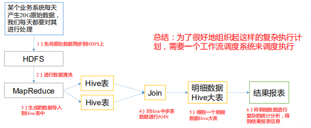
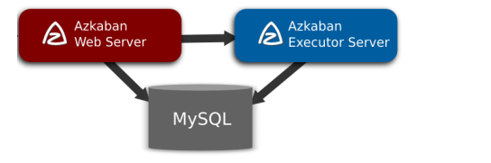

## 什么是 Azkaban

Azkaban 是由 Linkedin 公司推出的一个批量工作流任务调度器，主要用于在一个工作流 

内以一个特定的顺序运行一组工作和流程，它的配置是通过简单的 key:value 对的方式，通 

过配置中的 Dependencies 来设置依赖关系。Azkaban 使用 job 配置文件建立任务之间的依赖 

关系，并提供一个易于使用的 web 用户界面维护和跟踪你的工作流。 

官网：https://azkaban.github.io/

依赖关系：前任务的结果作为后任务的条件

## 为什么需要工作流调度系统

1）一个完整的数据分析系统通常都是由大量任务单元组成： 

Shell 脚本程序，Java 程序，MapReduce 程序、Hive 脚本等 

2）各任务单元之间存在时间先后及前后依赖关系 

3）为了很好地组织起这样的复杂执行计划，需要一个工作流调度系统来调度执行； 

​	例如，我们可能有这样一个需求，某个业务系统每天产生 20G 原始数据

​	我们每天都 要对其进行处理，处理步骤如下所示： 

- 1) 通过 Hadoop 先将原始数据上传到 HDFS 上（HDFS 的操作）； 

- 2) 使用 MapReduce 对原始数据进行清洗（MapReduce 的操作）； 

- 3) 将清洗后的数据导入到 hive 表中（hive 的导入操作）； 

- 4) 对 Hive 中多个表的数据进行 JOIN 处理，得到一张 hive 的明细表（创建中间表）； 

- 5) 通过对明细表的统计和分析，得到结果报表信息（hive 的查询操作）；

## Azkaban 特点

- 1) 兼容任何版本的 hadoop 

- 2) 易于使用的 Web 用户界面 

- 3) 简单的工作流的上传 

- 4) 方便设置任务之间的关系 

- 5) 调度工作流 

- 6) 模块化和可插拔的插件机制 

- 7) 认证/授权(权限的工作) 

- 8) 能够杀死并重新启动工作流 

- 9) 有关失败和成功的电子邮件提醒

## 常见工作流调度系统

1）简单的任务调度：直接使用 crontab 实现； 

2）复杂的任务调度：开发调度平台或使用现成的开源调度系统，比如 ooize、azkaban 等

## Azkaban 的架构

由三个关键组件构成：

- 1) AzkabanWebServer：AzkabanWebServer 是整个 Azkaban 工作流系统的主要管理者， 它用户登录认证、负责 project 管理、定时执行工作流、跟踪工作流执行进度等一 系列任务。 

- 2) AzkabanExecutorServer：负责具体的工作流的提交、执行，它们通过 mysql 数据库 来协调任务的执行。 

- 3) 关系型数据库（MySQL）：存储大部分执行流状态，AzkabanWebServer 和 AzkabanExecutorServer 都需要访问数据库。

## Azkaban 下载地址

下载地址:http://azkaban.github.io/downloads.html

