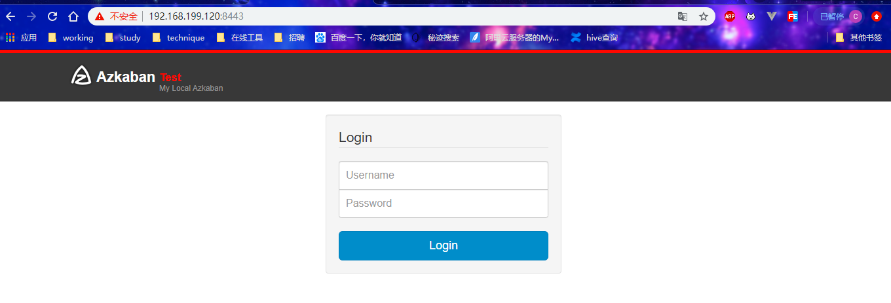
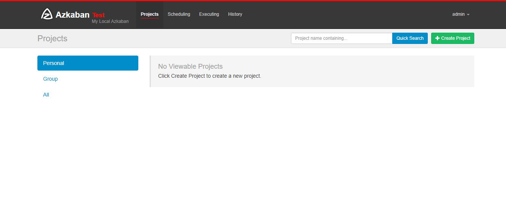

## 安装准备

**1)** 将 Azkaban Web 服务器、Azkaban 执行服务器、Azkaban 的 sql 执行脚本及 MySQL 安 装包拷贝到 	hadoop2 虚拟机/opt/software 目录下 

- a) azkaban-web-server-2.5.0.tar.gz 

- b) azkaban-executor-server-2.5.0.tar.gz 

- c) azkaban-sql-script-2.5.0.tar.gz 

- d) mysql-libs.zip 


**2)** 选择 **Mysql** 作为 Azkaban 数据库，因为 Azkaban 建立了一些 Mysql 连接增强功能，以 方便 Azkaban 设置。并增强服务可靠性。


## 安装Azkaban

1) 在/opt/module/目录下创建 azkaban 目录

```
[root@hadoop2 module]#  mkdir azkaban
```


2) 解压 azkaban-web-server-2.5.0.tar.gz、azkaban-executor-server-2.5.0.tar.gz、azkaban-sql- script-2.5.0.tar.gz 到/opt/module/azkaban 目录下 

```
tar -zxvf azkaban-web-server-2.5.0.tar.gz -C /opt/module/azkaban/
tar -zxvf azkaban-executor-server-2.5.0.tar.gz -C /opt/module/azkaban/
tar -zxvf azkaban-sql-script-2.5.0.tar.gz -C /opt/module/azkaban/
```


3) 对解压后的文件重新命名

```shell
mv azkaban-web-2.5.0/ server
mv azkaban-executor-2.5.0/ executor
```


4) azkaban 脚本导入

建表脚本位置：

```shell
[root@hadoop2 azkaban-2.5.0]# pwd
/opt/module/azkaban/azkaban-2.5.0
[root@hadoop2 azkaban-2.5.0]# ll
total 88
-rwxr-xr-x. 1 root root  129 Apr 22  2014 create.active_executing_flows.sql
-rwxr-xr-x. 1 root root  216 Apr 22  2014 create.active_sla.sql
-rwxr-xr-x. 1 root root 4694 Apr 22  2014 create-all-sql-2.5.0.sql
-rwxr-xr-x. 1 root root  610 Apr 22  2014 create.execution_flows.sql
-rwxr-xr-x. 1 root root  519 Apr 22  2014 create.execution_jobs.sql
-rwxr-xr-x. 1 root root  358 Apr 22  2014 create.execution_logs.sql
-rwxr-xr-x. 1 root root  224 Apr 22  2014 create.project_events.sql
-rwxr-xr-x. 1 root root  227 Apr 22  2014 create.project_files.sql
-rwxr-xr-x. 1 root root  280 Apr 22  2014 create.project_flows.sql
-rwxr-xr-x. 1 root root  285 Apr 22  2014 create.project_permissions.sql
-rwxr-xr-x. 1 root root  294 Apr 22  2014 create.project_properties.sql
-rwxr-xr-x. 1 root root  380 Apr 22  2014 create.projects.sql
-rwxr-xr-x. 1 root root  325 Apr 22  2014 create.project_versions.sql
-rwxr-xr-x. 1 root root  155 Apr 22  2014 create.properties.sql
-rwxr-xr-x. 1 root root  498 Apr 22  2014 create.schedules.sql
-rwxr-xr-x. 1 root root  189 Apr 22  2014 create.triggers.sql
-rwxr-xr-x. 1 root root   22 Apr 22  2014 database.properties
-rwxr-xr-x. 1 root root  671 Apr 22  2014 update-all-sql-2.1.sql
-rwxr-xr-x. 1 root root  156 Apr 22  2014 update-all-sql-2.2.sql
-rwxr-xr-x. 1 root root  395 Apr 22  2014 update.execution_logs.2.1.sql
-rwxr-xr-x. 1 root root   59 Apr 22  2014 update.project_properties.2.1.sql
```

需要执行

```
-rwxr-xr-x. 1 root root 4694 Apr 22  2014 create-all-sql-2.5.0.sql
```


进入 mysql，创建 azkaban 数据库，并将解压的脚本导入到 azkaban 数据库。

```sql
[root@hadoop2 azkaban]# mysql -uroot -p1234

mysql> create database azkaban;

mysql> use azkaban;

执行脚本
mysql> source /opt/module/azkaban/azkaban-2.5.0/create-all-sql-2.5.0.sql


mysql> show tables;
+------------------------+
| Tables_in_azkaban      |
+------------------------+
| active_executing_flows |
| active_sla             |
| execution_flows        |
| execution_jobs         |
| execution_logs         |
| project_events         |
| project_files          |
| project_flows          |
| project_permissions    |
| project_properties     |
| project_versions       |
| projects               |
| properties             |
| schedules              |
| triggers               |
+------------------------+
15 rows in set (0.00 sec)

```

注：**source 后跟.sql 文件，用于批量处理.sql 文件中的 sql 语句。**


## 生成密钥对和证书

Keytool 是 java 数据证书的管理工具，使用户能够管理自己的公/私钥对及相关证书。 

- -keystore 指定密钥库的名称及位置(产生的各类信息将存在.keystore 文件中) 

- -genkey(或者-genkeypair) 生成密钥对 

- -alias 为生成的密钥对指定别名，如果没有默认是 mykey 

- -keyalg 指定密钥的算法 RSA/DSA 默认是 DSA 


1）生成 keystore 的密码及相应信息的密钥库

```
keytool -keystore keystore -alias jetty -genkey -keyalg RSA
```

```
[root@hadoop2 server]# pwd
/opt/module/azkaban/server
[root@hadoop2 server]# keytool -keystore keystore -alias jetty -genkey -keyalg RSA
Enter keystore password:  
Keystore password is too short - must be at least 6 characters
Enter keystore password:  123456
Re-enter new password: 123456
What is your first and last name?
  [Unknown]:               
What is the name of your organizational unit?
  [Unknown]:  
What is the name of your organization?
  [Unknown]:  
What is the name of your City or Locality?
  [Unknown]:  
What is the name of your State or Province?
  [Unknown]:  
What is the two-letter country code for this unit?
  [Unknown]:  
Is CN=Unknown, OU=Unknown, O=Unknown, L=Unknown, ST=Unknown, C=Unknown correct?
  [no]:  y

Enter key password for <jetty>
	(RETURN if same as keystore password):  

```

解释：

```
keytool -keystore keystore -alias jetty -
genkey -keyalg RSA
输入密钥库口令: 
再次输入新口令: 
您的名字与姓氏是什么?
 [Unknown]: 
您的组织单位名称是什么?
 [Unknown]: 
您的组织名称是什么?
 [Unknown]: 
您所在的城市或区域名称是什么?
 [Unknown]: 
您所在的省/市/自治区名称是什么?
 [Unknown]: 
该单位的双字母国家/地区代码是什么?
 [Unknown]: 
CN=Unknown, OU=Unknown, O=Unknown, L=Unknown, ST=Unknown, C=Unknown 是否
正确?
 [否]: y
输入 <jetty> 的密钥口令
 (如果和密钥库口令相同, 按回车):
 再次输入新口令:
```

密钥库的密码至少必须 6 个字符，可以是纯数字或者字母或者数字和字母的组合等等 

密钥库的密码最好和<jetty> 的密钥相同，方便记忆


生成密钥的文件：

```shell
[root@hadoop2 server]# ll
total 8
-rw-r--r--. 1 root root  105 Apr 22  2014 azkaban.version
drwxr-xr-x. 1 root root  148 Apr 22  2014 bin
drwxr-xr-x. 1 root root   70 Feb 27 15:19 conf
drwxr-xr-x. 1 root root    0 Apr 22  2014 extlib
-rw-r--r--. 1 root root 2241 Feb 27 15:22 keystore
drwxr-xr-x. 1 root root 1280 Feb 27 13:24 lib
drwxr-xr-x. 1 root root    0 Apr 22  2014 plugins
drwxr-xr-x. 1 root root   54 Feb 27 13:24 web

```


2）将 keystore 拷贝到 azkaban web 服务器根目录中

```
 mv keystore /opt/module/azkaban/server/
```


查看密钥：

```shell
[root@hadoop2 server]# keytool -keystore keystore -list
Enter keystore password:  123456

Keystore type: JKS
Keystore provider: SUN

Your keystore contains 1 entry

jetty, Feb 27, 2020, PrivateKeyEntry, 
Certificate fingerprint (SHA1)://私钥  F3:39:95:28:49:D3:E1:6D:50:1E:10:FA:87:53:1E:1E:9E:23:DB:99//公钥

```


## 配置文件


### Web服务器配置

1）进入 azkaban web 服务器安装目录 conf 目录，打开 azkaban.properties 文件

```
[root@hadoop2 server]# pwd
/opt/module/azkaban/server
[root@hadoop2 server]# cd conf/

vim azkaban.properties
```


2）按照如下配置修改 azkaban.properties 文件。

```
#Azkaban Personalization Settings
#服务器 UI 名称,用于服务器上方显示的名字
azkaban.name=Test
#描述
azkaban.label=My Local Azkaban
#UI 颜色
azkaban.color=#FF3601
azkaban.default.servlet.path=/index
#默认 web server 存放 web 文件的目录
web.resource.dir=/opt/module/azkaban/server/web/
#默认时区,已改为亚洲/上海 默认为美国
default.timezone.id=Asia/Shanghai
#Azkaban UserManager class
user.manager.class=azkaban.user.XmlUserManager
#用户权限管理默认类（绝对路径）
user.manager.xml.file=/opt/module/azkaban/server/conf/azkaban-users.xml
#Loader for projects
#global 配置文件所在位置（绝对路径）
executor.global.properties=/opt/module/azkaban/executor/conf/global.pro
perties
azkaban.project.dir=projects

#数据库类型
database.type=mysql
#端口号
mysql.port=3306
#数据库连接 IP
mysql.host=hadoop2
#数据库实例名
mysql.database=azkaban
#数据库用户名
mysql.user=root
#数据库密码
mysql.password=000000
#最大连接数
mysql.numconnections=100
# Velocity dev mode
velocity.dev.mode=false
# Azkaban Jetty server properties.
# Jetty 服务器属性. #最大线程数
jetty.maxThreads=25
#Jetty SSL 端口
jetty.ssl.port=8443
#Jetty 端口
jetty.port=8081
#SSL 文件名（绝对路径）
jetty.keystore=/opt/module/azkaban/server/keystore
#SSL 文件密码
jetty.password=000000
#Jetty 主密码与 keystore 文件相同
jetty.keypassword=000000
#SSL 文件名（绝对路径）
jetty.truststore=/opt/module/azkaban/server/keystore
#SSL 文件密码
jetty.trustpassword=000000
# Azkaban Executor settings
executor.port=12321
# mail settings
mail.sender=
mail.host=
job.failure.email=
job.success.email=
lockdown.create.projects=false
cache.directory=cache
```

重点配置：

```
#默认 web server 存放 web 文件的目录
web.resource.dir=/opt/module/azkaban/server/web/
#默认时区,已改为亚洲/上海 默认为美国
default.timezone.id=Asia/Shanghai

#用户权限管理默认类（绝对路径）
user.manager.xml.file=/opt/module/azkaban/server/conf/azkaban-users.xml

#global 配置文件所在位置（绝对路径）
executor.global.properties=/opt/module/azkaban/executor/conf/global.pro
perties

#数据库连接 IP
mysql.host=hadoop2

#数据库用户名
mysql.user=root
#数据库密码
mysql.password=000000

#SSL 文件名（绝对路径）
jetty.keystore=/opt/module/azkaban/server/keystore
#SSL 文件密码
jetty.password=000000
#Jetty 主密码与 keystore 文件相同
jetty.keypassword=000000
#SSL 文件名（绝对路径）
jetty.truststore=/opt/module/azkaban/server/keystore
#SSL 文件密码
jetty.trustpassword=000000

```


3）web 服务器用户配置

在 azkaban web 服务器安装目录 conf 目录，按照如下配置修改 azkaban-users.xml 文件， 增加管理员用户。 

```
<azkaban-users>
        <user username="azkaban" password="azkaban" roles="admin" groups="azkaban" />
        <user username="metrics" password="metrics" roles="metrics"/>

         <user username="admin" password="admin" roles="metrics,admin"/>

        <role name="admin" permissions="ADMIN" />
        <role name="metrics" permissions="METRICS"/>
</azkaban-users>

```


### 执行服务器配置

1）进入执行服务器安装目录 conf，打开 azkaban.properties

```
[root@hadoop2 executor]# pwd
/opt/module/azkaban/executor
[root@hadoop2 executor]# cd conf/
[root@hadoop2 conf]# vim azkaban.properties 

```

2） 按照如下配置修改 azkaban.properties 文件。

```shell
#Azkaban
#时区
default.timezone.id=Asia/Shanghai
# Azkaban JobTypes Plugins
#jobtype 插件所在位置
azkaban.jobtype.plugin.dir=plugins/jobtypes
#Loader for projects
executor.global.properties=/opt/module/azkaban/executor/conf/global.pro
perties
azkaban.project.dir=projects
database.type=mysql
mysql.port=3306
mysql.host=hadoop102
mysql.database=azkaban
mysql.user=root
mysql.password=000000
mysql.numconnections=100
# Azkaban Executor settings
#最大线程数
executor.maxThreads=50
#端口号(如修改,请与 web 服务中一致)
executor.port=12321
#线程数
executor.flow.threads=30
```

配置重点：

```shell
#Azkaban
#时区
default.timezone.id=Asia/Shanghai

#Loader for projects
executor.global.properties=/opt/module/azkaban/executor/conf/global.pro
perties
azkaban.project.dir=projects

database.type=mysql
mysql.port=3306
mysql.host=hadoop102
mysql.database=azkaban
mysql.user=root
mysql.password=000000
mysql.numconnections=100
```


## 启动 Executor 服务器

```
[root@hadoop2 executor]# pwd
/opt/module/azkaban/executor
[root@hadoop2 executor]# bin/azkaban-executor-start.sh 

```


##  启动 Web 服务器

```
[root@hadoop2 server]# pwd
/opt/module/azkaban/server
[root@hadoop2 server]# bin/azkaban-web-start.sh 
```


先执行 executor，再执行 web，避免 Web Server 会因为找不到执行器启动失败。


jps 查看进程

```
[root@hadoop2 ~]# jps
1920 Jps
1873 AzkabanWebServer
1844 AzkabanExecutorServer
```


启动完成后，在浏览器(建议使用谷歌浏览器)中输入 https://192.168.199.120:8443，即可访问 

azkaban 服务了。 

登录页



首页




