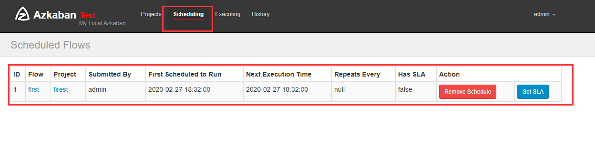

# command

Azkaban 内置的任务类型支持 command、java


## 单一job案例

1）创建 job 描述文件

```shell
[atguigu@hadoop102 jobs]$ vim first.job
#first.job
type=command
command=echo 'this is my first job'
```


2) 将 job 资源文件打包成 zip 文件

```shell
[atguigu@hadoop102 jobs]$ zip first.zip first.job
 adding: first.job (deflated 15%)
[atguigu@hadoop102 jobs]$ ll
总用量 8
-rw-rw-r--. 1 atguigu atguigu 60 10 月 18 17:42 first.job 
-rw-rw-r--. 1 atguigu atguigu 219 10 月 18 17:43 first.zip
```

注意： 

目前，Azkaban 上传的工作流文件只支持 xxx.**zip** 文件。zip 应包含 xxx.job 运行作业所需的 

文件和任何文件（文件名后缀必须以.job 结尾，否则无法识别）。作业名称在项目中必须是 

唯一的


3）通过 azkaban 的 web 管理平台创建 project 并上传 job 的 zip 包 

首先创建 project


上传配置文件按钮


上传 zip 包 


4)点击**Execute**按钮


执行成功：


5）点击查看 job 日志


7)定时执行


定时执行之后




## 调度shell脚本

1、绝对路径

```
type=command
command=/opt/shell/test.sh
```


2、相对路径

把job和shell打包在一个文件下

test.job

```
type=command
command=sh test.sh
```


test.sh

```shell
date >> /opt/module/azkaban/date.txt
```


在windows下把两个文件打包到同一级目录中


定时执行之后

```
[root@hadoop2 azkaban]# cat date.txt 
Thu Feb 27 18:49:25 CST 2020
[root@hadoop2 azkaban]# cat date.txt 
Thu Feb 27 18:49:25 CST 2020
Thu Feb 27 18:50:24 CST 2020

```


## 邮件通知配置

1）修改配置文件 

修改 server 的 conf 下的 azkaban.properties 文件

```
# mail settings
# 配置发邮件的账户
# 发送者邮箱
mail.sender=lbo_atguigu@163.com
# 邮箱服务器
mail.host=smtp.163.com
# 邮箱用户
mail.user=lbo_atguigu@163.com
#邮箱授权码
mail.password=atguiguv587

```


2）在网页上进行配置


3)查看邮件


## 多job 工作流案例

1）创建有依赖关系的多个 job 描述

- 1）创建有依赖关系的多个 job 描述

  ```
  #start.job
  type=command
  command=touch /opt/module/azkaban/date.txt
  ```

- 第二个 job：step1.job 依赖 start.job

  ```
  #step1.job
  type=command
  dependencies=start
  command=echo "this is step1 job"
  ```

- 第三个 job：step2.job 依赖 start.job

  ```
  #step2.job
  type=command
  dependencies=start
  command=echo "this is step2 job"
  ```

- 第四个 job：finish.job 依赖 step1.job 和 step2.job

  ```
  #finish.job
  type=command
  dependencies=step1,step2
  command=echo "this is finish job"
  ```

  

2）统一打包上传


执行成功：


# java

## Java 操作任务

使用 Azkaban 调度 java 程序 

1）编写 java 程序 

```java
package hbase.com.azkaban;
import java.io.FileNotFoundException;
import java.io.FileOutputStream;
import java.io.IOException;
public class AzkabanJob {
    public static void main(String[] args) throws FileNotFoundException {
        FileOutputStream fos = new
                FileOutputStream("/opt/module/azkaban/output.txt");
        try {
            fos.write("this is a java progress".getBytes());
        } catch (IOException e) {
            e.printStackTrace();
        }finally {
            try {
                fos.close();
            } catch (IOException e) {
                e.printStackTrace();
            }
        }
    }
}
```


2）将 java 程序打成 jar 包，创建 lib 目录，将 jar 放入 lib 内

```shyell
[root@hadoop2 lib]# pwd
/opt/module/azkaban/lib
[root@hadoop2 lib]# ll
total 12
-rw-r--r--. 1 root root 10280 Feb 27 21:00 azkaban.jar

```


3）编写 job 文件

```
type=javaprocess
java.class=hbase.com.azkaban.AzkabanJob
classpath=/opt/module/azkaban/lib/*
```


4）将 job 文件打成 zip 包


5)执行之后

```
[root@hadoop2 azkaban]# cat output.txt 
this is a java progress
```


# command

## HDFS 操作任务

1）创建 job 描述文件

```
#hdfs job
type=command
command=/opt/module/hadoop-2.7.2/bin/hadoop fs -mkdir /azkaban
```

2）将 job 资源文件打包成 zip 文件

3）通过 azkaban 的 web 管理平台创建 project 并上传 job 压缩包 

4）启动执行该 job


## MapReduce任务

1） 创建 job 描述文件，及 mr 程序 jar 包

```
#mapreduce job
type=command
command=/opt/module/hadoop-2.7.2/bin/hadoop jar /opt/module/hadoop-
2.7.2/share/hadoop/mapreduce/hadoop-mapreduce-examples-2.7.2.jar 
wordcount /wordcount/input /wordcount/output
```

2） 将所有 job 资源文件打到一个 zip 包中

3）在 azkaban 的 web 管理界面创建工程并上传 zip 包 

4）启动 job 


## Hive脚本任务

1）创建 job 描述文件和 hive 脚本

- Hive 脚本：student.sql

  ```sql
  use default;
  drop table student;
  create table student(id int, name string)
  row format delimited fields terminated by '\t';
  load data local inpath '/opt/module/datas/student.txt' into table 
  student;
  insert overwrite local directory '/opt/module/datas/student'
  row format delimited fields terminated by '\t'
  select * from student;
  ```

- Job 描述文件：hive.job

  ```
  #hive job
  type=command
  command=/opt/module/hive/bin/hive -f 
  /opt/module/azkaban/jobs/student.sql
  ```

  

2） 将所有 job 资源文件打到一个 zip 包中

3）在 azkaban 的 web 管理界面创建工程并上传 zip 包 

4）启动 job 

5）查看结果 

