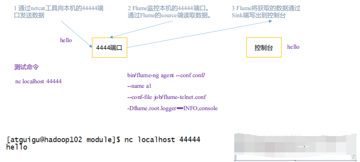
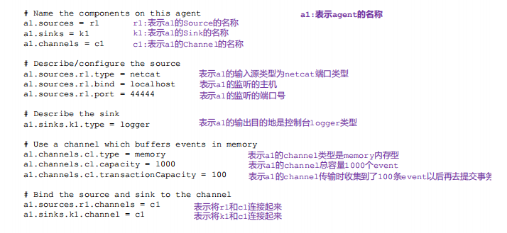
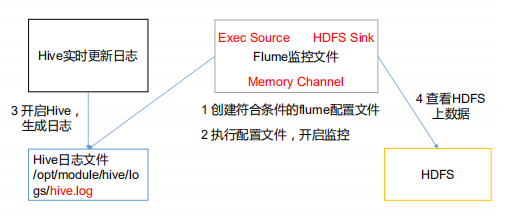

# **2.1 Flume** **安装部署**

## **2.1.1** **安装地址**

1） Flume 官网地址 

http://flume.apache.org/ 

2）文档查看地址 

http://flume.apache.org/FlumeUserGuide.html 

3）下载地址 

http://archive.apache.org/dist/flume/


## **2.1.2** **安装部署**

1）将 apache-flume-1.7.0-bin.tar.gz 上传到 linux 的/opt/software 目录下 

2）解压 apache-flume-1.7.0-bin.tar.gz 到/opt/module/目录下

```
tar -zxf apache-flume-1.7.0-bin.tar.gz -C /opt/module/
```


3）修改 apache-flume-1.7.0-bin 的名称为 flume

```
 mv apache-flume-1.7.0-bin flume
```


4）将 flume/conf 下的 flume-env.sh.template 文件修改为 flume-env.sh，并配置 flume

env.sh 文件

```
[root@hadoop102 conf]$ mv flume-env.sh.template flume-env.sh
[root@hadoop102 conf]$ vi flume-env.sh
export JAVA_HOME=/opt/module/jdk1.8.0_144
```


# **2.2 Flume** **入门案例**

## **2.2.1** **监控端口数据官方案例**

**1）案例需求：** 

使用 Flume 监听一个端口，收集该端口数据，并打印到控制台。 

**2）需求分析：**




**3）实现步骤：** 

**1.安装 netcat 工具** 

```
 sudo yum install -y nc
```

**2.判断 44444 端口是否被占用**

```
sudo netstat -tunlp | grep 44444
```


客户端必须依赖服务端存在

不可以单独存在


**3.创建 Flume Agent 配置文件 flume-netcat-logger.conf**

在 flume 目录下创建 job 文件夹并进入 job 文件夹。

```
mkdir job
```

在 job 文件夹下创建 Flume Agent 配置文件 flume-netcat-logger.conf。

```
vim flume-netcat-logger.conf
```

在 flume-netcat-logger.conf 文件中添加如下内容

```
添加内容如下：
# Name the components on this agent
a1.sources = r1
a1.sinks = k1
a1.channels = c1
# Describe/configure the source
a1.sources.r1.type = netcat
a1.sources.r1.bind = localhost
a1.sources.r1.port = 44444
# Describe the sink
a1.sinks.k1.type = logger
# Use a channel which buffers events in memory
a1.channels.c1.type = memory
a1.channels.c1.capacity = 1000
a1.channels.c1.transactionCapacity = 100
# Bind the source and sink to the channel
a1.sources.r1.channels = c1
a1.sinks.k1.channel = c1
```

注：配置文件来源于官方手册 http://flume.apache.org/FlumeUserGuide.html





**4. 先开启 flume 监听端口**

**第一种写法：**

```
[root@hadoop2 flume]# bin/flume-ng agent --conf conf/ --conf-file job/flume-netcat-logger.conf --name a1 -Dflume.root.logger=INFO,console

...
ame: c1 started
2019-10-25 12:01:01,005 (conf-file-poller-0) [INFO - org.apache.flume.node.Application.startAllComponents(Application.java:171)] Starting Sink k1
2019-10-25 12:01:01,009 (conf-file-poller-0) [INFO - org.apache.flume.node.Application.startAllComponents(Application.java:182)] Starting Source r1
2019-10-25 12:01:01,011 (lifecycleSupervisor-1-0) [INFO - org.apache.flume.source.NetcatSource.start(NetcatSource.java:155)] Source starting
2019-10-25 12:01:01,060 (lifecycleSupervisor-1-0) [INFO - org.apache.flume.source.NetcatSource.start(NetcatSource.java:169)] Created serverSocket:sun.nio.ch.ServerSocketChannelImpl[/127.0.0.1:44444]

```


本地开启一个窗口进行对本地的44444端口的服务

```
[root@hadoop2 ~]# nc localhost 44444

```

进行发送消息

```
[root@hadoop2 ~]# nc localhost 44444
hello
OK

```


本地服务端会接收到消息

```
mpl[/127.0.0.1:44444]
2019-10-25 12:03:01,471 (SinkRunner-PollingRunner-DefaultSinkProcessor) [INFO - org.apache.flume.sink.LoggerSink.process(LoggerSink.java:95)] Event: { headers:{} body: 68 65 6C 6C 6F                                  hello }

```

关闭服务端

```
^C2019-10-25 12:04:00,014 (agent-shutdown-hook) [INFO - org.apache.flume.lifecycle.LifecycleSupervisor.stop(LifecycleSupervisor.java:78)] Stopping lifecycle supervisor 11
2019-10-25 12:04:00,021 (agent-shutdown-hook) [INFO - org.apache.flume.node.PollingPropertiesFileConfigurationProvider.stop(PollingPropertiesFileConfigurationProvider.java:84)] Configuration provider stopping
2019-10-25 12:04:00,021 (agent-shutdown-hook) [INFO - org.apache.flume.instrumentation.MonitoredCounterGroup.stop(MonitoredCounterGroup.java:149)] Component type: CHANNEL, name: c1 stopped
2019-10-25 12:04:00,021 (agent-shutdown-hook) [INFO - org.apache.flume.instrumentation.MonitoredCounterGroup.stop(MonitoredCounterGroup.java:155)] Shutdown Metric for type: CHANNEL, name: c1. channel.start.time == 1572019261004
2019-10-25 12:04:00,022 (agent-shutdown-hook) [INFO - org.apache.flume.instrumentation.MonitoredCounterGroup.stop(MonitoredCounterGroup.java:161)] Shutdown Metric for type: CHANNEL, name: c1. channel.stop.time == 1572019440021
2019-10-25 12:04:00,022 (agent-shutdown-hook) [INFO - org.apache.flume.instrumentation.MonitoredCounterGroup.stop(MonitoredCounterGroup.java:177)] Shutdown Metric for type: CHANNEL, name: c1. channel.capacity == 1000
2019-10-25 12:04:00,023 (agent-shutdown-hook) [INFO - org.apache.flume.instrumentation.MonitoredCounterGroup.stop(MonitoredCounterGroup.java:177)] Shutdown Metric for type: CHANNEL, name: c1. channel.current.size == 0
2019-10-25 12:04:00,023 (agent-shutdown-hook) [INFO - org.apache.flume.instrumentation.MonitoredCounterGroup.stop(MonitoredCounterGroup.java:177)] Shutdown Metric for type: CHANNEL, name: c1. channel.event.put.attempt == 1
2019-10-25 12:04:00,023 (agent-shutdown-hook) [INFO - org.apache.flume.instrumentation.MonitoredCounterGroup.stop(MonitoredCounterGroup.java:177)] Shutdown Metric for type: CHANNEL, name: c1. channel.event.put.success == 1
2019-10-25 12:04:00,023 (agent-shutdown-hook) [INFO - org.apache.flume.instrumentation.MonitoredCounterGroup.stop(MonitoredCounterGroup.java:177)] Shutdown Metric for type: CHANNEL, name: c1. channel.event.take.attempt == 26
2019-10-25 12:04:00,023 (agent-shutdown-hook) [INFO - org.apache.flume.instrumentation.MonitoredCounterGroup.stop(MonitoredCounterGroup.java:177)] Shutdown Metric for type: CHANNEL, name: c1. channel.event.take.success == 1
2019-10-25 12:04:00,025 (agent-shutdown-hook) [INFO - org.apache.flume.source.NetcatSource.stop(NetcatSource.java:196)] Source stopping

```

agent-shutdown-hook钩子程序进行一些收尾工作

先听source然后将channel中的数据处理完成


**第二种写法**：

```
 bin/flume-ng agent -c conf/ -n $agent_name -f 
job/flume-netcat-logger.conf  -Dflume.root.logger=INFO,console
```

参数说明： 

--conf/-c：表示配置文件存储在 conf/目录 

--name/-n：表示给 agent 起名为 a1 

--conf-file/-f：flume 本次启动读取的配置文件是在 job 文件夹下的 flume-telnet.conf 

文件。

-Dflume.root.logger=INFO,console ：-D 表示 flume 运行时动态修改 flume.root.logger 

参数属性值，并将控制台日志打印级别设置为 INFO 级别。日志级别包括:log、info、warn、 

error。 


## **2.2.2** **实时监控单个追加文件**

**1）案例需求：实时监控 Hive 日志，并上传到 HDFS 中** 


**2）需求分析**： 



**3）实现步骤：** 

**1.Flume 要想将数据输出到 HDFS，须持有 Hadoop 相关 jar 包**

需要些数据到hdfs

```
commons-configuration-1.6.jar
hadoop-auth-2.7.2.jar
hadoop-common-2.7.2.jar
hadoop-hdfs-2.7.2.jar
commons-io-2.4.jar
htrace-core-3.1.0-incubating.jar
```

拷贝到/opt/module/flume/lib 文件夹下。


**2.创建 flume-file-hdfs.conf 文件**

job目录下

```
 vim flume-file-hdfs.conf
```

注：要想读取 Linux 系统中的文件，就得按照 Linux 命令的规则执行命令。由于 Hive 日志 

在 Linux 系统中所以读取文件的类型选择：exec 即 execute 执行的意思。表示执行 Linux 

命令来读取文件。

```
添加内容如下：
# Name the components on this agent
a1.sources = r1
a1.sinks = k1
a1.channels = c1

# Describe/configure the source
a1.sources = r1
a1.channels = c1
a1.sources.r1.type = exec
a1.sources.r1.command = tail -F  /opt/module/hive/logs/hive.log


# Describe the sink
a1.sinks.k1.type = logger

# Use a channel which buffers events in memory
a1.channels.c1.type = memory
a1.channels.c1.capacity = 1000
a1.channels.c1.transactionCapacity = 100

# Bind the source and sink to the channel
a1.sources.r1.channels = c1
a1.sinks.k1.channel = c1
```


**3.运行 Flume**

```
bin/flume-ng agent -c conf/ -f job/flume-file-hdfs.conf -n a1 -Dflume.root.logger=INFO,console
```


默认会打印10行

```
39 2D 31 30 2D 32 30 20 31 30 3A 35 33 2019-10-20 10:53 }
2019-10-27 09:30:11,364 (SinkRunner-PollingRunner-DefaultSinkProcessor) [INFO - org.apache.flume.sink.LoggerSink.process(LoggerSink.java:95)] Event: { headers:{} body: 32 30 31 39 2D 31 30 2D 32 30 20 31 30 3A 35 33 2019-10-20 10:53 }
2019-10-27 09:30:11,364 (SinkRunner-PollingRunner-DefaultSinkProcessor) [INFO - org.apache.flume.sink.LoggerSink.process(LoggerSink.java:95)] Event: { headers:{} body: 32 30 31 39 2D 31 30 2D 32 30 20 31 30 3A 35 33 2019-10-20 10:53 }
2019-10-27 09:30:11,364 (SinkRunner-PollingRunner-DefaultSinkProcessor) [INFO - org.apache.flume.sink.LoggerSink.process(LoggerSink.java:95)] Event: { headers:{} body: 32 30 31 39 2D 31 30 2D 32 30 20 31 30 3A 35 33 2019-10-20 10:53 }
2019-10-27 09:30:11,365 (SinkRunner-PollingRunner-DefaultSinkProcessor) [INFO - org.apache.flume.sink.LoggerSink.process(LoggerSink.java:95)] Event: { headers:{} body: 32 30 31 39 2D 31 30 2D 32 30 20 31 30 3A 35 33 2019-10-20 10:53 }
2019-10-27 09:30:11,365 (SinkRunner-PollingRunner-DefaultSinkProcessor) [INFO - org.apache.flume.sink.LoggerSink.process(LoggerSink.java:95)] Event: { headers:{} body: 32 30 31 39 2D 31 30 2D 32 30 20 31 30 3A 35 33 2019-10-20 10:53 }
2019-10-27 09:30:11,365 (SinkRunner-PollingRunner-DefaultSinkProcessor) [INFO - org.apache.flume.sink.LoggerSink.process(LoggerSink.java:95)] Event: { headers:{} body: 32 30 31 39 2D 31 30 2D 32 30 20 31 30 3A 35 33 2019-10-20 10:53 }
2019-10-27 09:30:11,366 (SinkRunner-PollingRunner-DefaultSinkProcessor) [INFO - org.apache.flume.sink.LoggerSink.process(LoggerSink.java:95)] Event: { headers:{} body: 32 30 31 39 2D 31 30 2D 32 30 20 31 30 3A 35 33 2019-10-20 10:53 }
2019-10-27 09:30:11,366 (SinkRunner-PollingRunner-DefaultSinkProcessor) [INFO - org.apache.flume.sink.LoggerSink.process(LoggerSink.java:95)] Event: { headers:{} body: 32 30 31 39 2D 31 30 2D 32 30 20 31 30 3A 35 33 2019-10-20 10:53 }
2019-10-27 09:30:11,366 (SinkRunner-PollingRunner-DefaultSinkProcessor) [INFO - org.apache.flume.sink.LoggerSink.process(LoggerSink.java:95)] Event: { headers:{} body: 32 30 31 39 2D 31 30 2D 32 30 20 31 30 3A 35 33 2019-10-20 10:53 }

```


**4.开启 Hadoop 和 Hive 并操作 Hive 产生日志**

```
bin/hive
```


开启hive之后进行打印日志10行


使用hive进行查询

```
hive (default)> select * from stu;
```


此时进行打印的日志

```
....
2019-10-27 09:36:37,251 (SinkRunner-PollingRunner-DefaultSinkProcessor) [INFO - org.apache.flume.sink.LoggerSink.process(LoggerSink.java:95)] Event: { headers:{} body: 32 30 31 39 2D 31 30 2D 32 37 20 30 39 3A 33 36 2019-10-27 09:36 }
2019-10-27 09:36:37,251 (SinkRunner-PollingRunner-DefaultSinkProcessor) [INFO - org.apache.flume.sink.LoggerSink.process(LoggerSink.java:95)] Event: { headers:{} body: 32 30 31 39 2D 31 30 2D 32 37 20 30 39 3A 33 36 2019-10-27 09:36 }
...

```


**5.使用到HDFS**


