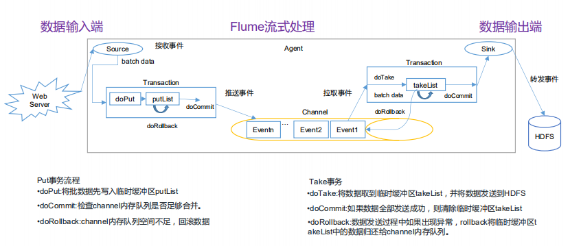
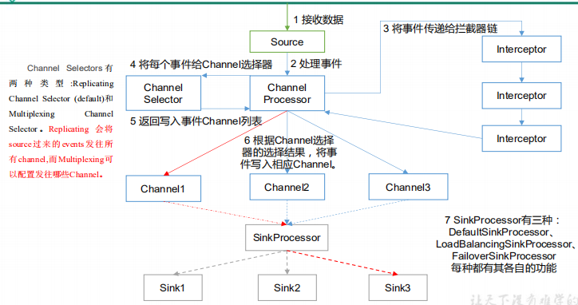
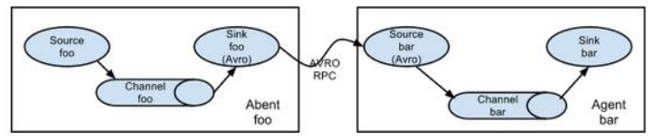
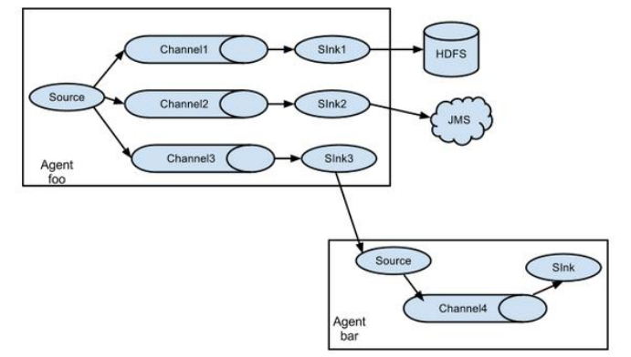
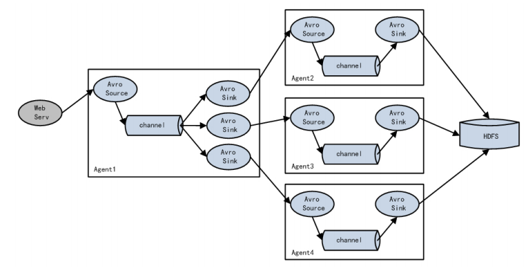
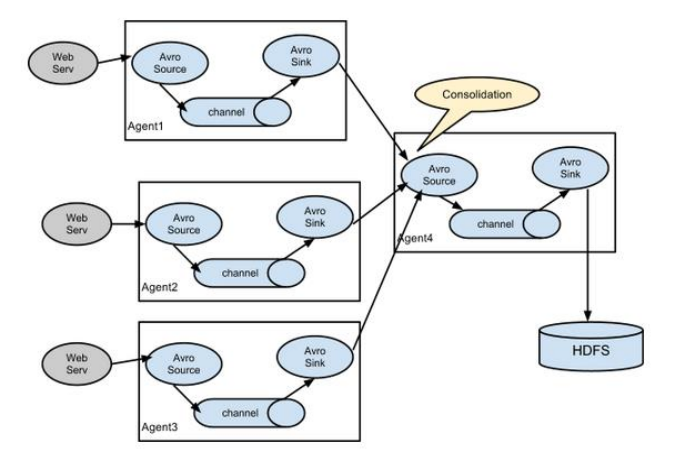
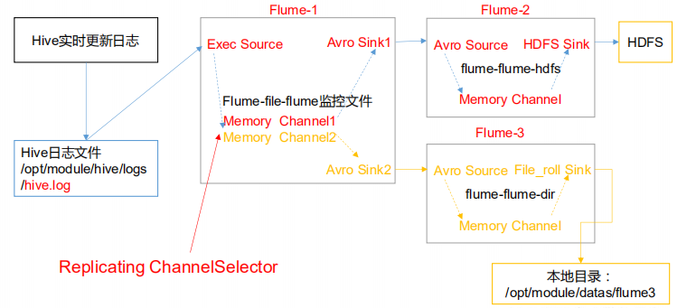

# **Flume** **进阶**

## **3.1 Flume** **事务**




channel被动接收source的时间

channel被动被sinks拉去数据


doCommit()首先去检查Channel中的内存是否足够合并，足够则推送，否则回滚

doRollback（）做事务回滚此时数据依然在putList中存放


Take事务和put事务类似

事务回滚到Channel中


## **3.2 Flume Agent** **内部原理**





**重要组件：**

**1）ChannelSelector** 

ChannelSelector 的作用就是选出 Event 将要被发往哪个 Channel。其共有两种类型， 

分别是 **Replicating**（复制）和 **Multiplexing**（多路复用）。

ReplicatingSelector 会将同一个 Event 发往所有的 Channel，Multiplexing 会根据相 

应的原则，将不同的 Event 发往不同的 Channel。


Replicating Channel Selector (default)

```
a1.sources = r1
a1.channels = c1 c2 c3
a1.sources.r1.selector.type = replicating
a1.sources.r1.channels = c1 c2 c3
a1.sources.r1.selector.optional = c3
```


Multiplexing Channel Selector

```
a1.sources = r1
a1.channels = c1 c2 c3 c4
a1.sources.r1.selector.type = multiplexing
多了复用需要跟拦截器一起用  添加一个头（头结构是map）
key是state
value是CZ、US

a1.sources.r1.selector.header = state  
a1.sources.r1.selector.mapping.CZ = c1
a1.sources.r1.selector.mapping.US = c2 c3
a1.sources.r1.selector.default = c4
```


**2）SinkProcessor** 

SinkProcessor 共 有 三 种 类 型 ， 分 别 是 **DefaultSinkProcessor** 、 

**LoadBalancingSinkProcessor** 和 **FailoverSinkProcessor** 

DefaultSinkProcessor 对 应 的 是 单 个 的 Sink ， LoadBalancingSinkProcessor 和 

FailoverSinkProcessor 对应的是 Sink Group，LoadBalancingSinkProcessor 可以实现负 

载均衡的功能，FailoverSinkProcessor 可以实现故障转移的功能。 


Default Sink Processor

Default sink processor accepts only a single sink. User is not forced to create processor (sink group) for single sinks. Instead user can follow the source - channel - sink pattern that was explained above in this user guide.


Failover Sink Processor

```
processor.type	default	The component type name, needs to be failover
```


Load balancing Sink Processor

```


processor.sinks	 –	Space-separated list of sinks that are participating in the group
processor.type	default	The component type name, needs to be load_balance
processor.backoff	false	Should failed sinks be backed off exponentially.
processor.selector	round_robin	Selection mechanism. Must be either round_robin, random or FQCN of custom class that inherits from AbstractSinkSelector
processor.selector.maxTimeOut	30000	Used by backoff selectors to limit exponential backoff (in milliseconds)
```

processor.selector.maxTimeOut	30000	Used by backoff selectors to limit exponential backoff (in milliseconds) 如果sinks挂掉此时在单位时间内就不会访问该挂掉的sinks（退避时间是 2 * n此访问（每次时间）

此时最大值是3000 ，在30s之后 依然会轮询进行访问


## **3.3 Flume** **拓扑结构**

### **3.3.1** **简单串联**





Flume Agent 连接


这种模式是将多个 flume 顺序连接起来了，从最初的 source 开始到最终 sink 传送的 

目的存储系统。此模式不建议桥接过多的 flume 数量，flume 数量过多不仅会影响传输速率， 

而且一旦传输过程中某个节点 flume 宕机，会影响整个传输系统。 


### **3.3.2** **复制和多路复用**




单 source，多 channel、sink


Flume 支持将事件流向一个或者多个目的地。这种模式可以将相同数据复制到多个 

channel 中，或者将不同数据分发到不同的 channel 中，sink 可以选择传送到不同的目的 

地。


### **3.3.3** **负载均衡和故障转移**





Flume 负载均衡或故障转移

Flume支持使用将多个sink逻辑上分到一个sink组，sink组配合不同的SinkProcessor 

可以实现负载均衡和错误恢复的功能。


### **3.3.4** **聚合**




这种模式是我们最常见的，也非常实用，日常 web 应用通常分布在上百个服务器，大者 

甚至上千个、上万个服务器。产生的日志，处理起来也非常麻烦。用 flume 的这种组合方式 

能很好的解决这一问题，每台服务器部署一个 flume 采集日志，传送到一个集中收集日志的 

flume，再由此 flume 上传到 hdfs、hive、hbase 等，进行日志分析。 


## **3.4 Flume** **企业开发案例**(source是服务端)


### **3.4.1** **复制和多路复用**

**1）案例需求** 

使用 Flume-1 监控文件变动（exec，Taildir），Flume-1 将变动内容传递给 Flume-2，Flume-2 负责存储 

到 HDFS。同时 Flume-1 将变动内容传递给 Flume-3，Flume-3 负责输出到 Local FileSystem。


**2）需求分析**



一方面上传到hdfs

一方面存在本地进行文件备份


**3）实现步骤**

**准备工作**

在/opt/module/flume/job 目录下创建 group1 文件夹

```
[root@hadoop2 job]# mkdir group1


[root@hadoop2 group1]# touch flume1.conf
[root@hadoop2 group1]# touch flume2.conf
[root@hadoop2 group1]# touch flume3.conf
```


在/opt/module/datas/目录下创建 flume3 文件夹


flume1.conf

```
# 定义
a1.sources = r1
a1.channels = c1 c2
a1.sinks=k1 k2

# source
a1.sources.r1.type = TAILDIR
a1.sources.r1.filegroups = f1
a1.sources.r1.filegroups.f1 = /opt/module/data/hive.log
a1.sources.r1.positionFile =  /opt/module/flume/position/position1.json

# channels
a1.channels.c1.type = memory
a1.channels.c1.capacity = 1000
a1.channels.c1.transactionCapacity = 100

a1.channels.c2.type = memory
a1.channels.c2.capacity = 1000
a1.channels.c2.transactionCapacity = 100

# sinks(avro)
a1.sinks.k1.type = avro
a1.sinks.k1.hostname = 192.168.199.120
a1.sinks.k1.port = 4141

a1.sinks.k2.type = avro
a1.sinks.k2.hostname = 192.168.199.120
a1.sinks.k2.port = 4142

# bind
a1.sources.r1.channels = c1 c2 
a1.sinks.k1.channel = c1
a1.sinks.k2.channel = c2


```


flume2.conf

```
#Name
a2.sources = r1
a2.channels = c1
a2.sinks = k1

#Source
a2.sources.r1.type = avro
a2.sources.r1.bind = 192.168.199.120
a2.sources.r1.port = 4141

#Channel
a2.channels.c1.type = memory
a2.channels.c1.capacity = 1000
a2.channels.c1.transactionCapacity = 100

#Sink
a2.sinks.k1.type = hdfs
a2.sinks.k1.hdfs.path = hdfs://192.168.199.120:9000/group1/%Y%m%d/%H
#上传文件的前缀
a2.sinks.k1.hdfs.filePrefix = logs-
#是否按照时间滚动文件夹
a2.sinks.k1.hdfs.round = true
#多少时间单位创建一个新的文件夹
a2.sinks.k1.hdfs.roundValue = 1
#重新定义时间单位
a2.sinks.k1.hdfs.roundUnit = hour
#是否使用本地时间戳
a2.sinks.k1.hdfs.useLocalTimeStamp = true
#积攒多少个Event才flush到HDFS一次
a2.sinks.k1.hdfs.batchSize = 1000
#设置文件类型，可支持压缩
a2.sinks.k1.hdfs.fileType = DataStream
#多久生成一个新的文件
a2.sinks.k1.hdfs.rollInterval = 30
#设置每个文件的滚动大小
a2.sinks.k1.hdfs.rollSize = 134217700
#文件的滚动与Event数量无关
a2.sinks.k1.hdfs.rollCount = 0

#Bind
a2.sources.r1.channels = c1
a2.sinks.k1.channel = c1
```


flume3.conf

```
#Name
a3.sources = r1
a3.channels = c1
a3.sinks = k1

#Source
a3.sources.r1.type = avro
a3.sources.r1.bind = 192.168.199.120
a3.sources.r1.port = 4142

#Channel
a3.channels.c1.type = memory
a3.channels.c1.capacity = 1000
a3.channels.c1.transactionCapacity = 100

#Sink
a3.sinks.k1.type = file_roll
a3.sinks.k1.sink.directory = /opt/module/datas/group1

#Bind
a3.sources.r1.channels = c1
a3.sinks.k1.channel = c1
```


进行启动：

```
[root@hadoop2 flume]# bin/flume-ng agent  -c conf/ -f job/group1/flume2.conf  -n a2
```

```
C[root@hadoop2 flume]# bin/flume-ng agent  -c conf/ -f job/group1/flume3.conf  -n a3
```

```
[root@hadoop2 flume]# bin/flume-ng agent -c conf/ -f job/group1/flume1.conf -n a1
```


进行添加信息到文件中

```
[root@hadoop2 data]# echo hello >> hive.log
```


flume.log的文件日子

```
03 Nov 2019 11:40:41,797 INFO  [SinkRunner-PollingRunner-DefaultSinkProcessor] (org.apache.flume.sink.hdfs.HDFSDataStream.configure:57)  - Serializer = TEXT, UseRawLocalFileSystem = false
03 Nov 2019 11:40:42,745 INFO  [SinkRunner-PollingRunner-DefaultSinkProcessor] (org.apache.flume.sink.hdfs.BucketWriter.open:231)  - Creating hdfs://192.168.199.120:9000/group1/20191103/11/logs-.1572799241798.tmp
03 Nov 2019 11:41:16,945 INFO  [hdfs-k1-roll-timer-0] (org.apache.flume.sink.hdfs.BucketWriter.close:357)  - Closing hdfs://192.168.199.120:9000/group1/20191103/11/logs-.1572799241798.tmp
03 Nov 2019 11:41:17,079 INFO  [hdfs-k1-call-runner-4] (org.apache.flume.sink.hdfs.BucketWriter$8.call:618)  - Renaming hdfs://192.168.199.120:9000/group1/20191103/11/logs-.1572799241798.tmp to hdfs://192.168.199.120:9000/group1/20191103/11/logs-.1572799241798
03 Nov 2019 11:41:17,134 INFO  [hdfs-k1-roll-timer-0] (org.apache.flume.sink.hdfs.HDFSEventSink$1.run:382)  - Writer callback called.
03 Nov 2019 11:42:35,767 INFO  [PollableSourceRunner-TaildirSource-r1] (org.apache.flume.source.taildir.TaildirSource.closeTailFiles:288)  - Closed file: /opt/module/data/hive.log, inode: 292750, pos: 41

```


查看hdfs


查看本地文件

```
[root@hadoop2 group1]# ll
total 4
-rw-r--r--. 1 root root 0 Nov  3 11:25 1572798128077-1
-rw-r--r--. 1 root root 0 Nov  3 11:25 1572798128077-2
-rw-r--r--. 1 root root 0 Nov  3 11:26 1572798128077-3
-rw-r--r--. 1 root root 0 Nov  3 11:26 1572798414896-1
-rw-r--r--. 1 root root 0 Nov  3 11:27 1572798414896-2
-rw-r--r--. 1 root root 0 Nov  3 11:27 1572798414896-3
-rw-r--r--. 1 root root 0 Nov  3 11:28 1572798414896-4
-rw-r--r--. 1 root root 0 Nov  3 11:29 1572798414896-5
-rw-r--r--. 1 root root 0 Nov  3 11:39 1572799191281-1
-rw-r--r--. 1 root root 0 Nov  3 11:44 1572799191281-10
-rw-r--r--. 1 root root 6 Nov  3 11:40 1572799191281-2
-rw-r--r--. 1 root root 0 Nov  3 11:40 1572799191281-3
-rw-r--r--. 1 root root 0 Nov  3 11:41 1572799191281-4
-rw-r--r--. 1 root root 0 Nov  3 11:41 1572799191281-5
-rw-r--r--. 1 root root 0 Nov  3 11:42 1572799191281-6
-rw-r--r--. 1 root root 0 Nov  3 11:42 1572799191281-7
-rw-r--r--. 1 root root 0 Nov  3 11:43 1572799191281-8
-rw-r--r--. 1 root root 0 Nov  3 11:43 1572799191281-9

```

