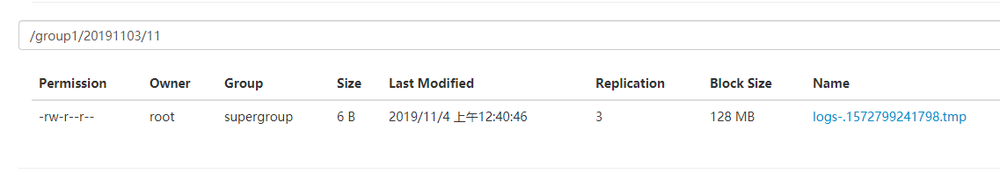

# **Flume** **进阶**

## **3.1 Flume** **事务**


channel被动接收source的时间

channel被动被sinks拉去数据


doCommit()首先去检查Channel中的内存是否足够合并，足够则推送，否则回滚

doRollback（）做事务回滚此时数据依然在putList中存放


Take事务和put事务类似

事务回滚到Channel中


## **3.2 Flume Agent** **内部原理**


**重要组件：**

**1）ChannelSelector** 

ChannelSelector 的作用就是选出 Event 将要被发往哪个 Channel。其共有两种类型， 

分别是 **Replicating**（复制）和 **Multiplexing**（多路复用）。

ReplicatingSelector 会将同一个 Event 发往所有的 Channel，Multiplexing 会根据相 

应的原则，将不同的 Event 发往不同的 Channel。


Replicating Channel Selector (default)

```
a1.sources = r1
a1.channels = c1 c2 c3
a1.sources.r1.selector.type = replicating
a1.sources.r1.channels = c1 c2 c3
a1.sources.r1.selector.optional = c3
```


Multiplexing Channel Selector

```
a1.sources = r1
a1.channels = c1 c2 c3 c4
a1.sources.r1.selector.type = multiplexing
多了复用需要跟拦截器一起用  添加一个头（头结构是map）
key是state
value是CZ、US

a1.sources.r1.selector.header = state  
a1.sources.r1.selector.mapping.CZ = c1
a1.sources.r1.selector.mapping.US = c2 c3
a1.sources.r1.selector.default = c4
```


**2）SinkProcessor** 

SinkProcessor 共 有 三 种 类 型 ， 分 别 是 **DefaultSinkProcessor** 、 

**LoadBalancingSinkProcessor** 和 **FailoverSinkProcessor** 

DefaultSinkProcessor 对 应 的 是 单 个 的 Sink ， LoadBalancingSinkProcessor 和 

FailoverSinkProcessor 对应的是 Sink Group，LoadBalancingSinkProcessor 可以实现负 

载均衡的功能，FailoverSinkProcessor 可以实现故障转移的功能。 


Default Sink Processor

Default sink processor accepts only a single sink. User is not forced to create processor (sink group) for single sinks. Instead user can follow the source - channel - sink pattern that was explained above in this user guide.


Failover Sink Processor

```
processor.type	default	The component type name, needs to be failover
```


Load balancing Sink Processor

```


processor.sinks	 –	Space-separated list of sinks that are participating in the group
processor.type	default	The component type name, needs to be load_balance
processor.backoff	false	Should failed sinks be backed off exponentially.
processor.selector	round_robin	Selection mechanism. Must be either round_robin, random or FQCN of custom class that inherits from AbstractSinkSelector
processor.selector.maxTimeOut	30000	Used by backoff selectors to limit exponential backoff (in milliseconds)
```

processor.selector.maxTimeOut	30000	Used by backoff selectors to limit exponential backoff (in milliseconds) 如果sinks挂掉此时在单位时间内就不会访问该挂掉的sinks（退避时间是 2 * n此访问（每次时间）

此时最大值是3000 ，在30s之后 依然会轮询进行访问


## **3.3 Flume** **拓扑结构**

### **3.3.1** **简单串联**


Flume Agent 连接


这种模式是将多个 flume 顺序连接起来了，从最初的 source 开始到最终 sink 传送的 

目的存储系统。此模式不建议桥接过多的 flume 数量，flume 数量过多不仅会影响传输速率， 

而且一旦传输过程中某个节点 flume 宕机，会影响整个传输系统。 


### **3.3.2** **复制和多路复用**


单 source，多 channel、sink


Flume 支持将事件流向一个或者多个目的地。这种模式可以将相同数据复制到多个 

channel 中，或者将不同数据分发到不同的 channel 中，sink 可以选择传送到不同的目的 

地。


### **3.3.3** **负载均衡和故障转移**


Flume 负载均衡或故障转移

Flume支持使用将多个sink逻辑上分到一个sink组，sink组配合不同的SinkProcessor 

可以实现负载均衡和错误恢复的功能。


### **3.3.4** **聚合**


这种模式是我们最常见的，也非常实用，日常 web 应用通常分布在上百个服务器，大者 

甚至上千个、上万个服务器。产生的日志，处理起来也非常麻烦。用 flume 的这种组合方式 

能很好的解决这一问题，每台服务器部署一个 flume 采集日志，传送到一个集中收集日志的 

flume，再由此 flume 上传到 hdfs、hive、hbase 等，进行日志分析。 


## **3.4 Flume** **企业开发案例**


### **3.4.1** **复制和多路复用**

**1）案例需求** 

使用 Flume-1 监控文件变动（exec，Taildir），Flume-1 将变动内容传递给 Flume-2，Flume-2 负责存储 

到 HDFS。同时 Flume-1 将变动内容传递给 Flume-3，Flume-3 负责输出到 Local FileSystem。


**2）需求分析**


一方面上传到hdfs

一方面存在本地进行文件备份


**3）实现步骤**

**准备工作**

在/opt/module/flume/job 目录下创建 group1 文件夹

```
[root@hadoop2 job]# mkdir group1


[root@hadoop2 group1]# touch flume1.conf
[root@hadoop2 group1]# touch flume2.conf
[root@hadoop2 group1]# touch flume3.conf
```


在/opt/module/datas/目录下创建 flume3 文件夹


flume1.conf

```
# 定义
a1.sources = r1
a1.channels = c1 c2
a1.sinks=k1 k2

# source
a1.sources.r1.type = TAILDIR
a1.sources.r1.filegroups = f1
a1.sources.r1.filegroups.f1 = /opt/module/data/hive.log
a1.sources.r1.positionFile =  /opt/module/flume/position/position1.json

# channels
a1.channels.c1.type = memory
a1.channels.c1.capacity = 1000
a1.channels.c1.transactionCapacity = 100

a1.channels.c2.type = memory
a1.channels.c2.capacity = 1000
a1.channels.c2.transactionCapacity = 100

# sinks(avro)
a1.sinks.k1.type = avro
a1.sinks.k1.hostname = 192.168.199.120
a1.sinks.k1.port = 4141

a1.sinks.k2.type = avro
a1.sinks.k2.hostname = 192.168.199.120
a1.sinks.k2.port = 4142

# bind
a1.sources.r1.channels = c1 c2 
a1.sinks.k1.channel = c1
a1.sinks.k2.channel = c2


```


flume2.conf

```
#Name
a2.sources = r1
a2.channels = c1
a2.sinks = k1

#Source
a2.sources.r1.type = avro
a2.sources.r1.bind = 192.168.199.120
a2.sources.r1.port = 4141

#Channel
a2.channels.c1.type = memory
a2.channels.c1.capacity = 1000
a2.channels.c1.transactionCapacity = 100

#Sink
a2.sinks.k1.type = hdfs
a2.sinks.k1.hdfs.path = hdfs://192.168.199.120:9000/group1/%Y%m%d/%H
#上传文件的前缀
a2.sinks.k1.hdfs.filePrefix = logs-
#是否按照时间滚动文件夹
a2.sinks.k1.hdfs.round = true
#多少时间单位创建一个新的文件夹
a2.sinks.k1.hdfs.roundValue = 1
#重新定义时间单位
a2.sinks.k1.hdfs.roundUnit = hour
#是否使用本地时间戳
a2.sinks.k1.hdfs.useLocalTimeStamp = true
#积攒多少个Event才flush到HDFS一次
a2.sinks.k1.hdfs.batchSize = 1000
#设置文件类型，可支持压缩
a2.sinks.k1.hdfs.fileType = DataStream
#多久生成一个新的文件
a2.sinks.k1.hdfs.rollInterval = 30
#设置每个文件的滚动大小
a2.sinks.k1.hdfs.rollSize = 134217700
#文件的滚动与Event数量无关
a2.sinks.k1.hdfs.rollCount = 0

#Bind
a2.sources.r1.channels = c1
a2.sinks.k1.channel = c1
```


flume3.conf

```
#Name
a3.sources = r1
a3.channels = c1
a3.sinks = k1

#Source
a3.sources.r1.type = avro
a3.sources.r1.bind = 192.168.199.120
a3.sources.r1.port = 4142

#Channel
a3.channels.c1.type = memory
a3.channels.c1.capacity = 1000
a3.channels.c1.transactionCapacity = 100

#Sink
a3.sinks.k1.type = file_roll
a3.sinks.k1.sink.directory = /opt/module/datas/group1

#Bind
a3.sources.r1.channels = c1
a3.sinks.k1.channel = c1
```


进行启动：

```
[root@hadoop2 flume]# bin/flume-ng agent  -c conf/ -f job/group1/flume2.conf  -n a2
```

```
C[root@hadoop2 flume]# bin/flume-ng agent  -c conf/ -f job/group1/flume3.conf  -n a3
```

```
[root@hadoop2 flume]# bin/flume-ng agent -c conf/ -f job/group1/flume1.conf -n a1
```


进行添加信息到文件中

```
[root@hadoop2 data]# echo hello >> hive.log
```


flume.log的文件日子

```
03 Nov 2019 11:40:41,797 INFO  [SinkRunner-PollingRunner-DefaultSinkProcessor] (org.apache.flume.sink.hdfs.HDFSDataStream.configure:57)  - Serializer = TEXT, UseRawLocalFileSystem = false
03 Nov 2019 11:40:42,745 INFO  [SinkRunner-PollingRunner-DefaultSinkProcessor] (org.apache.flume.sink.hdfs.BucketWriter.open:231)  - Creating hdfs://192.168.199.120:9000/group1/20191103/11/logs-.1572799241798.tmp
03 Nov 2019 11:41:16,945 INFO  [hdfs-k1-roll-timer-0] (org.apache.flume.sink.hdfs.BucketWriter.close:357)  - Closing hdfs://192.168.199.120:9000/group1/20191103/11/logs-.1572799241798.tmp
03 Nov 2019 11:41:17,079 INFO  [hdfs-k1-call-runner-4] (org.apache.flume.sink.hdfs.BucketWriter$8.call:618)  - Renaming hdfs://192.168.199.120:9000/group1/20191103/11/logs-.1572799241798.tmp to hdfs://192.168.199.120:9000/group1/20191103/11/logs-.1572799241798
03 Nov 2019 11:41:17,134 INFO  [hdfs-k1-roll-timer-0] (org.apache.flume.sink.hdfs.HDFSEventSink$1.run:382)  - Writer callback called.
03 Nov 2019 11:42:35,767 INFO  [PollableSourceRunner-TaildirSource-r1] (org.apache.flume.source.taildir.TaildirSource.closeTailFiles:288)  - Closed file: /opt/module/data/hive.log, inode: 292750, pos: 41

```


查看hdfs



查看本地文件

```
[root@hadoop2 group1]# ll
total 4
-rw-r--r--. 1 root root 0 Nov  3 11:25 1572798128077-1
-rw-r--r--. 1 root root 0 Nov  3 11:25 1572798128077-2
-rw-r--r--. 1 root root 0 Nov  3 11:26 1572798128077-3
-rw-r--r--. 1 root root 0 Nov  3 11:26 1572798414896-1
-rw-r--r--. 1 root root 0 Nov  3 11:27 1572798414896-2
-rw-r--r--. 1 root root 0 Nov  3 11:27 1572798414896-3
-rw-r--r--. 1 root root 0 Nov  3 11:28 1572798414896-4
-rw-r--r--. 1 root root 0 Nov  3 11:29 1572798414896-5
-rw-r--r--. 1 root root 0 Nov  3 11:39 1572799191281-1
-rw-r--r--. 1 root root 0 Nov  3 11:44 1572799191281-10
-rw-r--r--. 1 root root 6 Nov  3 11:40 1572799191281-2
-rw-r--r--. 1 root root 0 Nov  3 11:40 1572799191281-3
-rw-r--r--. 1 root root 0 Nov  3 11:41 1572799191281-4
-rw-r--r--. 1 root root 0 Nov  3 11:41 1572799191281-5
-rw-r--r--. 1 root root 0 Nov  3 11:42 1572799191281-6
-rw-r--r--. 1 root root 0 Nov  3 11:42 1572799191281-7
-rw-r--r--. 1 root root 0 Nov  3 11:43 1572799191281-8
-rw-r--r--. 1 root root 0 Nov  3 11:43 1572799191281-9

```


### **3.4.2** **负载均衡和故障转移**

**1）案例需求**

使用 Flume1 监控一个端口，其 sink 组中的 sink 分别对接 Flume2 和 Flume3，采用 

FailoverSinkProcessor，实现故障转移的功能。


**3）实现步骤** 


在/opt/module/flume/job 目录下创建 group2 文件夹


flume1（flume3的优先级比flume2的优先级高）

```
a1.sources = r1
a1.sinks = k1 k2
a1.channels = c1

# Describe/configure the source
a1.sources.r1.type = netcat
a1.sources.r1.bind = localhost
a1.sources.r1.port = 44444

# chanel
a1.channels.c1.type = memory
a1.channels.c1.capacity = 1000
a1.channels.c1.transactionCapacity = 100

# sinks
# sinks(avro)
a1.sinks.k1.type = avro
a1.sinks.k1.hostname = 192.168.199.120
a1.sinks.k1.port = 4141

a1.sinks.k2.type = avro
a1.sinks.k2.hostname = 192.168.199.120
a1.sinks.k2.port = 4142


# sinks group定义组
a1.sinkgroups = g1
a1.sinkgroups.g1.sinks = k1 k2
a1.sinkgroups.g1.processor.type = failover
a1.sinkgroups.g1.processor.priority.k1 = 5
a1.sinkgroups.g1.processor.priority.k2 = 10
a1.sinkgroups.g1.processor.maxpenalty = 10000


# bind
a1.sources.r1.channels = c1 
a1.sinks.k1.channel = c1
a1.sinks.k2.channel = c1
```

flume2

```
#Name
a2.sources = r1
a2.channels = c1
a2.sinks = k1

#Source
a2.sources.r1.type = avro
a2.sources.r1.bind = 192.168.199.120
a2.sources.r1.port = 4141

#Channel
a2.channels.c1.type = memory
a2.channels.c1.capacity = 1000
a2.channels.c1.transactionCapacity = 100

#Sink
a2.sinks.k1.type = logger

#Bind
a2.sources.r1.channels = c1
a2.sinks.k1.channel = c1
```

flume3

```
#Name
a3.sources = r1
a3.channels = c1
a3.sinks = k1

#Source
a3.sources.r1.type = avro
a3.sources.r1.bind = 192.168.199.120
a3.sources.r1.port = 4142

#Channel
a3.channels.c1.type = memory
a3.channels.c1.capacity = 1000
a3.channels.c1.transactionCapacity = 100

#Sink
a3.sinks.k1.type = logger

#Bind
a3.sources.r1.channels = c1
a3.sinks.k1.channel = c1
```


依次进行启动

```
 bin/flume-ng agent -c conf/ -f job/group2/flume2.conf  -n a2 
-Dflume.root.logger=INFO,console

```


```
bin/flume-ng agent -c conf/ -f job/group2/flume3.conf -n a3 -Dflume.root.logger=INFO,console
```


```
[root@hadoop2 flume]# bin/flume-ng agent -c conf/ -f job/group2/flume1.conf -n a1
```


#### 故障转移

发送信息

```
[root@hadoop2 group2]# nc localhost 44444
helloword
OK

```

flume3上接收信息

```
2019-11-04 10:34:25,865 (SinkRunner-PollingRunner-DefaultSinkProcessor) [INFO - org.apache.flume.sink.LoggerSink.process(LoggerSink.java:95)] Event: { headers:{} body: 68 65 6C 6C 6F 77 6F 72 64                      helloword }

```

此时发送的信息都在flume3上

因为flume3的优先级最高

如果flume3挂掉

此时会寻找flume2进行通信

此时的是一个组


#### 负载均衡

在上述的基础上修改flume1的配置文件

Load balancing Sink Processor的配置

```
a1.sources = r1
a1.sinks = k1 k2
a1.channels = c1

# Describe/configure the source
a1.sources.r1.type = netcat
a1.sources.r1.bind = localhost
a1.sources.r1.port = 44444

# chanel
a1.channels.c1.type = memory
a1.channels.c1.capacity = 1000
a1.channels.c1.transactionCapacity = 100

# sinks
# sinks(avro)
a1.sinks.k1.type = avro
a1.sinks.k1.hostname = 192.168.199.120
a1.sinks.k1.port = 4141

a1.sinks.k2.type = avro
a1.sinks.k2.hostname = 192.168.199.120
a1.sinks.k2.port = 4142


# sinks group定义组
a1.sinkgroups = g1
a1.sinkgroups.g1.sinks = k1 k2
a1.sinkgroups.g1.processor.type = load_balance
a1.sinkgroups.g1.processor.backoff = true
a1.sinkgroups.g1.processor.selector = random


# bind
a1.sources.r1.channels = c1 
a1.sinks.k1.channel = c1
a1.sinks.k2.channel = c1
```

此时的既是负载均衡的配置


## **3.4.3** **聚合**

**1）案例需求** 

hadoop2 上的 Flume-1 监控文件/opt/module/data/group.log， 

hadoop3 上的 Flume-2 监控某一个端口的数据流， 

Flume-1 与 Flume-2 将数据发送给 hadoop104 上的 Flume-3，Flume-3 将最终数据打印到控 

制台。


**hadoop2&hadoop3属于客户端能远程连接到服务端**


**2）需求分析**


f1 --4141

f2 --4142

f3 --4141&4142使用两个source


**hadoop2的配置文件**

```
a2.sources = r1
a2.sinks = k1
a2.channels = c1

# Describe/configure the source
a2.sources.r1.type = TAILDIR
a2.sources.r1.filegroups = f1
a2.sources.r1.filegroups.f1 = /opt/module/data/flume2.txt
a2.sources.r1.positionFile = /opt/module/flume/position/position2.json


# channels
a2.channels.c1.type = memory
a2.channels.c1.capacity = 1000
a2.channels.c1.transactionCapacity = 100

# sinks
a2.sinks.k1.type = avro
# 绑定到hadoop4机器上
a2.sinks.k1.hostname = hadoop4
a2.sinks.k1.port = 4141


# bind
a2.sources.r1.channels = c1 
a2.sinks.k1.channel = c1
```


**hadoop3的配置文件**

```
a3.sources = r1
a3.sinks = k1
a3.channels = c1

# Describe/configure the source
a3.sources.r1.type = netcat
a3.sources.r1.bind = localhost
a3.sources.r1.port = 44444


# channels
a3.channels.c1.type = memory
a3.channels.c1.capacity = 1000
a3.channels.c1.transactionCapacity = 100

# sinks
a3.sinks.k1.type = avro
# 绑定到hadoop4机器上
a3.sinks.k1.hostname = hadoop4
a3.sinks.k1.port = 4141


# bind
a3.sources.r1.channels = c1 
a3.sinks.k1.channel = c1

a3.sources = r1
a3.sinks = k1
a3.channels = c1

# Describe/configure the source
a3.sources.r1.type = netcat
a3.sources.r1.bind = localhost
a3.sources.r1.port = 44444


# channels
a3.channels.c1.type = memory
a3.channels.c1.capacity = 1000
a3.channels.c1.transactionCapacity = 100

# sinks
a3.sinks.k1.type = avro
# 绑定到hadoop4机器上
a3.sinks.k1.hostname = hadoop4
a3.sinks.k1.port = 4141


# bind
a3.sources.r1.channels = c1 
a3.sinks.k1.channel = c1
```


**hadoop4的配置文件**

```
a4.sources = r1
a4.sinks = k1
a4.channels = c1

# Describe/configure the source
a4.sources.r1.type = avro
a4.sources.r1.bind = hadoop4
a4.sources.r1.port = 4141


# channels
a4.channels.c1.type = memory
a4.channels.c1.capacity = 1000
a4.channels.c1.transactionCapacity = 100

# sinks
a4.sinks.k1.type = logger


# bind
a4.sources.r1.channels = c1 
a4.sinks.k1.channel = c1
```


一次进行启动

hadoop4

```
[root@hadoop4 flume]# bin/flume-ng agent -c conf/ -f job/group3/flume44.conf  -n a4 
-Dflume.root.logger=INFO,console

```

Hadoop3

```
[root@hadoop3 flume]# bin/flume-ng agent -c conf/ -f job/group3/flume33.conf  -n a3
```

hadoop2

```
[root@hadoop2 flume]# bin/flume-ng agent -c conf/ -f job/group3/flume22.conf  -n a2
```


**使用hadoop2进行对文件追加内容**

```
[root@hadoop2 data]# echo hello >> flume2.txt
```

hadoop4进行相关的数据收集

```
2019-11-05 10:50:46,383 (SinkRunner-PollingRunner-DefaultSinkProcessor) [INFO - org.apache.flume.sink.LoggerSink.process(LoggerSink.java:95)] Event: { headers:{} body: 68 65 6C 6C 6F                                  hello }
```


**hadoop3上舒勇netcat 进行测试**

```
[root@hadoop3 ~]# nc localhost 44444
hello word
OK
```

hadoop4上进行响应

```
2019-11-05 10:54:44,436 (SinkRunner-PollingRunner-DefaultSinkProcessor) [INFO - org.apache.flume.sink.LoggerSink.process(LoggerSink.java:95)] Event: { headers:{} body: 68 65 6C 6C 6F 20 77 6F 72 64                   hello word }

```


之上就是一个测试案例

此时的测试两个source使用同一个端口（hadoop4）上

如果两个端口不一致

此时可以使用两个source进行性汇总

此时修改hadoop3的端口为4142

```
a3.sources = r1
a3.sinks = k1
a3.channels = c1

# Describe/configure the source
a3.sources.r1.type = netcat
a3.sources.r1.bind = localhost
a3.sources.r1.port = 44444


# channels
a3.channels.c1.type = memory
a3.channels.c1.capacity = 1000
a3.channels.c1.transactionCapacity = 100

# sinks
a3.sinks.k1.type = avro
# 绑定到hadoop4机器上
a3.sinks.k1.hostname = hadoop4
a3.sinks.k1.port = 4142


# bind
a3.sources.r1.channels = c1 
a3.sinks.k1.channel = c1
```

hadoop4的配置文件进行修改

```
a4.sources = r1 r2
a4.sinks = k1
a4.channels = c1

# Describe/configure the source
a4.sources.r1.type = avro
a4.sources.r1.bind = hadoop4
a4.sources.r1.port = 4141

# Describe/configure the source
a4.sources.r1.type = avro
a4.sources.r1.bind = hadoop4
a4.sources.r1.port = 4142

# channels
a4.channels.c1.type = memory
a4.channels.c1.capacity = 1000
a4.channels.c1.transactionCapacity = 100

# sinks
a4.sinks.k1.type = logger

# bind
a4.sources.r1.channels = c1 
a4.sources.r2.channels = c1 
a4.sinks.k1.channel = c1
```


## **3.5** **自定义** **Interceptor**


**1）案例需求** 

使用 Flume 采集服务器本地日志，需要按照日志类型的不同，将不同种类的日志发往不 

同的分析系统。

**2）需求分析** 

在实际的开发中，一台服务器产生的日志类型可能有很多种，不同类型的日志可能需要 

发送到不同的分析系统。此时会用到 Flume 拓扑结构中的 Multiplexing 结构，Multiplexing 

的原理是，根据 event 中 Header 的某个 key 的值，将不同的 event 发送到不同的 Channel

中，所以我们需要自定义一个 Interceptor，为不同类型的 event 的 Header 中的 key 赋予 

不同的值。 


以端口数据模拟日志，以数字（单个）和字母（单个）模拟不同类型 的日志

需要自定义 interceptor 区分数字和字母，将其分别发往不同的分析系统 （Channel）。


参考地址:ctrl + f ：flume interceptor


1、依赖

```
<dependency>
<groupId>org.apache.flume</groupId>
<artifactId>flume-ng-core</artifactId>
<version>1.7.0</version>
</dependency> 
```


2.定义 CustomInterceptor 类并实现 Interceptor 接口。

```
package flume.com.flume.interceptor;


import org.apache.flume.Context;
import org.apache.flume.Event;
import org.apache.flume.interceptor.Interceptor;

import java.util.ArrayList;
import java.util.List;
import java.util.Map;

public class TypeInterceptor implements Interceptor {

    //声明存放事件的集合
    private List<Event> addEvent;

    //初始化
    @Override
    public void initialize() {
        //初始化
        addEvent = new ArrayList<>();
    }

    //单个事件处理
    //Event是个接口
    @Override
    public Event intercept(Event event) {
        //获取时间 中的header
        Map<String, String> headers = event.getHeaders();

        //获取时间中的body
        //byte[] body = event.getBody();
        String body = new String(event.getBody());

        //根据body中的内容进行添加相应的头信息
        if (body.contains("hello")){
            //添加头信息
            headers.put("type","mrcheng");
        }else {
            headers.put("type","flume");
        }

        //可以进行事件的过滤


        return event;
    }


    //批处理
    @Override
    public List<Event> intercept(List<Event> list) {
        //首先进行清空集合
        addEvent.clear();

        //遍历events给每一个事件添加头信息
        for (Event event :list){
            addEvent.add(intercept(event));
        }
        //返回结果
        return addEvent;
    }

    //关闭
    @Override
    public void close() {

    }

    //$Builder
    public static class Builder implements Interceptor.Builder{

        //返回值是一个拦截器对象
        @Override
        public Interceptor build() {
            return new TypeInterceptor();
        }

        @Override
        public void configure(Context context) {

        }
    }
}

```

打包上传到目录下

/opt/module/flume/lib/


3.编辑 flume 配置文件

hadoop2配置文件

```
# Name the components on this agent
a1.sources = r1
a1.sinks = k1 k2
a1.channels = c1 c2

# Describe/configure the source
a1.sources.r1.type = netcat
a1.sources.r1.bind = localhost
a1.sources.r1.port = 44444

a1.sources.r1.interceptors = i1
a1.sources.r1.interceptors.i1.type = flume.com.flume.interceptor.TypeInterceptor$Builder
a1.sources.r1.selector.type = multiplexing

a1.sources.r1.selector.header = type
a1.sources.r1.selector.mapping.mrcheng = c1
a1.sources.r1.selector.mapping.flume = c2

# Describe the sink
a1.sinks.k1.type = avro
a1.sinks.k1.hostname = hadoop3
a1.sinks.k1.port = 4141

a1.sinks.k2.type=avro
a1.sinks.k2.hostname = hadoop4
a1.sinks.k2.port = 4242


# Use a channel which buffers events in memory
a1.channels.c1.type = memory
a1.channels.c1.capacity = 1000
a1.channels.c1.transactionCapacity = 100
# Use a channel which buffers events in memory

a1.channels.c2.type = memory
a1.channels.c2.capacity = 1000
a1.channels.c2.transactionCapacity = 100

# Bind the source and sink to the channel
a1.sources.r1.channels = c1 c2
a1.sinks.k1.channel = c1
a1.sinks.k2.channel = c2

```


hadoop3配置文件

```
a1.sources = r1
a1.sinks = k1
a1.channels = c1

a1.sources.r1.type = avro
a1.sources.r1.bind = hadoop3
a1.sources.r1.port = 4141

a1.sinks.k1.type = logger

a1.channels.c1.type = memory
a1.channels.c1.capacity = 1000
a1.channels.c1.transactionCapacity = 100

a1.sinks.k1.channel = c1
a1.sources.r1.channels = c1
```


hadoop4配置文件

```
a1.sources = r1
a1.sinks = k1
a1.channels = c1

a1.sources.r1.type = avro
a1.sources.r1.bind = hadoop4
a1.sources.r1.port = 4242

a1.sinks.k1.type = logger

a1.channels.c1.type = memory
a1.channels.c1.capacity = 1000
a1.channels.c1.transactionCapacity = 100

a1.sinks.k1.channel = c1
a1.sources.r1.channels = c1
```


启动

```
[root@hadoop4 flume]# bin/flume-ng agent -c  conf/ -f job/interceptor/flume4.conf -n a1 -Dflume.root.logger=INFO,console
```


```
[root@hadoop3 flume]# bin/flume-ng agent -c conf/ -f job/interceptor/flume3.conf -n a1 -Dflume.root.logger=INFO,console
```


```
[root@hadoop2 flume]# bin/flume-ng agent -c conf/  -f job/interceptor/flume2.conf  -n a1

```


#### 功能

在netcat中在进行输入数据

根据是否有hello数据进行分发到不同的机器


使用netcat进行测试

**包含hello**

```
[root@hadoop2 ~]#  nc localhost 44444
helloword 
OK
```

此时在hadoop3上会有相应的数据打印

```
2019-11-09 11:09:12,517 (SinkRunner-PollingRunner-DefaultSinkProcessor) [INFO - org.apache.flume.sink.LoggerSink.process(LoggerSink.java:95)] Event: { headers:{type=mrcheng} body: 68 65 6C 6C 6F 77 6F 72 64 20                   helloword  }
```


**不包含hello**

```
[root@hadoop2 ~]#  nc localhost 44444
helloword 
OK

OK

OK
sss
OK

```

此时在hadoop4上会有相应的数据打印

```
2019-11-09 11:10:23,553 (SinkRunner-PollingRunner-DefaultSinkProcessor) [INFO - org.apache.flume.sink.LoggerSink.process(LoggerSink.java:95)] Event: { headers:{type=flume} body: }
2019-11-09 11:10:23,554 (SinkRunner-PollingRunner-DefaultSinkProcessor) [INFO - org.apache.flume.sink.LoggerSink.process(LoggerSink.java:95)] Event: { headers:{type=flume} body: }
2019-11-09 11:10:23,556 (SinkRunner-PollingRunner-DefaultSinkProcessor) [INFO - org.apache.flume.sink.LoggerSink.process(LoggerSink.java:95)] Event: { headers:{type=flume} body: 73 73 73                                        sss }

```


## **3.6** **自定义** **Source**


### 前言

Source 是负责接收数据到 Flume Agent 的组件。

Source 组件可以处理各种类型、各种格式的日志数据，包括 avro、thrift、exec、jms、spooling directory、netcat、sequence  generator、syslog、http、legacy。

官方提供的 source 类型已经很多，但是有时候并不能 满足实际开发当中的需求，此时需要根据实际需求自定义某些 source。 


官方也提供了自定义 source 的接口：

https://flume.apache.org/FlumeDeveloperGuide.html#source 根据官方说明自定义 

MySource 需要继承 AbstractSource 类并实现 Configurable 和 PollableSource 接口。 


实现相应方法： 

getBackOffSleepIncrement()//暂不用 

getMaxBackOffSleepInterval()//暂不用 

configure(Context context)//初始化 context（读取配置文件内容） 

process()//获取数据封装成 event 并写入 channel，这个方法将被循环调用。 

使用场景：读取 MySQL 数据或者其他文件系统。 


### **需求**

使用 flume 接收数据，并给每条数据添加前缀，输出到控制台。前缀可从 flume 配置文 

件中配置。


### 分析


### java代码

```
package flume.com.flume.source;

import org.apache.flume.Context;
import org.apache.flume.EventDeliveryException;
import org.apache.flume.PollableSource;
import org.apache.flume.conf.Configurable;
import org.apache.flume.event.SimpleEvent;
import org.apache.flume.source.AbstractSource;


public class MySource extends AbstractSource implements Configurable,PollableSource {

    //定义全局的前缀和后缀
    private String  pre = null;
    private String  sub = null;

    //1、接收数据
    //2、封装为事件
    //3、将事件传递channel
    @Override
    public Status process() throws EventDeliveryException {

        //定义状态
        Status status = null;


        try {
            //1、接收数据(造数据)
            for (int i = 0;i <=4;i++){
                //2、构造事件对象（Event实现类）
                SimpleEvent simpleEvent = new SimpleEvent();

                //3、事件设置值
                simpleEvent.setBody((pre + "--" + i + "--" + sub).getBytes());

                //4、将事件传递给channel
                getChannelProcessor().processEvent(simpleEvent);

                //正常完成
                status = Status.READY;
            }

        }catch (Exception e){
            status = Status.BACKOFF;
        }

        //线程进行休眠
        try {
            Thread.sleep(5000);
        } catch (InterruptedException e) {
            e.printStackTrace();
        }

        return status;
    }


    //初始化 context（读取配置文件内容）
    @Override
    public void configure(Context context) {
        //读取配置信息 给前后缀赋值
        pre = context.getString("pre");
        //如果为空加上默认值
        sub = context.getString("sub","cn");
    }

    //增加某个值
    @Override
    public long getBackOffSleepIncrement() {
        return 0;
    }

    //初始值
    @Override
    public long getMaxBackOffSleepInterval() {
        return 0;
    }
}

```

打包上传到lib文件下


source.conf 配置文件

```
# Name the components on this agent
a1.sources = r1
a1.sinks = k1
a1.channels = c1

# Describe/configure the source
a1.sources.r1.type = flume.com.flume.source.MySource
a1.sources.r1.pre =  mrchengs
a1.sources.r1.sub = com

# Describe the sink
a1.sinks.k1.type = logger

# Use a channel which buffers events in memory
a1.channels.c1.type = memory
a1.channels.c1.capacity = 1000
a1.channels.c1.transactionCapacity = 100

# Bind the source and sink to the channel
a1.sources.r1.channels = c1
a1.sinks.k1.channel = c1
```


启动服务：

```
[root@hadoop2 flume]# bin/flume-ng agent -c conf/ -f job/source/source.conf  -n a1 -Dflume.root.logger=INFO,console
```


此时控制台就会定期打印出数据

```
2019-11-10 02:37:17,132 (conf-file-poller-0) [INFO - org.apache.flume.node.Application.startAllComponents(Application.java:171)] Starting Sink k1
2019-11-10 02:37:17,134 (conf-file-poller-0) [INFO - org.apache.flume.node.Application.startAllComponents(Application.java:182)] Starting Source r1
2019-11-10 02:37:17,251 (SinkRunner-PollingRunner-DefaultSinkProcessor) [INFO - org.apache.flume.sink.LoggerSink.process(LoggerSink.java:95)] Event: { headers:{} body: 6D 72 63 68 65 6E 67 73 2D 2D 30 2D 2D 63 6F 6D mrchengs--0--com }
2019-11-10 02:37:17,251 (SinkRunner-PollingRunner-DefaultSinkProcessor) [INFO - org.apache.flume.sink.LoggerSink.process(LoggerSink.java:95)] Event: { headers:{} body: 6D 72 63 68 65 6E 67 73 2D 2D 31 2D 2D 63 6F 6D mrchengs--1--com }
2019-11-10 02:37:17,252 (SinkRunner-PollingRunner-DefaultSinkProcessor) [INFO - org.apache.flume.sink.LoggerSink.process(LoggerSink.java:95)] Event: { headers:{} body: 6D 72 63 68 65 6E 67 73 2D 2D 32 2D 2D 63 6F 6D mrchengs--2--com }
2019-11-10 02:37:17,252 (SinkRunner-PollingRunner-DefaultSinkProcessor) [INFO - org.apache.flume.sink.LoggerSink.process(LoggerSink.java:95)] Event: { headers:{} body: 6D 72 63 68 65 6E 67 73 2D 2D 33 2D 2D 63 6F 6D mrchengs--3--com }
2019-11-10 02:37:17,252 (SinkRunner-PollingRunner-DefaultSinkProcessor) [INFO - org.apache.flume.sink.LoggerSink.process(LoggerSink.java:95)] Event: { headers:{} body: 6D 72 63 68 65 6E 67 73 2D 2D 34 2D 2D 63 6F 6D mrchengs--4--com }

```


## **3.7** **自定义** **Sink**

### 前沿

Sink 不断地轮询 Channel 中的事件且批量地移除它们，并将这些事件批量写入到存储 

或索引系统、或者被发送到另一个 Flume Agent。 


Sink 是完全事务性的。在从 Channel 批量删除数据之前，每个 Sink 用 Channel 启动一 

个事务。批量事件一旦成功写出到存储系统或下一个 Flume Agent，Sink 就利用 Channel 提 

交事务。


**事务一旦被提交，该 Channel 从自己的内部缓冲区删除事件。**


Sink 组件目的地包括 hdfs、logger、avro、thrift、ipc、file、null、HBase、solr、 

自定义。


官方提供自定义 sink 的接口：

https://flume.apache.org/FlumeDeveloperGuide.html#sink 根据官方说明自定义 

MySink 需要继承 AbstractSink 类并实现 Configurable 接口。 


实现相应方法： 

configure(Context context)//初始化 context（读取配置文件内容） 

process()//从 Channel 读取获取数据（event），这个方法将被循环调用。 

使用场景：读取 Channel 数据写入 MySQL 或者其他文件系统。 


### 需求

使用 flume 接收数据，并在 Sink 端给每条数据添加前缀和后缀，输出到控制台。前后 

缀可在 flume 任务配置文件中配置。 


### 代码实现

```
package flume.com.flume.sink;

import org.apache.flume.*;
import org.apache.flume.conf.Configurable;
import org.apache.flume.sink.AbstractSink;
import org.slf4j.Logger;
import org.slf4j.LoggerFactory;

public class MySink  extends AbstractSink implements Configurable {

    //获取logger对象
    Logger logger = LoggerFactory.getLogger(MySink.class);

    //定义前后缀
    private  String pre;
    private  String sub;

    //获取channel
    //从channel获取数据
    //发送数据
    @Override
    public Status process() throws EventDeliveryException {

        //定义返回状态
        Status  status = null;

        //1、获取channel
        Channel channel = getChannel();

        //2、从channel中获取事务
        Transaction transaction = channel.getTransaction();

        //3、开启事务
        transaction.begin();

       try{

           //4、获取数据
           Event event = channel.take();

           //5、处理事件(业务逻辑)
           String body = new String(event.getBody());
           //具体在控制台还是文件依赖配置文件的使用
           logger.info(body);

           //6、提交事务
           transaction.commit();

           status = Status.READY;
       }catch (Exception r){
           //回滚事务
           transaction.rollback();

           status = Status.BACKOFF;
       }finally {
           //关闭事务
           if (transaction != null){
               transaction.close();
           }
       }
        return status;
    }

    @Override
    public void configure(Context context) {
        //读取配置文件给前后缀赋值
        pre = context.getString("pre");
        sub = context.getString("sub","cn");


    }
}
```


conf配置文件

```
 # Name the components on this agent
a1.sources = r1
a1.sinks = k1
a1.channels = c1

# Describe/configure the source
a1.sources.r1.type = netcat
a1.sources.r1.bind = localhost
a1.sources.r1.port = 44444

# Describe the sink
a1.sinks.k1.type = flume.com.flume.sink.MySink
a1.sinks.k1.pre = hello:--
a1.sinks.k1.sub = --com


# Use a channel which buffers events in memory
a1.channels.c1.type = memory
a1.channels.c1.capacity = 1000
a1.channels.c1.transactionCapacity = 100

# Bind the source and sink to the channel
a1.sources.r1.channels = c1
a1.sinks.k1.channel = c1
```

启动

```
[root@hadoop2 flume]# bin/flume-ng agent conf/ -f job/sink/sink.conf  -n a1  -Dflume.root.logger=INFO,console

```


使用nc进行测试

```
[root@hadoop2 ~]# nc localhost 44444
hello
OK
goog^Hd^H^H^H^H^H
OK
good
OK
```

结果

```
19/11/10 04:03:06 INFO sink.MySink: hello
19/11/10 04:03:37 INFO sink.MySink: good
19/11/10 04:03:39 INFO sink.MySink: good
```


