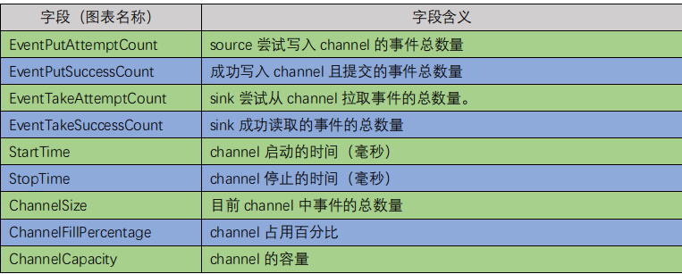

## **Flume** **数据流监控**

###  **Ganglia** **的安装与部署**

**1) 安装 httpd 服务与 php**

```
 yum -y install httpd php
```


**2) 安装其他依赖**

```
yum -y install rrdtool perl-rrdtool rrdtool-devel
```

```
 yum -y install apr-devel
```


**3）安装 ganglia**

```
rpm -Uvh http://dl.fedoraproject.org/pub/epel/6/x86_64/epel-release-6-8.noarch.rpm
```

```
 yum -y install ganglia-gmetad 
 yum -y install ganglia-web
 yum -y install ganglia-gmond
```

Ganglia 由 gmond、gmetad 和 gweb 三部分组成。


gmond（Ganglia Monitoring Daemon）是一种轻量级服务，安装在每台需要收集指标 

数据的节点主机上。使用 gmond，你可以很容易收集很多系统指标数据，如 CPU、内存、 

磁盘、网络和活跃进程的数据等。


gmetad（Ganglia Meta Daemon）整合所有信息，并将其以 RRD 格式存储至磁盘的服 

务。


gweb（Ganglia Web）Ganglia 可视化工具，gweb 是一种利用浏览器显示 gmetad 所存 

储数据的 PHP 前端。在 Web 界面中以图表方式展现集群的运行状态下收集的多种不同指标 

数据。 


**4) 修改配置文件/etc/httpd/conf.d/ganglia.conf**

```
 vim /etc/httpd/conf.d/ganglia.conf
```


```
Alias /ganglia /usr/share/ganglia

<Location /ganglia>
  Order deny,allow
  Allow from all
  Allow from 127.0.0.1
  Allow from ::1
  # Allow from .example.com
</Location>

```


**5) 修改配置文件/etc/ganglia/gmetad.conf**

```
 vim /etc/ganglia/gmetad.conf
```

```
data_source "hadoop2" 192.168.199.120
```


**6) 修改配置文件/etc/ganglia/gmond.conf**

```
 vim /etc/ganglia/gmond.conf
```

```
cluster {
  name = "hadoop2"
  owner = "unspecified"
  latlong = "unspecified"
  url = "unspecified"
}

```

```
udp_send_channel {
  #bind_hostname = yes # Highly recommended, soon to be default.
                       # This option tells gmond to use a source address
                       # that resolves to the machine's hostname.  Without
                       # this, the metrics may appear to come from any
                       # interface and the DNS names associated with
                       # those IPs will be used to create the RRDs.
 # mcast_join = 239.2.11.71
  host = 192.168.199.120
  port = 8649
  ttl = 1
}

```

```
udp_recv_channel {
 # mcast_join = 239.2.11.71
  port = 8649
  bind = 192.168.199.120
  retry_bind = true
  # Size of the UDP buffer. If you are handling lots of metrics you really
  # should bump it up to e.g. 10MB or even higher.
  # buffer = 10485760
}

```


**7) 修改配置文件/etc/selinux/config**

```
 vim /etc/selinux/config
```


```

# This file controls the state of SELinux on the system.
# SELINUX= can take one of these three values:
#     enforcing - SELinux security policy is enforced.
#     permissive - SELinux prints warnings instead of enforcing.
#     disabled - No SELinux policy is loaded.
SELINUX=disabled
# SELINUXTYPE= can take one of these two values:
#     targeted - Targeted processes are protected,
#     mls - Multi Level Security protection.
SELINUXTYPE=targeted

```


selinux 本次生效关闭必须重启，如果此时不想重启，可以临时生效之：

```
sudo setenforce 0
```


**8) 启动 ganglia**

```
[root@MrChengs ~]#  service httpd start
正在启动 httpd：                                           [确定]
[root@MrChengs ~]#  service gmetad start
Starting GANGLIA gmetad:                                   [确定]
[root@MrChengs ~]# service gmond start
Starting GANGLIA gmond:                                    [确定]
```


**9) 打开网页浏览 ganglia 页面**

http://192.168.199.141/ganglia/


### **操作** **Flume** **测试监控**

 **修改/opt/module/flume/conf 目录下的 flume-env.sh 配置：**

```
JAVA_OPTS="-Dflume.monitoring.type=ganglia
-Dflume.monitoring.hosts=Ganglia_ip:8649
-Xms100m
-Xmx200m"
```


 **启动 Flume 任务**

```
 bin/flume-ng agent \
--conf conf/ \
--name a1 \
--conf-file job/flume-netcat-logger.conf \ -Dflume.root.logger==INFO,console \ -Dflume.monitoring.type=ganglia \ -Dflume.monitoring.hosts=Ganglia_ip:8649
```


