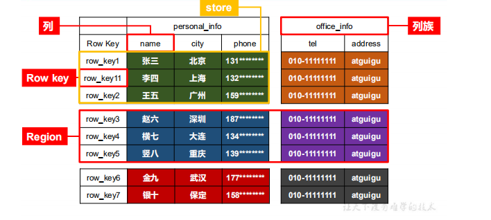
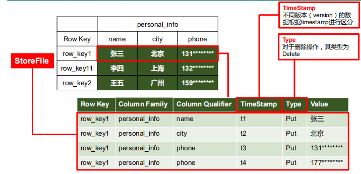

#  1、简介

## 1.1 HBase定义

HBase 是一种**分布式**、可扩展、支持海量数据存储的 NoSQL 数据库。

# **2 H**Base **数据模型**

逻辑上，HBase 的数据模型同关系型数据库很类似，数据存储在一张表中，有行有列。 

但从 HBase 的底层物理存储结构（K-V）来看，HBase 更像是一个 **multi-dimensional map**。 

## **2.1 HBase **逻辑结构

Row key:按照位数进行排序

Regin：是一张表的切片（横向的切片），按照数据量进行切分的

store：真是存储的数据存在hdfs上

## **2.2 H**Base **物理存储结构**

## **2.3** **数据模型**

**1）Name Space** 

命名空间，类似于关系型数据库的 DatabBase 概念，每个命名空间下有多个表。HBase 

有两个自带的命名空间，分别是 **hbase** 和 **default**，hbase 中存放的是 HBase 内置的表， 

**default** 表是用户默认使用的命名空间。

**2）Region** 

类似于关系型数据库的表概念。不同的是，HBase 定义表时只需要声明列族即可，不需 

要声明具体的列。这意味着，往 HBase 写入数据时，字段可以动态、按需指定。因此，和关 

系型数据库相比，HBase 能够轻松应对字段变更的场景。 

**3）Row** 

HBase 表中的每行数据都由一个 **RowKey** 和多个 **Column**（列）组成，数据是按照 RowKey 

的**字典顺序存储**的，并且查询数据时只能根据 RowKey 进行检索，所以 RowKey 的设计十分重 

要。 

**4）Column** 

HBase 中的每个列都由 **Column Family**(列族)和 **Column Qualifier（列限定符）**进行限 

定，例如 info：name，info：age。建表时，只需指明列族，而列限定符无需预先定义。 

**5）Time Stamp** 

用于标识数据的不同版本（version），每条数据写入时，如果不指定时间戳，系统会 

自动为其加上该字段，其值为写入 HBase 的时间。 

**6）Cell** 

由{rowkey, column Family：column Qualifier, time Stamp} 唯一确定的单元。cell 中的数 

据是没有类型的，全部是字节码形式存贮。

