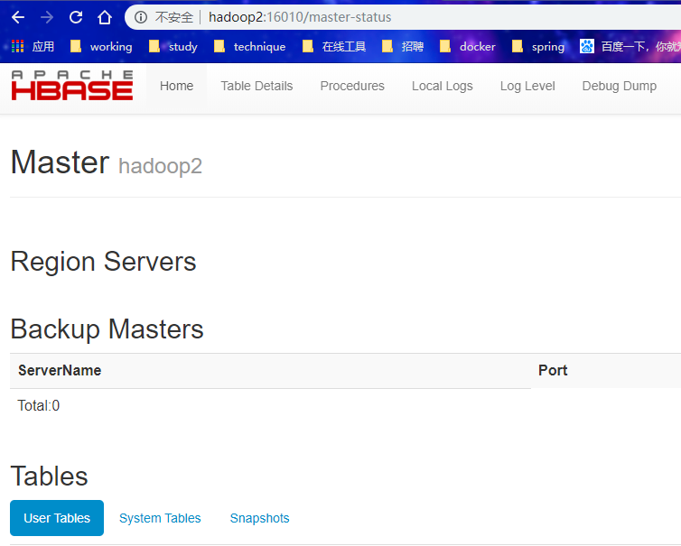
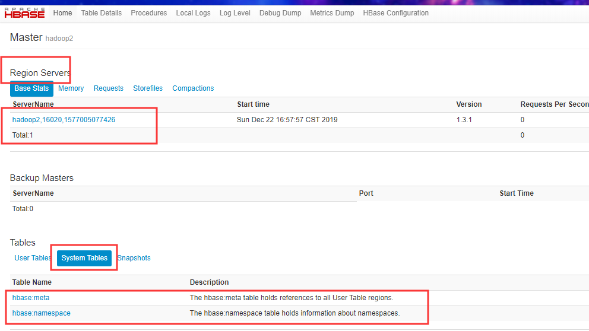
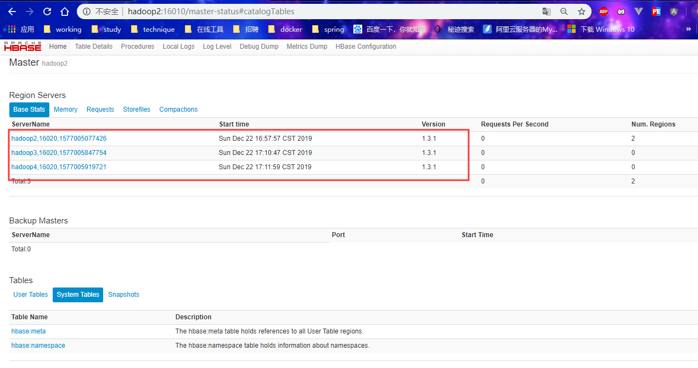

## **1、Zookeeper** **正常部署**

首先保证 Zookeeper 集群的正常部署，并启动之：

```
[root@hadoop2 zookeeper-3.4.10]# bin/zkServer.sh start
[root@hadoop3 zookeeper-3.4.10]# bin/zkServer.sh  start
[root@hadoop4 zookeeper-3.4.10]# bin/zkServer.sh start
```


## **2、Hadoop** **正常部署**


```
[root@hadoop2 sbin]# start-dfs.sh //必须启动dfs
```


```
[root@hadoop3 sbin]# start-yarn.sh //可以不启动
```


## **3、HBase** **的解压**


```
tar -zxvf hbase-1.3.1-bin.tar.gz -C /opt/module/
```


###  **HBase** **的配置文件**

conf目录下的配置文件

**1、regionservers**

```
[root@hadoop2 conf]# cat regionservers 
hadoop2
hadoop3
hadoop4

```


**2、hbase-env.sh**

```
//添加环境变量
export JAVA_HOME=/opt/jdk1.8.0_131

//注释两个设置
//在启动的时候会友警告提示
//可以不修改
#export HBASE_MASTER_OPTS="$HBASE_MASTER_OPTS -XX:PermSize=128m -XX:MaxPermSize=128m"
#export HBASE_REGIONSERVER_OPTS="$HBASE_REGIONSERVER_OPTS -XX:PermSize=128m -XX:MaxPermSize=128m"

//告诉HBase是否应该管理自己的Zookeeper实例
//默认为true
//有一个自带的zk
//此时的myid都会被修改
//自己的zk就启动失败
export HBASE_MANAGES_ZK=false
```


**3、hbase-site.xml**

```
<!--Hbase的根目录 -->
<property>
	<name>hbase.rootdir</name>
	<value>hdfs://hadoop2:9000/HBase</value>
</property>

<!--是否打开分布式 -->
<property>
	<name>hbase.cluster.distributed</name>
	<value>true</value>
</property>

<!-- 0.98 后的新变动，之前版本没有.port,默认端口为 60000 -->
<property>
	<name>hbase.master.port</name>
	<value>16000</value>
</property>

<!-- -->
<property> 
	<name>hbase.zookeeper.quorum</name>
	<value>hadoop2,hadoop3,hadoop4</value>
</property>

<!--zk的工作目录 -->
<property> 
	<name>hbase.zookeeper.property.dataDir</name>
	<value>/opt/module/zookeeper-3.4.10/zkData</value>
</property>
```


**4、软连接 hadoop 配置文件到 HBase：**

```
[root@hadoop2 conf]# ln -s /opt/module/hadoop-2.7.2/etc/hadoop/core-site.xml  /opt/module/hbase/conf/core-site.xml[root@hadoop2 conf]# ln -s /opt/module/hadoop-2.7.2/etc/hadoop/hdfs-site.xml /opt/module/hbase/conf/hdfs-site.xml
[root@hadoop2 conf]# 

```


### **远程发送到其他集群**

```
 xsync hbase/
```


## **4、HBase** **服务的启动**

**1．启动方式** 1

```
[root@hadoop2 hbase]# bin/hbase-daemon.sh start master
starting master, logging to /opt/module/hbase/bin/../logs/hbase-root-master-hadoop2.out
```


外部访问

```
http://hadoop2:16010
```



此时启动的时一个机器上的服务

启动Region Servers

```
[root@hadoop2 hbase]# bin/hbase-daemon.sh start regionserver
starting regionserver, logging to /opt/module/hbase/bin/../logs/hbase-root-regionserver-hadoop2.out

```





| Table Name                                                   | Description                                                  |
| :----------------------------------------------------------- | :----------------------------------------------------------- |
| [hbase:meta](http://hadoop2:16010/table.jsp?name=hbase:meta) | The hbase:meta table holds references to all User Table regions. |
| [hbase:namespace](http://hadoop2:16010/table.jsp?name=hbase:namespace) | The hbase:namespace table holds information about namespaces. |

namespace；是一个表名字


集群工作需要专门去其他机器上启动

```
[root@hadoop3 hbase]#  bin/hbase-daemon.sh start regionserver
starting regionserver, logging to /opt/module/hbase/bin/../logs/hbase-root-regionserver-hadoop3.out
[root@hadoop3 hbase]# 
```

```
[root@hadoop4 hbase]# bin/hbase-daemon.sh start regionserver
starting regionserver, logging to /opt/module/hbase/bin/../logs/hbase-root-regionserver-hadoop4.out
[root@hadoop4 hbase]# 

```

需要看日志是否报错

时间不同步会启动失败




**启动方式 2** 

群起

在那台机器启动就是master

```
[root@hadoop2 hbase]# bin/start-hbase.sh 
starting master, logging to /opt/module/hbase/bin/../logs/hbase-root-master-hadoop2.out
hadoop4: starting regionserver, logging to /opt/module/hbase/bin/../logs/hbase-root-regionserver-hadoop4.out
hadoop3: starting regionserver, logging to /opt/module/hbase/bin/../logs/hbase-root-regionserver-hadoop3.out
hadoop2: starting regionserver, logging to /opt/module/hbase/bin/../logs/hbase-root-regionserver-hadoop2.out
```

群关

```
[root@hadoop2 hbase]# bin/stop-hbase.sh 
stopping hbase...........................................
```


**提示**：如果集群之间的节点时间不同步，会导致 regionserver 无法启动，抛出 ClockOutOfSyncException 异常。 

a、同步时间服务

b、属性：hbase.master.maxclockskew 设置更大的值

```
<property>
 <name>hbase.master.maxclockskew</name>
 <value>180000</value>
 <description>Time difference of regionserver from 
master</description>
</property
```


