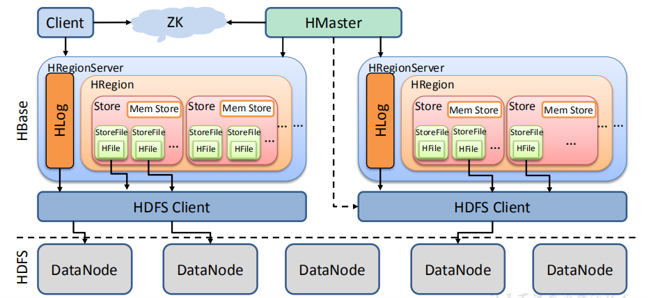

**StoreFile**

保存实际数据的物理文件，StoreFile 以 HFile 的形式存储在 HDFS 上。每个 Store 会有 

一个或多个 StoreFile（HFile），数据在每个 StoreFile 中都是有序的。 

**MemStore**

写缓存，由于 HFile 中的数据要求是有序的，所以数据是先存储在 MemStore 中，排好

序后，等到达刷写时机才会刷写到 HFile，每次刷写都会形成一个新的 HFile。 

**WAL**

由于数据要经 MemStore 排序后才能刷写到 HFile，但把数据保存在内存中会有很高的 

概率导致数据丢失，为了解决这个问题，数据会先写在一个叫做 Write-Ahead logfile 的文件 

中，然后再写入 MemStore 中。所以在系统出现故障的时候，数据可以通过这个日志文件重 

建。 