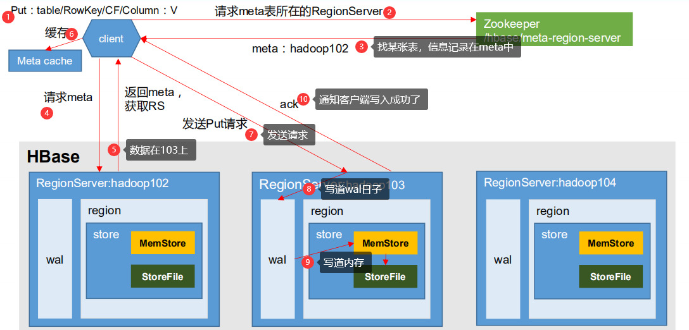

**读比写慢**

## 写流程

1）Client 先访问 zookeeper，获取 hbase:meta 表位于哪个 Region Server。 

2）访问对应的 Region Server，获取 hbase:meta 表，根据读请求的 namespace:table/rowkey， 

查询出目标数据位于哪个 Region Server 中的哪个 Region 中。并将该 table 的 region 信息以 

及 meta 表的位置信息缓存在客户端的 meta cache，方便下次访问。 

3）与目标 Region Server 进行通讯； 

4）将数据顺序写入（追加）到 WAL； 

5）将数据写入对应的 MemStore，数据会在 MemStore 进行排序； 

6）向客户端发送 ack； 

7）等达到 MemStore 的刷写时机后，将数据刷写到 HFile。

