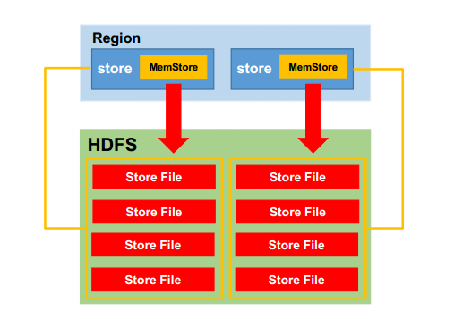

   **MemStore Flush**

   

**MemStore** 刷写时机：

1、当某个 memstroe 的大小达到了 **hbase.hregion.memstore.flush.size**（默认值 **128M**），
其**所在 region 的所有 memstore 都会刷写**。

​		   当 memstore 的大小达到了

   				   **hbase.hregion.memstore.flush.size**（默认值 **128M**）

   		  		*   **hbase.hregion.memstore.block.multiplier**（默认值 **4**）

 时，会阻止继续往该 memstore 写数据。

   

   

   2.当 region server 中 memstore 的总大小达到
			**java_heapsize**
			***hbase.regionserver.global.memstore.size**（默认值 **0.4**）
			***hbase.regionserver.global.memstore.size.lower.limit**（默认值 **0.95**），
region 会按照其所有 memstore 的大小顺序（由大到小）依次进行刷写。直到 region server
中所有 memstore 的总大小减小到上述值以下。

​	当 region server 中 memstore 的总大小达到
​			**java_heapsize\*hbase.regionserver.global.memstore.size**（默认值 **0.4**）
时，会阻止继续往所有的 memstore 写数据。

   

3、   到达自动刷写的时间，也会触发 memstore flush。自动刷新的时间间隔由该属性进行
配置 **hbase.regionserver.optionalcacheflushinterval**（默认 **1** 小时）

   

4、   当 WAL 文件的数量超过 **hbase.regionserver.max.logs**，region 会按照时间顺序依次进
行刷写，直到 WAL 文件数量减小到 **hbase.regionserver.max.log** 以下（**该属性名已经废弃，**
**现无需手动设置，最大值为 32**）

   

