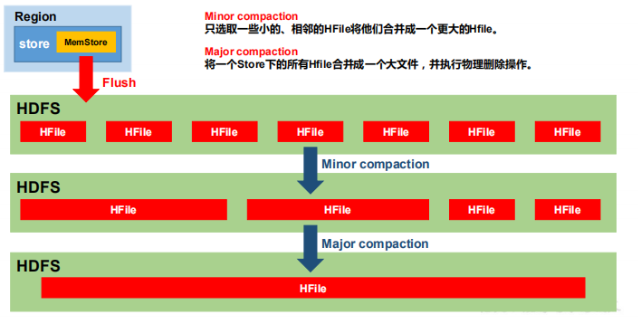

由于memstore每次刷写都会生成一个新的HFile，且同一个字段的不同版本（timestamp） 

和不同类型（Put/Delete）有可能会分布在不同的 HFile 中，因此查询时需要遍历所有的 HFile。

为了减少 HFile 的个数，以及清理掉过期和删除的数据，会进行 StoreFile Compaction。


Compaction 分为两种，分别是 **Minor Compaction** 和 **Major Compaction**。Minor Compaction 

会将临近的若干个较小的 HFile 合并成一个较大的 HFile，但**不会清理过期和删除的数据**。 

Major Compaction 会将一个 Store 下的所有的 HFile 合并成一个大 HFile，**并且会清理掉过期** 

**和删除的数据**。 





```
hbase(main):001:0> help

  Group name: tools
  Commands: assign, balance_switch, balancer, balancer_enabled, catalogjanitor_enabled, catalogjanitor_run, catalogjanitor_switch, close_region, compact, compact_rs, flush, major_compact, merge_region, move, normalize, normalizer_enabled, normalizer_switch, split, splitormerge_enabled, splitormerge_switch, trace, unassign, wal_roll, zk_dump
```

major_compact:大合并（文件数超过三个也大合并）

compact:小合并（文件超过四五个执行这个）

小合并不会删除数据


默认的配置环境

一般关闭此操作

```xml
<!-- 一个region进行 major compaction合并的周期,在这个点的时候， 这个region下的所有hfile会进行合并,默认是7天,majorcompaction非常耗资源,建议生产关闭(设置为0)，在应用空闲时间手动触发 -->  
    <property>  
        <name>hbase.hregion.majorcompaction</name>  
        <value>604800000</value>  
        <description>The time (in miliseconds) between 'major' compactions of  
            all  
            HStoreFiles in a region. Default: Set to 7 days. Major compactions tend to  
            happen exactly when you need them least so enable them such that they  
            run at  
            off-peak for your deploy; or, since this setting is on a periodicity that is  
            unlikely to match your loading, run the compactions via an external  
            invocation out of a cron job or some such.  
        </description>  
    </property>  
```


```xml
 <!-- 一个抖动比例，意思是说上一个参数设置是7天进行一次合并，也可以有50%的抖动比例 -->  
    <property>  
        <name>hbase.hregion.majorcompaction.jitter</name>  
        <value>0.50</value>  
        <description>Jitter outer bound for major compactions.  
            On each regionserver, we multiply the hbase.region.majorcompaction  
            interval by some random fraction that is inside the bounds of this  
            maximum. We then add this + or - product to when the next  
            major compaction is to run. The idea is that major compaction  
            does happen on every regionserver at exactly the same time. The  
            smaller this number, the closer the compactions come together.  
        </description>  
    </property>  
```

```xml
<!-- 一个store里面允许存的hfile的个数，超过这个个数会被写到新的一个hfile里面 也即是每个region的每个列族对应的memstore在fulsh为hfile的时候，默认情况下当达到3个hfile的时候就会   
        对这些文件进行合并重写为一个新文件，设置个数越大可以减少触发合并的时间，但是每次合并的时间就会越长 -->  
    <property>  
        <name>hbase.hstore.compactionThreshold</name>  
        <value>3</value>  
        <description>  
            If more than this number of HStoreFiles in any one HStore  
            (one HStoreFile is written per flush of memstore) then a compaction  
            is run to rewrite all HStoreFiles files as one. Larger numbers  
            put off compaction but when it runs, it takes longer to complete.  
        </description>  
    </property>  
```


手动：

```shell
hbase(main):003:0> put 'stu','1003','info2:name','mingming'
0 row(s) in 0.1020 seconds

hbase(main):004:0> flush 'stu'
0 row(s) in 0.8990 seconds

hbase(main):005:0> put 'stu','1003','info2:age','13'
0 row(s) in 0.0200 seconds

hbase(main):006:0> put 'stu','1003','info2:sex','boy'
0 row(s) in 0.0090 seconds

hbase(main):007:0> flush 'stu'
0 row(s) in 0.4590 seconds

```


一般执行之后不会立即删除原有文件，考虑到移植性问题（会有一个缓冲时间删除原有的文件）

```
hbase(main):013:0* compact
compact      compact_rs
hbase(main):013:0* compact 'stu'
0 row(s) in 0.1720 seconds

```


