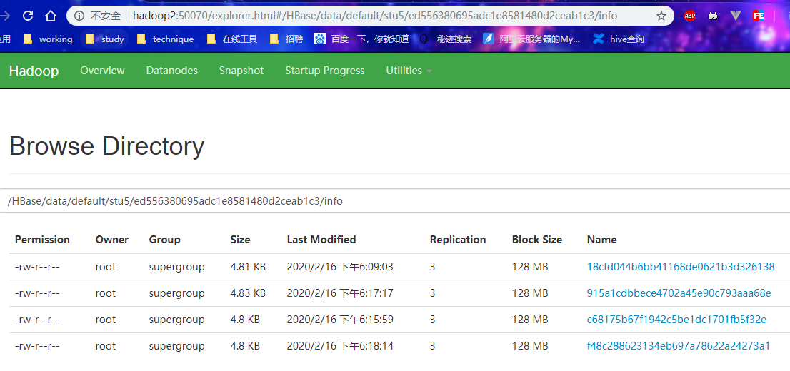

### 删除数据的阶段：**flush**和**大合并**


```shell
hbase(main):025:0> create 'stu5','info'
0 row(s) in 2.3170 seconds
=> Hbase::Table - stu5

hbase(main):015:0> put 'stu5','1001','info:name','qq'
0 row(s) in 0.2340 seconds
```


扫描

理论出现修改过的记录

```shell
hbase(main):016:0> scan 'stu5',{RAW=>TRUE,VERSIONS=>10}
ROW                                      COLUMN+CELL                                                                                                          
 1001                                    column=info:name, timestamp=1581848086058, value=qq                                                                  
 1001                                    column=info:name, timestamp=1581847528739, value=mrchengs11111  
```


执行flush ‘stu5’之后

flush：刷下只管内存空间不管磁盘空间

```shell
hbase(main):017:0> flush 'stu5'
0 row(s) in 0.6560 seconds

hbase(main):018:0> scan 'stu5',{RAW=>TRUE,VERSIONS=>10}
ROW                                      COLUMN+CELL                                                                                                          
 1001                                    column=info:name, timestamp=1581848086058, value=qq                                                                  
 1001                                    column=info:name, timestamp=1581847528739, value=mrchengs11111                                                       
1 row(s) in 0.0230 seconds
```


添加数据

```shell
hbase(main):022:0* put 'stu5','1002','info:name','ww'
0 row(s) in 0.0220 seconds

hbase(main):023:0> put 'stu5','1003','info:name','ss'

hbase(main):027:0* flush 'stu5'

hbase(main):028:0> put 'stu5','1004','info:name','xx'
0 row(s) in 0.0100 seconds

hbase(main):029:0> flush 'stu5'
0 row(s) in 0.4180 seconds

```


查看数据

```shell
hbase(main):030:0> scan 'stu5',{RAW=>TRUE,VERSIONS=>10}
ROW                                      COLUMN+CELL                                                                                                          
 1001                                    column=info:name, timestamp=1581848086058, value=qq                                                                  
 1001                                    column=info:name, timestamp=1581847528739, value=mrchengs11111                                                       
 1002                                    column=info:name, timestamp=1581848198318, value=ww                                                                  
 1003                                    column=info:name, timestamp=1581848211676, value=ss                                                                  
 1004                                    column=info:name, timestamp=1581848291880, value=xx                                                                  
4 row(s) in 0.0560 seconds

```


此时有4个文件




进行文件合并

```shell
hbase(main):033:0* compact 'stu5'
0 row(s) in 0.5290 seconds

```

此时4个文件会合并成为一个文件


查看数据

```shell
hbase(main):036:0> scan 'stu5',{RAW=>TRUE,VERSIONS=>10}
ROW                                      COLUMN+CELL                                                                                                          
 1001                                    column=info:name, timestamp=1581848086058, value=qq                                                                  
 1002                                    column=info:name, timestamp=1581848198318, value=ww                                                                  
 1003                                    column=info:name, timestamp=1581848211676, value=ss                                                                  
 1004                                    column=info:name, timestamp=1581848291880, value=xx                                                                  
4 row(s) in 0.0270 seconds

```

合并之后把1001之前的历史数据进行删除


**flush**：删除的同一内存的数据，不能删除跨越文件的数据

**compact**：major将多个文件合并成为一个，


### 删除标记

先增加一个数据在进行删除数据

```shell
hbase(main):040:0> put 'stu5','1005','info:name','mrchengs'
0 row(s) in 0.0810 seconds

hbase(main):041:0> delete 'stu5','1005','info:name'
0 row(s) in 0.1010 seconds

```


此时扫描数据

被删除的数据**标记**还在内存

```shell
hbase(main):042:0> scan 'stu5',{RAW=>TRUE,VERSIONS=>10}
ROW                                      COLUMN+CELL                                                                                                          
 1001                                    column=info:name, timestamp=1581848086058, value=qq                                                                  
 1002                                    column=info:name, timestamp=1581848198318, value=ww                                                                  
 1003                                    column=info:name, timestamp=1581848211676, value=ss                                                                  
 1004                                    column=info:name, timestamp=1581848291880, value=xx                                                                  
 1005                                    column=info:name, timestamp=1581850604320, type=DeleteColumn                                                         
 1005                                    column=info:name, timestamp=1581850588699, value=mrchengs  
```


flush数据之后

```shell
hbase(main):043:0> flush  'stu5'
0 row(s) in 0.3820 seconds

hbase(main):044:0> scan 'stu5',{RAW=>TRUE,VERSIONS=>10}
ROW                                      COLUMN+CELL                                                                                                          
 1001                                    column=info:name, timestamp=1581848086058, value=qq                                                                  
 1002                                    column=info:name, timestamp=1581848198318, value=ww                                                                  
 1003                                    column=info:name, timestamp=1581848211676, value=ss                                                                  
 1004                                    column=info:name, timestamp=1581848291880, value=xx                                                                  
 1005                                    column=info:name, timestamp=1581850604320, type=DeleteColumn 
```

此时数据已经被删除，但是数据的标记还存在


此时添加数据并且进行刷新

```shell
hbase(main):045:0> put 'stu5','1006','info:name','mrchengs1'
0 row(s) in 0.0120 seconds

hbase(main):046:0> flush  'stu5'
0 row(s) in 0.3640 seconds

hbase(main):047:0> put 'stu5','1007','info:name','mrchengs5'
0 row(s) in 0.0130 seconds

hbase(main):048:0> flush  'stu5'
0 row(s) in 0.3740 seconds

```

此时的文件数为4执行文件合并

```shell
hbase(main):051:0* scan 'stu5',{RAW=>TRUE,VERSIONS=>10}
ROW                                      COLUMN+CELL                                                                                                          
 1001                                    column=info:name, timestamp=1581848086058, value=qq                                                                  
 1002                                    column=info:name, timestamp=1581848198318, value=ww                                                                  
 1003                                    column=info:name, timestamp=1581848211676, value=ss                                                                  
 1004                                    column=info:name, timestamp=1581848291880, value=xx                                                                  
 1005                                    column=info:name, timestamp=1581850604320, type=DeleteColumn                                                         
 1006                                    column=info:name, timestamp=1581850829665, value=mrchengs1                                                           
 1007                                    column=info:name, timestamp=1581850846275, value=mrchengs5                                                           
7 row(s) in 0.0630 seconds

hbase(main):052:0> compact
compact      compact_rs
hbase(main):052:0> compact 'stu5'
0 row(s) in 0.1500 seconds

hbase(main):053:0> scan 'stu5',{RAW=>TRUE,VERSIONS=>10}
ROW                                      COLUMN+CELL                                                                                                          
 1001                                    column=info:name, timestamp=1581848086058, value=qq                                                                  
 1002                                    column=info:name, timestamp=1581848198318, value=ww                                                                  
 1003                                    column=info:name, timestamp=1581848211676, value=ss                                                                  
 1004                                    column=info:name, timestamp=1581848291880, value=xx                                                                  
 1006                                    column=info:name, timestamp=1581850829665, value=mrchengs1                                                           
 1007                                    column=info:name, timestamp=1581850846275, value=mrchengs5                                                           
6 row(s) in 0.1080 seconds

```


flush：

不知道是否有文件被delete数据作用，会产生数据诡异现象


compact：

把所有的数据进行删除，并且删除标记


