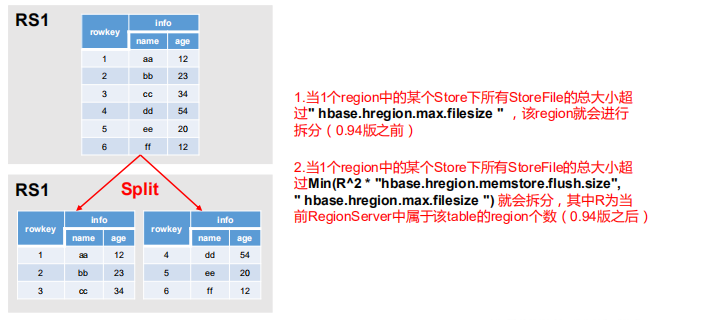

## Region Split


默认情况下，每个 Table 起初只有一个 Region，随着数据的不断写入，Region 会自动进 

行拆分。

刚拆分时，两个子 Region 都位于当前的 Region Server，但处于负载均衡的考虑， 

HMaster 有可能会将某个 Region 转移给其他的 Region Server。 


Regin Split时机：

  1.当1个region中的某个Store下所有StoreFile的总大小超过**hbase.hregion.max.filesize**， 

​		该 Region 就会进行拆分（0.94 版本之前）。 


2. 当 1 个 region 中 的 某 个 Store 下所有 StoreFile 的 总 大 小 超 过 

   Min(R^2 *  "**hbase.hregion.memstore.flush.size",hbase.hregion.max.filesize**")

   该 Region 就会进行拆分，其 中 R 为当前 Region Server 中属于该 Table 的个数（0.94 版本之后）。

默认配置10G

```xml
 <!--HStoreFile最大的大小，当某个region的某个列族超过这个大小会进行region拆分 -->  
    <property>  
        <name>hbase.hregion.max.filesize</name>  
        <value>10737418240</value>  
        <description>  
            Maximum HStoreFile size. If any one of a column families' HStoreFiles has  
            grown to exceed this value, the hosting HRegion is split in two.  
        </description>  
    </property>  
```





官方不建议使用多个列族

在刷新的时候 容易产生多个小文件


