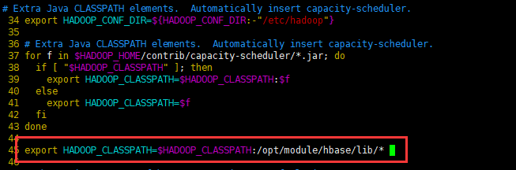

#  **MapReduce**

通过 HBase 的相关 JavaAPI，我们可以实现伴随 HBase 操作的 MapReduce 过程，比如使用 

MapReduce 将数据从本地文件系统导入到 HBase 的表中，比如我们从 HBase 中读取一些原 

始数据后使用 MapReduce 做数据分析。


# 官方 HBase-MapReduce

1．查看 HBase 的 MapReduce 任务的执行

```
$ bin/hbase mapredcp
```

```
/opt/module/hbase/lib/zookeeper-3.4.6.jar:/opt/module/hbase/lib/netty-all-4.0.23.Final.jar:/opt/module/hbase/lib/hbase-client-1.3.1.jar:/opt/module/hbase/lib/metrics-core-2.2.0.jar:/opt/module/hbase/lib/hbase-prefix-tree-1.3.1.jar:/opt/module/hbase/lib/hbase-common-1.3.1.jar:/opt/module/hbase/lib/protobuf-java-2.5.0.jar:/opt/module/hbase/lib/guava-12.0.1.jar:/opt/module/hbase/lib/htrace-core-3.1.0-incubating.jar:/opt/module/hbase/lib/hbase-protocol-1.3.1.jar:/opt/module/hbase/lib/hbase-hadoop-compat-1.3.1.jar:/opt/module/hbase/lib/hbase-server-1.3.1.jar
```


2．环境变量的导入 

（1）执行环境变量的导入（临时生效，在命令行执行下述操作）

```
$ export HBASE_HOME=/opt/module/hbase
$ export HADOOP_HOME=/opt/module/hadoop-2.7.2
$ export HADOOP_CLASSPATH=`${HBASE_HOME}/bin/hbase mapredcp`
```

（2）永久生效：在/etc/profile 配置

```
export HBASE_HOME=/opt/module/hbase
export HADOOP_HOME=/opt/module/hadoop-2.7.2
```

并在 hadoop-env.sh 中配置：（注意：在 for 循环之后配） 

export HADOOP_CLASSPATH=$HADOOP_CLASSPATH:/opt/module/hbase/lib/* 

进行配置文件的分发




3．运行官方的 MapReduce 任务 

-- 案例一：统计stu5表中有多少行数据 

hbase家目录：lib/hbase-server-1.3.1.jar （相对路径）

```
 /opt/module/hadoop-2.7.2/bin/yarn jar lib/hbase-server-1.3.1.jar 
rowcounter stu5
```

```
hbase(main):001:0> scan 'stu5'
ROW                                              COLUMN+CELL
 1001      column=info:name, timestamp=1582179003853, value=Mrchegns
 1002      column=info:name, timestamp=1581848198318, value=ww
 1003      column=info:name, timestamp=1581848211676, value=ss
 1004      column=info:name, timestamp=1581848291880, value=xx
 1006      column=info:name, timestamp=1581850829665, value=mrchengs1
 1007      column=info:name, timestamp=1581850846275, value=mrchengs5  
```

结果：·

```
	org.apache.hadoop.hbase.mapreduce.RowCounter$RowCounterMapper$Counters
		ROWS=6
	File Input Format Counters 
		Bytes Read=0
	File Output Format Counters 
		Bytes Written=0

```


-- 案例二：使用 MapReduce 将本地数据导入到 HBase

1）在本地创建一个 tsv 格式的文件：fruit.tsv

```
1001 Apple Red
1002 Pear Yellow
1003 Pineapple Yellow
```


2）创建 Hbase 表

```
Hbase(main):001:0> create 'fruit','info'
```


3）在 HDFS 中创建 input_fruit 文件夹并上传 fruit.tsv 文件

```
[root@hadoop3 hbase]# hadoop fs -put fruit.tsv /
SLF4J: Class path contains multiple SLF4J bindings.
SLF4J: Found binding in [jar:file:/opt/module/hadoop-2.7.2/share/hadoop/common/lib/slf4j-log4j12-1.7.10.jar!/org/slf4j/impl/StaticLoggerBinder.class]
SLF4J: Found binding in [jar:file:/opt/module/hbase/lib/slf4j-log4j12-1.7.5.jar!/org/slf4j/impl/StaticLoggerBinder.class]
SLF4J: See http://www.slf4j.org/codes.html#multiple_bindings for an explanation.
SLF4J: Actual binding is of type [org.slf4j.impl.Log4jLoggerFactory]

```


4）执行 MapReduce 到 HBase 的 fruit 表中

```
/opt/module/hadoop-2.7.2/bin/yarn jar lib/hbase-server-1.3.1.jar importtsv  -Dimporttsv.columns=HBASE_ROW_KEY,info:name,info:color fruit hdfs://hadoop2:9000/fruit.tsv
```


5）使用 scan 命令查看导入后的结果

```
hbase(main):002:0> scan 'fruit'
ROW                                      COLUMN+CELL                                                                                                          
 1001  column=info:color, timestamp=1582447675052, value=Red                                                                
 1001  column=info:name, timestamp=1582447617468, value=Apple                                                               
 1002  column=info:color, timestamp=1582447691724, value=Yellow                                                             
 1002  column=info:name, timestamp=1582447710670, value=Pear                                                                
 1003  column=info:color, timestamp=1582447826532, value=Yellow                                                             
 1003   column=info:name, timestamp=1582447726088, value=Pineapple 
```


# **自定义** **HBase-MapReduce1**

将文件的内容迁移到hbase中

Mapper

```java
package hbase.com.hbase.mr1;

import org.apache.hadoop.io.LongWritable;
import org.apache.hadoop.io.Text;
import org.apache.hadoop.mapreduce.Mapper;

import java.io.IOException;

public class FruitMapper extends Mapper<LongWritable, Text,LongWritable, Text> {

    @Override
    protected void map(LongWritable key, Text value, Context context) throws IOException, InterruptedException {
        context.write(key,value);
    }
}

```


Reducer

```java
package hbase.com.hbase.mr1;

import org.apache.hadoop.hbase.client.Put;
import org.apache.hadoop.hbase.mapreduce.TableReducer;
import org.apache.hadoop.hbase.util.Bytes;
import org.apache.hadoop.io.LongWritable;
import org.apache.hadoop.io.NullWritable;
import org.apache.hadoop.io.Text;

import java.io.IOException;

public class FruitReducer extends TableReducer<LongWritable, Text, NullWritable> {

    @Override
    protected void reduce(LongWritable key, Iterable<Text> values, Context context) throws IOException, InterruptedException {

        //遍历values = 1001 Apple Red
        for (Text value : values) {
            //获取每一行数据
            String[] split = value.toString().split("\t");
            //构建Put对象
            Put put = new Put(Bytes.toBytes(split[0]));
            //给put对象赋值
            put.addColumn(Bytes.toBytes("info"),Bytes.toBytes("name"),Bytes.toBytes(split[1]));
            put.addColumn(Bytes.toBytes("info"),Bytes.toBytes("color"),Bytes.toBytes(split[2]));

            //写出
            context.write(NullWritable.get(),put);
        }
    }
}

```


Driver

```java
package hbase.com.hbase.mr1;

import org.apache.hadoop.conf.Configuration;
import org.apache.hadoop.fs.Path;
import org.apache.hadoop.hbase.mapreduce.TableMapReduceUtil;
import org.apache.hadoop.io.LongWritable;
import org.apache.hadoop.io.Text;
import org.apache.hadoop.mapreduce.Job;
import org.apache.hadoop.mapreduce.lib.input.FileInputFormat;
import org.apache.hadoop.util.Tool;
import org.apache.hadoop.util.ToolRunner;

public class FruitDriver  implements Tool {
    //定义：Configuration
    Configuration configuration = null;


    @Override
    public int run(String[] args) throws Exception {
        //获取job对象
        Job job = Job.getInstance(configuration);
        //设置驱动类路径
        job.setJarByClass(FruitDriver.class);
        //设置mapper&mapper输出的kv类型
        job.setMapperClass(FruitMapper.class);
        job.setMapOutputKeyClass(LongWritable.class);
        job.setMapOutputValueClass(Text.class);
        //设置reducer类
        //TableReducer<LongWritable, Text, NullWritable>
        TableMapReduceUtil.initTableReducerJob(args[1],FruitReducer.class,job);      //args[1]输出路径
        //设置输入参数
        FileInputFormat.setInputPaths(job,new Path(args[0]));
        //提交任务
        boolean b = job.waitForCompletion(true);

        return b?0:1;
    }

    @Override
    public void setConf(Configuration conf) {
        configuration = conf ;
    }

    @Override
    public Configuration getConf() {
        return configuration;
    }

    public static void main(String[] args) {

        try {
            Configuration configuration = new Configuration();
            int run = ToolRunner.run(configuration, new FruitDriver(), args);

            System.exit(run);

        } catch (Exception e) {
            e.printStackTrace();
        }
    }
}
```


创建表

```shell
hbase(main):005:0> create 'fruit1','info'

```

执行命令(jar后跟参数输入&输出)

```shell
[root@hadoop3 hbase]# yarn jar hbase-1.0-SNAPSHOT.jar  hbase.com.hbase.mr1.FruitDriver /fruit.tsv fruit1
```


# **自定义** **Hbase-MapReduce2**

从hbase读数据在写到另一个表中

mapper

```java
package hbase.com.hbase.mr1;

import org.apache.hadoop.hbase.Cell;
import org.apache.hadoop.hbase.CellUtil;
import org.apache.hadoop.hbase.client.Put;
import org.apache.hadoop.hbase.client.Result;
import org.apache.hadoop.hbase.io.ImmutableBytesWritable;
import org.apache.hadoop.hbase.mapreduce.TableMapper;
import org.apache.hadoop.hbase.util.Bytes;

import java.io.IOException;

public class FruitMapper extends TableMapper<ImmutableBytesWritable, Put> {
    @Override
    protected void map(ImmutableBytesWritable key, Result value, Context context) throws IOException, InterruptedException {

        //构建Put对象
        Put put = new Put(key.get());

        //获取数据
        for (Cell cell : value.rawCells()) {
            //判断当前cell是否未name
            if ("name".equals(Bytes.toString(CellUtil.cloneRow(cell)))){
                //给put对象赋值
                put.add(cell);
            }
        }
        context.write(key,put);
    }
}
```


reducer

```java
package hbase.com.hbase.mr1;

import org.apache.hadoop.hbase.client.Put;
import org.apache.hadoop.hbase.io.ImmutableBytesWritable;
import org.apache.hadoop.hbase.mapreduce.TableReducer;
import org.apache.hadoop.hbase.util.Bytes;
import org.apache.hadoop.io.LongWritable;
import org.apache.hadoop.io.NullWritable;
import org.apache.hadoop.io.Text;

import java.io.IOException;

public class FruitReducer extends TableReducer<ImmutableBytesWritable, Put, NullWritable> {

    @Override
    protected void reduce(ImmutableBytesWritable key, Iterable<Put> values, Context context) throws IOException, InterruptedException {

        //遍历values = 1001 Apple Red
        for (Put put : values) {
            //写出
            context.write(NullWritable.get(),put);
        }
    }
}
```


driver

```java
package hbase.com.hbase.mr1;

import org.apache.hadoop.conf.Configuration;
import org.apache.hadoop.fs.Path;
import org.apache.hadoop.hbase.client.Put;
import org.apache.hadoop.hbase.client.Scan;
import org.apache.hadoop.hbase.io.ImmutableBytesWritable;
import org.apache.hadoop.hbase.mapreduce.TableMapReduceUtil;
import org.apache.hadoop.io.LongWritable;
import org.apache.hadoop.io.Text;
import org.apache.hadoop.mapreduce.Job;
import org.apache.hadoop.mapreduce.lib.input.FileInputFormat;
import org.apache.hadoop.util.Tool;
import org.apache.hadoop.util.ToolRunner;

public class FruitDriver  implements Tool {
    //定义：Configuration
    Configuration configuration = null;


    @Override
    public int run(String[] args) throws Exception {
        //获取job对象
        Job job = Job.getInstance(configuration);
        //设置驱动类路径
        job.setJarByClass(FruitDriver.class);
        //设置mapper&mapper输出的kv类型
        TableMapReduceUtil.initTableMapperJob("fruit",new Scan(),FruitMapper.class,
                ImmutableBytesWritable.class, Put.class,job);//输出的表
        //设置reducer类
        //TableReducer<LongWritable, Text, NullWritable>
        TableMapReduceUtil.initTableReducerJob("fruit1",FruitReducer.class,job);//数据转移到的表
        //提交任务
        boolean b = job.waitForCompletion(true);

        return b?0:1;
    }

    @Override
    public void setConf(Configuration conf) {
        configuration = conf ;
    }

    @Override
    public Configuration getConf() {
        return configuration;
    }

    public static void main(String[] args) {

        try {
            Configuration configuration = new Configuration();
            int run = ToolRunner.run(configuration, new FruitDriver(), args);

            System.exit(run);

        } catch (Exception e) {
            e.printStackTrace();
        }
    }
}
```


