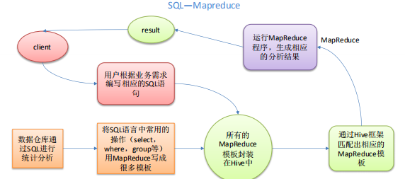
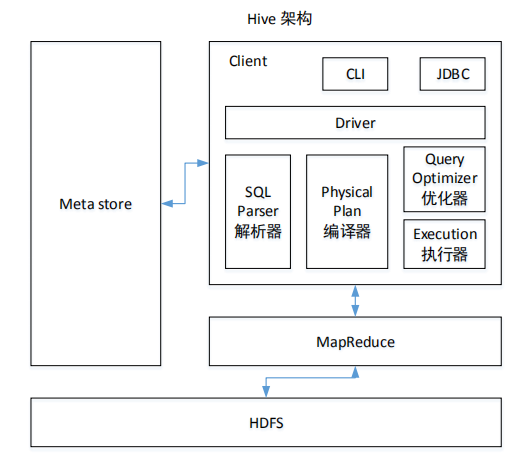
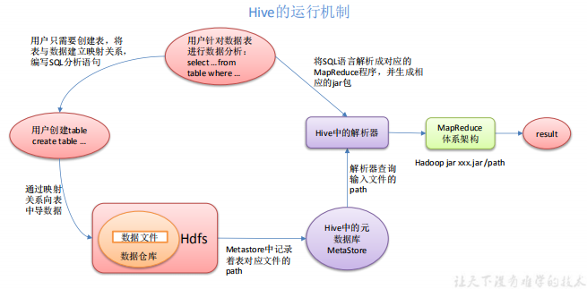

## 1.1、Hive是什么

Hive：由 Facebook 开源用于解决**海量结构化日志**的数据统计。

Hive 是基于 Hadoop 的一个**数据仓库工具**，可以将**结构化的数据文件映射为一张表**，并提供类 SQL 查询功能。

**本质是：将 HQL 转化成 MapReduce 程序**

1）Hive 处理的数据存储在 HDFS 

2）Hive 分析数据底层的**默认实现**是 MapReduce 

3）执行程序运行在 Yarn 上

## 1.2、优缺点

### 1.2.1、优点

1) 操作接口采用类 SQL 语法，提供快速开发的能力（简单、容易上手）。 

2) 避免了去写 MapReduce，减少开发人员的学习成本。

3) Hive 的执行延迟比较高，因此 Hive 常用于数据分析，对实时性要求不高的场合。 

4) Hive 优势在于处理大数据，对于处理小数据没有优势，因为 Hive 的执行延迟比较 高。 

5) Hive 支持用户自定义函数，用户可以根据自己的需求来实现自己的函数。 

### 1.2.2、缺点

**1．Hive 的 HQL 表达能力有限** 

（1）迭代式算法无法表达 

（2）数据挖掘方面不擅长 

**2．Hive 的效率比较低** 

（1）Hive 自动生成的 MapReduce 作业，通常情况下不够智能化 

（2）Hive 调优比较困难，粒度较粗

## 1.3、Hive框架原理

框架原理图

**1．用户接口：Client** 

CLI（hive shell）、JDBC/ODBC(java 访问 hive)、WEBUI（浏览器访问 hive） 

**2．元数据：Metastore** 

元数据包括：表名、表所属的数据库（默认是 default）、表的拥有者、列/分区字段、表 

的类型（是否是外部表）、表的数据所在目录等；

**3．Hadoop** 

使用 HDFS 进行存储，使用 MapReduce 进行计算。 

**4．驱动器：Driver** 

（1）解析器（SQL Parser）：将 SQL 字符串转换成抽象语法树 AST，这一步一般都用 第三方工具库完成，比如 antlr；对 AST 进行语法分析，比如表是否存在、字段是否存在、SQL 语义是否有误。 

（2）编译器（Physical Plan）：将 AST 编译生成逻辑执行计划。 

（3）优化器（Query Optimizer）：对逻辑执行计划进行优化。 

（4）执行器（Execution）：把逻辑执行计划转换成可以运行的物理计划。对于 Hive 来说，就是 MR/Spark。 

Hive 运行机制

Hive 通过给用户提供的一系列交互接口，接收到用户的指令(SQL)，使用自己的 Driver， 

结合元数据(MetaStore)，将这些指令翻译成 MapReduce，提交到 Hadoop 中执行，最后，将 

执行返回的结果输出到用户交互接口。

## 1.4、Hive和数据库比较

由于 Hive 采用了类似 SQL 的查询语言 HQL(Hive Query Language)，因此很容易 

将 Hive 理解为数据库。其实从结构上来看，Hive 和数据库除了拥有类似的查询语言，再无 

类似之处。

**1.4.1** **查询语言** 

由于 SQL 被广泛的应用在数据仓库中，因此，专门针对 Hive 的特性设计了类 SQL 的 

查询语言 HQL。熟悉 SQL 开发的开发者可以很方便的使用 Hive 进行开发。 

**1.4.2** **数据存储位置** 

Hive 是建立在 Hadoop 之上的，所有 Hive 的数据都是存储在 HDFS 中的。而数据库则 

可以将数据保存在块设备或者本地文件系统中。 

**1.4.3** **数据更新** 

由于 Hive 是针对数据仓库应用设计的，而数**据仓库的内容是读多写少的**。因此，**Hive** 

**中不建议对数据的改写，所有的数据都是在加载的时候确定好的**。而数据库中的数据通常是 

需 要 经 常 进 行 修 改 的 ， 因 此 可 以 使 用 INSERT INTO … VALUES 添 加 数 据 ， 使 

用 UPDATE … SET 修改数据。 

**1.4.4** **索引** 

Hive 在加载数据的过程中不会对数据进行任何处理，甚至不会对数据进行扫描，因此 

也没有对数据中的某些 Key 建立索引。Hive 要访问数据中满足条件的特定值时，需要**暴力** 

**扫描整个数据**，因此访问延迟较高。由于 MapReduce 的引入， Hive 可以并行访问数据，因 

此即使没有索引，对于大数据量的访问，Hive 仍然可以体现出优势。数据库中，通常会针 

对一个或者几个列建立索引，因此对于少量的特定条件的数据的访问，数据库可以有很高的 

效率，较低的延迟。由于数据的访问延迟较高，决定了 Hive 不适合在线数据查询。 

**1.4.5** **执行** 

Hive 中大多数查询的执行是通过 Hadoop 提供的 MapReduce 来实现的。而数据库通常 

有自己的执行引擎。 

**1.4.6** **执行延迟** 

Hive 在查询数据的时候，由于没有索引，需要扫描整个表，因此延迟较高。另外一个 

导致 Hive 执行延迟高的因素是 MapReduce 框架。**由于 MapReduce 本身具有较高的延迟**， 

因此在利用 MapReduce 执行 Hive 查询时，也**会有较高的延迟**。相对的，数据库的执行延迟 

较低。当然，这个低是有条件的，即数据规模较小，当数据规模大到超过数据库的处理能力 

的时候，Hive 的并行计算显然能体现出优势。 

**1.4.7** **可扩展性** 

由于 Hive 是建立在 Hadoop 之上的，因此 Hive 的可扩展性是和 Hadoop 的可扩展性是 

一致的（世界上最大的 Hadoop 集群在 Yahoo!，2009 年的规模在 4000 台节点左右）。而数 

据库由于 ACID 语义的严格限制，扩展行非常有限。目前最先进的并行数据库 Oracle 在理 

论上的扩展能力也只有 100 台左右。 

**1.4.8** **数据规模** 

由于 Hive 建立在集群上并可以利用 MapReduce 进行并行计算，因此可以支持很大规模 

的数据；对应的，数据库可以支持的数据规模较小。 

