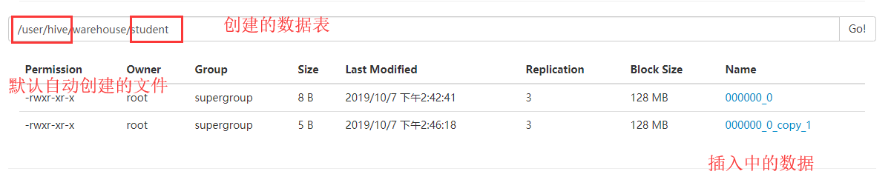
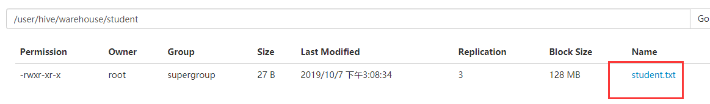
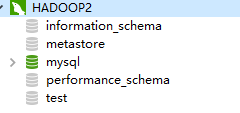
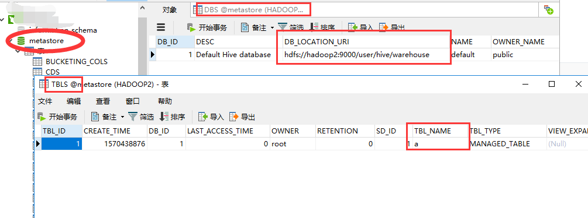

# Hive安装

## **2.1 Hive** **安装地址**

1．Hive 官网地址 

http://hive.apache.org/ 

2．文档查看地址 

https://cwiki.apache.org/confluence/display/Hive/GettingStarted 

3．下载地址 

http://archive.apace.org/dist/hive/


## 2.2、安装部署


**1．Hive 安装及配置**

（1）把 apache-hive-1.2.1-bin.tar.gz 上传到 linux 的/opt/software 目录下

（2）解压 apache-hive-1.2.1-bin.tar.gz 到/opt/module/目录下面

```
[root@hadoop2 software]# tar -zxvf apache-hive-1.2.1-bin.tar.gz  -C /opt/module
```

（3）修改 apache-hive-1.2.1-bin.tar.gz 的名称为 hive

```
[root@hadoop2 module]# mv apache-hive-1.2.1-bin/ hive
```

（4）修改/opt/module/hive/conf 目录下的 hive-env.sh.template 名称为 hive-env.sh

```
[root@hadoop2 conf]# cp  hive-env.sh.template  hive-env.sh
[root@hadoop2 conf]# ll
total 192
-rw-rw-r--. 1 root root   1139 Apr 29  2015 beeline-log4j.properties.template
-rw-rw-r--. 1 root root 168431 Jun 19  2015 hive-default.xml.template
-rw-r--r--. 1 root root   2378 Oct  7 01:52 hive-env.sh
-rw-rw-r--. 1 root root   2378 Apr 29  2015 hive-env.sh.template
-rw-rw-r--. 1 root root   2662 Apr 29  2015 hive-exec-log4j.properties.template
-rw-rw-r--. 1 root root   3050 Apr 29  2015 hive-log4j.properties.template
-rw-rw-r--. 1 root root   1593 Apr 29  2015 ivysettings.xml
 
```

（5）配置 hive-env.sh 文件

（a）配置 HADOOP_HOME 路径

（b）配置 HIVE_CONF_DIR 路径

```
export HADOOP_HOME=/opt/module/hadoop-2.7.2
export HIVE_CONF_DIR=/opt/module/hive/conf
```


**2．Hadoop 集群配置**

（1）必须启动 hdfs 和 yarn

```
[root@hadoop102 hadoop-2.7.2]$ sbin/start-dfs.sh
[root@hadoop103 hadoop-2.7.2]$ sbin/start-yarn.sh
```

（2）在 HDFS 上创建/tmp 和/user/hive/warehouse 两个目录并修改他们的同组权限可写 

​		(可不操作，系统会自动创建)

```
[atguigu@hadoop102 hadoop-2.7.2]$ bin/hadoop fs -mkdir /tmp
[atguigu@hadoop102 hadoop-2.7.2]$ bin/hadoop fs -mkdir -p /user/hive/warehouse
```

```
[atguigu@hadoop102 hadoop-2.7.2]$ bin/hadoop fs -chmod g+w /tmp
[atguigu@hadoop102 hadoop-2.7.2]$ bin/hadoop fs -chmod g+w  /user/hive/warehouse
```


**3．Hive 基本操作**

（1）启动 hive

```
[root@hadoop2 hive]# bin/hive

Logging initialized using configuration in jar:file:/opt/module/hive/lib/hive-common-1.2.1.jar!/hive-log4j.properties
hive> 

```

安装目录下会生成两个文件”hactalig、metastore_db

（2）查看数据库

```
hive> show databases;
OK
default
Time taken: 3.774 seconds, Fetched: 1 row(s)
```

（3）打开默认数据库

```
hive> use default;
OK
Time taken: 0.06 seconds
```

（4）显示 default 数据库中的表

```
hive>  show tables;
OK
Time taken: 0.048 seconds
```

（5）创建一张表

```
hive>  create table student(id int, name string);
OK
Time taken: 1.103 seconds
```

（6）显示数据库中有几张表

```
    >  show tables;
OK
student
Time taken: 0.029 seconds, Fetched: 1 row(s)
```

（7）查看表的结构

```
hive> desc student;
OK
id                  	int                 	                    
name                	string              	                    
Time taken: 0.442 seconds, Fetched: 2 row(s)
```

（8）向表中插入数据

```
hive> insert into student values(1000,"ss");
Query ID = root_20191007024046_f36720ad-348e-44d7-ad53-3f430afa12d7
Total jobs = 3
Launching Job 1 out of 3
Number of reduce tasks is set to 0 since there's no reduce operator
Starting Job = job_1570428724043_0001, Tracking URL = http://hadoop3:8088/proxy/application_1570428724043_0001/
Kill Command = /opt/module/hadoop-2.7.2/bin/hadoop job  -kill job_1570428724043_0001
Hadoop job information for Stage-1: number of mappers: 1; number of reducers: 0
2019-10-07 02:41:34,313 Stage-1 map = 0%,  reduce = 0%
2019-10-07 02:42:34,601 Stage-1 map = 0%,  reduce = 0%, Cumulative CPU 6.01 sec
2019-10-07 02:42:44,127 Stage-1 map = 100%,  reduce = 0%, Cumulative CPU 8.76 sec
MapReduce Total cumulative CPU time: 8 seconds 760 msec
Ended Job = job_1570428724043_0001
Stage-4 is selected by condition resolver.
Stage-3 is filtered out by condition resolver.
Stage-5 is filtered out by condition resolver.
Moving data to: hdfs://hadoop2:9000/user/hive/warehouse/student/.hive-staging_hive_2019-10-07_02-40-46_871_5309747111294884544-1/-ext-10000
Loading data to table default.student
Table default.student stats: [numFiles=1, numRows=1, totalSize=8, rawDataSize=7]
MapReduce Jobs Launched: 
Stage-Stage-1: Map: 1   Cumulative CPU: 8.76 sec   HDFS Read: 3545 HDFS Write: 79 SUCCESS
Total MapReduce CPU Time Spent: 8 seconds 760 msec
OK
Time taken: 124.568 seconds
```

（9）查询表中数据

```
hive>  select * from student;
OK
1000	ss
Time taken: 0.554 seconds, Fetched: 1 row(s)
```

(10) 再次插入数据

```
hive> insert into student values(1,"qq");
Query ID = root_20191007024541_6c6f8ef8-12df-4d0e-96c9-b5b7aa52e2bb
Total jobs = 3
Launching Job 1 out of 3
Number of reduce tasks is set to 0 since there's no reduce operator
Starting Job = job_1570428724043_0002, Tracking URL = http://hadoop3:8088/proxy/application_1570428724043_0002/
Kill Command = /opt/module/hadoop-2.7.2/bin/hadoop job  -kill job_1570428724043_0002
Hadoop job information for Stage-1: number of mappers: 1; number of reducers: 0
2019-10-07 02:46:08,630 Stage-1 map = 0%,  reduce = 0%
2019-10-07 02:46:19,715 Stage-1 map = 100%,  reduce = 0%, Cumulative CPU 6.03 sec
MapReduce Total cumulative CPU time: 6 seconds 30 msec
Ended Job = job_1570428724043_0002
Stage-4 is selected by condition resolver.
Stage-3 is filtered out by condition resolver.
Stage-5 is filtered out by condition resolver.
Moving data to: hdfs://hadoop2:9000/user/hive/warehouse/student/.hive-staging_hive_2019-10-07_02-45-41_382_5960629614465254711-1/-ext-10000
Loading data to table default.student
Table default.student stats: [numFiles=2, numRows=2, totalSize=13, rawDataSize=11]
MapReduce Jobs Launched: 
Stage-Stage-1: Map: 1   Cumulative CPU: 6.03 sec   HDFS Read: 3630 HDFS Write: 76 SUCCESS
Total MapReduce CPU Time Spent: 6 seconds 30 msec
OK
Time taken: 40.958 seconds
```

插入一个数据将会进行启动mr程序，非常耗时

再web上回发现




（11）查询

```
    > select * from student;
OK
1000	ss
1	qq
Time taken: 0.109 seconds, Fetched: 2 row(s)
```

select 不走mr程序


## 2.3、本地文件导入Hive

需求 

将本地/opt/module/data/student.txt 这个目录下的数据导入到 hive 的 student(id int, name  string)表中。


**1．数据准备**

在/opt/module/data 这个目录下准备数据

（1）在/opt/module/目录下创建 data

```
[root@hadoop2 module]# pwd
/opt/module
[root@hadoop2 module]#  mkdir data

```

（2）在/opt/module/datas/目录下创建 student.txt 文件并添加数据

```
[root@hadoop2 module]# cat student.txt 
2	baozhu
3	tiezhu
4	liuzhu
```


**2．Hive 实际操作**


（1）启动 hive

```
bin/hive
```

（2）显示数据库

```
hive> show databases;
```

（3）使用 default 数据库

```
hive> use default;
```

（4）显示 default 数据库中的表

```
hive> show tables;
```

（5）删除已创建的 student 表

```
hive> drop table student;
```

（6）创建 student 表, 并声明文件分隔符’\t’

```
hive> create table student(id int, name string) ROW FORMAT 
DELIMITED FIELDS TERMINATED
BY '\t';
```

（7）加载/opt/module/data/student.txt 文件到 student 数据库表中。

```
hive> load data local inpath '/opt/module/data/student.txt' into table student;
Loading data to table default.student
Table default.student stats: [numFiles=3, numRows=0, totalSize=40, rawDataSize=0]
OK
Time taken: 0.486 seconds
```

（8）Hive 查询结果

```
hive> select  * from student;
OK
2	baozhu
3	tiezhu
4	liuzhu
Time taken: 0.098 seconds, Fetched: 3 row(s)
```



(9)上传方式2

```
先将文件上传到hdfs上
[root@hadoop2 module]# hadoop fs -put data/student2.txt  /

hive> 
    > 
    > load data  inpath '/student2.txt' into table student;
Loading data to table default.student
Table default.student stats: [numFiles=2, totalSize=54]
OK
Time taken: 0.32 seconds
hive> select * from student;
OK
2	baozhu
3	tiezhu
4	liuzhu
2	baozhu
3	tiezhu
4	liuzhu

```

注意：hdfs上的文件上传到会将文件移动到相应的文件下

实际的文件还是再hadoop/data/tmp/.....下方


**3．遇到的问题**

再打开一个客户端窗口启动 hive，会产生 java.sql.SQLException 异常。

```
Exception in thread "main" java.lang.RuntimeException: 
java.lang.RuntimeException:
Unable to instantiate
org.apache.hadoop.hive.ql.metadata.SessionHiveMetaStoreClien t
at 
org.apache.hadoop.hive.ql.session.SessionState.start(Session
State.java:522)
at 
org.apache.hadoop.hive.cli.CliDriver.run(CliDriver.java:677)
at 
org.apache.hadoop.hive.cli.CliDriver.main(CliDriver.java:621
)
at sun.reflect.NativeMethodAccessorImpl.invoke0(Native 
Method)
at 
ssorImpl.java:57)
at 
sun.reflect.DelegatingMethodAccessorImpl.invoke(DelegatingMe
thodAccessorImpl.java:43)
at java.lang.reflect.Method.invoke(Method.java:606)
at org.apache.hadoop.util.RunJar.run(RunJar.java:221)
at org.apache.hadoop.util.RunJar.main(RunJar.java:136)
Caused by: java.lang.RuntimeException: Unable to instantiate 
org.apache.hadoop.hive.ql.metadata.SessionHiveMetaStoreClien
t
at
org.apache.hadoop.hive.metastore.MetaStoreUtils.newInstance(
MetaStoreUtils.java:1523)
at 
org.apache.hadoop.hive.metastore.RetryingMetaStoreClient.<in
it>(RetryingMetaStoreClient.java:86)
at 
org.apache.hadoop.hive.metastore.RetryingMetaStoreClient.get
Proxy(RetryingMetaStoreClient.java:132)
at 
org.apache.hadoop.hive.metastore.RetryingMetaStoreClient.get
Proxy(RetryingMetaStoreClient.java:104)
at 
org.apache.hadoop.hive.ql.metadata.Hive.createMetaStoreClien
t(Hive.java:3005)
at 
org.apache.hadoop.hive.ql.metadata.Hive.getMSC(Hive.java:302
4)
at 
org.apache.hadoop.hive.ql.session.SessionState.start(Session
State.java:503)
... 8 more
sun.reflect.NativeMethodAccessorImpl.invoke(NativeMethodAcce
```

**原因是，Metastore 默认存储在自带的 derby 数据库中，推荐使用 MySQL 存储 Metastore;**


## **2.4 MySql** **安装**

### **2.4.1** **安装包准备**

**1．查看 mysql 是否安装，如果安装了，卸载 mysql**

（1）查看

```
 rpm -qa|grep mysql
 mysql-libs-5.1.73-7.el6.x86_64
```

（2）卸载

```
rpm -e --nodeps  mysql-libs-5.1.73-7.el6.x86_64
```


**2．解压 mysql-libs.zip 文件到当前目录**

```
[root@hadoop2 software]# unzip mysql-libs.zip 
Archive:  mysql-libs.zip
   creating: mysql-libs/
  inflating: mysql-libs/MySQL-client-5.6.24-1.el6.x86_64.rpm  
  inflating: mysql-libs/mysql-connector-java-5.1.27.tar.gz  
  inflating: mysql-libs/MySQL-server-5.6.24-1.el6.x86_64.rpm  
```


**3．进入到 mysql-libs 文件夹下**

```
[root@hadoop2 mysql-libs]# ll
total 76048
-rw-r--r--. 1 root root 18509960 Mar 26  2015 MySQL-client-5.6.24-1.el6.x86_64.rpm
-rw-r--r--. 1 root root  3575135 Dec  1  2013 mysql-connector-java-5.1.27.tar.gz
-rw-r--r--. 1 root root 55782196 Mar 26  2015 MySQL-server-5.6.24-1.el6.x86_64.rpm
```


### **2.4.2** **安装** **MySql** **服务器**

**1．安装 mysql 服务端**

安装相应的依赖

```
https://www.xuejiayuan.net/blog/42e57e6de44b400eb1057e28398eed8c
```

相关错误

```
https://www.geek-share.com/detail/2731931723.html
```


```
[root@hadoop2 mysql-libs]# rpm -ivh  MySQL-server-5.6.24-1.el6.x86_64.rpm
```


**2．查看产生的随机密码**

```
[root@hadoop2 mysql-libs]#  cat /root/.mysql_secret
# The random password set for the root user at Mon Oct  7 03:41:07 2019 (local time): C8sUzuI39URweAID
```


**3．查看 mysql 状态**

```
[root@hadoop2 mysql-libs]# service mysql status
 ERROR! MySQL is not running

```


**4．启动 mysql**

```
[root@hadoop2 mysql-libs]# service mysql status
 ERROR! MySQL is not running
[root@hadoop2 mysql-libs]#  service mysql start
Starting MySQL....... SUCCESS! 

```


### **2.4.3** **安装** **MySql** **客户端**


**1．安装 mysql 客户端**

```
[root@hadoop2 mysql-libs]# rpm -ivh MySQL-client-5.6.24-1.el6.x86_64.rpm
```


**2．链接 mysql**

```
[root@hadoop2 mysql-libs]# mysql -uroot -pC8sUzuI39URweAID
```


**3．修改密码**

```
mysql> SET PASSWORD=PASSWORD('1234');
```


**4．退出 mysql**

```
exit
```


### **2.4.4 MySql** **中** **user** **表中主机配置**

配置只要是 root 用户+密码，在任何主机上都能登录 MySQL 数据库。


**1．进入 mysql**

```
mysql -uroot -p1234
```

**2．显示数据库**

```
mysql>show databases;
```

**3．使用 mysql 数据库**

```
mysql>use mysql;
```

**4．展示 mysql 数据库中的所有表**

```
mysql>show tables;
```

**5．展示 user 表的结构**

```
mysql>desc user;
```

**6．查询 user 表**

```
mysql> select user,host,password from user;
+------+-----------+-------------------------------------------+
| user | host      | password                                  |
+------+-----------+-------------------------------------------+
| root | localhost | *A4B6157319038724E3560894F7F932C8886EBFCF |
| root | hadoop2   | *23A0DF5EE0E9CBE92528102857DD94A3407AC7CA |
| root | 127.0.0.1 | *23A0DF5EE0E9CBE92528102857DD94A3407AC7CA |
| root | ::1       | *23A0DF5EE0E9CBE92528102857DD94A3407AC7CA |
+------+-----------+-------------------------------------------+
4 rows in set (0.00 sec)
```

**7．修改 user 表，把 Host 表内容修改为%**

```
mysql>update user set host='%' where host='localhost';
```

**8．删除 root 用户的其他 host**

```
delete from user where Host='hadoop102';
delete from user where Host='127.0.0.1';
delete from user where Host='::1';
```

**9．刷新**

```
flush privileges;
```

**10．退出**

```
quit;
```


## **2.5 Hive** **元数据配置到** **MySql**

### **2.5.1** **驱动拷贝**

1．在/opt/software/mysql-libs 目录下解压 mysql-connector-java-5.1.27.tar.gz 驱动 包

```
[root@hadoop2 mysql-libs]# tar -zxvf mysql-connector-java-5.1.27.tar.gz 
```

2．拷贝 mysql-connector-java-5.1.27-bin.jar 到/opt/module/hive/lib/

```
[root@hadoop2 mysql-connector-java-5.1.27]# cp mysql-connector-java-5.1.27-bin.jar /opt/module/hive/lib/
```


### **2.5.2** **配置** **Metastore** **到** **MySql**

1．在/opt/module/hive/conf 目录下创建一个 hive-site.xml

```
[root@hadoop2 conf]# vim  hive-site.xml

```

2．根据官方文档配置参数，拷贝数据到 hive-site.xml 文件中

https://cwiki.apache.org/confluence/display/Hive/AdminManual+MetastoreAdmin

```
<?xml version="1.0"?>
<?xml-stylesheet type="text/xsl" href="configuration.xsl"?>
<configuration>
        <property>
                <name>javax.jdo.option.ConnectionURL</name>
                <value>jdbc:mysql://hadoop2:3306/metastore?createDatabaseIfNotExist=true</value>
                <description>JDBC connect string for a JDBC metastore</description>
        </property>
        <property>
                <name>javax.jdo.option.ConnectionDriverName</name>
                <value>com.mysql.jdbc.Driver</value>
                <description>Driver class name for a JDBC metastore</description>
        </property>
        <property>
                <name>javax.jdo.option.ConnectionUserName</name>
                <value>root</value>
                <description>username to use against metastore database</description>
        </property>
        <property>
                <name>javax.jdo.option.ConnectionPassword</name>
                <value>1234</value>
                <description>password to use against metastore database</description>
        </property>
</configuration>
```


3．配置完毕后，如果启动 hive 异常，可以重新启动虚拟机。（重启后，别忘了启 

动 hadoop 集群） 


启动之后mysql创建数据库




创建新的数据库

```
hive> 
    > create table a(a int);
OK
Time taken: 2.115 seconds

```

此时查看数据表




### **2.5.3** **多窗口启动** **Hive** **测试**

**1．先启动 MySQL**

```
[root@hadoop2 ~]# mysql -u root -p1234

```

```
mysql> show databases;
+--------------------+
| Database |
+--------------------+
| information_schema |
| mysql |
| performance_schema |
| test |
+--------------------+
```


**2．再次打开多个窗口，分别启动 hive**

```
[root@hadoop2 hive]#  bin/hive
```


**3．启动 hive 后，回到 MySQL 窗口查看数据库，显示增加了 metastore 数据库**

```
mysql> show databases;
+--------------------+
| Database           |
+--------------------+
| information_schema |
| metastore          |
| mysql              |
| performance_schema |
| test               |
+--------------------+
5 rows in set (0.04 sec)
```


## **2.6 HiveJDBC** **访问**

开发不直接使用

进行一些数据的上传

```
hive> load data local inpath '/opt/module/data/a.txt' into table a;
Loading data to table default.a
Table default.a stats: [numFiles=1, totalSize=16]
OK
Time taken: 3.747 seconds
hive> select * from a;
OK
1
2
3
4
5
6
7
8
Time taken: 1.207 seconds, Fetched: 8 row(s)

```


### **2.6.1** **启动** **hiveserver2** **服务**

```
[root@hadoop2 hive]#  bin/hiveserver2

```

会处于监控的状态


### **2.6.2** **启动** **beeline**

```
[root@hadoop2 hive]# bin/beeline 
Beeline version 1.2.1 by Apache Hive
beeline> 
```


### 2.6.3 连接hiveserver2

提供url，端口

```
 !connect jdbc:hive2://hadoop2:10000（回车）
```

```
[root@hadoop2 hive]# bin/beeline 
Beeline version 1.2.1 by Apache Hive
beeline>  !connect jdbc:hive2://hadoop2:10000
Connecting to jdbc:hive2://hadoop2:10000
Enter username for jdbc:hive2://hadoop2:10000: root
Enter password for jdbc:hive2://hadoop2:10000: 
Connected to: Apache Hive (version 1.2.1)
Driver: Hive JDBC (version 1.2.1)
Transaction isolation: TRANSACTION_REPEATABLE_READ
0: jdbc:hive2://hadoop2:10000> 

```

```
0: jdbc:hive2://hadoop2:10000> show tables;
+-----------+--+
| tab_name  |
+-----------+--+
| a         |
+-----------+--+
1 row selected (9.338 seconds)
0: jdbc:hive2://hadoop2:10000> select * from a;
+------+--+
| a.a  |
+------+--+
| 1    |
| 2    |
| 3    |
| 4    |
| 5    |
| 6    |
| 7    |
| 8    |
+------+--+
8 rows selected (8.095 seconds)
0: jdbc:hive2://hadoop2:10000> 

```


hiveserver2会有相关的提示

```
[root@hadoop2 hive]#  bin/hiveserver2
OK
OK
```


## 2.7 Hive常用交互命令

```

[root@hadoop2 hive]#  bin/hive -help
usage: hive
 -d,--define <key=value>          Variable subsitution to apply to hive
                                  commands. e.g. -d A=B or --define A=B
    --database <databasename>     Specify the database to use
 -e <quoted-query-string>         SQL from command line
 -f <filename>                    SQL from files
 -H,--help                        Print help information
    --hiveconf <property=value>   Use value for given property
    --hivevar <key=value>         Variable subsitution to apply to hive
                                  commands. e.g. --hivevar A=B
 -i <filename>                    Initialization SQL file
 -S,--silent                      Silent mode in interactive shell
 -v,--verbose                     Verbose mode (echo executed SQL to the
                                  console)

```


**1．“-e”不进入 hive 的交互窗口执行 sql 语句**

```
[root@hadoop2 hive]# bin/hive -e "select * from a;"

Logging initialized using configuration in jar:file:/opt/module/hive/lib/hive-common-1.2.1.jar!/hive-log4j.properties
OK
1
2
3
4
5
6
7
8
Time taken: 3.173 seconds, Fetched: 8 row(s)
[root@hadoop2 hive]# 

```


**2．“-f”执行脚本中 sql 语句**

```
[root@hadoop2 hive]# cat hive.sql 
select * from a;
```


```
[root@hadoop2 hive]# bin/hive -f hive.sql 

Logging initialized using configuration in jar:file:/opt/module/hive/lib/hive-common-1.2.1.jar!/hive-log4j.properties
OK
1
2
3
4
5
6
7
8
Time taken: 2.975 seconds, Fetched: 8 row(s)
[root@hadoop2 hive]# 

```


## **2.8 Hive** **其他命令操作**

#### 1．在 hive cli 命令窗口中如何查看 hdfs 文件系统

```
hive> 
    > dfs -ls /;
Found 2 items
drwx-wx-wx   - root supergroup          0 2019-10-07 02:40 /tmp
drwxr-xr-x   - root supergroup          0 2019-10-07 03:08 /user
hive> 

```


#### 2．在 hive cli 命令窗口中如何查看本地文件系统

```
hive> ! ls /opt/module/data;
a.txt
student2.txt
student.txt
hive> 

```


#### 3．查看在 hive 中输入的所有历史命令

（1）进入到当前用户的根目录/root 或/home/xxxx

（2）查看. hivehistory 文件 

```
[root@hadoop2 ~]# cat .hivehistory
show databases;
use default;
 show tables;
 create table student(id int, name string);
hive>  create table student(id int, name string);
OK
Time taken: 1.103 seconds
;
 show tables;
desc student;
insert into student values(1000,"ss");
 select * from student;
insert into student values(1,"qq");
select * from student;
load data local inpath '/opt/module/data/sutdent.txt into table student;
load data local inpath '/opt/module/data/student.txt' into table student;
select * from student;
 drop table student;
 create table student(id int, name string) ROW FORMAT 
DELIMITED FIELDS TERMINATED
BY '\t';
load data local inpath '/opt/module/data/student.txt' into table student;
selectt * from student;
select  * from student;
load data  inpath '/student2.txt' into table student;
select * from student;
exit
;
exit
;
```


## **2.9** **Hive** **常见属性配置**

### **2.9.1 Hive** **数据仓库位置配置**

1）Default 数据仓库的最原始位置是在 hdfs 上的：/user/hive/warehouse 路径下。 

2）**在仓库目录下，没有对默认的数据库 default 创建文件夹。如果某张表属于 default 数据库，直接在数据仓库目录下创建一个文件夹。** 

3）修改 default 数据仓库原始位置（将 hive-default.xml.template 如下配置信息拷贝到 hive-site.xml 文件中）。 

```
<property>
<name>hive.metastore.warehouse.dir</name>
<value>/user/hive/warehouse</value>
<description>location of default database for the 
warehouse</description>
</property>
```

配置同组用户有执行权限

```
bin/hdfs dfs -chmod g+w /user/hive/warehouse
```


### **2.9.2** **查询后信息显示配置**

1）在 hive-site.xml 文件中添加如下配置信息，就可以实现显示当前数据库，以及查询 表的头信息配置。

```
<property>//客户端打印头
		<name>hive.cli.print.header</name>
		<value>true</value>
</property>
<property>//打印当前的数据库
		<name>hive.cli.print.current.db</name>
		<value>true</value>
</property>

```


2）重新启动 hive，对比配置前后差异。 

```
Logging initialized using configuration in jar:file:/opt/module/hive/lib/hive-common-1.2.1.jar!/hive-log4j.properties
hive (default)> select * from a;
OK
a.a
1
2
3
4
5
6
7
8
Time taken: 3.377 seconds, Fetched: 8 row(s)

```


### **2.9.3 Hive** **运行日志信息配置**

**1．Hive 的 log 默认存放在/tmp/当前用户/hive.log 目录下（当前用户名下）**

**2．修改 hive 的 log 存放日志到/opt/module/hive/logs**

（1）修改/opt/module/hive/conf/hive-log4j.properties.template 文件名称为 hive-log4j.properties

（2）在 hive-log4j.properties 文件中修改 log 存放位置

```
hive.log.dir=/opt/module/hive/logs
```


## **2.9.4** **参数配置方式**

#### 1．查看当前所有的配置信息

```
[root@hadoop2 hive]# set;
BASH=/bin/bash
BASHOPTS=checkwinsize:cmdhist:expand_aliases:extquote:force_fignore:histappend:hostcomplete:interactive_comments:login_shell:progcomp:promptvars:sourcepath
BASH_ALIASES=()
BASH_ARGC=()
BASH_ARGV=()
BASH_CMDS=()
BASH_LINENO=()
BASH_SOURCE=()
BASH_VERSINFO=([0]="4" [1]="2" [2]="46" [3]="2" [4]="release" [5]="x86_64-redhat-linux-gnu")
BASH_VERSION='4.2.46(2)-release'
COLUMNS=177
DIRSTACK=()
EUID=0
GROUPS=()
HADOOP_HOME=/opt/module/hadoop-2.7.2
HISTCONTROL=ignoredups
HISTFILE=/root/.bash_history
HISTFILESIZE=1000
HISTSIZE=1000
HOME=/root
HOSTNAME=hadoop2
HOSTTYPE=x86_64
ID=0
IFS=$' \t\n'
JAVA_HOME=/opt/jdk1.8.0_131
LANG=en_US.UTF-8
LESSOPEN='||/usr/bin/lesspipe.sh %s'
LINES=34
LOGNAME=root
LS_COLORS='rs=0:di=01;34:ln=01;36:mh=00:pi=40;33:so=01;35:do=01;35:bd=40;33;01:cd=40;33;01:or=40;31;01:mi=01;05;37;41:su=37;41:sg=30;43:ca=30;41:tw=30;42:ow=34;42:st=37;44:ex=01;32:*.tar=01;31:*.tgz=01;31:*.arc=01;31:*.arj=01;31:*.taz=01;31:*.lha=01;31:*.lz4=01;31:*.lzh=01;31:*.lzma=01;31:*.tlz=01;31:*.txz=01;31:*.tzo=01;31:*.t7z=01;31:*.zip=01;31:*.z=01;31:*.Z=01;31:*.dz=01;31:*.gz=01;31:*.lrz=01;31:*.lz=01;31:*.lzo=01;31:*.xz=01;31:*.bz2=01;31:*.bz=01;31:*.tbz=01;31:*.tbz2=01;31:*.tz=01;31:*.deb=01;31:*.rpm=01;31:*.jar=01;31:*.war=01;31:*.ear=01;31:*.sar=01;31:*.rar=01;31:*.alz=01;31:*.ace=01;31:*.zoo=01;31:*.cpio=01;31:*.7z=01;31:*.rz=01;31:*.cab=01;31:*.jpg=01;35:*.jpeg=01;35:*.gif=01;35:*.bmp=01;35:*.pbm=01;35:*.pgm=01;35:*.ppm=01;35:*.tga=01;35:*.xbm=01;35:*.xpm=01;35:*.tif=01;35:*.tiff=01;35:*.png=01;35:*.svg=01;35:*.svgz=01;35:*.mng=01;35:*.pcx=01;35:*.mov=01;35:*.mpg=01;35:*.mpeg=01;35:*.m2v=01;35:*.mkv=01;35:*.webm=01;35:*.ogm=01;35:*.mp4=01;35:*.m4v=01;35:*.mp4v=01;35:*.vob=01;35:*.qt=01;35:*.nuv=01;35:*.wmv=01;35:*.asf=01;35:*.rm=01;35:*.rmvb=01;35:*.flc=01;35:*.avi=01;35:*.fli=01;35:*.flv=01;35:*.gl=01;35:*.dl=01;35:*.xcf=01;35:*.xwd=01;35:*.yuv=01;35:*.cgm=01;35:*.emf=01;35:*.axv=01;35:*.anx=01;35:*.ogv=01;35:*.ogx=01;35:*.aac=01;36:*.au=01;36:*.flac=01;36:*.mid=01;36:*.midi=01;36:*.mka=01;36:*.mp3=01;36:*.mpc=01;36:*.ogg=01;36:*.ra=01;36:*.wav=01;36:*.axa=01;36:*.oga=01;36:*.spx=01;36:*.xspf=01;36:'
MACHTYPE=x86_64-redhat-linux-gnu
MAIL=/var/spool/mail/root
MAILCHECK=60
OLDPWD=/opt/module/hive/conf
OPTERR=1
OPTIND=1
OSTYPE=linux-gnu
PATH=/usr/local/sbin:/usr/local/bin:/usr/sbin:/usr/bin:/opt/jdk1.8.0_131/bin:/opt/jdk1.8.0_131/jre/home:/opt/module/hadoop-2.7.2/bin:/opt/module/hadoop-2.7.2/sbin:/root/bin
PIPESTATUS=([0]="0")
PPID=3885
PROMPT_COMMAND='printf "\033]0;%s@%s:%s\007" "${USER}" "${HOSTNAME%%.*}" "${PWD/#$HOME/~}"'
PS1='[\u@\h \W]\$ '
PS2='> '
PS4='+ '
PWD=/opt/module/hive
SELINUX_LEVEL_REQUESTED=
SELINUX_ROLE_REQUESTED=
SELINUX_USE_CURRENT_RANGE=
SHELL=/bin/bash
SHELLOPTS=braceexpand:emacs:hashall:histexpand:history:interactive-comments:monitor
SHLVL=1
SSH_CLIENT='192.168.199.218 65295 22'
SSH_CONNECTION='192.168.199.218 65295 192.168.199.120 22'
SSH_TTY=/dev/pts/3
TERM=xterm
UID=0
USER=root
XDG_RUNTIME_DIR=/run/user/0
XDG_SESSION_ID=11
_=--color=auto
colors=/root/.dircolors
```


#### 2．参数的配置三种方式 

（1）配置文件方式

默认配置文件：hive-default.xml 

用户自定义配置文件：hive-site.xml 

注意：**用户自定义配置会覆盖默认配置**。另外，Hive 也会读入 Hadoop 的配置，因 

为 Hive 是作为 Hadoop 的客户端启动的，Hive 的配置会覆盖 Hadoop 的配置。配置文件 

的设定对本机启动的所有 Hive 进程都有效。 


（2）命令行参数方式

启动 Hive 时，可以在命令行添加**-hiveconf param=value** 来设定参数。

```
bin/hive -hiveconf mapred.reduce.tasks=10;
```

***注意：仅对本次 hive 启动有效***


查看参数设置

```
hive (default)> set mapred.reduce.tasks;
```


（3）参数声明方式 

可以在 HQL 中使用 SET 关键字设定参数 

例如： 

```
hive (default)> set mapred.reduce.tasks=100;
```

***注意：仅对本次 hive 启动有效。***


查看参数设置 

```
hive (default)> set mapred.reduce.tasks;
```


上述三种设定方式的优先级依次递增。即  **配置文件<命令行参数<参数声明**。注意某些 

系统级的参数，例如 log4j 相关的设定，必须用前两种方式设定，因为那些参数的读取在会 

话建立以前已经完成了。