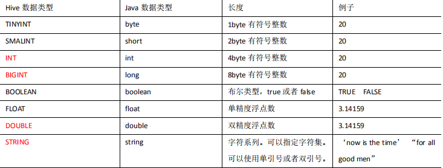
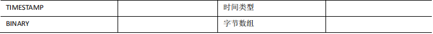
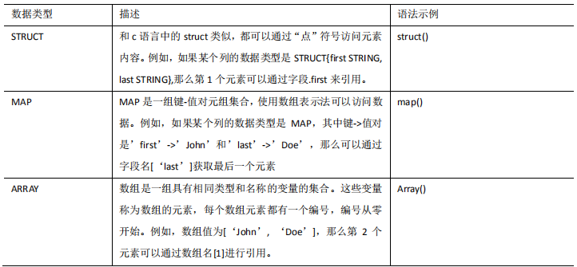

## 3.1 基本数据类型





对于 Hive 的 String 类型相当于数据库的 varchar 类型，该类型是一个可变的字符串，不 

过它不能声明其中最多能存储多少个字符，理论上它可以存储 2GB 的字符数。


## **3.2** **集合数据类型**





Hive 有三种复杂数据类型 ARRAY、MAP 和 STRUCT。ARRAY 和 MAP 与 Java 中的 

Array 和 Map 类似，而 STRUCT 与 C 语言中的 Struct 类似，它封装了一个命名字段集合， 

复杂数据类型允许任意层次的嵌套。 


### 案例实操

1） 假设某表有如下一行，我们用 JSON 格式来表示其数据结构。在 Hive 下访问的格式为

```
{
"name": "songsong",
"friends": ["bingbing" , "lili"] , //列表 Array, 
"children": { //键值 Map,
"xiao song": 18 ,
"xiaoxiao song": 19
}
"address": { //结构 Struct,
"street": "hui long guan" ,
"city": "beijing" 
} }
```

2）基于上述数据结构，我们在 Hive 里创建对应的表，并导入数据。 

创建本地测试文件 test.txt 

```
songsong,bingbing_lili,xiao song:18_xiaoxiao song:19,hui long 
guan_beijing
yangyang,caicai_susu,xiao yang:18_xiaoxiao yang:19,chao 
yang_beijing
```

**注意**：MAP，STRUCT 和 ARRAY 里的元素间关系都可以用同一个字符表示，这 

里用“_”。


3）Hive 上创建测试表 test

```
create table test(
name string,
friends array<string>,
children map<string, int>,
address struct<street:string, city:string>
)
row format delimited 
fields terminated by ','
collection items terminated by '_'
map keys terminated by ':'
lines terminated by '\n';
```

字段解释： 

row format delimited fields terminated by ',' 	-- 列分隔符 

collection items terminated by '_' 	--MAP STRUCT 和 ARRAY 的分隔符(数据分割 符号) 

map keys terminated by ':'	 -- MAP 中的 key 与 value 的分隔符 

lines terminated by '\n';		 -- 行分隔符 


4）导入文本数据到测试表

```
load data local inpath "/opt/module/datas/test.txt" into table test;
```


5）访问三种集合列里的数据，以下分别是 ARRAY，MAP，STRUCT 的访问方式

```
select friends[1],children['xiao song'],address.city from test
```


## **3.3** **类型转化**

Hive 的原子数据类型是可以进行隐式转换的，类似于 Java 的类型转换，例如某表达式 

使用 INT 类型，TINYINT 会自动转换为 INT 类型

但是 Hive **不会进行反向转化**，例如， 某表达式使用 TINYINT 类型

INT 不会自动转换为 TINYINT 类型，它会返回错误，除非使 用 CAST 操作。


**1．隐式类型转换规则如下**

（1）任何整数类型都可以隐式地转换为一个范围更广的类型，如 TINYINT 可以转换成 INT，INT 可以转换成 BIGINT。 

（2）所有整数类型、FLOAT 和 **STRING** 类型都可以隐式地转换成 DOUBLE。 

（3）TINYINT、SMALLINT、INT 都可以转换为 FLOAT。 

（4）BOOLEAN 类型不可以转换为任何其它的类型。


**2．可以使用 CAST 操作显示进行数据类型转换**

例如 CAST('1' AS INT)将把字符串'1' 转换成整数 1；

如果强制类型转换失败，如执行 CAST('X' AS INT)，表达式返回空值 NULL。 