## **4.1** **创建数据库**

**1）创建一个数据库，数据库在 HDFS 上的默认存储路径是/user/hive/warehouse/*.db。**

```
hive (default)>  create database hive;
OK
Time taken: 1.035 seconds
```


查看数据库

```
hive (default)> show databases;
OK
database_name
default
hive
Time taken: 0.204 seconds, Fetched: 2 row(s)
```

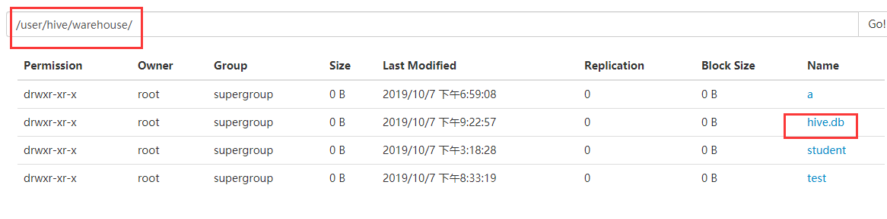

默认添加.db后缀

会创建一个新的文件夹


**2）避免要创建的数据库已经存在错误，增加 if not exists 判断。（标准写法）**

```
create database if not exists db_hive;
```


**3）创建一个数据库，指定数据库在 HDFS 上存放的位置**

```
hive (default)> create database hive2 location '/hive2';
OK
Time taken: 0.18 seconds
```

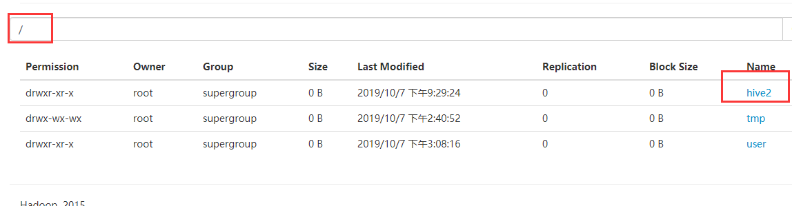


**4）创建一个数据库，类似default**

再dfs上创建一个文件夹用于存放库

```
[root@hadoop2 hive]# hadoop fs -mkdir -p /database//hive3
```

创建数据库

```
hive (default)> create database banzhang location '/database//hive3';
OK
Time taken: 0.135 seconds
```

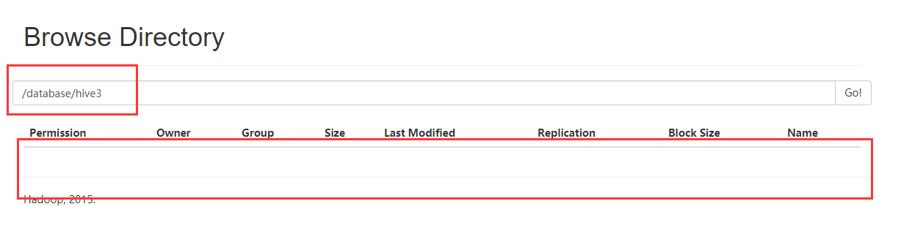

此时创建的效果类似default

创建表

```
hive (banzhang)> create table cc(id int);
OK
Time taken: 0.151 seconds
```

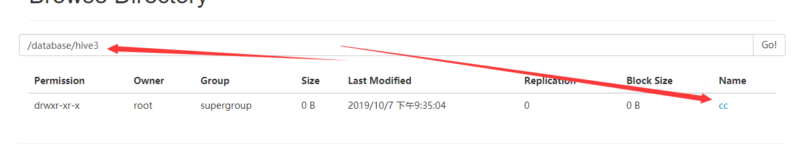

此时就是直接创建一个数据库指向hdfs的文件夹

即库名，路径可以不一致。


## **4.2** **查询数据库**

### **4.2.1** **显示数据库**

**1．显示数据库**

```
hive (banzhang)> show databases;
OK
database_name
banzhang
default
hive
hive2
Time taken: 0.068 seconds, Fetched: 4 row(s)
```


**2．过滤显示查询的数据库**

```
hive (banzhang)>  show databases like 'h*';
OK
database_name
hive
hive2
Time taken: 0.06 seconds, Fetched: 2 row(s)
```


### **4.2.2** **查看数据库详情**

**1．显示数据库信息**

```
hive (banzhang)> desc database hive;
OK
db_name	comment	location	owner_name	owner_type	parameters
hive		hdfs://hadoop2:9000/user/hive/warehouse/hive.db	root	USER	
Time taken: 0.082 seconds, Fetched: 1 row(s)
hive (banzhang)> 

```


**2．显示数据库详细信息，extended**

```
hive (banzhang)> desc database extended hive;
OK
db_name	comment	location	owner_name	owner_type	parameters
hive		hdfs://hadoop2:9000/user/hive/warehouse/hive.db	root	USER	
Time taken: 0.056 seconds, Fetched: 1 row(s)
```


### **4.2.3** **切换当前数据库**

```
hive (default)> use db_hive;
```


## **4.3** **修改数据库**

用户可以使用 ALTER DATABASE 命令为某个数据库的 DBPROPERTIES 设置键-值对 属性值，来描述这个数据库的属性信息。


**数据库的其他元数据信息都是不可更改的，包括数 据库名和数据库所在的目录位置。**


```
### 进行数据库的修改
hive (banzhang)> alter database hive set dbproperties('createtime'='20191007');
OK
Time taken: 0.204 seconds
  
### 在 hive 中查看修改结果
hive (banzhang)> desc database extended hive;
OK
db_name	comment	location	owner_name	owner_type	parameters
hive		hdfs://hadoop2:9000/user/hive/warehouse/hive.db	root	USER	{createtime=20191007}
Time taken: 0.037 seconds, Fetched: 1 row(s)
hive (banzhang)> 

```


## **4.4** **删除数据库**


**1．删除空数据库**

```
hive (banzhang)> show databases;
OK
database_name
banzhang
default
hive
hive2
hive4
Time taken: 0.023 seconds, Fetched: 5 row(s)

删除数据库
hive (banzhang)> drop database hive4;
Moved: 'hdfs://hadoop2:9000/user/hive/warehouse/hive4.db' to trash at: hdfs://hadoop2:9000/user/root/.Trash/Current
OK
Time taken: 1.73 seconds
hive (banzhang)> 

```


**2．如果删除的数据库不存在，最好采用 if exists 判断数据库是否存在**

```
hive> drop database db_hive;
FAILED: SemanticException [Error 10072]: Database does not exist: 
db_hive
hive> drop database if exists db_hive2;
```


**3．如果数据库不为空，可以采用 cascade 命令，强制删除**

```
hive> drop database db_hive;
FAILED: Execution Error, return code 1 from 
org.apache.hadoop.hive.ql.exec.DDLTask. 
InvalidOperationException(message:Database db_hive is not empty. 
One or more tables exist.)

进行强制删除
hive> drop database db_hive cascade;
```


## **4.5** **创建表**

### 1．建表语法

**CREATE [EXTERNAL] TABLE [IF NOT EXISTS] table_name** 

**[(col_name data_type [COMMENT col_comment], ...)]** 

[COMMENT table_comment] 

**[PARTITIONED BY (col_name data_type [COMMENT col_comment], ...)]** 

[CLUSTERED BY (col_name, col_name, ...) 

[SORTED BY (col_name [ASC|DESC], ...)] INTO num_buckets BUCKETS] 

**[ROW FORMAT row_format]** 

[STORED AS file_format] 

**[LOCATION hdfs_path]**


### 2．字段解释说明

**（1）**CREATE TABLE 创建一个指定名字的表。如果相同名字的表已经存在，则抛出异常；用户可以用 IF NOT EXISTS 选项来忽略这个异常。 

**（2）**EXTERNAL 关键字可以让用户创建一个外部表，在建表的同时指定一个指向实际数据的路（LOCATION）

**Hive 创建内部表时，会将数据移动到数据仓库指向的路径；若创建外部表，仅记录数据所在的路径，不对数据的位置做任何改变**。

在删除表的 时候，内部表的元数据和数据会被一起删除，而外部表只删除元数据，不删除据。 

**（3）**COMMENT：为表和列添加注释。 

**（4）**PARTITIONED BY 创建分区表 

**（5）**CLUSTERED BY 创建分桶表 

**（6）**SORTED BY 不常用 

**（7）**ROW FORMAT 

​		DELIMITED [FIELDS TERMINATED BY char] [COLLECTION ITEMS  

​		TERMINATED BY char] 

​					[MAP KEYS TERMINATED BY char] [LINES TERMINATED BY char]  

​			| SERDE serde_name [WITH SERDEPROPERTIES (property_name=property_value,  

​	property_name=property_value, ...)] 

用户在建表的时候可以自定义 SerDe 或者使用自带的 SerDe。如果没有指定 ROW  

FORMAT 或者 ROW FORMAT DELIMITED，将会使用自带的 SerDe。在建表的时候，用户 

还需要为表指定列，用户在指定表的列的同时也会指定自定义的 SerDe，Hive 通过 SerDe 

确定表的具体的列的数据。 

SerDe 是 Serialize/Deserilize 的简称，目的是用于序列化和反序列化。 

**（8）**STORED AS 指定存储文件类型 

常用的存储文件类型：SEQUENCEFILE（二进制序列文件）、TEXTFILE（文本）、 

RCFILE（列式存储格式文件） 

如果文件数据是纯文本，可以使用 STORED AS TEXTFILE。如果数据需要压缩， 

使用 STORED AS SEQUENCEFILE。 

**（9）LOCATION ：指定表在 HDFS 上的存储位置。** 

**（10）**LIKE 允许用户复制现有的表结构，但是不复制数据。


### **4.5.1** **管理表**

**1．理论**

默认创建的表都是所谓的管理表，有时也被称为**内部表**。

因为这种表，Hive 会（或多 或少地）控制着数据的生命周期。

Hive 默认情况下会将这些表的数据存储在由配置项 hive.metastore.warehouse.dir(例如，/user/hive/warehouse)所定义的目录的子目录下。

**当我们 删除一个管理表时，Hive 也会删除这个表中数据**。管理表不适合和其他工具共享数据。


**2、实例操作**

（1）普通创建表

此时库中有一个test

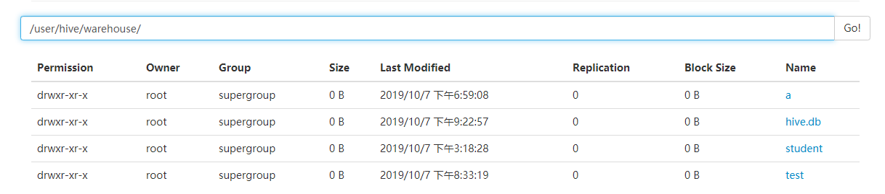


（2）查询

```
hive (default)> select  * from test;
OK
test.name	test.friends	test.children	test.address
ongsong	["bingbing","lili"]	{"xiao song":18,"xiaoxiao song":19}	{"street":"hui long guan","city":"beijing"}
yangyang	["caicai","susu"]	{"xiao yang":18,"xiaoxiao yang":19}	{"street":"chaoyang","city":"beijing"}
Time taken: 4.233 seconds, Fetched: 2 row(s)

```


(3)进行删除

```
hive (default)> drop table test;
Moved: 'hdfs://hadoop2:9000/user/hive/warehouse/test' to trash at: hdfs://hadoop2:9000/user/root/.Trash/Current
OK
Time taken: 4.738 seconds
hive (default)> 
```

此时可以发现删除之后的表数据全部丢失

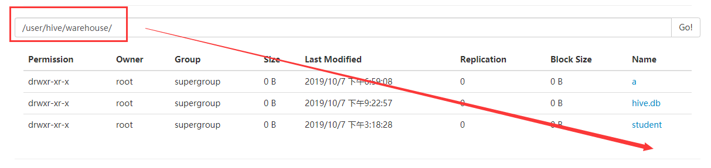


### **4.5.2** **外部表**[EXTERNAL ]

**1．理论**

因为表是外部表，所以 Hive 并非认为其完全拥有这份数据。

**删除该表并不会删除掉这 份数据，不过描述表的元数据信息会被删除掉。**


**2．管理表和外部表的使用场景**

每天将收集到的网站日志定期流入 HDFS 文本文件。在外部表（原始日志表）的基础 

上做大量的统计分析，用到的中间表、结果表使用内部表存储，数据通过 SELECT+INSERT 

进入内部表。 


**3．案例实操**

分别创建部门和员工外部表，并向表中导入数据。

（1）原始数据

dept.txt

```
10	ACCOUNTING	1700
20	RESEARCH	1800
30	SALES	1900
40	OPERATIONS	1700
```

emp.txt

```
7369	SMITH	CLERK	7902	1980-12-17	800.00		20
7499	ALLEN	SALESMAN	7698	1981-2-20	1600.00	300.00	30
7521	WARD	SALESMAN	7698	1981-2-22	1250.00	500.00	30
7566	JONES	MANAGER	7839	1981-4-2	2975.00		20
7654	MARTIN	SALESMAN	7698	1981-9-28	1250.00	1400.00	30
7698	BLAKE	MANAGER	7839	1981-5-1	2850.00		30
7782	CLARK	MANAGER	7839	1981-6-9	2450.00		10
7788	SCOTT	ANALYST	7566	1987-4-19	3000.00		20
7839	KING	PRESIDENT		1981-11-17	5000.00		10
7844	TURNER	SALESMAN	7698	1981-9-8	1500.00	0.00	30
7876	ADAMS	CLERK	7788	1987-5-23	1100.00		20
7900	JAMES	CLERK	7698	1981-12-3	950.00		30
7902	FORD	ANALYST	7566	1981-12-3	3000.00		20
7934	MILLER	CLERK	7782	1982-1-23	1300.00		10
```


（2）建表语句

创建部门表

```
create external table if not exists default.dept(
deptno int,
dname string,
loc int
)
row format delimited fields terminated by '\t';
```


创建员工表

```
create external table if not exists default.emp(
empno int,
ename string,
job string,
mgr int,
hiredate string, 
sal double, 
comm double,
deptno int)
row format delimited fields terminated by '\t';
```


（3）查看创建的表

```
hive (default)> show tables;
OK
tab_name
a
dept
emp
Time taken: 0.143 seconds, Fetched: 3 row(s)
hive (default)> 
```


（4）向外部表中导入数据 导入数据 

```
load data local inpath '/opt/module/data/dept.txt' into table default.dept;
load data local inpath '/opt/module/data/emp.txt' into table default.emp;
```

查询结果

```
hive (default)> select * from dept;
OK
dept.deptno	dept.dname	dept.loc
10	ACCOUNTING	1700
20	RESEARCH	1800
30	SALES	1900
40	OPERATIONS	1700
Time taken: 0.125 seconds, Fetched: 4 row(s)


hive (default)> select * from emp;
OK
emp.empno	emp.ename	emp.job	emp.mgr	emp.hiredate	emp.sal	emp.comm	emp.deptno
7369	SMITH	CLERK	7902	1980-12-17	800.0	NULL	20
7499	ALLEN	SALESMAN	7698	1981-2-20	1600.0	300.0	30
7521	WARD	SALESMAN	7698	1981-2-22	1250.0	500.0	30
7566	JONES	MANAGER	7839	1981-4-2	2975.0	NULL	20
7654	MARTIN	SALESMAN	7698	1981-9-28	1250.0	1400.0	30
7698	BLAKE	MANAGER	7839	1981-5-1	2850.0	NULL	30
7782	CLARK	MANAGER	7839	1981-6-9	2450.0	NULL	10
7788	SCOTT	ANALYST	7566	1987-4-19	3000.0	NULL	20
7839	KING	PRESIDENT	NULL	1981-11-17	5000.0	NULL	10
7844	TURNER	SALESMAN	7698	1981-9-8	1500.0	0.0	30
7876	ADAMS	CLERK	7788	1987-5-23	1100.0	NULL	20
7900	JAMES	CLERK	7698	1981-12-3	950.0	NULL	30
7902	FORD	ANALYST	7566	1981-12-3	3000.0	NULL	20
7934	MILLER	CLERK	7782	1982-1-23	1300.0	NULL	10
Time taken: 0.19 seconds, Fetched: 14 row(s)

```


此时存放再路径下的相关文件路径中

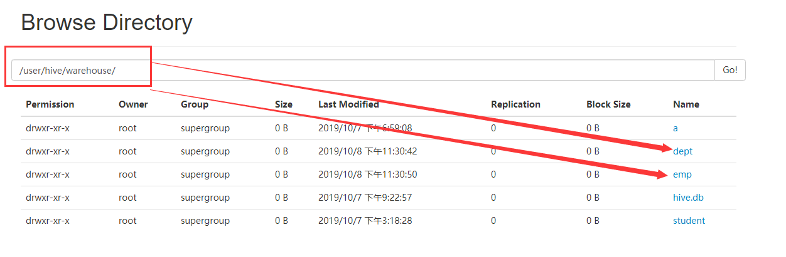


(5) 执行删除操作

```
hive (default)> drop table dept;
OK
Time taken: 0.274 seconds


hive (default)> show tables;
OK
emp
Time taken: 0.04 seconds, Fetched: 2 row(s)

```

但是此时的数据却依旧存放在hdfs的路径上

文件并没有被删除

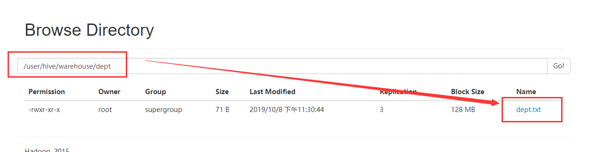


**(7)  数据依然存在，但是数据库中的表不存在，那么该怎么找到数据**

此时再进行创建表

```
hive (default)> create external table if not exists default.dept(
              > deptno int,
              > dname string,
              > loc int
              > )
              > row format delimited fields terminated by '\t';
OK
Time taken: 0.222 seconds

```

进行查询

```
hive (default)> select * from dept;
OK
dept.deptno	dept.dname	dept.loc
10	ACCOUNTING	1700
20	RESEARCH	1800
30	SALES	1900
40	OPERATIONS	1700
Time taken: 0.129 seconds, Fetched: 4 row(s)

```

此时可以重新找到数据


**注意：**

此时再mysql 中会指向hdfs上的路径

同时hdfs上的数据依然存在，所以此时再重新创建数据库，即可以找到数据。


### **4.5.3** **管理表与外部表的互相转换**

（1）查询表的类型

```
hive (default)> select * from dept;
OK
dept.deptno	dept.dname	dept.loc
10	ACCOUNTING	1700
20	RESEARCH	1800
30	SALES	1900
40	OPERATIONS	1700
...
Location:           	hdfs://hadoop2:9000/user/hive/warehouse/dept	 
Table Type:         	EXTERNAL_TABLE      	 
Table Parameters:	 	 
	COLUMN_STATS_ACCURATE	false 
...            
	EXTERNAL            	TRUE     
...
```

**Table Type:         	EXTERNAL_TABLE**    

   

（2）修改内部表 dept为外部表

```
alter table student2 set tblproperties('EXTERNAL'='TRUE');
```

'EXTERNAL'='TRUE' === EXTERNAL_TABLE   == >外部表

'EXTERNAL'='FALSE' === MANAGED_TBLW  == >内部表


（3）删除外表在hdfs上的数据

首先将外部表转为内部表

然后再执行

```
drop table  dept;
```


**注意：('EXTERNAL'='TRUE')和('EXTERNAL'='FALSE')为固定写法，区分大小写！**


## **4.6** **分区表**

分区表实际上就是对应一个 HDFS 文件系统上的独立的文件夹，该文件夹下是该分区 所有的数据文件。


**Hive 中的分区就是分目录，把一个大的数据集根据业务需要分割成小的 数据集。**

​	

在查询时通过 **WHERE** 子句中的表达式选择查询所需要的指定的分区，这样的查 询效率会提高很多。


### **4.6.1** **分区表基本操作**


#### **1．引入分区表（）**

需要根据日期对日志进行管理

```
/user/hive/warehouse/log_partition/20170702/20170702.log
/user/hive/warehouse/log_partition/20170703/20170703.log
/user/hive/warehouse/log_partition/20170704/20170704.log
```


#### **2．创建分区表语法**

```
hive (default)> create table dept_partition(
deptno int, dname string, loc string
)
///====================
partitioned by (month string)
///====================
row format delimited fields terminated by '\t';
```

hive (default)> create table dept_partition(
deptno int, dname string, loc string
)
///====================

month :分区字段（名字任意）

**partitioned by (month string)**
///====================
row format delimited fields terminated by '\t';


```
hive (default)> create table dept_partition(
              > deptno int, dname string, loc string
              > )
              > partitioned by (month string)
              > row format delimited fields terminated by '\t';
OK
Time taken: 7.805 seconds
```

此时创建之后，查看文件夹并没太大变化

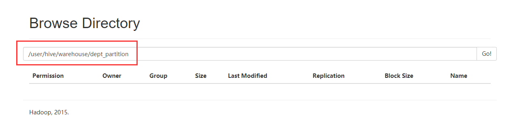


#### **3．加载数据到分区表中**

```
hive (default)> load data local inpath  '/opt/module/data/dept.txt' into table default.dept_partition partition(month='201909');

hive (default)> load data local inpath '/opt/module/data/dept.txt' into table default.dept_partition partition(month='201708');

hive (default)> load data local inpath '/opt/module/data/dept.txt' into table default.dept_partition partition(month='201707’);
```

进行文件的导入

```
hive (default)> load data local inpath  '/opt/module/data/dept.txt' into table default.dept_partition partition(month='201909');
Loading data to table default.dept_partition partition (month=201909)
Partition default.dept_partition{month=201909} stats: [numFiles=1, numRows=0, totalSize=71, rawDataSize=0]
OK
Time taken: 5.824 seconds

```

此时进行查看

此时会发现我们命名的month值为一个文件夹

再这个文件夹下面进行存放相应的分区数据

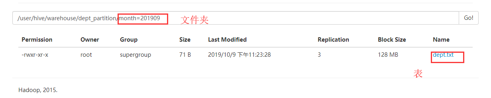


#### **4．查询分区表中数据**

进行查询

此时也会进行相应的分区表进行显示

同时是将所有分区的数据进行查询

```
hive (default)> 
              > 
              > select * from dept_partition;
OK
dept_partition.deptno	dept_partition.dname	dept_partition.loc	dept_partition.month
10	ACCOUNTING	1700	201909
20	RESEARCH	1800	201909
30	SALES	1900	201909
40	OPERATIONS	1700	201909
10	ACCOUNTING	1700	201910
20	RESEARCH	1800	201910
30	SALES	1900	201910
40	OPERATIONS	1700	201910
Time taken: 3.998 seconds, Fetched: 8 row(s)
hive (default)> 

```


同时可以使用where进行 分区信息进行限定

```
hive (default)> select * from dept_partition where month='201910';
OK
dept_partition.deptno	dept_partition.dname	dept_partition.loc	dept_partition.month
10	ACCOUNTING	1700	201910
20	RESEARCH	1800	201910
30	SALES	1900	201910
40	OPERATIONS	1700	201910
Time taken: 1.259 seconds, Fetched: 4 row(s)

```


首先访问mysql找到相应的路径去通信

走where时，发现有分区信息，然后进行定位指定的路径

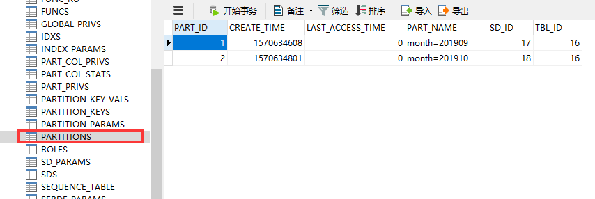


#### 5.增加分区

单个分区

```
alter table dept_partition add partition(month='XXXXX') ;
```

多个分区

```
alter table dept_partition add partition(month='xxxx') partition(month='xxxx');
```


#### 6．删除分区

删除单个分区

```
alter table dept_partition drop partition (month='xxxx');
```

同时删除多个分区

```
alter table dept_partition drop partition (month='xxx'), partition (month='xxx');
```


#### 7．查看分区表有多少分区

```
show partitions dept_partition;
```


#### 8．查看分区表结构

```
 desc formatted dept_partition;
```


### **4.6.2** **分区表注意事项**

#### **1．创建二级分区表**

```
 create table dept_partition2(
deptno int, dname string, loc string)
partitioned by (month string, day string)
row format delimited fields terminated by '\t';
```


#### 2．正常的加载数据

（1）加载数据到二级分区表中 

```
load data local inpath 
'/opt/module/datas/dept.txt' into table
default.dept_partition2 partition(month='xxxx', day='xxxx');
```

（2）查询分区数据

```
select * from dept_partition2 where 
month='xxxx' and day='xxxx';
```


#### 3．把数据直接上传到分区目录上，让分区表和数据产生关联的三种方式

##### （1）方式一：上传数据后修复

上传数据

```
命令1： dfs -mkdir -p
/user/hive/warehouse/dept_partition2/month=201709/day=12;


命令2： dfs -put /opt/module/datas/dept.txt 
/user/hive/warehouse/dept_partition2/month=201709/day=12;
```

查询数据（查询不到刚上传的数据）

```
select * from dept_partition2 where  month='201709' and day='12';
```

执行修复命令

```
msck repair table dept_partition2;
```

再次查询数据


注意：

**此时并没进行再mysql中进行相应的数据插入**

**即此时的查询找不到相应的路径**


##### （2）方式二：上传数据后添加分区

上传数据

```
命令1： dfs -mkdir -p
/user/hive/warehouse/dept_partition2/month=201709/day=12;


命令2： dfs -put /opt/module/datas/dept.txt 
/user/hive/warehouse/dept_partition2/month=201709/day=12;
```


执行添加分区

```
alter table dept_partition2 add 
partition(month='201709',
day='11');
```

查询数据


##### （3）方式三：创建文件夹后 load 数据到分区

创建目录

```
 dfs -mkdir -p
/user/hive/warehouse/dept_partition2/month=201709/day=10;
```

上传数据

```
load data local inpath 
'/opt/module/datas/dept.txt' into table
dept_partition2 partition(month='201709',day='10');
```

查询数据


### **4.7** **修改表**


#### **4.7.1** **重命名表**

1．语法

```
ALTER TABLE table_name RENAME TO new_table_name
```

2．实操案例

```
查看表
hive (default)> show tables;
OK
tab_name
a
dept
dept_partition
emp
Time taken: 2.852 seconds, Fetched: 4 row(s)


更改表名字
hive (default)> alter table a rename to newa;
OK
Time taken: 1.43 seconds
hive (default)> show tables;
OK
tab_name
dept
dept_partition
emp
newa
Time taken: 0.094 seconds, Fetched: 4 row(s)
```


#### **4.7.2** **增加、修改和删除表分区**

4.6.1


#### **4.7.3** 增加/修改/替换列信息

**1．语法** 

更新列

```
ALTER TABLE table_name CHANGE [COLUMN] col_old_name col_new_name 
column_type [COMMENT col_comment] [FIRST|AFTER column_name]
```

增加和替换列

```
ALTER TABLE table_name ADD|REPLACE COLUMNS (col_name data_type 
[COMMENT col_comment], ...)
```

注：**ADD 是代表新增一字段，字段位置在所有列后面(partition 列前)，REPLACE 则是** 

**表示替换表中所有字段。** 


**2．实操案例**

（1）查询表结构

```
hive (default)> desc newa;
OK
col_name	data_type	comment
a                   	int                 	                    
Time taken: 0.302 seconds, Fetched: 1 row(s)
```

（2）添加列

```
hive (default)> alter table newa add  columns (aname string);
OK
Time taken: 0.791 seconds
```

（3）查询表结构

```
hive (default)> desc newa;
OK
col_name	data_type	comment
a                   	int                 	                    
aname               	string              	                    
Time taken: 0.156 seconds, Fetched: 2 row(s)
```


（4）更新列(不仅可以该列明同时还可以修改属性)

```
hive (default)> alter  table newa  change column aname sex string;
OK
Time taken: 0.354 seconds

```


（5）查询表结构

```
hive (default)> desc newa;
OK
col_name	data_type	comment
a                   	int                 	                    
sex                 	string              	                    
Time taken: 0.134 seconds, Fetched: 2 row(s)
```


（6）替换列

```
hive (default)> alter  table newa  replace columns (sex string ,grade int);
OK
Time taken: 0.206 seconds

```


（5）查询表结构

```
hive (default)> desc newa;
OK
col_name	data_type	comment
sex                 	string              	                    
grade               	int                 	                    
Time taken: 0.117 seconds, Fetched: 2 row(s)

```


### **4.8** **删除表**

```
hive (default)> drop table 表名;
```


