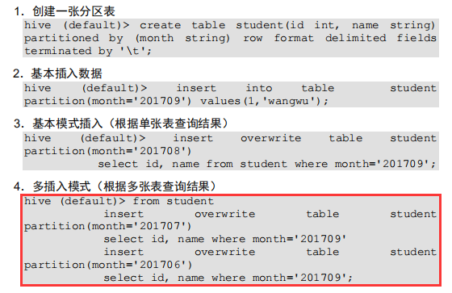
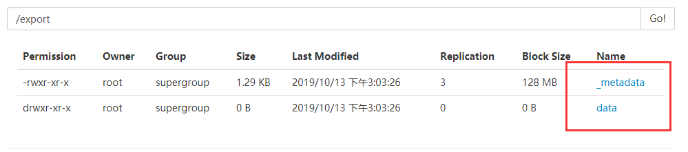

# **DML** **数据操作**

## **5.1** **数据导入**

### **5.1.1** 向表中装载数据（Load）


语法：

**load data [local] inpath '2文件全路径' [overwrite] | into table 表名  [partition (partcol1=val1,…)];**


```
hive (default)> load data local inpath '/opt/module/data/a.txt' into table newa;
Loading data to table default.newa
Table default.newa stats: [numFiles=2, numRows=0, totalSize=32, rawDataSize=0]
OK
Time taken: 2.844 seconds
hive (default)> select * from newa;
OK
newa.a
1
2
3
4
5
6
7
8
1
2
3
4
5
6
7
8
Time taken: 0.125 seconds, Fetched: 16 row(s)

```


**（1）load data:表示加载数据** 

**（2）local:表示从本地加载数据到 hive 表；否则从 HDFS 加载数据到 hive 表** 

**（3）inpath:表示加载数据的路径** 

**（4）overwrite:表示覆盖表中已有数据，否则表示追加** 

```
hive (default)> load data local inpath '/opt/module/data/a.txt' overwrite  into table newa;
Loading data to table default.newa
Moved: 'hdfs://hadoop2:9000/user/hive/warehouse/newa/a.txt' to trash at: hdfs://hadoop2:9000/user/root/.Trash/Current
Moved: 'hdfs://hadoop2:9000/user/hive/warehouse/newa/a_copy_1.txt' to trash at: hdfs://hadoop2:9000/user/root/.Trash/Current
Table default.newa stats: [numFiles=1, numRows=0, totalSize=16, rawDataSize=0]
OK
Time taken: 0.505 seconds
hive (default)> select * from newa;
OK
newa.a
1
2
3
4
5
6
7
8
Time taken: 0.105 seconds, Fetched: 8 row(s)
```

**（5）into table:表示加载到哪张表** 

**（6）student:表示具体的表** 

**（7）partition:表示上传到指定分区** 


### **5.1.2** 通过查询语句向表中插入数据（Insert）

1、建立一张表，使newa和newb之间的字段一致

​	并且进行newa中的数据查询

```
hive (default)> show tables;
OK
newa
newb
Time taken: 0.036 seconds, Fetched: 5 row(s)
hive (default)> select * from newa;
OK
newa.a
1
2
3
4
5
6
7
8
Time taken: 0.116 seconds, Fetched: 8 row(s)

```

2、插入数据

```
hive (default)> insert into table newb 
              > select * from newa;
              
              
Query ID = root_20191010120034_36f201f9-bf1f-49a8-b804-00ed5c4e0a6b
Total jobs = 3
Launching Job 1 out of 3
Number of reduce tasks is set to 0 since there's no reduce operator
Starting Job = job_1570720448419_0001, Tracking URL = http://hadoop3:8088/proxy/application_1570720448419_0001/
Kill Command = /opt/module/hadoop-2.7.2/bin/hadoop job  -kill job_1570720448419_0001
Hadoop job information for Stage-1: number of mappers: 1; number of reducers: 0
2019-10-10 12:00:53,251 Stage-1 map = 0%,  reduce = 0%
2019-10-10 12:01:11,045 Stage-1 map = 100%,  reduce = 0%, Cumulative CPU 4.01 sec
MapReduce Total cumulative CPU time: 4 seconds 10 msec
Ended Job = job_1570720448419_0001
Stage-4 is selected by condition resolver.
Stage-3 is filtered out by condition resolver.
Stage-5 is filtered out by condition resolver.
Moving data to: hdfs://hadoop2:9000/user/hive/warehouse/newb/.hive-staging_hive_2019-10-10_12-00-34_077_1661906270799595176-1/-ext-10000
Loading data to table default.newb
Table default.newb stats: [numFiles=1, numRows=8, totalSize=16, rawDataSize=8]
MapReduce Jobs Launched: 
Stage-Stage-1: Map: 1   Cumulative CPU: 4.01 sec   HDFS Read: 3003 HDFS Write: 84 SUCCESS
Total MapReduce CPU Time Spent: 4 seconds 10 msec
OK
newa.a
Time taken: 40.5 seconds

```


3、查询newb数据表

```
hive (default)> select * from newb;
OK
newb.b
1
2
3
4
5
6
7
8
Time taken: 0.109 seconds, Fetched: 8 row(s)

```


#### 注意：

使用into使进行插入

使用overwrite使进行覆盖

insert overwrite ........





### 5.1.3查询语句中创建表并加载数据（As Select）

第四章5.1节

根据查询结果创建表（查询的结果会添加到新创建的表中）

```
create table if not exists 表名
as select id, name from 被查询的表名;
```


### **5.1.4** **创建表时通过** **Location** **指定加载数据路径**

**1．上传数据到 hdfs 上** 

```
[root@hadoop2 data]# hadoop fs -mkdir -p /mr/hive/aa

[root@hadoop2 data]# hadoop fs  -put a.txt  /mr/hive/aa

```


**2．创建表，并指定在 hdfs 上的位置**并且进行查询

```
hive (default)> create table aa(id int) location '/mr/hive/aa';
OK
Time taken: 1.0 seconds


hive (default)> select * from aa;
OK
aa.id
1
2
3
4
5
6
7
8
Time taken: 1.138 seconds, Fetched: 8 row(s)

```


### **5.1.5 Import** **数据到指定** **Hive** **表中**

**注意：先用 export 导出后，再将数据导入。**

```
hive (default)> import table student2 partition(month='201709') 
from
'/user/hive/warehouse/export/student';
```


## **5.2** **数据导出**

### **5.2.1 Insert** **导出**

#### 1．将查询的结果导出到本地

注意：如果再已有文件的目录下，其他文件会被删除

```
hive (default)> select * from dept;
OK
dept.deptno	dept.dname	dept.loc
10	ACCOUNTING	1700
20	RESEARCH	1800
30	SALES	1900
40	OPERATIONS	1700
Time taken: 6.403 seconds, Fetched: 4 row(s)
```

```
hive (default)> insert overwrite local directory  '/opt/module/data/dept'
              > select * from dept;
Query ID = root_20191013023915_4fec6f40-47aa-4fc2-a605-cf073edc2242
Total jobs = 1
.....
```

```
[root@hadoop2 data]# clear
[root@hadoop2 data]# ll
total 0
drwxr-xr-x. 1 root root 170 Oct 13 02:41 dept
[root@hadoop2 data]# cd dept/
[root@hadoop2 dept]# ll
total 4
-rw-r--r--. 1 root root 69 Oct 13 02:41 000000_0
[root@hadoop2 dept]# cat 000000_0 
10ACCOUNTING1700
20RESEARCH1800
30SALES1900
40OPERATIONS1700

```

此时的数据是没有分隔符的

使用如下的方式进行


#### 2．将查询的结果格式化导出到本地

导入介入的分隔符，到出时也加入相应的分隔符

```
hive (default)> insert overwrite local directory  '/opt/module/data/dept1'
              > row format delimited fields terminated by '\t'
              > select * from dept;
Query ID = root_20191013024524_5959bf47-c6ee-4011-ab8a-3f9dfc2b1e51
....
```


查询此时的文件内容

```
[root@hadoop2 dept1]# cat 000000_0 
10	ACCOUNTING	1700
20	RESEARCH	1800
30	SALES	1900
40	OPERATIONS	1700
```

此时的内容是人工可以看懂的数据也是期望的数据


#### 3．将查询的结果导出到 HDFS 上(没有 local)

```
hive (default)> insert overwrite directory 
'/user/atguigu/student2'
ROW FORMAT DELIMITED FIELDS TERMINATED BY '\t' 
select * from student;
```


### **5.2.2 Hadoop** **命令导出到本地**

```
dfs -get 
/user/hive/warehouse/student/month=201709/000000_0
/opt/module/datas/export/student3.txt;
```


### **5.2.3 Hive Shell** **命令导出**

基本语法：（**hive -f/-e 执行语句或者脚本 > file**）

```
bin/hive -e 'select * from 
default.student;' >
/xxx/fileName
```


### 	**5.2.4 Export** **导出到** **HDFS** **上**

```
hive (default)> export table dept 
              > to '/export';
Copying data from file:/tmp/root/b6efe1b0-48d1-4c11-8a05-041a72446f8c/hive_2019-10-13_03-03-25_110_618451214044227441-1/-local-10000/_metadata
Copying file: file:/tmp/root/b6efe1b0-48d1-4c11-8a05-041a72446f8c/hive_2019-10-13_03-03-25_110_618451214044227441-1/-local-10000/_metadata
Copying data from hdfs://hadoop2:9000/user/hive/warehouse/dept
Copying file: hdfs://hadoop2:9000/user/hive/warehouse/dept/dept.txt
OK
Time taken: 1.213 seconds

```



此时可以发现元素据和数据都导出


import：注意 只能是新表才能进行导入

```
inport table 表名  from  'hdfs路径'
```


### **5.2.5 Sqoop** **导出**

后续....


## **5.3** **清除表中数据（**Truncate**）** 

**注意：Truncate 只能删除管理表，不能删除外部表中数据**

```
 truncate table 表名;
```

