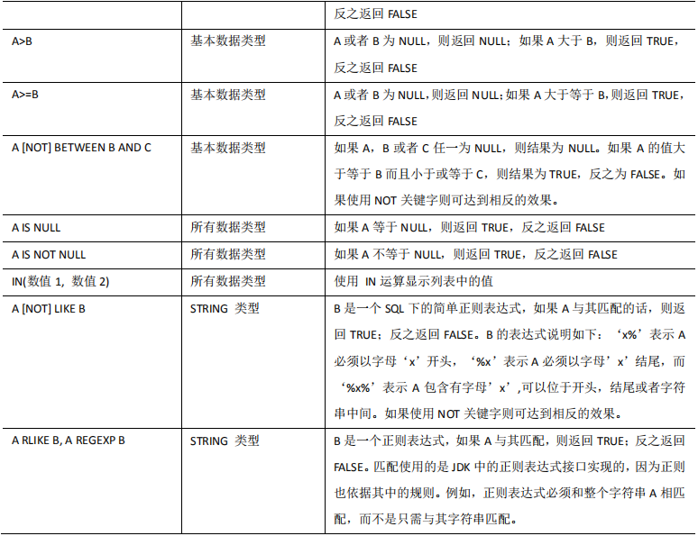

# **查询**

https://cwiki.apache.org/confluence/display/Hive/LanguageManual+Select官网查询函数等案例


## **6.1** 基本查询（Select…From）

### **6.1.1** **全表和特定列查询**

#### 1．全表查询

```
select * from emp;
```

#### 2．选择特定列查询

```
 select empno, ename from emp;
```


注意： 

（1）SQL 语言大小写不敏感。 

（2）SQL 可以写在一行或者多行 

（3）**关键字不能被缩写也不能分行** 

（4）各子句一般要分行写。 

（5）使用缩进提高语句的可读性。


### **6.1.2** **列别名**

1．重命名一个列 

2．便于计算 

3．紧跟列名，也可以在列名和别名之间加入关键字‘AS’ 


```
 select ename AS name, deptno dn from emp;
```


```
 select ename  name, deptno dn from emp;
```


### **6.1.3** **算术运算符**


查询员工工资并且进行加1000

```
 select sal +1000 from emp;
```


### **6.1.4** **常用函数**

#### 1．求总行数（count）

```
 select count(*) cnt from emp;
```


#### 2．求工资的最大值（max）

```
 select max(sal) max_sal from emp;
```


#### 3．求工资的最小值（min）

```
select min(sal) min_sal from emp;
```


#### 4．求工资的总和（sum）

```
select sum(sal) sum_sal from emp;
```


#### 5．求工资的平均值（avg）

```
select avg(sal) avg_sal from emp;
```


### **6.1.5 Limit** **语句**

```
典型的查询会返回多行数据。LIMIT 子句用于限制返回的行数。
```

```
 select * from emp limit 5;
```


## 6.2 Where **语句**

1．使用 WHERE 子句，将不满足条件的行过滤掉 

2．WHERE 子句紧随 FROM 子句 


查询出薪水大于 1000 的所有员工

```
 select * from emp where sal >1000;
```


### **6.2.1** 比较运算符（Between/In/ Is Null） 


下面表中描述了谓词操作符，这些操作符同样可以用于 JOIN…ON 和 HAVING 语句中





查询出薪水等于 5000 的所有员工

```
select * from emp where sal =5000;
```


查询工资在 500 到 1000 的员工信息

```
 select * from emp where sal between 500 and 1000;
```


查询 comm 为空的所有员工信息

```
select * from emp where comm is null;
```


查询工资是 1500 或 5000 的员工信息

```
 select * from emp where sal IN (1500, 5000);
```


### **6.2.2 Like** **和** **RLike**

1）使用 LIKE 运算选择类似的值 

2）选择条件可以包含字符或数字: 

​		**% 代表零个或多个字符(任意个字符)。** 

​		**_ 代表一个字符。** 

3）RLIKE 子句是 Hive 中这个功能的一个扩展，其可以通过 Java 的正则表达式这个更 

​		强大的语言来指定匹配条件。


查找以 2 开头薪水的员工信息

```
select * from emp where sal LIKE '2%';
```


查找第二个数值为 2 的薪水的员工信息

```
 select * from emp where sal LIKE '_2%';
```


查找薪水中含有 2 的员工信息

```
select * from emp where sal RLIKE '[2]';
```


### **6.2.3** 逻辑运算符（And/Or/Not）


查询薪水大于 1000，部门是 30

```
 select * from emp where sal>1000 and deptno=30;
```


查询薪水大于 1000，或者部门是 30

```
 select * from emp where sal>1000 or deptno=30;
```


查询除了 20 部门和 30 部门以外的员工信息

```
select * from emp where deptno not IN(30, 20);
```


## **6.3** **分组**

### **6.3.1 Group By** **语句**

GROUP BY 语句通常会和聚合函数一起使用，按照一个或者多个列队结果进行分组， 

然后对每个组执行聚合操作。


计算 emp 表每个部门的平均工资

```
hive (default)> select t.deptno, avg(t.sal) avg_sal from emp t 
              > group by t.deptno;
```


计算 emp 每个部门中每个岗位的最高薪水

```
select t.deptno, t.job, max(t.sal) max_sal from 
emp t group by
t.deptno, t.job;
```


### **6.3.2 Having** **语句**

**1．having 与 where 不同点**

（1）where 针对表中的列发挥作用，查询数据；having 针对查询结果中的列发挥作用， 筛选数据。 

（2）where 后面不能写聚合函数，而 having 后面可以使用聚合函数。 

（3）having 只用于 group by 分组统计语句。 


**2．案例实操**

求每个部门的平均薪水大于 2000 的部门

求每个部门的平均工资

```
 select deptno, avg(sal) from emp group by deptno;
```


求每个部门的平均薪水大于 2000 的部门

```
select deptno, avg(sal) avg_sal from emp group 
by deptno having
avg_sal > 2000;
```


## **6.4 Join** **语句**


### **6.4.1** **等值** **Join**

Hive 支持通常的 SQL JOIN 语句

**但是只支持等值连接，不支持非等值连接。**


根据员工表和部门表中的部门编号相等，查询员工编号、员工名称和部门名称；

```
select e.empno, e.ename, d.deptno, d.dname 
from emp e 
join dept d
on e.deptno = d.deptno;
```


### **6.4.2** **表的别名**

**1．好处** 

（1）使用别名可以简化查询。 

（2）使用表名前缀可以提高执行效率。 


**2．案例实操** 

合并员工表和部门表

```
select e.empno, e.ename, d.deptno 
from emp e 
joindept d 
on e.deptno= d.deptno;
```


### **6.4.3** **内连接**

内连接：

只有进行连接的两个表中**都存在**与**连接条件相匹配**的数据才会被保留下来。

```
select e.empno, e.ename, d.deptno 
from emp e 
joindept d 
on e.deptno= d.deptno;
```


### **6.4.4** **左外连接**

左外连接：

JOIN 操作符左边表中符合 WHERE 子句的所有记录将会被返回。

```
 select e.empno, e.ename, d.deptno 
 from emp e 
 left join dept d 
 on e.deptno = d.deptno;
```


### **6.4.5** **右外连接**

右外连接：

JOIN 操作符右边表中符合 WHERE 子句的所有记录将会被返回。

```
select e.empno, e.ename, d.deptno 
from emp e 
right join dept d 
on e.deptno = d.deptno;
```


### **6.4.6** **满外连接**

满外连接：

将会返回所有表中符合 WHERE 语句条件的所有记录。

如果任一表的指定 字段没有符合条件的值的话，那么就使用 NULL 值替代。 

```
 select e.empno, e.ename, d.deptno 
 from emp e 
 full join dept d 
 on e.deptno = d.deptno;
```


### **6.4.7** **多表连接**

注意：

连接 n 个表，至少需要 n-1 个连接条件。例如：连接三个表，至少需要两个连 接条件。


**1．创建位置表**

```
create table if not exists default.location(
loc int,
loc_name string
)
row format delimited fields terminated by '\t';
```


**2．导入数据**

```
load data local inpath 
'/opt/module/data/location.txt' into table default.location;
```


**3．多表连接查询**

```
SELECT e.ename, d.deptno, l.loc_name
FROM emp e 
JOIN dept d
	ON d.deptno = e.deptno
JOIN location l
	ON d.loc = l.loc;
```

大多数情况下，Hive 会对每对 JOIN 连接对象启动一个 MapReduce 任务

首先启动一个 MapReduce job 对表 e 和表 d 进行连接操作

然后会再启动一个 MapReduce job 将第一个 MapReduce job 的输出和表 l;进行连接操作。 


注意：

为什么不是表 d 和表 l 先进行连接操作呢？这是因为 Hive 总是按照从左到右的 顺序执行的。


### **6.4.8** **笛卡尔积**

**1．笛卡尔集会在下面条件下产生**

（1）省略连接条件 

（2）连接条件无效 

（3）所有表中的所有行互相连接 


**2．案例实操**

```
hive (default)> select empno,dname
              > from emp,dept;
```


### **6.4.9** **连接谓词中不支持** **or**

```
hive (default)> select e.empno,e.ename,d.deptno
              > from emp e
              > join dept d
              > on e.deptno=d.deptno or e.ename=d.dname;
FAILED: SemanticException [Error 10019]: Line 4:3 OR not supported in JOIN currently 'dname'
```


## **6.5** **排序**


### **6.5.1** 全局排序（Order By）

**Order By：全局排序，一个 Reducer**


1．使用 ORDER BY 子句排序

**ASC（ascend）: 升序（默认）** 

**DESC（descend）: 降序**


2．ORDER BY 子句在 SELECT 语句的结尾


3．案例实操

（1）查询员工信息按工资升序排列

```
hive (default)> select * from emp order by sal;
```


（2）查询员工信息按工资降序排列

```
select * from emp order by sal desc;
```


### **6.5.2** **按照别名排序**

按照员工薪水的 2 倍排序

```
hive (default)> select ename,sal*2 sal_two from emp order by sal_two;
```


### **6.5.3** **多个列排序**

按照部门和工资升序排序

```
hive (default)> select ename,deptno,sal
              > from emp
              > order by deptno asc,sal desc;

```


### **6.5.4** **每个** **MapReduce** **内部排序（Sort By）**

Sort By：

**每个 Reducer 内部进行排序，对全局结果集来说不是排序。**


**1．设置 reduce 个数**

```
hive (default)> set mapreduce.job.reduces=3;
```


**2．查看设置 reduce 个数**

```
set mapreduce.job.reduces;
```


**3．根据部门编号降序查看员工信息**

```
hive (default)>  select * from emp sort by empno desc;
```


**4．将查询结果导入到文件中（按照部门编号降序排序）**

```
hive (default)> insert overwrite local directory 
              > '/opt/module/data/sortdata'
              > select * from emp sort by deptno desc;
```


注意：

此时再文件中会有三个文件

再mr程序中分了三个区，此时会随机进行分区（此时没有指定分区字段）

此时引入分区排序：按照某个字段进行分区，然后再进行排序


### **6.5.5** **分区排序（Distribute By）**

Distribute By：

类似 MR 中 partition，进行分区，结合 sort by 使用。


**注意，Hive 要求 DISTRIBUTE BY 语句要写在 SORT BY 语句之前。**


```
hive (default)>  set mapreduce.job.reduces=3;
```


根据deptno进行分区然后按照sal进行排序

```
hive (default)> insert overwrite directory '/opt/module/data/dire-by'
              > select * from emp distribute by deptno 
              > sort by sal;
```


进行查看

```
[root@hadoop2 data]# hadoop fs -cat /opt/module/data/dire-by/000000_0
7900JAMESCLERK76981981-12-3950.0\N30
7521WARDSALESMAN76981981-2-221250.0500.030
7654MARTINSALESMAN76981981-9-281250.01400.030
7844TURNERSALESMAN76981981-9-81500.00.030
7499ALLENSALESMAN76981981-2-201600.0300.030
7698BLAKEMANAGER78391981-5-12850.0\N30

[root@hadoop2 data]# hadoop fs -cat /opt/module/data/dire-by/000001_0
7934MILLERCLERK77821982-1-231300.0\N10
7782CLARKMANAGER78391981-6-92450.0\N10
7839KINGPRESIDENT\N1981-11-175000.0\N10

[root@hadoop2 data]# hadoop fs -cat /opt/module/data/dire-by/000002_0
7369SMITHCLERK79021980-12-17800.0\N20
7876ADAMSCLERK77881987-5-231100.0\N20
7566JONESMANAGER78391981-4-22975.0\N20
7788SCOTTANALYST75661987-4-193000.0\N20
7902FORDANALYST75661981-12-33000.0\N20

```


### **6.5.6 Cluster By**

**当 distribute by 和 sorts by 字段相同时，可以使用 cluster by 方式。**


cluster by 除了具有 distribute by 的功能外还兼具 sort by 的功能。

但是**排序只能是升序排序**，不能指定排序规则为 ASC 或者 DESC。 


排序字段和分区字段相同可以使用cluster by进行分区排序


两种方法是等价的

```
hive (default)> select * from emp cluster by deptno;

hive (default)> select * from emp distribute by deptno sort by 
deptno;
```


注意：按照部门编号分区，不一定就是固定死的数值，可以是 20 号和 30 号部门分到一 

个分区里面去。


### 6.5.7、4种排序的比较

Order By的语法

```
“ order by”子句中有一些限制。在严格模式下（即hive.mapred.mode = strict），必须在order by子句后跟一个“ limit”子句。如果将hive.mapred.mode设置为nonstrict，则没有limit子句。原因是为了强加所有结果的总顺序，必须有一个减速器才能对最终输出进行排序。如果输出中的行数太大，则单个减速器可能需要很长时间才能完成。

请注意，列是通过名称而不是位置编号指定的。但是，在Hive 0.11.0和更高版本中， 按以下方式配置时可以按位置指定列：

对于Hive 0.11.0到2.1.x，将hive.groupby.orderby.position.alias设置   为true（默认值为false）。
对于Hive 2.2.0和更高版本， 默认情况下，  hive.orderby.position.alias为true。
默认排序顺序为升序（ASC）。

在Hive 2.1.0和更高版本中，支持为“ order by”子句中的每个列指定空排序顺序。ASC顺序的默认空排序顺序为NULLS FIRST，而DESC顺序的默认空排序顺序为NULLS LAST。

在Hive 3.0.0及更高版本中，优化程序将删除子查询和视图中的无限制排序。要禁用它，请将hive.remove.orderby.in.subquery设置  为false。
```


Sort By

```
Hive使用SORT BY中的列对行进行排序，然后再将行提供给reducer。排序顺序将取决于列类型。如果列是数字类型，则排序顺序也是数字顺序。如果列是字符串类型，则排序顺序将是字典顺序。

在Hive 3.0.0和更高版本中，子查询中的排序依据不受限制，   并且   优化程序将删除视图。要禁用它，请将hive.remove.orderby.in.subquery设置   为false。
```


Sort By and Order By

```
Hive支持SORT BY，可对每个reducer的数据进行排序。“ order by”和“ sort by”之间的区别在于，前者保证输出中的总顺序，而后者仅保证精简器中行的排序。如果存在多个减速器，则“排序依据”可能会给出部分排序的最终结果。

注意：关于单列的单独SORT BY与CLUSTER BY之间的区别可能会造成混淆。区别在于，如果有多个reducer分区，则CLUSTER BY按字段划分，而SORT BY则是随机划分，以便在reducer上均匀地分布数据（和负载）。

基本上，每个reducer中的数据将根据用户指定的顺序进行排序。
```


Sort By

```
转换后，通常将变量类型视为字符串，这意味着数字数据将按字典顺序进行排序。为了克服这个问题，可以在使用SORT BY之前使用第二个带有强制类型转换的SELECT语句。
```


Cluster By and Distribute By

```
Cluster By和Distribute By主要与Transform / Map-Reduce脚本一起使用。但是，如果需要对查询的输出进行分区和排序以用于后续查询，有时在SELECT语句中很有用。

Cluster By是Distribute By和Sort By的捷径。

蜂巢使用在列分发由该行减速器之间分配。具有相同“ 分配依据”列的所有行将转到相同的reducer。但是，“ 分发依据”不保证分布式键上的聚类或排序属性。
```


#### 总结


## **6.6** **分桶及抽样查询**


### **6.6.1** **分桶表数据存储**

**分区针对的是数据的存储路径；**

**分桶针对的是数据文件。**


**分区**提供一个隔离数据和优化查询的便利方式。不过，并非所有的数据集都可形成合理 

的分区，特别是之前所提到过的要确定合适的划分大小这个疑虑。


分桶是将数据集分解成更容易管理的若干部分的另一个技术。

类似MR的分区。


**1．先创建分桶表，通过直接导入数据文件的方式**

数据准备

```
[root@hadoop2 data]# cat student.txt 
1001	ss1
1002	ss2
1003	ss3
1004	ss4
1005	ss5
1006	ss6
1007	ss7
1008	ss8
1009	ss9
1010	ss10
1011	ss11
1012	ss12
1013	ss13
1014	ss14
1015	ss15
1016	ss16

```


创建分桶表

```
create table stu_buck(id int, name string)
clustered by(id) into 4 buckets
row format delimited fields terminated by '\t';
```

clustered by(id) into 4 buckets

分桶按照那个字段继续宁分桶

分几个桶（4个）

之后就会走4个reducer程序


查看表结构

```
desc formatted stu_buck;
```


进行添加数据

```
hive (default)> load  data local inpath '/opt/module/data/student.txt' into table stu_buck;
Loading data to table default.stu_buck
Table default.stu_buck stats: [numFiles=1, totalSize=151]
OK
Time taken: 1.128 seconds

```


上传数据之后的分桶表文件位置


此时的数据并没分成4个桶

要走mr任务进行分桶


清空表

```
hive (default)> truncate table  stu_buck;
```


**2．创建分桶表时，数据通过子查询的方式导入**

（1）先建一个普通的 stu 表

```
hive (default)> create table stu(id int, name string)
              > row format delimited fields terminated by '\t';
OK
Time taken: 0.256 seconds
```


（2）向普通的 stu 表中导入数据

```
hive (default)> load data local inpath '/opt/module/data/student.txt' into table stu; 
Loading data to table default.stu
Table default.stu stats: [numFiles=1, totalSize=151]
OK
Time taken: 0.395 seconds
```


```
hive (default)> select * from stu;
OK
stu.id	stu.name
1001	ss1
1002	ss2
1003	ss3
1004	ss4
1005	ss5
1006	ss6
1007	ss7
1008	ss8
1009	ss9
1010	ss10
1011	ss11
1012	ss12
1013	ss13
1014	ss14
1015	ss15
1016	ss16
```


（3）导入数据到分桶表，通过子查询的方式

```
hive (default)> insert into table stu_buck
              > select id, name from stu;
Query ID = root_20191014122048_545a5e99-114a-485e-9d15-83da8dbe2bc2
Total jobs = 3
Launching Job 1 out of 3
Number of reduce tasks is set to 0 since there's no reduce operator
Starting Job = job_1571066069705_0002, Tracking URL = http://hadoop3:8088/proxy/application_1571066069705_0002/
Kill Command = /opt/module/hadoop-2.7.2/bin/hadoop job  -kill job_1571066069705_0002
.....
```


（4）发现还是只有一个分桶，


此时的文件种还是只有一个分桶


（5）需要设置一个属性

```
开启分桶功能
hive (default)> set hive.enforce.bucketing=true;

设置mr为-1，不指定，按照自己的参数进行指定
否则会影响
hive (default)> set mapreduce.job.reduces=-1;

hive (default)> insert into table stu_buck
select id, name from stu;
```


将数据按照不同的字段不同的值放到不同的文件中

按照字段的规律


（6）查询分桶的数据

```
hive (default)> select * from stu_buck;
OK
stu_buck.id	stu_buck.name
1016	ss16
1012	ss12
1008	ss8
1004	ss4
1009	ss9
1005	ss5
1001	ss1
1013	ss13
1010	ss10
1002	ss2
1006	ss6
1014	ss14
1003	ss3
1011	ss11
1007	ss7
1015	ss15
Time taken: 1.28 seconds, Fetched: 16 row(s)

```


### **6.6.2** **分桶抽样查询**

对于非常大的数据集，有时用户需要使用的是一个具有代表性的查询结果而不是全部结 果。

Hive 可以通过对表进行抽样来满足这个需求。 


查询表 stu_buck 中的数据。

```
hive (default)> select * from stu_buck tablesample(bucket 1 out of 4 on id);
```

```
OK
stu_buck.id	stu_buck.name
1016	ss16
1012	ss12
1008	ss8
1004	ss4

```


注：tablesample 是抽样语句，语法：TABLESAMPLE(BUCKET x OUT OF y) 。 

y决定抽取多少个数据

x是从那个桶开始抽


y 必须是 table 总 bucket 数的倍数或者因子。hive 根据 y 的大小，决定抽样的比例。

例 如，table 总共分了 4 份，当 y=2 时，抽取(4/2=)2 个 bucket 的数据，

当 y=8 时，抽取(4/8=)1/2个 bucket 的数据。 


x 表示从哪个 bucket 开始抽取，如果需要取多个分区，以后的分区号为当前分区号加上y。


例如，table 总 bucket 数为 4，tablesample(bucket 1 out of 2)，表示总共抽取（4/2=）2 个 

bucket 的数据，抽取第 1(x)个和第 3(x+y)个 bucket 的数据。


**注意：x 的值必须小于等于 y 的值，否则**

```
FAILED: SemanticException [Error 10061]: Numerator should not be bigger than 
denominator in sample clause for table stu_buck
```


## **6.7** **其他常用查询函数**


### **6.7.1** **空字段赋值**

**1）函数说明**

NVL：给值为 NULL 的数据赋值，它的格式是 NVL( string1, replace_with)。它的功能是如果 

string1 为 NULL，则 NVL 函数返回 replace_with 的值，否则返回 string1 的值，如果两个参 

数都为 NULL ，则返回 NULL。 


**2）数据准备：采用员工表**


**3）查询：如果员工的 comm 为 NULL，则用-1 代替**

```
hive (default)> select nvl(comm,-1) from emp;
OK
_c0
-1.0
300.0
500.0
-1.0
1400.0
-1.0
-1.0
-1.0
-1.0
0.0
-1.0
-1.0
-1.0
-1.0
```


**4）查询：如果员工的 comm 为 NULL，则用领导 id 代替**

```
hive (default)> select nvl(comm,mgr) from emp;
OK
_c0
7902.0
300.0
500.0
7839.0
1400.0
7839.0
7839.0
7566.0
NULL
0.0
7788.0
7698.0
7566.0
7782.0

```


### **6.7.2** **时间类**

都只能操作yyyy-MM-dd类型数据

#### 1）date_format:格式化时间（regexp_replace替换）

```
hive (default)> select date_format('2019-10-11','yyyy-MM-dd');
OK
_c0
2019-10-11
Time taken: 2.478 seconds, Fetched: 1 row(s)
```


使用regexp_replace进行替换  regexp_replace（'str','要替换字符'，'替换字符'）

select  regexp_replace('2019/10/10','/','-')


#### 2）date_add:时间跟天数相加

```
hive (default)> select date_add('2019-10-11',4);
OK
_c0
2019-10-15
Time taken: 0.269 seconds, Fetched: 1 row(s)
```


#### 3）date_sub:时间跟天数相减

```
hive (default)> select date_sub('2019-10-11',4);
OK
_c0
2019-10-07
Time taken: 0.221 seconds, Fetched: 1 row(s)
```


#### 4）datediff:两个时间相减

注意最近的时间再前面为正值

最近的时间再后面则为负值

```
hive (default)> select datediff('2019-10-11','2019-10-15');
OK
_c0
-4
Time taken: 0.25 seconds, Fetched: 1 row(s)

```


### **6.7.3 CASE WHEN**

1. 数据准备


2．需求

求出不同部门男女各多少人。结果如下：

```
A	 2	 1
B 	 1   2
```


3．创建本地 emp_sex.txt，添加数据

```
[root@hadoop2 data]# cat emp_sex.txt 
悟空	A	男
大海	A	男
宋宋	B	男
凤姐	A	女
婷姐	B	女
婷婷	B	女
```


4．创建 hive 表并导入数据

```
create table emp_sex(
name string, 
dept_id string, 
sex string) 
row format delimited fields terminated by "\t";
load data local inpath '/opt/module/data/emp_sex.txt' into table 
emp_sex;
```


导入

```
hive (default)> load data local inpath '/opt/module/data/emp_sex.txt' into table emp_sex;
```


5．按需求查询数据

```
hive (default)> select 
              > dept_id,
              > sum(if(sex='男'，1，0)) male_count,
              > sum(if(sex='男'，1，0)) female_count
              > from 
              > emp_sex
              > group by
              > dept_id;
```


```
hive (default)> select 
              > dept_id,
              > sum(case sex when '男' then 1 else 0 end) male_count,
              > sum(case sex when '女' then 1 else 0 end) female_count
              > from 
              > emp_sex
              > group by
              > dept_id;

```

```
Total MapReduce CPU Time Spent: 8 seconds 960 msec
OK
dept_id	male_count	female_count
A	4	2
B	2	4
Time taken: 97.989 seconds, Fetched: 2 row(s)
```


### **6.7.4** **行转列**

**1．相关函数说明**

**CONCAT**(string A/col, string B/col…)：

​			回输入字符串连接后的结果，支持任意个输入 字符串;

```
hive (default)> select concat('hello','word','mr');
OK
_c0
hellowordmr
Time taken: 1.082 seconds, Fetched: 1 row(s)
```

```
hive (default)> select concat(deptno,'-',dname) from dept;
OK
_c0
10-ACCOUNTING
20-RESEARCH
30-SALES
40-OPERATIONS
Time taken: 2.344 seconds, Fetched: 4 row(s)
```


**CONCAT_WS**(separator, str1, str2,...)：它是一个特殊形式的 CONCAT()。

注意：只能是String类型 的数据

第一个参数剩 余参数间的分隔符。分隔符可以是与剩余参数一样的字符串。

如果分隔符是 NULL， 返回值也将为 NULL。

这个函数会跳过分隔符参数后的任何 NULL 和空字符串。

分隔符将被加到被连接的字符串之间; 

```
hive (default)> select concat_ws('-','qqq','www','eeee');
OK
_c0
qqq-www-eeee
Time taken: 0.174 seconds, Fetched: 1 row(s)

```


**COLLECT_SET**(col)：

函数只接受基本数据类型，它的主要作用是将某字段的值进行去重汇总，产生 array 类型字段。 


```
hive (default)> select * from dept;
OK
dept.deptno	dept.dname	dept.loc
10	ACCOUNTING	1700
20	RESEARCH	1800
30	SALES	1900
40	OPERATIONS	1700
Time taken: 9.483 seconds, Fetched: 4 row(s)


hive (default)> select collect_set(deptno) from dept;
OK
_c0
[10,20,30,40]

```


```
hive (default)> select  concat_ws('-',collect_set(dname)) from dept;
OK
_c0
ACCOUNTING-RESEARCH-SALES-OPERATIONS
```


**2．数据准备**


**3．需求**

把星座和血型一样的人归类到一起。结果如下：

```
射手座,A 大海|凤姐
白羊座,A 孙悟空|猪八戒
白羊座,B 宋宋
```


**4．创建本地 constellation.txt，导入数据**

```
[root@hadoop2 data]# cat constellation.txt 
孙悟空	白羊座	A
大海	射手座	A
宋宋	白羊座	B
猪八戒	白羊座	A
凤姐	射手座	A
```


**5．创建 hive 表并导入数据**

```
create table person_info(
name string, 
constellation string, 
blood_type string) 
row format delimited fields terminated by "\t";


hive (default)> load data local inpath '//opt/module/data/constellation.txt' into table person_info;

```


**6．按需求查询数据**

```
select
	t1.base,
	concat_ws('|', collect_set(t1.name)) name
from
	(select
		name,
		concat(constellation, ",", blood_type) base
		from
		person_info) t1
group by
	t1.base;
```


### **6.7.5** **列转行**

**1．函数说明**

EXPLODE(col)：将 hive 一列中复杂的 array 或者 map 结构拆分成多行。


LATERAL VIEW 

用法：

​		LATERAL VIEW udtf(expression) tableAlias AS columnAlias 

解释：

​		用于和 split, explode 等 UDTF 一起使用，它能够将一列数据拆成多行数据，在此 基础上可以对拆分后的数据进行聚合。


**2．数据准备**


**3．需求**

将电影分类中的数组数据展开

```
《疑犯追踪》 悬疑
《疑犯追踪》 动作
《疑犯追踪》 科幻
《疑犯追踪》 剧情
《Lie to me》 悬疑
《Lie to me》 警匪
《Lie to me》 动作
《Lie to me》 心理
《Lie to me》 剧情
《战狼 2》 战争
《战狼 2》 动作
《战狼 2》 灾难
```


**4．创建本地 movie.txt，导入数据**

```
[root@hadoop2 data]# cat movie.txt 
《疑犯追踪》	悬疑,动作,科幻,剧情
《Lie to me》	悬疑,警匪,动作,心理,剧情
《战狼 2》	战争,动作,灾难

```


**5．创建 hive 表并导入数据**

```
create table movie_info(
movie string,
category array<string>)
row format delimited fields terminated by "\t"
collection items terminated by ",";

load data local inpath "/opt/module/data/movie.txt" into table 
movie_info;
```


**6．按需求查询数据**

EXPLODE实例：

```
hive (default)> select  explode(category) from movie_info;
OK
col
悬疑
动作
科幻
剧情
悬疑
警匪
动作
心理
剧情
战争
动作
灾难
Time taken: 0.291 seconds, Fetched: 12 row(s)

```


lateral view会侧写一张表as是别名

再查询时使用别名

```
hive (default)> select movie, category_name
              > from 
              > movie_info lateral view explode(category) table_tmp as category_name;
OK
movie	category_name
《疑犯追踪》	悬疑
《疑犯追踪》	动作
《疑犯追踪》	科幻
《疑犯追踪》	剧情
《Lie to me》	悬疑
《Lie to me》	警匪
《Lie to me》	动作
《Lie to me》	心理
《Lie to me》	剧情
《战狼 2》	战争
《战狼 2》	动作
《战狼 2》	灾难

```


### **6.7.6** **窗口函数**

**1．相关函数说明**

**OVER()**：指定分析函数工作的数据窗口大小，这个数据窗口大小可能会随着行的变化 而变化； 

参数：

再over内用

**CURRENT ROW**：当前行； 

**n PRECEDING**：往前 n 行数据； 

**n FOLLOWING**：往后 n 行数据； 

**UNBOUNDED**：起点，UNBOUNDED PRECEDING 表示从前面的起点，UNBOUNDED 

**FOLLOWING** 表示到后面的终点； 

再over外部使用

**LAG(col,n)**：往前第 n 行数据； 

**LEAD(col,n)**：往后第 n 行数据； 

**NTILE(n)**：把有序分区中的行分发到指定数据的组中，各个组有编号，编号从 1 开始， 对于每一行，NTILE 返回此行所属的组的编号。注意：n 必须为 int 类型。 


**2．数据准备：name，orderdate，cost**

```
jack,2017-01-01,10
tony,2017-01-02,15
jack,2017-02-03,23
tony,2017-01-04,29
jack,2017-01-05,46
jack,2017-04-06,42
tony,2017-01-07,50
jack,2017-01-08,55
mart,2017-04-08,62
mart,2017-04-09,68
neil,2017-05-10,12
mart,2017-04-11,75
neil,2017-06-12,80
mart,2017-04-13,94
```


```
hive (default)> create table business (name string,orderdata string,cost int)
              > row format delimited fields terminated by ',';
OK


hive (default)> load data local inpath '/opt/module/data/buss.txt' into table business;
Loading data to table default.business
Table default.business stats: [numFiles=1, totalSize=266]
OK
Time taken: 5.434 seconds
hive (default)> select * from business;
OK
business.name	business.orderdata	business.cost
jack	2017-01-01	10
tony	2017-01-02	15
jack	2017-02-03	23
tony	2017-01-04	29
jack	2017-01-05	46
jack	2017-04-06	42
tony	2017-01-07	50
jack	2017-01-08	55
mart	2017-04-08	62
mart	2017-04-09	68
neil	2017-05-10	12
mart	2017-04-11	75
neil	2017-06-12	80
mart	2017-04-13	94
Time taken: 1.207 seconds, Fetched: 14 row(s)
```


**3．需求** 

（1）查询在 2017 年 4 月份购买过的顾客及总人数 

```
hive (default)> select name,count(* )
              > from business
              > where orderdata like '2017-04-%';
FAILED: SemanticException [Error 10025]: Line 1:7 Expression not in GROUP BY key 'name'
```


与预期结果不符合

这里查询的结果是每个人再四月购买的次数

```
hive (default)> select name,count(* )
              > from business
              > where orderdata like '2017-04-%'
              > group by name;
name	_c1
jack	1
mart	4

```

使用窗口函数

```
hive (default)> select name,count(*) over ()
              > from business
              > where substring(orderdata,1,7) = '2017-04'
              > group by name;
name	count_window_0
mart	2
jack	2
```


跟在聚合函数后面做开窗（数据集）

数据集仅仅是前面的聚合函数使用

over（）没有参数，此时对每个数据集开窗

**开窗针对每一条数据，开窗多少由其数据决定**


（2）查询顾客的购买明细及购买总额 

打印格式：name  data  cost    sum(全部相等)

```
hive (default)> select * ,sum(cost) over()
              > from business;
business.name	business.orderdata	business.cost	sum_window_0
mart	2017-04-13	94	661
neil	2017-06-12	80	661
mart	2017-04-11	75	661
neil	2017-05-10	12	661
mart	2017-04-09	68	661
mart	2017-04-08	62	661
jack	2017-01-08	55	661
tony	2017-01-07	50	661
jack	2017-04-06	42	661
jack	2017-01-05	46	661
tony	2017-01-04	29	661
jack	2017-02-03	23	661
tony	2017-01-02	15	661
jack	2017-01-01	10	661

```


（3）上述的场景,要将 cost 按照日期进行累加 

结果：

name  data  cost    cost

name  data  cost1    cost+cost1    

....


```
hive (default)> select name ,orderdata,cost ,sum(cost) over(order by orderdata)
              > from business;
OK
name	orderdata	cost	sum_window_0
jack	2017-01-01	10	10
tony	2017-01-02	15	25
tony	2017-01-04	29	54
jack	2017-01-05	46	100
tony	2017-01-07	50	150
jack	2017-01-08	55	205
jack	2017-02-03	23	228
jack	2017-04-06	42	270
mart	2017-04-08	62	332
mart	2017-04-09	68	400
mart	2017-04-11	75	475
mart	2017-04-13	94	569
neil	2017-05-10	12	581
neil	2017-06-12	80	661

```

分析：

对第一条数据进行开窗（此时没有比第一条数据小的）

jack	2017-01-01	10	10

对第二条数据进行开窗（此时第一个窗口比当前窗口小）

tony	2017-01-02	15	25


按照不同的人进行开窗

```
hive (default)> select name ,orderdata,cost ,sum(cost) over(distribute by name)
              > from business;
name	orderdata	cost	sum_window_0
jack	2017-01-05	46	176
jack	2017-01-08	55	176
jack	2017-01-01	10	176
jack	2017-04-06	42	176
jack	2017-02-03	23	176
mart	2017-04-13	94	299
mart	2017-04-11	75	299
mart	2017-04-09	68	299
mart	2017-04-08	62	299
neil	2017-05-10	12	92
neil	2017-06-12	80	92
tony	2017-01-04	29	94
tony	2017-01-02	15	94
tony	2017-01-07	50	94

```


按照人以及时间进行开窗排序

此时开窗只是再区内开窗

即一个开窗只能再一个人的名下开窗

```
hive (default)> select name ,orderdata,cost ,sum(cost) over(distribute by name sort by orderdata)
              > from business;
jack	2017-01-01	10	10
jack	2017-01-05	46	56
jack	2017-01-08	55	111
jack	2017-02-03	23	134
jack	2017-04-06	42	176

jack的活动范围

mart	2017-04-08	62	62
mart	2017-04-09	68	130
mart	2017-04-11	75	205
mart	2017-04-13	94	299
neil	2017-05-10	12	12
neil	2017-06-12	80	92
tony	2017-01-02	15	15
tony	2017-01-04	29	44
tony	2017-01-07	50	94

```


--

```
select name,orderdate,cost,
sum(cost) over() as sample1,--所有行相加
sum(cost) over(partition by name) as sample2,--按 name 分组，组内
数据相加
sum(cost) over(partition by name order by orderdate) as sample3,--
按 name 分组，组内数据累加
sum(cost) over(partition by name order by orderdate rows between
UNBOUNDED PRECEDING and current row ) as sample4 ,--和 sample3 一 样,由起点到当前行的聚合
sum(cost) over(partition by name order by orderdate rows between 
1 PRECEDING and current row) as sample5, --当前行和前面一行做聚合
sum(cost) over(partition by name order by orderdate rows between
1 PRECEDING AND 1 FOLLOWING ) as sample6,--当前行和前边一行及后面一行
sum(cost) over(partition by name order by orderdate rows between 
current row and UNBOUNDED FOLLOWING ) as sample7 --当前行及后面所有行
from business;
```


（4）查询顾客上次的购买时间 

**lag(列,第前几行，默认值)**

name  data  cost    last_data

```
hive (default)> select name ,orderdata,cost, lag(orderdata,1) over(distribute by name sort by orderdata)
              > from business;

```

```
jack	2017-01-01	10	NULL
jack	2017-01-05	46	2017-01-01
jack	2017-01-08	55	2017-01-05
jack	2017-02-03	23	2017-01-08
jack	2017-04-06	42	2017-02-03
mart	2017-04-08	62	NULL
mart	2017-04-09	68	2017-04-08
mart	2017-04-11	75	2017-04-09
mart	2017-04-13	94	2017-04-11
neil	2017-05-10	12	NULL
neil	2017-06-12	80	2017-05-10
tony	2017-01-02	15	NULL
tony	2017-01-04	29	2017-01-02
tony	2017-01-07	50	2017-01-04

```

使用默认值

```
hive (default)> select name ,orderdata,cost, lag(orderdata,1,'2020-10-10') over(distribute by name sort by orderdata)
              > from business;
name	orderdata	cost	lag_window_0
jack	2017-01-01	10	2020-10-10
jack	2017-01-05	46	2017-01-01
jack	2017-01-08	55	2017-01-05
jack	2017-02-03	23	2017-01-08
jack	2017-04-06	42	2017-02-03
mart	2017-04-08	62	2020-10-10
mart	2017-04-09	68	2017-04-08
mart	2017-04-11	75	2017-04-09
mart	2017-04-13	94	2017-04-11
neil	2017-05-10	12	2020-10-10
neil	2017-06-12	80	2017-05-10
tony	2017-01-02	15	2020-10-10
tony	2017-01-04	29	2017-01-02
tony	2017-01-07	50	2017-01-04
```


查询顾客下次的购买时间 

lead(列，第后几行，默认值)

```
select 
	name ,orderdata,cost, 
	lead(orderdata,1,'2020-11-11') over(distribute by name sort by orderdata)
 from business;
```


**NTILE(n)**：把有序分区中的行分发到指定**数据的组**中，各个组有编号，编号从 1 开始，

对于每一行，NTILE 返回此行所属的组的编号。注意：n 必须为 int 类型。

对于数据条数进行分组

对查询的结果再此进行查询

（5）查询前 20%时间的订单信息 

```
select name,orderdata,cost,
ntile(5) over(order by orderdata) ntile_5
from business ; b1

select name,orderdata,cost
from b1
where ntile_5=1;

即：
select name,orderdata,cost from (
select name,orderdata,cost, ntile(5) over(order by orderdata) 
sorted
from business
) t
where sorted = 1;

```


### **6.7.7 Rank**

依赖窗口函数的使用

**1．函数说明**

**RANK**() 排序相同时会重复，总数不会变 （可以并列  1,1,3,4....）

**DENSE_RANK**() 排序相同时会重复，总数会减少 （1，1，2，3....)

**ROW_NUMBER**() 会根据顺序计算(不可重复) (1,2,3,4,5.....)


**2．数据准备**


**3．需求**

计算每门学科成绩排名。 

**4．创建本地 score.txt，导入数据**

**5．创建 hive 表并导入数据**

```
hive (default)> create table score(
              > name string,
              > subject string, 
              > score int) 
              > row format delimited fields terminated by "\t";
OK
Time taken: 4.057 seconds
hive (default)> load data local  inpath '/opt/module/data/score.txt' into table score;
Loading data to table default.score
Table default.score stats: [numFiles=1, totalSize=213]
OK
Time taken: 1.371 seconds
```


**6．按需求查询数据**

```
select name,
subject,
score,
rank() over(partition by subject order by score desc) rp,
dense_rank() over(partition by subject order by score desc) drp,
row_number() over(partition by subject order by score desc) rmp
from score;

name	subject	score	rp	drp	rmp
孙悟空	数学	95	1	1	1
宋宋	数学	86	2	2	2
婷婷	数学	85	3	3	3
大海	数学	56	4	4	4

宋宋	英语	84	1	1	1
大海	英语	84	1	1	2
婷婷	英语	78	3	2	3
孙悟空	英语	68	4	3	4

大海	语文	94	1	1	1
孙悟空	语文	87	2	2	2
婷婷	语文	65	3	3	3
宋宋	语文	64	4	4	4
Time taken: 173.664 seconds, Fetched: 12 row(s)


```

