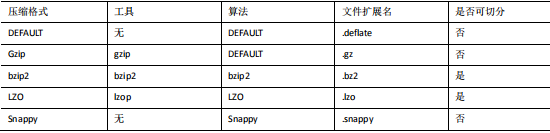
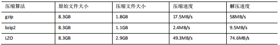
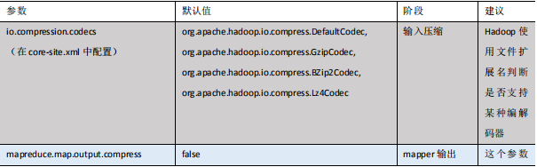
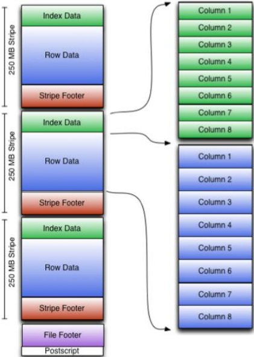
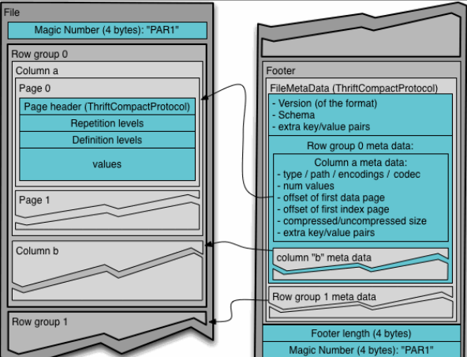
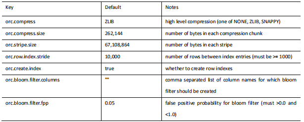

#  **压缩和存储**

## **8.1 Hadoop** **源码编译支持** **Snappy** **压缩**

### **8.1.1** **资源准备**

1．CentOS 联网 

配置 CentOS 能连接外网。Linux 虚拟机 ping www.baidu.com 是畅通的 

注意：采用 root 角色编译，减少文件夹权限出现问题 

2．jar 包准备(hadoop 源码、JDK8 、maven、protobuf) 

（1）hadoop-2.7.2-src.tar.gz 

（2）jdk-8u144-linux-x64.tar.gz 

（3）snappy-1.1.3.tar.gz 

（4）apache-maven-3.0.5-bin.tar.gz 

（5）protobuf-2.5.0.tar.gz


### **8.1.2 jar** **包安装**

**注意：所有操作必须在 root 用户下完成**


1．JDK 解压、配置环境变量 JAVA_HOME 和 PATH，验证 java-version(如下都需 

要验证是否配置成功)

验证命令：java -version

2．Maven 解压、配置 MAVEN_HOME 和 PATH

验证命令：mvn -version


### **8.1.3** **编译源码**

1．准备编译环境

```
[root@hadoop101 software]# yum install svn
[root@hadoop101 software]# yum install autoconf automake libtool 
cmake
[root@hadoop101 software]# yum install ncurses-devel
[root@hadoop101 software]# yum install openssl-devel
[root@hadoop101 software]# yum install gcc*
```


2．编译安装 snappy

```
[root@hadoop101 software]# tar -zxvf snappy-1.1.3.tar.gz -C 
/opt/module/
[root@hadoop101 module]# cd snappy-1.1.3/
[root@hadoop101 snappy-1.1.3]# ./configure
[root@hadoop101 snappy-1.1.3]# make
[root@hadoop101 snappy-1.1.3]# make install
# 查看 snappy 库文件
[root@hadoop101 snappy-1.1.3]# ls -lh /usr/local/lib |grep snappy
```

3．编译安装 protobuf

```
[root@hadoop101 software]# tar -zxvf protobuf-2.5.0.tar.gz -C 
/opt/module/
[root@hadoop101 module]# cd protobuf-2.5.0/
[root@hadoop101 protobuf-2.5.0]# ./configure
[root@hadoop101 protobuf-2.5.0]# make
[root@hadoop101 protobuf-2.5.0]# make install
# 查看 protobuf 版本以测试是否安装成功
[root@hadoop101 protobuf-2.5.0]# protoc --version
```

4．编译 hadoop native

```
[root@hadoop101 software]# tar -zxvf hadoop-2.7.2-src.tar.gz
[root@hadoop101 software]# cd hadoop-2.7.2-src/
[root@hadoop101 software]# mvn clean package -DskipTests 
-Pdist,native -Dtar -Dsnappy.lib=/usr/local/lib -Dbundle.snappy
```

执行成功后，/opt/software/hadoop-2.7.2-src/hadoop-dist/target/hadoop-2.7.2.tar.gz 即为新 

生成的支持 snappy 压缩的二进制安装包。 


在文件的/lib/native文件夹目录下的文件拷贝到hapoop/lib/native目录下

 前提需要进行停止服务

需要进行集群的文件分发


查看hadoop支持的压缩类型

```
hadoop checknative
```


## **8.2 Hadoop** **压缩配置**

### **8.2.1 MR** **支持的压缩编码**




为了支持多种压缩/解压缩算法，Hadoop 引入了编码/解码器


压缩性能的比较： 




http://google.github.io/snappy/ 

On a single core of a Core i7 processor in 64-bit mode, Snappy compresses at about 250  

MB/sec or more and decompresses at about 500 MB/sec or more. 


### **8.2.2** **压缩参数配置**

要在 Hadoop 中启用压缩，可以配置如下参数（mapred-site.xml 文件中）：





## **8.3** **开启** **Map** **输出阶段压缩**


开启 map 输出阶段压缩可以减少 job 中 map 和 Reduce task 间数据传输量。具体配置如下：


1．开启 hive 中间传输数据压缩功能

```
set hive.exec.compress.intermediate=true;
```


2．开启 mapreduce 中 map 输出压缩功能

```
set mapreduce.map.output.compress=true;
```


3．设置 mapreduce 中 map 输出数据的压缩方式

```
set mapreduce.map.output.compress.codec=
org.apache.hadoop.io.compress.SnappyCodec;
```


4．执行查询语句

```
 select count(ename) name from emp;
```


## **8.4** **开启** **Reduce** **输出阶段压缩**

当 Hive 将 输 出 写 入 到 表 中 时 ， 输 出 内 容 同 样 可 以 进 行 压 缩 。 属 性 

hive.exec.compress.output 控制着这个功能。用户可能需要保持默认设置文件中的默认值 

false，这样默认的输出就是非压缩的纯文本文件了。用户可以通过在查询语句或执行脚本中

设置这个值为 true，来开启输出结果压缩功能。


1．开启 hive 最终输出数据压缩功能

```
set hive.exec.compress.output=true;
```


2. 开启 mapreduce 最终输出数据压缩

```
set mapreduce.output.fileoutputformat.compress=true;
```


3．设置 mapreduce 最终数据输出压缩方式

```
set mapreduce.output.fileoutputformat.compress.codec =
org.apache.hadoop.io.compress.SnappyCodec;
```


4．设置 mapreduce 最终数据输出压缩为块压缩

```
set mapreduce.output.fileoutputformat.compress.type=BLOCK;
```


5．测试一下输出结果是否是压缩文件

```
insert overwrite local directory
'/opt/module/datas/distribute-result' select * from emp 
distribute by deptno sort by empno desc;
```


## **8.5** **文件存储格式**

Hive 支持的存储数的格式主要有：TEXTFILE 、SEQUENCEFILE、ORC、PARQUET。


### **8.5.1** **列式存储和行式存储**


列式存储和行式存储


所示左边为逻辑表，右边第一个为行式存储，第二个为列式存储。


**1．行存储的特点**

查询满足条件的一整行数据的时候，列存储则需要去每个聚集的字段找到对应的每个列 

的值，行存储只需要找到其中一个值，其余的值都在相邻地方，所以此时行存储查询的速度 

更快。


**2．列存储的特点**

因为每个字段的数据聚集存储，在查询只需要少数几个字段的时候，能大大减少读取的 

数据量；每个字段的数据类型一定是相同的，列式存储可以针对性的设计更好的设计压缩算 

法。


**TEXTFILE 和 SEQUENCEFILE 的存储格式都是基于行存储的；** 

**ORC 和 PARQUET 是基于列式存储的。**


###  **8.5.2 TextFile** **格式**

默认格式，数据不做压缩，磁盘开销大，数据解析开销大。可结合 Gzip、Bzip2 使用， 

但使用 Gzip 这种方式，hive 不会对数据进行切分，从而无法对数据进行并行操作。 


### **8.5.3 Orc** **格式**

Orc (Optimized Row Columnar)是 Hive 0.11 版里引入的新的存储格式。 

如图 所示可以看到每个 Orc 文件由 1 个或多个 stripe 组成，每个 stripe250MB 大小， 

这个 Stripe 实际相当于 RowGroup 概念，不过大小由 4MB->250MB，这样应该能提升顺序 

读的吞吐率。每个 Stripe 里有三部分组成，分别是 Index Data，Row Data，Stripe Footer： 





1）Index Data：一个轻量级的 index，默认是**每隔 1W 行做一个索引**。这里做的索引应 

该只是记录某行的各字段在 Row Data 中的 offset。 


2）Row Data：存的是具体的数据，先取部分行，然后对这些行按列进行存储。对每个 

列进行了编码，分成多个 Stream 来存储。 


3）Stripe Footer：存的是各个 Stream 的类型，长度等信息。 

每个文件有一个 File Footer，这里面存的是每个 Stripe 的行数，每个 Column 的数据类型 

信息等；每个文件的尾部是一个PostScript，这里面记录了整个文件的压缩类型以及FileFooter 

的长度信息等。在读取文件时，会 seek 到文件尾部读 PostScript，从里面解析到 File Footer 

长度，再读 FileFooter，从里面解析到各个 Stripe 信息，再读各个 Stripe，即从后往前读。 


### **8.5.4 Parquet** **格式**

Parquet 是面向分析型业务的列式存储格式，由 Twitter 和 Cloudera 合作开发，2015 年 5 

月从 Apache 的孵化器里毕业成为 Apache 顶级项目。 

Parquet 文件是以二进制方式存储的，所以是不可以直接读取的，文件中包括该文件的数 

据和元数据，**因此 Parquet 格式文件是自解析的**。 

通常情况下，在存储 Parquet 数据的时候会按照 Block 大小设置行组的大小，由于一般 

情况下每一个 Mapper 任务处理数据的最小单位是一个 Block，这样可以把**每一个行组由一** 

**个 Mapper 任务处理，增大任务执行并行度**。





上图展示了一个 Parquet 文件的内容，一个文件中可以存储多个行组，文件的首位都是 

该文件的 Magic Code，用于校验它是否是一个 Parquet 文件，Footer length 记录了文件元数 

据的大小，通过该值和文件长度可以计算出元数据的偏移量，文件的元数据中包括每一个行 

组的元数据信息和该文件存储数据的 Schema 信息。除了文件中每一个行组的元数据，每一

页的开始都会存储该页的元数据，在 Parquet 中，有三种类型的页：**数据页、字典页和索引** 

**页**。数据页用于存储当前行组中该列的值，字典页存储该列值的编码字典，每一个列块中最 

多包含一个字典页，索引页用来存储当前行组下该列的索引，目前 Parquet 中还不支持索引


### **8.5.5** **主流文件存储格式对比实验**


1. 测试数据


2．TextFile 

（1）创建表，存储数据格式为 TEXTFILE

```
create table log_text (
track_time string,
url string,
session_id string,
referer string,
ip string,
end_user_id string,
city_id string
)
row format delimited fields terminated by '\t'
stored as textfile;
```

**stored as textfile;**


（2）向表中加载数据

```
load data local inpath 
'/opt/module/datas/log.data' into table log_text ;
```

（3）查看表中数据大小

```
dfs -du -h /user/hive/warehouse/log_text;
```

**18.1 M** /user/hive/warehouse/log_text/log.data


3．ORC

（1）创建表，存储数据格式为 ORC

```
create table log_orc(
track_time string,
url string,
session_id string,
referer string,
ip string,
end_user_id string,
city_id string
)
row format delimited fields terminated by '\t'
stored as orc ;
```

**stored as orc ;**


（2）向表中加载数据

```
 insert into table log_orc select * from 
log_text ;
```


（3）查看表中数据大小

```
dfs -du -h /user/hive/warehouse/log_orc/ ;
```

**2.8 M** /user/hive/warehouse/log_orc/000000_0


4．Parquet

（1）创建表，存储数据格式为 parquet

```
create table log_parquet(
track_time string,
url string,
session_id string,
referer string,
ip string,
end_user_id string,
city_id string
)
row format delimited fields terminated by '\t'
stored as parquet ;
```

**stored as parquet ;**


（2）向表中加载数据 

```
hive (default)> insert into table log_parquet select * from 
log_text ;
```


（3）查看表中数据大小

```
hive (default)> dfs -du -h 
/user/hive/warehouse/log_parquet/ ;
```

**13.1 M** /user/hive/warehouse/log_parquet/000000_0


存储文件的压缩比总结： 

**ORC > Parquet > textFile**


**存储文件的查询速度测试：**

存储文件的查询速度总结：**查询速度相近**。


## **8.6** **存储和压缩结合**

### **8.6.1** **修改** **Hadoop** **集群具有** **Snappy** **压缩方式**

1．查看 hadoop checknative 命令使用

```
 hadoop
checknative [-a|-h] check native hadoop and 
compression libraries availability
```


2．查看 hadoop 支持的压缩方式

```
[root@hadoop104 hadoop-2.7.2]$ hadoop checknative
17/12/24 20:32:52 WARN bzip2.Bzip2Factory: Failed to 
load/initialize native-bzip2 library system-native, will use 
pure-Java version
17/12/24 20:32:52 INFO zlib.ZlibFactory: Successfully loaded &
initialized native-zlib library
Native library checking:
hadoop: true 
/opt/module/hadoop-2.7.2/lib/native/libhadoop.so
zlib: true /lib64/libz.so.1
snappy: false 
lz4: true revision:99
bzip2: false
```


3．将编译好的支持 Snappy 压缩的 hadoop-2.7.2.tar.gz 包导入到 hadoop102 的 

/opt/software 中 


4．解压 hadoop-2.7.2.tar.gz 到当前路径

```
 tar -zxvf hadoop-2.7.2.tar.gz
```


5．进入到/opt/software/hadoop-2.7.2/lib/native 路径可以看到支持 Snappy 压缩的 

动态链接库 

```
[root@hadoop102 native]$ pwd
/opt/software/hadoop-2.7.2/lib/native
[atguigu@hadoop102 native]$ ll
```

```
-rw-r--r--. 1 atguigu atguigu 472950 9 月 1 10:19 libsnappy.a
-rwxr-xr-x. 1 atguigu atguigu 955 9 月 1 10:19 libsnappy.la
lrwxrwxrwx. 1 atguigu atguigu 18 12 月 24 20:39 libsnappy.so -> libsnappy.so.1.3.0
lrwxrwxrwx. 1 atguigu atguigu 18 12 月 24 20:39 libsnappy.so.1 -> libsnappy.so.1.3.0
-rwxr-xr-x. 1 atguigu atguigu 228177 9 月 1 10:19 libsnappy.so.1.3.0
```


6．拷贝/opt/software/hadoop-2.7.2/lib/native 里面的所有内容到开发集群的 

/opt/module/hadoop-2.7.2/lib/native 路径上

```
cp ../native/* 
/opt/module/hadoop-2.7.2/lib/native/
```


7．分发集群

```
 hadoop checknative
17/12/24 20:45:02 WARN bzip2.Bzip2Factory: Failed to 
load/initialize native-bzip2 library system-native, will use
pure-Java version
17/12/24 20:45:02 INFO zlib.ZlibFactory: Successfully loaded & 
initialized native-zlib library
Native library checking:
hadoop: true 
/opt/module/hadoop-2.7.2/lib/native/libhadoop.so
zlib: true /lib64/libz.so.1
snappy: true 
/opt/module/hadoop-2.7.2/lib/native/libsnappy.so.1
lz4: true revision:99
bzip2: false
```


9．重新启动 hadoop 集群和 hive


### **8.6.2** **测试存储和压缩**

官网：https://cwiki.apache.org/confluence/display/Hive/LanguageManual+ORC


ORC 存储方式的压缩：




1．创建一个非压缩的的 ORC 存储方式

（1）建表语句

```
create table log_orc_none(
track_time string,
url string,
session_id string,
referer string,
ip string,
end_user_id string,
city_id string
)
row format delimited fields terminated by '\t'
stored as orc tblproperties ("orc.compress"="NONE");
```

**stored as orc tblproperties ("orc.compress"="NONE");**


（2）插入数据 

```
hive (default)> insert into table log_orc_none select * from  

log_text ; 
```


（3）查看插入后数据

```
hive (default)> dfs -du -h 
/user/hive/warehouse/log_orc_none/;

```

**7.7 M** /user/hive/warehouse/log_orc_none/000000_0


2．创建一个 SNAPPY 压缩的 ORC 存储方式

（1）建表语句 

```
create table log_orc_snappy(
track_time string,
url string,
session_id string,
referer string,
ip string,
end_user_id string,
city_id string )
row format delimited fields terminated by '\t'
stored as orc tblproperties ("orc.compress"="SNAPPY");
```

**stored as orc tblproperties ("orc.compress"="SNAPPY");**


（2）插入数据 

```
hive (default)> insert into table log_orc_snappy select * from  

log_text ;
```


（3）查看插入后数据 

```
hive (default)> dfs -du -h  

/user/hive/warehouse/log_orc_snappy/ ; 
```

**3.8 M** /user/hive/warehouse/log_orc_snappy/000000_0


3．默认创建的 ORC 存储方式，导入数据后的大小为 

**2.8 M** /user/hive/warehouse/log_orc/000000_0 

比 Snappy 压缩的还小。原因是 orc 存储文件默认采用 **ZLIB 压缩。比 snappy 压缩的小**。


4．存储方式和压缩总结

**hive 表的数据存储格式一般选择：orc 或 parquet。压缩方式一** 

**般选择 snappy，lzo。** 


