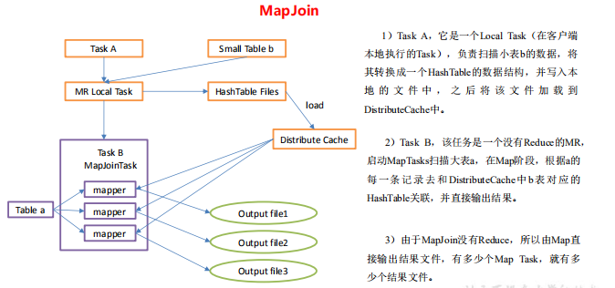

#  **企业级调优**

## **9.1 Fetch** **抓取**


Fetch 抓取是指，**Hive 中对某些情况的查询可以不必使用 MapReduce** 计算。


SELECT * FROM employees;在这种情况下

Hive 可以简单地读取 employee 对应的存储目录 

下的文件，然后输出查询结果到控制台。


在 hive-default.xml.template 文件中 hive.fetch.task.conversion 默认是 more

老版本 hive 默认是 **minimal**，该**属性修改为 more 以后，在全局查找、字段查找、**

**limit 查找等都不走 mapreduce。**

```
<property>
<name>hive.fetch.task.conversion</name>
<value>more</value>

<description>
Expects one of [none, minimal, more].
Some select queries can be converted to single FETCH task 
minimizing latency.
Currently the query should be single sourced not having any 
subquery and should not have
any aggregations or distincts (which incurs RS), lateral views 
and joins.
0. none : disable hive.fetch.task.conversion
1. minimal : SELECT STAR, FILTER on partition columns, LIMIT 
only
2. more : SELECT, FILTER, LIMIT only (support TABLESAMPLE and 
virtual columns)
</description>
</property>
```

0. none : disable hive.fetch.task.conversion
1. minimal : SELECT STAR, FILTER on partition columns, LIMIT only
2. more : SELECT, FILTER, LIMIT only (support TABLESAMPLE and virtual columns)


1）把 hive.fetch.task.conversion 设置成 none，然后执行查询语句，都会执行 mapreduce 程序。

```
hive (default)> set hive.fetch.task.conversion=none;
hive (default)> select * from emp;
hive (default)> select ename from emp;
hive (default)> select ename from emp limit 3;
```


2）把 hive.fetch.task.conversion 设置成 more，然后执行查询语句，如下查询方式都不会 

执行 mapreduce 程序。 

```
hive (default)> set hive.fetch.task.conversion=more;
hive (default)> select * from emp;
hive (default)> select ename from emp;
hive (default)> select ename from emp limit 3;
```


## **9.2** **本地模式**


大多数的 Hadoop Job 是需要 Hadoop 提供的完整的可扩展性来处理大数据集的。不过， 

**有时 Hive 的输入数据量是非常小的**。在这种情况下，为查询触发执行任务消耗的时间可能 

会比实际 job 的执行时间要多的多。


对于大多数这种情况，**Hive 可以通过本地模式在单台机** 

**器上处理所有的任务。对于小数据集，执行时间可以明显被缩短。**


用户可以通过设置 hive.exec.mode.local.auto 的值为 true，来让 Hive 在适当的时候自动 

启动这个优化。

```
set hive.exec.mode.local.auto=true; //开启本地 mr
//设置 local mr 的最大输入数据量，当输入数据量小于这个值时采用 local mr 的
方式，默认为 134217728，即 128M
set hive.exec.mode.local.auto.inputbytes.max=50000000;
//设置 local mr 的最大输入文件个数，当输入文件个数小于这个值时采用 local mr
的方式，默认为 4
set hive.exec.mode.local.auto.input.files.max=10;
```


1）开启本地模式，并执行查询语句 

```
hive (default)> set hive.exec.mode.local.auto=true;
hive (default)> select * from emp cluster by deptno;
Time taken: 1.328 seconds, Fetched: 14 row(s)
```

2）关闭本地模式，并执行查询语句

```
hive (default)> set hive.exec.mode.local.auto=false;
hive (default)> select * from emp cluster by deptno;
Time taken: 20.09 seconds, Fetched: 14 row(s)
```


## **9.3** **表的优化**


### **9.3.1** **小表、大表** **Join**


将 key 相对分散，并且数据量小的表放在 join 的左边，这样可以有效减少内存溢出错误 

发生的几率；再进一步，可以使用 map join 让小的维度表（1000 条以下的记录条数）先进 

内存。在 map 端完成 reduce


**新版的 hive 已经对小表 JOIN 大表和大表 JOIN 小表进行了优化。小表** 

**放在左边和右边已经没有明显区别。**


**案例实操** 

1．需求 

测试大表 JOIN 小表和小表 JOIN 大表的效率 

2．建大表、小表和 JOIN 后表的语句 

```
// 创建大表
create table bigtable(id bigint, time bigint, uid string, 
keyword string, url_rank int, click_num int, click_url string)
row format delimited fields terminated by '\t';
```

```
// 创建小表
create table smalltable(id bigint, time bigint, uid string, 
keyword string, url_rank int, click_num int, click_url string) 
row format delimited fields terminated by '\t';
```

```
// 创建 join 后表的语句
create table jointable(id bigint, time bigint, uid string, 
keyword string, url_rank int, click_num int, click_url string) 
row format delimited fields terminated by '\t';
```


3．分别向大表和小表中导入数据

```
hive (default)> load data local inpath 
'/opt/module/data/bigtable' into table bigtable;

hive (default)>load data local inpath 
'/opt/module/data/smalltable' into table smalltable;
```


4．关闭 mapjoin 功能（默认是打开的）

```
set hive.auto.convert.join = false;
```


5．执行小表 JOIN 大表语句

```
insert overwrite table jointable
select b.id, b.time, b.uid, b.keyword, b.url_rank, b.click_num, 
b.click_url
from smalltable s
left join bigtable b
on b.id = s.id;
```

Time taken: 35.921 seconds 

Time taken: 43.152 seconds 


6．执行大表 JOIN 小表语句

```
insert overwrite table jointable
select b.id, b.time, b.uid, b.keyword, b.url_rank, b.click_num,
b.click_url
from bigtable b
left join smalltable s
on s.id = b.id;
```

Time taken: 34.196 seconds 

Time taken: 40.807 seconds 


### **9.3.2** **大表** **Join** **大表**

1．空 KEY 过滤

有时 join 超时是因为某些 key 对应的数据太多，而相同 key 对应的数据都会发送到相同 

的 reducer 上，从而导致内存不够。此时我们应该仔细分析这些异常的 key，很多情况下， 

这些 key 对应的数据是异常数据，我们需要在 SQL 语句中进行过滤。


案例实操 

（1）配置历史服务器

配置 mapred-site.xml

```
<property>
<name>mapreduce.jobhistory.address</name>
<value>hadoop102:10020</value>
</property>
<property>
<name>mapreduce.jobhistory.webapp.address</name>
<value>hadoop102:19888</value>
</property>
```

启动历史服务器

```
sbin/mr-jobhistory-daemon.sh start historyserver
```

查看 jobhistory 

http://hadoop102:19888/jobhistory


（2）创建原始数据表、空 id 表、合并后数据表

```
// 创建原始表
create table ori(id bigint, time bigint, uid string, keyword 
string, url_rank int, click_num int, click_url string) row 
format delimited fields terminated by '\t';
```

```
// 创建空 id 表
create table nullidtable(id bigint, time bigint, uid string, 
keyword string, url_rank int, click_num int, click_url string) 
row format delimited fields terminated by '\t';
```

```
// 创建 join 后表的语句
create table jointable(id bigint, time bigint, uid string, 
keyword string, url_rank int, click_num int, click_url string) 
row format delimited fields terminated by '\t';
```


（3）分别加载原始数据和空 id 数据到对应表中

```
hive (default)> load data local inpath '/opt/module/datas/
SogouQ1.txt' into table ori;

hive (default)> load data local inpath '/opt/module/data/nullid' 
into table nullidtable;
```


（4）测试不过滤空 id

```
 insert overwrite table jointable 
select n.* from nullidtable n left join ori o on n.id = o.id;
```

Time taken: 42.038 seconds 

Time taken: 37.284 seconds 

Time taken: 41.743 seconds 


（5）测试过滤空 id

```
 insert overwrite table jointable 
select n.* from (select * from nullidtable where id is not null ) 
n left join ori o on n.id = o.id;
```

Time taken: 31.725 seconds 

Time taken: 28.876 seconds 

Time taken: 33.29 seconds


2．空 key 转换

有时虽然某个 key 为空对应的数据很多，但是相应的数据不是异常数据，必须要包含在 

join 的结果中，此时我们可以表 a 中 key 为空的字段赋一个随机的值，使得数据随机均匀地 

分不到不同的 reducer 上。


**不随机分布空** **null** **值：** 

（1）设置 5 个 reduce 个数 

```
set mapreduce.job.reduces = 5;
```


（2）JOIN 两张表

insert overwrite table jointable 

select n.* from nullidtable n left join ori b on n.id = b.id;


**结果：如图** **，出现了数据倾斜，某些** **reducer** **的资源消耗远大** 

**于其他** **reducer**。


**随机分布空 null 值** 

（1）设置 5 个 reduce 个数 

set mapreduce.job.reduces = 5; 


（2）JOIN 两张表

```
insert overwrite table jointable
select n.* from nullidtable n full join ori o on 
case when n.id is null then concat('hive', rand()) else n.id end 
= o.id;
```


**结果：消除了数据倾斜，负载均衡** **reducer** **的资源消耗**


### **9.3.3 MapJoin**


如果不指定 MapJoin 或者不符合 MapJoin 的条件，那么 Hive 解析器会将 Join 操作转换 

成 Common Join，即：在 Reduce 阶段完成 join。容易发生数据倾斜。可以用 MapJoin 把小 

表全部加载到内存在 map 端进行 join，避免 reducer 处理。


1．开启 MapJoin 参数设置

（1）设置自动选择 MapJoin

```
set hive.auto.convert.join = true; 默认为 true
```


（2）大表小表的阈值设置（默认 25M 一下认为是小表）：

```
set hive.mapjoin.smalltable.filesize=25000000;
```


2．MapJoin 工作机制




**案例实操：**

（1）开启 Mapjoin 功能

```
set hive.auto.convert.join = true; 默认为 true
```


（2）执行小表 JOIN 大表语句

```
insert overwrite table jointable
select b.id, b.time, b.uid, b.keyword, b.url_rank, 
b.click_num, b.click_url
from smalltable s
join bigtable b
on s.id = b.id;
```

Time taken: 24.594 seconds 

Time taken: 26.212 seconds 


（3）执行大表 JOIN 小表语句

```
insert overwrite table jointable
select b.id, b.time, b.uid, b.keyword, b.url_rank, 
b.click_num, b.click_url
from bigtable b
join smalltable s
on s.id = b.id;
```

Time taken: 24.315 seconds 

Time taken: 24.498 seconds


### **9.3.4 Group By**

默认情况下，Map 阶段同一 Key 数据分发给一个 reduce，当一个 key 数据过大时就倾 

斜了。

并不是所有的聚合操作都需要在 Reduce 端完成，很多聚合操作都可以先在 Map 端进行 

部分聚合，最后在 Reduce 端得出最终结果。


1．开启 Map 端聚合参数设置 

（1）是否在 Map 端进行聚合，默认为 True

```
hive.map.aggr = true
```

（2）在 Map 端进行聚合操作的条目数目

```
hive.groupby.mapaggr.checkinterval = 100000
```

（3）有数据倾斜的时候进行负载均衡（默认是 false）

```
hive.groupby.skewindata = true
```

当选项设定为 true，生成的查询计划会有两个 MR Job。第一个 MR Job 中，Map 的输 

出结果会随机分布到 Reduce 中，每个 Reduce 做部分聚合操作，并输出结果，这样处理的结 

果是相同的 Group By Key 有可能被分发到不同的 Reduce 中，从而达到负载均衡的目的；第 

二个 MR Job 再根据预处理的数据结果按照 Group By Key 分布到 Reduce 中（这个过程可以 

保证相同的 Group By Key 被分布到同一个 Reduce 中），最后完成最终的聚合操作。


### **9.3.5 Count(Distinct)** **去重统计**

数据量小的时候无所谓，数据量大的情况下，由于 COUNT DISTINCT 操作需要用一个 

Reduce Task 来完成，这一个 Reduce 需要处理的数据量太大，就会导致整个 Job 很难完成， 

一般 COUNT DISTINCT 使用先 GROUP BY 再 COUNT 的方式替换： 


**案例实操** 

1．创建一张大表 

```
hive (default)> create table bigtable(id bigint, time bigint, 
uid string, keyword
string, url_rank int, click_num int, click_url string) row format 
delimited
fields terminated by '\t';
```


2．加载数据

```
hive (default)> load data local inpath 
'/opt/module/datas/bigtable' into table
bigtable;
```


3．设置 5 个 reduce 个数

```
set mapreduce.job.reduces = 5;
```


4．执行去重 id 查询

```
hive (default)> select count(distinct id) from bigtable;
Stage-Stage-1: Map: 1 Reduce: 1 Cumulative CPU: 7.12 sec 
HDFS Read: 120741990 HDFS Write: 7 SUCCESS
Total MapReduce CPU Time Spent: 7 seconds 120 msec
OK
c0
100001
Time taken: 23.607 seconds, Fetched: 1 row(s)
Time taken: 39.753 seconds, Fetched: 1 row(s)
```


5．采用 GROUP by 去重 id

```
hive (default)> select count(id) from (select id from bigtable
group by id) a;
Stage-Stage-1: Map: 1 Reduce: 5 Cumulative CPU: 17.53 sec 
HDFS Read: 120752703 HDFS Write: 580 SUCCESS
Stage-Stage-2: Map: 1 Reduce: 1 Cumulative CPU: 4.29 sec 
HDFS Read: 9409 HDFS Write: 7 SUCCESS
Total MapReduce CPU Time Spent: 21 seconds 820 msec
OK
_c0
100001
Time taken: 50.795 seconds, Fetched: 1 row(s)
Time taken: 63.108 seconds, Fetched: 1 row(s)
```

**虽然会多用一个 Job 来完成，但在数据量大的情况下，这个绝对是值得的。**


### **9.3.6** **笛卡尔积**

尽量避免笛卡尔积，join 的时候不加 on 条件，或者无效的 on 条件，Hive 只能使用 1 

个 reducer 来完成笛卡尔积。


### **9.3.7** **行列过滤**

**列处理**：在 SELECT 中，只拿需要的列，如果有，尽量使用分区过滤，少用 SELECT *。 

**行处理**：在分区剪裁中，当使用外关联时，如果将副表的过滤条件写在 Where 后面， 

那么就会先全表关联，之后再过滤，


1．测试先关联两张表，再用 where 条件过滤

```
select o.id from bigtable b
join ori o on o.id = b.id
where o.id <= 10;
```


2．通过子查询后，再关联表

```
select b.id from bigtable b
join (select id from ori where id <= 10 ) o on b.id = o.id;
```


### **9.3.8** **动态分区调整**


关系型数据库中，对分区表 Insert 数据时候，数据库自动会根据分区字段的值，将数据 

插入到相应的分区中，Hive 中也提供了类似的机制，即动态分区(Dynamic Partition)，只不 

过，使用 Hive 的动态分区，需要进行相应的配置。


1．开启动态分区参数设置

（1）开启动态分区功能（默认 true，开启）

```
hive.exec.dynamic.partition=true
```

（2）设置为非严格模式（动态分区的模式，默认 strict，表示必须指定至少一个分区为 

静态分区，nonstrict 模式表示允许所有的分区字段都可以使用动态分区。）

```
hive.exec.dynamic.partition.mode=nonstrict
```


（3）在所有执行 MR 的节点上，最大一共可以创建多少个动态分区。

```
hive.exec.max.dynamic.partitions=1000
```


（4）在每个执行 MR 的节点上，最大可以创建多少个动态分区。该参数需要根据实际 

的数据来设定。比如：源数据中包含了一年的数据，即 day 字段有 365 个值，那么该参数就 

需要设置成大于 365，如果使用默认值 100，则会报错。 

```
hive.exec.max.dynamic.partitions.pernode=100
```


（5）整个 MR Job 中，最大可以创建多少个 HDFS 文件。

```
hive.exec.max.created.files=100000
```


（6）当有空分区生成时，是否抛出异常。一般不需要设置。

```
hive.error.on.empty.partition=false
```


2．案例实操 

需求：将 ori 中的数据按照时间(如：20111230000008)，插入到目标表 ori_partitioned_target 

的相应分区中。 

（1）创建分区表

```
create table ori_partitioned(id bigint, time bigint, uid 
string, keyword string,
url_rank int, click_num int, click_url string) 
partitioned by (p_time bigint) 
row format delimited fields terminated by '\t';
```


（2）加载数据到分区表中

```
hive (default)> load data local inpath '/home/atguigu/ds1' into 
table
ori_partitioned partition(p_time='20111230000010') ;
hive (default)> load data local inpath '/home/atguigu/ds2' into 
table ori_partitioned partition(p_time='20111230000011') ;
```


（3）创建目标分区表

```
create table ori_partitioned_target(id bigint, time bigint, 
uid string,
keyword string, url_rank int, click_num int, click_url string) 
PARTITIONED BY (p_time STRING) row format delimited fields 
terminated by '\t';
```


（4）设置动态分区

```
set hive.exec.dynamic.partition = true;
set hive.exec.dynamic.partition.mode = nonstrict;
set hive.exec.max.dynamic.partitions = 1000;
set hive.exec.max.dynamic.partitions.pernode = 100;
set hive.exec.max.created.files = 100000;
set hive.error.on.empty.partition = false;
hive (default)> insert overwrite table ori_partitioned_target 
partition (p_time) 
select id, time, uid, keyword, url_rank, click_num, click_url, 
p_time from ori_partitioned;
```


（6）查看目标分区表的分区情况

```
 show partitions ori_partitioned_target;
```


## **9.4 MR** **优化**

### **9.4.1** **合理设置** **Map** **数** 

**1**）通常情况下，作业会通过 **input** **的目录产生一个或者多个** **map** **任务。**

主要的决定因素有：input 的文件总个数，input 的文件大小，集群设置的文件块大小。


**2**）是不是map **数越多越好？**\

答案是否定的。如果一个任务有很多小文件（远远小于块大小 128m），则每个小文件 

也会被当做一个块，用一个 map 任务来完成，而一个 map 任务启动和初始化的时间远远大 

于逻辑处理的时间，就会造成很大的资源浪费。而且，同时可执行的 map 数是受限的。 


**3**）是不是保证每个 **map** **处理接近** **128m** **的文件块，就高枕无忧了？**

答案也是不一定。比如有一个 127m 的文件，正常会用一个 map 去完成，但这个文件只 

有一个或者两个小字段，却有几千万的记录，如果 map 处理的逻辑比较复杂，用一个 map 

任务去做，肯定也比较耗时。


**问题 2 和 3，我们需要采取两种方式来解决：即减少 map 数和增加 map 数；**


### **9.4.2** **小文件进行合并**

在 map 执行前合并小文件，减少 map 数：CombineHiveInputFormat 具有对小文件进行 

合并的功能（系统默认的格式）。HiveInputFormat 没有对小文件合并功能。

```
set hive.input.format= 
org.apache.hadoop.hive.ql.io.CombineHiveInputFormat;
```


### **9.4.3** **复杂文件增加** **Map** **数** 

当 input 的文件都很大，任务逻辑复杂，map 执行非常慢的时候，可以考虑增加 Map 

数，来使得每个 map 处理的数据量减少，从而提高任务的执行效率。 

增加 map 的方法为：根据 

computeSliteSize(Math.max(minSize,Math.min(maxSize,blocksize)))=blocksize=128M 公式，调 

整 maxSize 最大值。让 maxSize 最大值低于 blocksize 就可以增加 map 的个数。 


1．执行查询 

hive (default)> select count(*) from emp; 

2．设置最大切片值为 100 个字节 

hive (default)> set  

mapreduce.input.fileinputformat.split.maxsize=100; 

hive (default)> select count(*) from emp; 


### **9.4.4** **合理设置** **Reduce** **数**


1．调整 reduce 个数方法一 

（1）每个 Reduce 处理的数据量默认是 256MB 

hive.exec.reducers.bytes.per.reducer=256000000 

（2）每个任务最大的 reduce 数，默认为 1009 

hive.exec.reducers.max=1009 

（3）计算 reducer 数的公式 

N=min(参数 2，总输入数据量/参数 1) 


2．调整 reduce 个数方法二 

在 hadoop 的 mapred-default.xml 文件中修改 

设置每个 job 的 Reduce 个数 

set mapreduce.job.reduces = 15; 


3．reduce 个数并不是越多越好 

1）过多的启动和初始化 reduce 也会消耗时间和资源； 

2）另外，有多少个 reduce，就会有多少个输出文件，如果生成了很多个小文件，那么 

如果这些小文件作为下一个任务的输入，则也会出现小文件过多的问题；

 

在设置 reduce 个数的时候也需要考虑这两个原则：**处理大数据量利用合适的 reduce 数；** 

**使单个 reduce 任务处理数据量大小要合适；**


## **9.5** **并行执行**

Hive 会将一个查询转化成一个或者多个阶段。这样的阶段可以是 MapReduce 阶段、抽 

样阶段、合并阶段、limit 阶段。或者 Hive 执行过程中可能需要的其他阶段。默认情况下， 

Hive 一次只会执行一个阶段。不过，某个特定的 job 可能包含众多的阶段，而这些阶段可能 

并非完全互相依赖的，也就是说有些阶段是可以并行执行的，这样可能使得整个 job 的执行 

时间缩短。不过，如果有更多的阶段可以并行执行，那么 job 可能就越快完成。 


通过设置参数 hive.exec.parallel 值为 true，就可以开启并发执行。不过，在共享集群中， 

需要注意下，如果 job 中并行阶段增多，那么集群利用率就会增加。 


```
set hive.exec.parallel=true; //打开任务并行执行
set hive.exec.parallel.thread.number=16; //同一个 sql 允许最大并行度，
默认为 8。
```

在系统资源比较空闲的时候才有优势，否则，没资源，并行也起不来。


## **9.6** **严格模式**

Hive 提供了一个严格模式，可以防止用户执行那些可能意想不到的不好的影响的查询。 

通过设置属性 hive.mapred.mode 值为默认是非严格模式 **nonstrict** 。开启严格模式需要 

修改 hive.mapred.mode 值为 strict，开启严格模式可以禁止 3 种类型的查询。

```
<property>
<name>hive.mapred.mode</name>
<value>strict</value>
<description>
The mode in which the Hive operations are being performed. 
In strict mode, some risky queries are not allowed to run. They 
include:
Cartesian Product.
No partition being picked up for a query.
Comparing bigints and strings.
Comparing bigints and doubles.
Orderby without limit.
</description>
</property>
```

1) 对于分区表，除非 where 语句中含有分区字段过滤条件来限制范围，否则不允许执行。 

换句话说，就是用户不允许扫描所有分区。进行这个限制的原因是，通常分区表都拥有 

非常大的数据集，而且数据增加迅速。没有进行分区限制的查询可能会消耗令人不可接 

受的巨大资源来处理这个表。 

2) 对于使用了 order by 语句的查询，要求必须使用 limit 语句。因为 order by 为了执行排 

序过程会将所有的结果数据分发到同一个 Reducer 中进行处理，强制要求用户增加这个 

LIMIT 语句可以防止 Reducer 额外执行很长一段时间。 

3) 限制笛卡尔积的查询。对关系型数据库非常了解的用户可能期望在执行 JOIN 查询的时 

候不使用 ON 语句而是使用 where 语句，这样关系数据库的执行优化器就可以高效地将 

WHERE 语句转化成那个 ON 语句。不幸的是，Hive 并不会执行这种优化，因此，如果 

表足够大，那么这个查询就会出现不可控的情况。 


##  **9.7 JVM** **重用**


JVM 重用是 Hadoop 调优参数的内容，其对 Hive 的性能具有非常大的影响，特别是对 

于很难避免小文件的场景或 task 特别多的场景，这类场景大多数执行时间都很短。 


Hadoop 的默认配置通常是使用派生 JVM 来执行 map 和 Reduce 任务的。这时 JVM 的 

启动过程可能会造成相当大的开销，尤其是执行的 job 包含有成百上千 task任务的情况。JVM 

重用可以使得 JVM 实例在同一个 job 中重新使用 N 次。N 的值可以在 Hadoop 的

mapred-site.xml 文件中进行配置。通常在 10-20 之间，具体多少需要根据具体业务场景测试 

得出。 

```
<property>
<name>mapreduce.job.jvm.numtasks</name>
<value>10</value>
<description>How many tasks to run per jvm. If set to -1, there is
no limit. 
</description>
</property>
```

这个功能的缺点是，开启 JVM 重用将一直占用使用到的 task 插槽，以便进行重用，直 

到任务完成后才能释放。如果某个“不平衡的”job 中有某几个 reduce task 执行的时间要比其 

他 Reduce task 消耗的时间多的多的话，那么保留的插槽就会一直空闲着却无法被其他的 job 

使用，直到所有的 task 都结束了才会释放。


## **9.8** **推测执行**

在分布式集群环境下，因为程序 Bug（包括 Hadoop 本身的 bug），负载不均衡或者资 

源分布不均等原因，会造成同一个作业的多个任务之间运行速度不一致，有些任务的运行速 

度可能明显慢于其他任务（比如一个作业的某个任务进度只有 50%，而其他所有任务已经 

运行完毕），则这些任务会拖慢作业的整体执行进度。为了避免这种情况发生，Hadoop 采 

用了推测执行（Speculative Execution）机制，它根据一定的法则推测出“拖后腿”的任务，并 

为这样的任务启动一个备份任务，让该任务与原始任务同时处理同一份数据，并最终选用最 

先成功运行完成任务的计算结果作为最终结果。 

设置开启推测执行参数：Hadoop 的 mapred-site.xml 文件中进行配置

```
<property>
<name>mapreduce.map.speculative</name>
<value>true</value>
<description>If true, then multiple instances of some map tasks 
may be executed in parallel.</description>
</property>
<property>
<name>mapreduce.reduce.speculative</name>
<value>true</value>
<description>If true, then multiple instances of some reduce tasks
may be executed in parallel.</description>
</property>
```

不过 hive 本身也提供了配置项来控制 reduce-side 的推测执行：

```
<property>
<name>hive.mapred.reduce.tasks.speculative.execution</name>
<value>true</value>
<description>Whether speculative execution for reducers should 
be turned on. </description>
</property>
```

关于调优这些推测执行变量，还很难给一个具体的建议。如果用户对于运行时的偏差非 

常敏感的话，那么可以将这些功能关闭掉。如果用户因为输入数据量很大而需要执行长时间 

的 map 或者 Reduce task 的话，那么启动推测执行造成的浪费是非常巨大大。 


## **9.9** **压缩**


## **9.10** **执行计划（**Explain**）** 

1．基本语法 

EXPLAIN [EXTENDED | DEPENDENCY | AUTHORIZATION] query 


2．案例实操 

（1）查看下面这条语句的执行计划 

hive (default)> explain select * from emp; 

hive (default)> explain select deptno, avg(sal) avg_sal from emp group  

by deptno; 

（2）查看详细执行计划 

hive (default)> explain extended select * from emp; 

hive (default)> explain extended select deptno, avg(sal) avg_sal from  

emp group by deptno; 


