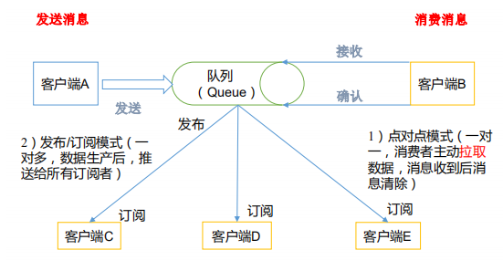
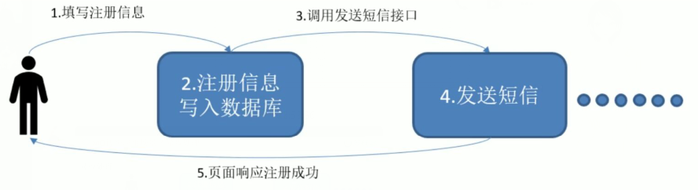
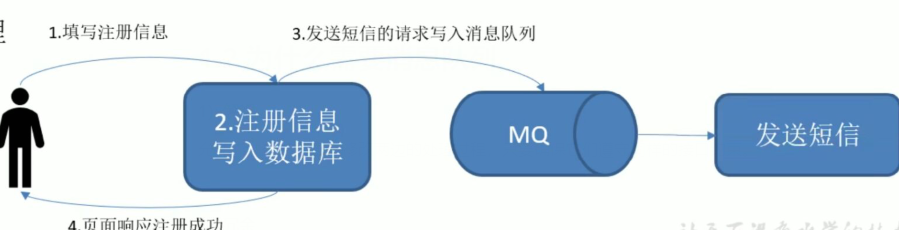
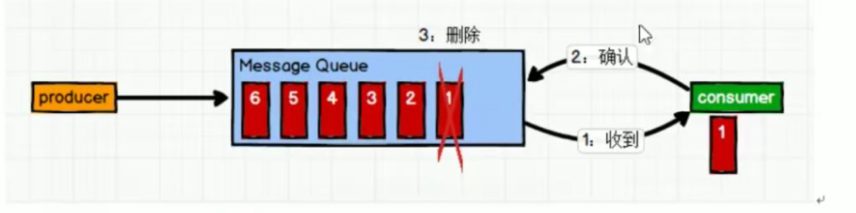
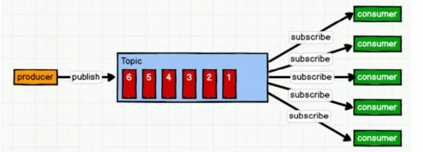
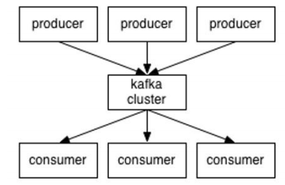
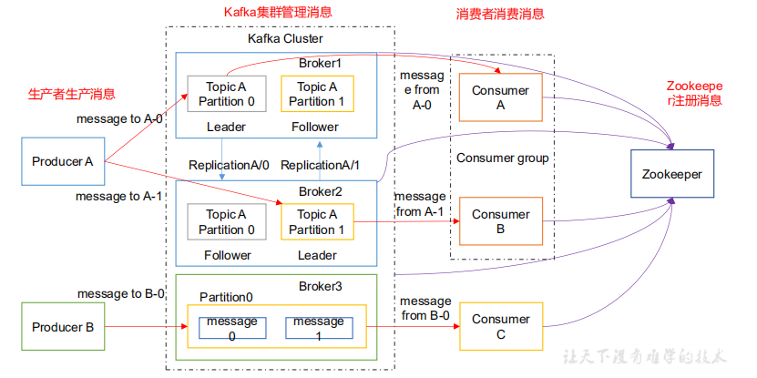

# **Kafka** **概述**

## **1.1** **消息队列**

消息队列内部实现原理

**为什么需要消息队列？**

1、解耦

2、冗余

3、扩展性

4、灵活性&峰值处理能力

5、可恢复性

6、顺序保证

7、缓冲

8、异步通信

### 1.2.1 传统场景异步处理

**同步处理**

两者同步一方进行业务的执行，另一方进行等待

**异步处理**

异步处理可以一方进行业务执行，在一段时间内另一方可以进行其他的业务，待时间到了之后

### 1.2.2 消息队列的两种模式

**（1）点对点模式**

**一对一**，消费者主动拉取数据，消息收到后消息清除

点对点模型通常是一个基于拉取或者轮询的消息传送模型，这种模型从队列中请求信息， 

而不是将消息推送到客户端。这个模型的特点是发送到队列的消息被一个且只有一个接收者 

接收处理，即使有多个消息监听者也是如此。 

**（2）发布/订阅模式**

**一对多**，数据生产后，推送给所有订阅者

发布订阅模型则是一个基于推送的消息传送模型。发布订阅模型可以有多种不同的订阅 

者，临时订阅者只在主动监听主题时才接收消息，而持久订阅者则监听主题的所有消息，即 

使当前订阅者不可用，处于离线状态。 

## **1.2** **为什么需要消息队列**

**1）解耦**

允许你独立的扩展或修改两边的处理过程，只要确保它们遵守同样的接口约束。

**2）冗余**

消息队列把数据进行持久化直到它们已经被完全处理，通过这一方式规避了数据丢失风 

险。许多消息队列所采用的"插入-获取-删除"范式中，在把一个消息从队列中删除之前，需 

要你的处理系统明确的指出该消息已经被处理完毕，从而确保你的数据被安全的保存直到你 

使用完毕。 

**3）扩展性**

因为消息队列解耦了你的处理过程，所以增大消息入队和处理的频率是很容易的，只要 

另外增加处理过程即可。 

**4）灵活性 & 峰值处理能力**

在访问量剧增的情况下，应用仍然需要继续发挥作用，但是这样的突发流量并不常见。 

如果为以能处理这类峰值访问为标准来投入资源随时待命无疑是巨大的浪费。使用消息队列 

能够使关键组件顶住突发的访问压力，而不会因为突发的超负荷的请求而完全崩溃。 

**5）可恢复性**

系统的一部分组件失效时，不会影响到整个系统。消息队列降低了进程间的耦合度，所 

以即使一个处理消息的进程挂掉，加入队列中的消息仍然可以在系统恢复后被处理。 

**6）顺序保证**

在大多使用场景下，数据处理的顺序都很重要。大部分消息队列本来就是排序的，并且 

能保证数据会按照特定的顺序来处理。（Kafka 保证一个 Partition 内的消息的有序性）

**7）缓冲**

有助于控制和优化数据流经过系统的速度，解决生产消息和消费消息的处理速度不一致 

的情况。 

8）异步通信

很多时候，用户不想也不需要立即处理消息。消息队列提供了异步处理机制，允许用户 

把一个消息放入队列，但并不立即处理它。想向队列中放入多少消息就放多少，然后在需要 

的时候再去处理它们。

## **1.3** **什么是** **Kafka**

在流式计算中，Kafka 一般用来缓存数据，Storm 通过消费 Kafka 的数据进行计算。

定义：

是一个分布式的基于**发布/订阅模式**的**消息**队列主要用于大数据实时数据处理

1）Apache Kafka 是一个开源**消息**系统，由 Scala 写成。是由 Apache 软件基金会开发的 

一个开源消息系统项目。

2）Kafka 最初是由 LinkedIn 公司开发，并于 2011 年初开源。2012 年 10 月从 Apache  

Incubator 毕业。该项目的目标是为处理实时数据提供一个统一、高通量、低等待的平台。

3）**Kafka** **是一个分布式消息队列。**Kafka 对消息保存时根据 Topic 进行归类，发送消息 

者称为 Producer，消息接受者称为 Consumer，此外 kafka 集群有多个 kafka 实例组成，每个 

实例(server)称为 broker。

4）无论是 kafka 集群，还是 consumer 都依赖于 **zookeeper** 集群保存一些 meta 信息，来 

保证系统可用性。 

## **1.4 Kafka** **架构**

**Kafka 整体架构图**

**Kafka架构**

1）Producer ：消息生产者，就是向 kafka broker 发消息的客户端； 

2）Consumer ：消息消费者，向 kafka broker 取消息的客户端； 

3）Topic ：可以理解为一个队列；

4）Consumer Group （CG）：这是kafka用来实现一个topic消息的广播（发给所有的consumer） 

和单播（发给任意一个 consumer）的手段。一个 topic 可以有多个 CG。topic 的消息会复制 

（不是真的复制，是概念上的）到所有的 CG，但每个 partion 只会把消息发给该 CG 中的一 

个 consumer。如果需要实现广播，只要每个 consumer 有一个独立的 CG 就可以了。要实现 

单播只要所有的 consumer 在同一个 CG。用 CG 还可以将 consumer 进行自由的分组而不需 

要多次发送消息到不同的 topic；

5）Broker ：一台 kafka 服务器就是一个 broker。一个集群由多个 broker 组成。一个 broker 

可以容纳多个 topic； 

6）Partition：为了实现扩展性，一个非常大的 topic 可以分布到多个 broker（即服务器）上， 

一个 topic 可以分为多个 partition，每个 partition 是一个有序的队列。partition 中的每条消息 

都会被分配一个有序的 id（offset）。kafka 只保证按一个 partition 中的顺序将消息发给 

consumer，不保证一个 topic 的整体（多个 partition 间）的顺序；

 

7）Offset：kafka 的存储文件都是按照 offset.kafka 来命名，用 offset 做名字的好处是方便查 

找。例如你想找位于 2049 的位置，只要找到 2048.kafka 的文件即可。当然 the first offset 就 

是 00000000000.kafka。 

