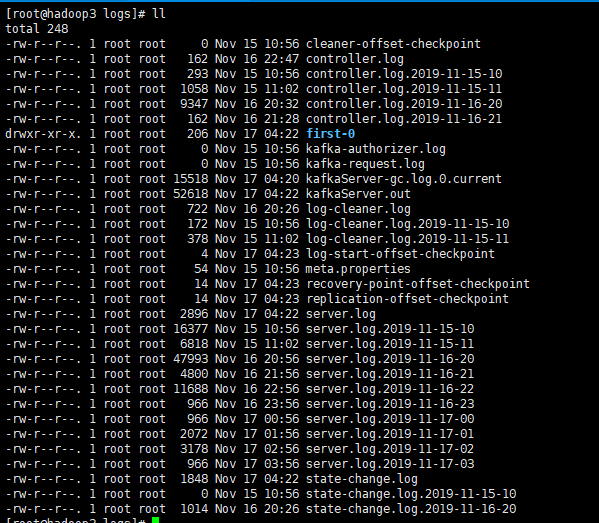

##  2.1、**jar** **包下载**

http://kafka.apache.org/downloads.html


## **2.2、Kafka** **集群部署**

1、**解压安装包**

```

[root@hadoop2 software]# tar -zxvf kafka_2.11-0.11.0.2.tgz  -C /opt/module/

```


**2、修改解压后的文件名称**

```
[root@hadoop2 module]# mv kafka_2.11-0.11.0.2/ kafka

```


**3、修改配置文件(**/opt/module/kafka/config)

server.properties


```
#broker 的全局唯一编号，不能重复
broker.id=0


#删除 topic 功能使能
delete.topic.enable=true


#处理网络请求的线程数量
num.network.threads=3


#用来处理磁盘 IO 的现成数量
num.io.threads=8


#发送套接字的缓冲区大小
socket.send.buffer.bytes=102400


#接收套接字的缓冲区大小
socket.receive.buffer.bytes=102400


#请求套接字的缓冲区大小
socket.request.max.bytes=104857600 

#kafka 运行日志存放的路径
log.dirs=/opt/module/kafka/logs

#topic 在当前 broker 上的分区个数
num.partitions=1


#用来恢复和清理 data 下数据的线程数量
num.recovery.threads.per.data.dir=1
```


**4、配置环境变量**

```
 vi /etc/profile
 
export KAFKA_HOME=/opt/module/kafka
export PATH=$PATH:$KAFKA_HOME/bin
 
```


**5、分发安装包**

```
xsync kafka/
```

注意：分发之后记得配置其他机器的环境变量


**6、 hadoop103 和 hadoop104 上修改配置文件**

/opt/module/kafka/config/server.properties   broker.id 不得重复

**broker.id=1、broker.id=2**


**7、启动机器上的zk服务**


**8、启动集群**

```
[root@hadoop2 kafka]# bin/kafka-server-start.sh  config/server.properties
```

是一种阻塞进程


此时可以加入一个-

**-daemon**参数进行作为守护进程启动

```
[root@hadoop2 kafka]# bin/kafka-server-start.sh -daemon  config/server.properties
```


使用jps

```
[root@hadoop2 kafka]# jps
1616 QuorumPeerMain
2180 Kafka
2247 Jps
```


**9、关闭集群**

```
 bin/kafka-server-stop.sh stop
```


## **2.3、Kafka** **命令行操作**


**1）查看当前服务器中的所有 topic**

```
bin/kafka-topics.sh --zookeeper hadoop2:2181 --list
```


**2）创建 topic**

```
[root@hadoop2 kafka]# bin/kafka-topics.sh --zookeeper hadoop2:2181 --create --replication-factor 2 --partitions 2 --topic first
Created topic "first".
```

选项说明： 

--topic 定义 topic 名 

--replication-factor 定义副本数 

--partitions 定义分区数 


**分区可以大于机数**

**副本书不能大于机数**


此时进入logs文件夹

hadoop2


hadoop3




hadoop4


```
drwxr-xr-x. 1 root root   206 Nov 17 04:22 first-0
drwxr-xr-x. 1 root root   206 Nov 17 04:22 first-1
```

此时又两个副本

0&1是分区号

存在磁盘（命名：主题+分区号）

其余的都是启动日志

如果启动有问题需要看server.log日志


**3）删除 topic**

```
[root@hadoop2 kafka]# bin/kafka-topics.sh  --zookeeper  hadoop2:2181 --delete --topic second
Error while executing topic command : Topic second does not exist on ZK path hadoop2:2181
[2019-11-17 04:29:48,052] ERROR java.lang.IllegalArgumentException: Topic second does not exist on ZK path hadoop2:2181
	at kafka.admin.TopicCommand$.deleteTopic(TopicCommand.scala:168)
	at kafka.admin.TopicCommand$.main(TopicCommand.scala:70)
	at kafka.admin.TopicCommand.main(TopicCommand.scala)
 (kafka.admin.TopicCommand$)
```

注意：

需要 server.properties 中设置 delete.topic.enable=true 否则只是标记删除或者直接重启。


**4）发送消息**

```
[root@hadoop2 kafka]# bin/kafka-console-producer.sh  --topic first --broker-list hadoop2:9092
```

主题+集群


**5）消费消息（1）**

监听是否有消息

```
[root@hadoop3 kafka]# bin/kafka-console-consumer.sh  --topic first hadoop2:2181
```


此时可以在发送信息的同时进行消费消息

**生产消息**

```
[root@hadoop2 kafka]# clear
[root@hadoop2 kafka]# bin/kafka-console-producer.sh  --topic first --broker-list hadoop2:9092
>hello kafka
>goo^H^H^H
>my gar^Hd
>

```

**消费消息**

```
[root@hadoop3 kafka]# bin/kafka-console-consumer.sh  --topic first --zookeeper hadoop2:2181
Using the ConsoleConsumer with old consumer is deprecated and will be removed in a future major release. Consider using the new consumer by passing [bootstrap-server] instead of [zookeeper].
hello kafka
goo
my gad

```


如果此时重新开启一个消费者无法已经被消费过的信息

此时可以使用参数(**-from-beginning**)进行从头开始消费(消费已经被其他机器消费的消息)

```
[root@hadoop4 kafka]# bin/kafka-console-consumer.sh  --topic first --zookeeper hadoop2:2181  --from-beginning
Using the ConsoleConsumer with old consumer is deprecated and will be removed in a future major release. Consider using the new consumer by passing [bootstrap-server] instead of [zookeeper].
goo
my
hello kafka
my gad
hello

```


**5、消费消息（2）**

也是可以进行消息的消费

bootstrap-server：会自动创建好主题

```
[root@hadoop3 kafka]# bin/kafka-console-consumer.sh  --topic first --bootstrap-server hadoop2:9092
hello kafka

```


此时法案先logs文件下下面（hadoop2）

```
[root@hadoop2 kafka]# ll logs/
total 584
-rw-r--r--. 1 root root     0 Nov 15 10:53 cleaner-offset-checkpoint
drwxr-xr-x. 1 root root   206 Nov 17 04:52 __consumer_offsets-0
drwxr-xr-x. 1 root root   206 Nov 17 04:52 __consumer_offsets-12
drwxr-xr-x. 1 root root   206 Nov 17 04:52 __consumer_offsets-15
drwxr-xr-x. 1 root root   206 Nov 17 04:52 __consumer_offsets-18
drwxr-xr-x. 1 root root   206 Nov 17 04:52 __consumer_offsets-21
drwxr-xr-x. 1 root root   206 Nov 17 04:52 __consumer_offsets-24
drwxr-xr-x. 1 root root   206 Nov 17 04:52 __consumer_offsets-27
drwxr-xr-x. 1 root root   206 Nov 17 04:52 __consumer_offsets-3
drwxr-xr-x. 1 root root   206 Nov 17 04:52 __consumer_offsets-30
drwxr-xr-x. 1 root root   206 Nov 17 04:52 __consumer_offsets-33
drwxr-xr-x. 1 root root   206 Nov 17 04:52 __consumer_offsets-36
drwxr-xr-x. 1 root root   206 Nov 17 04:52 __consumer_offsets-39
drwxr-xr-x. 1 root root   206 Nov 17 04:52 __consumer_offsets-42
drwxr-xr-x. 1 root root   206 Nov 17 04:52 __consumer_offsets-45
drwxr-xr-x. 1 root root   206 Nov 17 04:52 __consumer_offsets-48
drwxr-xr-x. 1 root root   206 Nov 17 04:52 __consumer_offsets-6
drwxr-xr-x. 1 root root   206 Nov 17 04:52 __consumer_offsets-9
```

默认的50个分区一个副本（轮询的方式）

分区主要做负载


**6）查看某个 Topic 的详情**                                                                                                                                                                                                                                                                                    

```
[root@hadoop2 kafka]# bin/kafka-topics.sh --zookeeper hadoop2:2181 --describe --topic first
Topic:first	PartitionCount:2	ReplicationFactor:2	Configs:
	Topic: first	Partition: 0	Leader: 2	Replicas: 2,1	Isr: 2,1
	Topic: first	Partition: 1	Leader: 0	Replicas: 0,2	Isr: 0,2

```


## 2.4、数据日志分离

**1、删除之前的logs文件**

```
rm -rf logs/
```


**2、清空zk中的信息**

```
[zk: localhost:2181(CONNECTED) 0] ls /
[server, cluster, brokers, zookeeper, mr, sanguo, admin, isr_change_notification, controller_epoch, consumers, latest_producer_id_block, config]
```


**3、修改配置文件**

```
log.dirs=/opt/module/kafka/data
```


**4、启动**


**5、创建topic**

```
[root@hadoop2 kafka]# bin/kafka-topics.sh --zookeeper hadoop2:2181 --topic first --partitions  2 --replication-factor 2 --create
```


```
[root@hadoop3 kafka]# ll logs/
total 68
-rw-r--r--. 1 root root  7835 Nov 17 08:11 controller.log
-rw-r--r--. 1 root root     0 Nov 17 08:09 kafka-authorizer.log
-rw-r--r--. 1 root root     0 Nov 17 08:09 kafka-request.log
-rw-r--r--. 1 root root  4499 Nov 17 08:09 kafkaServer-gc.log.0.current
-rw-r--r--. 1 root root 18401 Nov 17 08:11 kafkaServer.out
-rw-r--r--. 1 root root   172 Nov 17 08:09 log-cleaner.log
-rw-r--r--. 1 root root 18401 Nov 17 08:11 server.log
-rw-r--r--. 1 root root  6833 Nov 17 08:11 state-change.log
[root@hadoop3 kafka]# ll data/
total 16
-rw-r--r--. 1 root root   0 Nov 17 08:09 cleaner-offset-checkpoint
drwxr-xr-x. 1 root root 206 Nov 17 08:11 first-0
-rw-r--r--. 1 root root   4 Nov 17 08:11 log-start-offset-checkpoint
-rw-r--r--. 1 root root  54 Nov 17 08:09 meta.properties
-rw-r--r--. 1 root root  14 Nov 17 08:11 recovery-point-offset-checkpoint
-rw-r--r--. 1 root root  14 Nov 17 08:12 replication-offset-checkpoint
```


实例数据存储的位置

```
[root@hadoop3 kafka]# ll data/first-0/
total 0
-rw-r--r--. 1 root root 10485760 Nov 17 08:11 00000000000000000000.index
-rw-r--r--. 1 root root        0 Nov 17 08:11 00000000000000000000.log
-rw-r--r--. 1 root root 10485756 Nov 17 08:11 00000000000000000000.timeindex
-rw-r--r--. 1 root root        0 Nov 17 08:11 leader-epoch-checkpoint
[root@hadoop3 kafka]#
```


**6、进行发送数据**

```
[root@hadoop2 kafka]# bin/kafka-console-producer.sh  --topic first --broker-list hadoop2:9092
>hello kafka
>

```


**7、查看文件**

此时是可以查看到数据的

```
[root@hadoop2 data]# cd first-1/
[root@hadoop2 first-1]# ll
total 8
-rw-r--r--. 1 root root 10485760 Nov 17 08:11 00000000000000000000.index
-rw-r--r--. 1 root root       79 Nov 17 08:14 00000000000000000000.log
-rw-r--r--. 1 root root 10485756 Nov 17 08:11 00000000000000000000.timeindex
-rw-r--r--. 1 root root        8 Nov 17 08:14 leader-epoch-checkpoint
[root@hadoop2 first-1]# cat 00000000000000000000.log 
Cƴ󀭹
  ny
   ÿÿÿÿÿÿÿÿÿÿÿÿÿÿ"hello kafka
```

