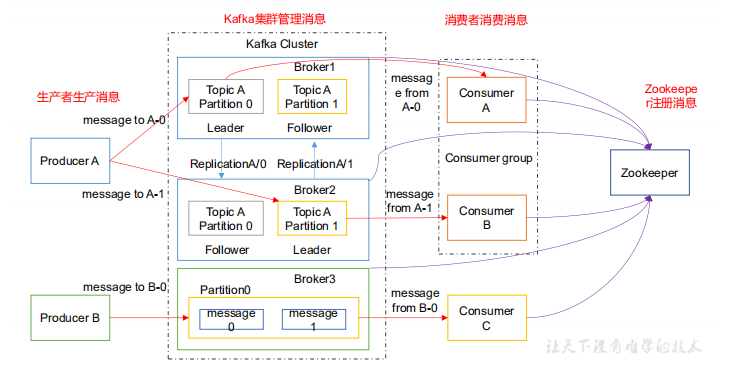
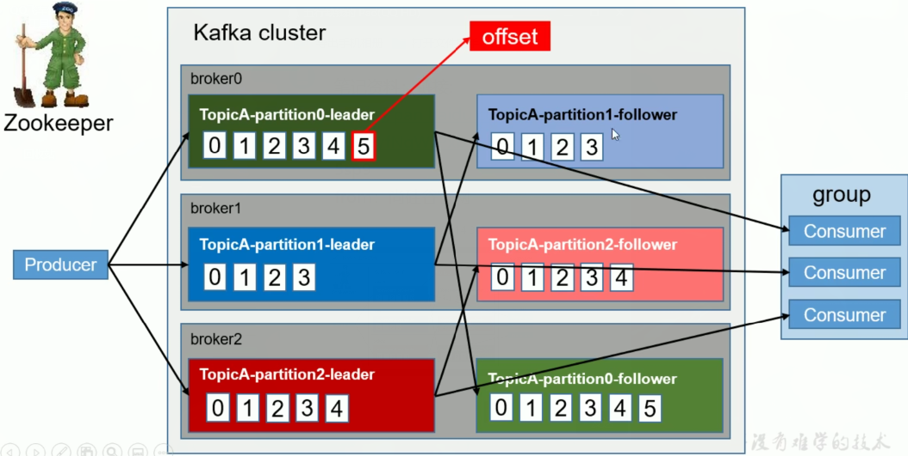
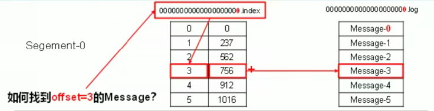
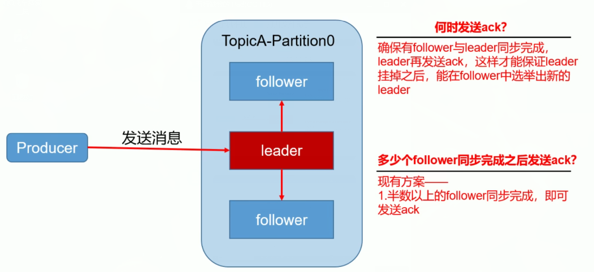
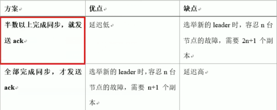
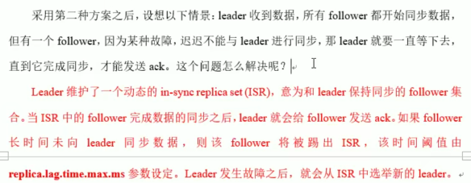

# 工作流程分析

## 1、工作流程&文件存储

### 核心组成





### 工作流程




kafka中消息是以 topic 进行分类的

生产者生产消息，消费者消费消息

都是面向topic的


topic是逻辑上的概念

partition是物理上的概念

每个partition对应一个log文件

log文件中存储就是producer生产的数据


producer生产数据会不断追加到该log文件中的末端

且每条数据都有自己的offset


消费者组中的每个消费者都会实时记录自己消费到了那个ffset

以便出错时恢复

从上次的位置继续消费


```
[root@hadoop4 first-0]# pwd
/opt/module/kafka/data/first-0
[root@hadoop4 first-0]# ll
total 0
-rw-r--r--. 1 root root 0 Nov 17 10:13 00000000000000000000.index
-rw-r--r--. 1 root root 0 Nov 17 08:11 00000000000000000000.log
-rw-r--r--. 1 root root 0 Nov 17 10:13 00000000000000000000.timeindex
-rw-r--r--. 1 root root 0 Nov 17 08:11 leader-epoch-checkpoint

```

00000000000000000000.index存放索引

 00000000000000000000.log存放数据


默认是7天保存数据

文件最大时1G

文件最大时，如果消费到1000，此时使用index提供此时消费的位置

快速定位到下一个开始的位置


由于生产者生产的消息会不断追加到log文件末尾

为了防止log文件过大导致数据定位低下

kafka采取了分片机制和索引机制

将每个partition分为多个segment

每个segment对应两个文件：index&log文件

这些文件位于同一个文件夹下

命名规则：topic+分区区号


index和log文件以当前segment的第一条消息的offset命名

index&log文件结构的示意图：



此时有6条消息要找到offset等于3的消息就是找到偏移量

存放的其实偏移量的信息，以及消息的大小


## 2、生产者

### 2.1 分区策略

**(1)、分区的原因**

a、方便在集群中进行扩展，每个partition可以通过调整以适应他所在的机器

每个topic又可以有多个partition组成，因此整个集群就可以适应任意大小的数据了


b、提高并发，因为可以以partition为单位进行读写


**(2)、分区原则**

将producer发送的数据封装成一个**ProducerRecord**对象

a、指明partition的情况下，直接将指明的值作为partition的值

b、没有指明partition的值，但有key的情况下，将key的hash值与topic的partition数进行取余得到partition值

c、既没有partition的值有没有key值的情况下

第一次调用时随机生成一个整数后每次调用进行递增

将这个值与topic可用的partition总数取余得到partition值

也就是round-robin算法


### 2.2 数据可靠性的保证

为保证producer发送的数据能可靠到达指定topic

topic的每个partition受到producer发送的数据后

都需要向producer大宋ack(acknownledgement确认收到)

如果producer收到ack，就会进行下一轮的发送，否则重新发送数据





#### **副本数据同步策略**




kafka选择第二个方案

1、同样为了容忍n台节点故障，第一种需要2n+1个副本，第二种方案只需要n+1个副本

​      kafka的每个区都有大量的数据，而一种方案会造成大量的数据冗余

2、网络延迟对kafka的影响比较小


#### **ISR**（0.9移除）



 replica.time.max.ms延迟时间

在延迟时间内就加入，否则就删除

很快在拉过来


#### ack应答机制

对于某些部太重要的数据，对数据的可靠性要求不是很高

能够容忍数据少量丢失，所以没必要等isr中的follower全部接受成功


提供了3中可靠性级别

用户根据可靠性和延迟进行权衡

**0：**producer不等待broker的ack，这一操作提供一个低延时

​      broker一接收到还没有写入磁盘就已经返回，当broker发生故障有**可能数据丢失**


**1：**producer等待broker的ack，partition的leader落盘成功护返回ack

​	   如果在follower同步之前leader故障，**将会数据丢失**


**-1：**producer等待broder的ack，partition的leader和follower（isr中）全部落盘成功才返回ack

​		但是如果在follower同步完成之后，border发送ack之前，leader发生故障

​		此时会造成**数据重复**


