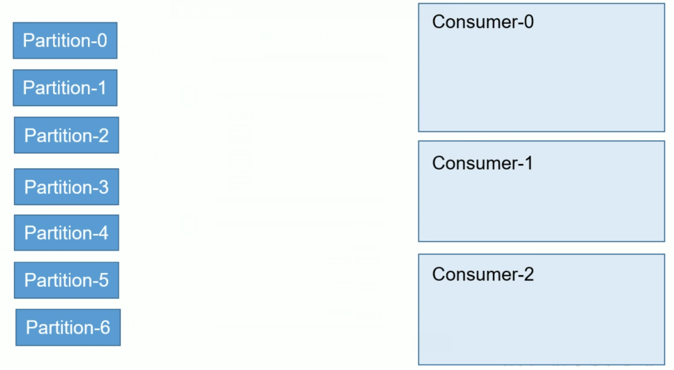

# 工作流程分析

## 1、工作流程&文件存储

### 核心组成


### 工作流程


kafka中消息是以 topic 进行分类的

生产者生产消息，消费者消费消息

都是面向topic的


topic是逻辑上的概念

partition是物理上的概念

每个partition对应一个log文件

log文件中存储就是producer生产的数据


producer生产数据会不断追加到该log文件中的末端

且每条数据都有自己的offset


消费者组中的每个消费者都会实时记录自己消费到了那个ffset

以便出错时恢复

从上次的位置继续消费


```
[root@hadoop4 first-0]# pwd
/opt/module/kafka/data/first-0
[root@hadoop4 first-0]# ll
total 0
-rw-r--r--. 1 root root 0 Nov 17 10:13 00000000000000000000.index
-rw-r--r--. 1 root root 0 Nov 17 08:11 00000000000000000000.log
-rw-r--r--. 1 root root 0 Nov 17 10:13 00000000000000000000.timeindex
-rw-r--r--. 1 root root 0 Nov 17 08:11 leader-epoch-checkpoint

```

00000000000000000000.index存放索引

 00000000000000000000.log存放数据


默认是7天保存数据

文件最大时1G

文件最大时，如果消费到1000，此时使用index提供此时消费的位置

快速定位到下一个开始的位置


由于生产者生产的消息会不断追加到log文件末尾

为了防止log文件过大导致数据定位低下

kafka采取了分片机制和索引机制

将每个partition分为多个segment

每个segment对应两个文件：index&log文件

这些文件位于同一个文件夹下

命名规则：topic+分区区号


index和log文件以当前segment的第一条消息的offset命名

index&log文件结构的示意图：


此时有6条消息要找到offset等于3的消息就是找到偏移量

存放的其实偏移量的信息，以及消息的大小


## 2、生产者

### 2.1 分区策略

**(1)、分区的原因**

a、方便在集群中进行扩展，每个partition可以通过调整以适应他所在的机器

每个topic又可以有多个partition组成，因此整个集群就可以适应任意大小的数据了


b、提高并发，因为可以以partition为单位进行读写


**(2)、分区原则**

将producer发送的数据封装成一个**ProducerRecord**对象

a、指明partition的情况下，直接将指明的值作为partition的值

b、没有指明partition的值，但有key的情况下，将key的hash值与topic的partition数进行取余得到partition值

c、既没有partition的值有没有key值的情况下

第一次调用时随机生成一个整数后每次调用进行递增

将这个值与topic可用的partition总数取余得到partition值

也就是round-robin算法


### 2.2 数据可靠性的保证

为保证producer发送的数据能可靠到达指定topic

topic的每个partition受到producer发送的数据后

都需要向producer大宋ack(acknownledgement确认收到)

如果producer收到ack，就会进行下一轮的发送，否则重新发送数据


#### **副本数据同步策略**


kafka选择第二个方案

1、同样为了容忍n台节点故障，第一种需要2n+1个副本，第二种方案只需要n+1个副本

​      kafka的每个区都有大量的数据，而一种方案会造成大量的数据冗余

2、网络延迟对kafka的影响比较小


#### **ISR**（0.9移除）


 replica.time.max.ms延迟时间

在延迟时间内就加入，否则就删除

很快在拉过来


#### ack应答机制

对于某些部太重要的数据，对数据的可靠性要求不是很高

能够容忍数据少量丢失，所以没必要等isr中的follower全部接受成功


提供了3中可靠性级别

用户根据可靠性和延迟进行权衡

**0：**producer不等待broker的ack，这一操作提供一个低延时

​      broker一接收到还没有写入磁盘就已经返回，当broker发生故障有**可能数据丢失**


**1：**producer等待broker的ack，partition的leader落盘成功护返回ack

​	   如果在follower同步之前leader故障，**将会数据丢失**


**-1：**producer等待broder的ack，partition的leader和follower（isr中）全部落盘成功才返回ack

​		但是如果在follower同步完成之后，border发送ack之前，leader发生故障

​		此时会造成**数据重复**


#### 故障处理


假设现在leader的写了10条数据

follow1写了8条

follow2写了9条

此时leader挂掉

follow1被选为leader，此时follow2的数据和follow1数据不一致

follow2被选为leader，此时leader又恢复

此时存储的数据就会又问题


为了保存数据存储的**一致性**（LEO&HW）


Log文件中的LEO&HW

HW表示当前follow中最小的值，表示consumer数据可当位置的之前数据，之后的数据不暴露


此时可以解决上述的问题

可以保证**消费者数据一致性**

数据丢失是ack的问题


上述问题中leader又恢复

此时发送数据为hello

就会在leader的第11条数据

在follow1的第9条

在follow2的第10条

此时的数据混乱


结论：

会从ISR中选出一个新的leader之后

为了保证多个分本之间的数据一致性问题

其余的follow会先将各自文件高于HW的部分裁掉

然后从新的leader中同步数据

解决重复消费问题


### 2.3 Exactly Once语义


## 3、消费者


### 3.1 消费方式

**consumer采用pull（拉）模式从broker中读取数据**

**push(推)模式很难适应消费速率不同的消费者，因为消息发送是由broker决定**

目标是尽可能快速的传递消息，但是这样很容易造成consumer来不及处理消息

典型的表现就是拒绝服务以及网络拥塞

pull可以根据消费者的消费能力以适应当前的的消费速率


**pull的不足：如果Kafka中没有数据，消费者可能陷入循环当中，一直返回空数据**

解决：Kafka的消费者在消费数据传递一个时长参数timeout，如果当前没有数据可以消费，consumer会等待一段时间之后在返回，这段时间就是timeout


### 3.2 分区分配策略

一个consumer group中有多个consumer

一个topic中有多个partition

必然会有partition的分配问题

确定那个partition由那个consumer来消费


在启动消费者时候触发

启动一个消费者分配所有的分区

在启动一个消费者进行重新分配分区

**消费者个数发生变化时都会触发改变**


两种策略：**RoundRobin**、**Range**


#### RoundRobin（轮询）

做不到完全平均




涉及到多个topic

假设T1（topic）由三个partition（0，1，2）

假设T2（topic）由三个partition（0，1，2）

将两个主题当作一个整体来看

此时由6个对象，（TopicAndPartition对象）根据hash值进行排序

假设排序之后，会将排序之后的对象进行轮询


#### Range


按照单个**主题**进行划分

不是按照消费者主题进行划分

可能带来消费数据不对等问题


### 3.3 offset的维护

由于consumer在消费过程中可能出现断点宕机等问题

consumer恢复后

需要从故障前的位置继续消费

consumer需要实时激励自己消费到了那个offset

一边恢复之后继续消费


offset保存在zk，同时还保存在Kafka本地


按照**消费者组**+**主题**+**分区** 确定offset


#### 保存zk中

1、创建新的topic

```
[root@hadoop2 kafka]# bin/kafka-topics.sh --zookeeper hadoop2:2181 --create --replication-factor 2 --partitions 2 --topic bigdata
Created topic "bigdata".
```

2、生产者（进行发送消息的窗口）

```
bin/kafka-console-producer.sh --broker-list hadoop2:9092 --topic bigdata
```

3、消费者（进入消费者消费的窗口）

```
bin/kafka-console-consumer.sh --zookeeper hadoop2:2181 --topic bigdata
```


4、测试发送&消费消息

生产者进行生产消息

```
[root@hadoop2 kafka]# bin/kafka-console-producer.sh --broker-list hadoop2:9092 --topic bigdata
>hello bgi
```

生产者可以进行消息的消费

```
[root@hadoop2 kafka]# bin/kafka-console-consumer.sh --zookeeper hadoop2:2181 --topic bigdata
Using the ConsoleConsumer with old consumer is deprecated and will be removed in a future major release. Consider using the new consumer by passing [bootstrap-server] instead of [zookeeper].
hello bgi
```


5、进入zk目录

```
bin/zkCline.sh
```

此时进行ls /进行查询

```
[zk: localhost:2181(CONNECTED) 1] ls /
[cluster, controller, brokers, zookeeper, mr, sanguo, admin, isr_change_notification, controller_epoch, consumers, latest_producer_id_block, config]
```

除了zookeeper都是Kafka的资源


6、此时查询**controller**

```
[zk: localhost:2181(CONNECTED) 2] get /controller
{"version":1,"brokerid":1,"timestamp":"1574607613727"}
cZxid = 0x800000013
ctime = Sun Nov 24 10:00:13 EST 2019
mZxid = 0x800000013
mtime = Sun Nov 24 10:00:13 EST 2019
pZxid = 0x800000013
cversion = 0
dataVersion = 0
aclVersion = 0
ephemeralOwner = 0x26e9deab45a0000
dataLength = 54
numChildren = 0
```

是用来争抢资源

**broderid**


7、此时查询**brokers**

```
[zk: localhost:2181(CONNECTED) 3] ls /brokers
[ids, topics, seqid]
```

[ids,topics,seqid]

```
[zk: localhost:2181(CONNECTED) 4] ls /brokers/ids
[0, 1, 2]
```

此时依赖其组成集群

```
[zk: localhost:2181(CONNECTED) 5] ls /brokers/topics
[bigdata, first]
```

是两个主题（已经创建好的两个主题）


8、此时查看**consumers**

消费者进行存数据

```
[zk: localhost:2181(CONNECTED) 6] ls /consumers
[console-consumer-5395]
```

[console-consumer-xxxx] (x代表数字)

此时这个代表消费者组（上述开启的消费者），没有指定消费者组

此时的消费者组是随机的

```
[zk: localhost:2181(CONNECTED) 7] ls /consumers/console-consumer-5395
[ids, owners, offsets]
```

[ids,owners,offsets]

```
[zk: localhost:2181(CONNECTED) 8] ls /consumers/console-consumer-5395/offsets
[bigdata]
```

[bigdata] (代表topic)

```
[zk: localhost:2181(CONNECTED) 9] ls /consumers/console-consumer-5395/offsets/bigdata
[0, 1]
```

[0,1] (分区)

进行get值

```
[zk: localhost:2181(CONNECTED) 10] get /consumers/console-consumer-5395/offsets/bigdata/0
1
cZxid = 0x80000004a
ctime = Sun Nov 24 10:10:49 EST 2019
mZxid = 0x80000004a
mtime = Sun Nov 24 10:10:49 EST 2019
pZxid = 0x80000004a
cversion = 0
dataVersion = 0
aclVersion = 0
ephemeralOwner = 0x0
dataLength = 1
numChildren = 0

```

1 (此时发送的是一条数据)

```
[zk: localhost:2181(CONNECTED) 11] get /consumers/console-consumer-5395/offsets/bigdata/1
0
cZxid = 0x80000004d
ctime = Sun Nov 24 10:10:49 EST 2019
mZxid = 0x80000004d
mtime = Sun Nov 24 10:10:49 EST 2019
pZxid = 0x80000004d
cversion = 0
dataVersion = 0
aclVersion = 0
ephemeralOwner = 0x0
dataLength = 1
numChildren = 0

```

0   (此时发送的是一条数据)

再次发送一条数据（**轮询策略**）

```
[root@hadoop2 kafka]# bin/kafka-console-producer.sh --broker-list hadoop2:9092 --topic bigdata
>hello bgi^H^H^[[D^[[D
>zk


[root@hadoop2 kafka]# bin/kafka-console-consumer.sh --zookeeper hadoop2:2181 --topic bigdata
Using the ConsoleConsumer with old consumer is deprecated and will be removed in a future major release. Consider using the new consumer by passing [bootstrap-server] instead of [zookeeper].
hello bgi
zk
```


此时再次进行查询即可（本地会友延迟）

```
[zk: localhost:2181(CONNECTED) 13] get /consumers/console-consumer-5395/offsets/bigdata/1
1
cZxid = 0x80000004d
ctime = Sun Nov 24 10:10:49 EST 2019
mZxid = 0x80000004e
mtime = Sun Nov 24 10:18:49 EST 2019
pZxid = 0x80000004d
cversion = 0
dataVersion = 1
aclVersion = 0
ephemeralOwner = 0x0
dataLength = 1
numChildren = 0

```

1   (此时发送的是二条数据)


#### 保存在本地

bin/kafka-console-consumer.sh  --topic first --bootstrap-server hadoop2:9092

使用上述的命令zk中没有消费者组内容

Kafka 0.9版本之前，consumer默认将offset保存在zk中

Kafka 0.9版本之后，consumer默认将offset保存在Kafka一个内置的topic中，该topic为-consumer_offsets.


1、修改配置文件consumer.properties

用创建的消费者去消费系统的topic

```
exclude.internal.topics = false
```

```
[root@hadoop2 config]# vim consumer.properties

# timeout in ms for connecting to zookeeper
zookeeper.connection.timeout.ms=6000

#consumer group id
group.id=test-consumer-group

#consumer timeout
#consumer.timeout.ms=5000

exclude.internal.topics=false

```


2、读取offset

0.11.0.0之前版本(<)

```
bin/kafka-console-consumer.sh --topic __consumer_offsets --zookeeper hadoop2:2181 --formatter "kafka.coordinator.GroupMetadataManager\$OffsetsMessageFormatter" --consumer.config config/consumer.properties --from-beginning
```

0.11.0.0之前版后（>=）

```
bin/kafka-console-consumer.sh --topic __consumer_offsets --zookeeper hadoop2:2181 --formatter "kafka.coordinator.group.GroupMetadataManager\$OffsetsMessageFormatter" --consumer.config config/consumer.properties --from-beginning
```


--zookeeper hadoop2:2181

消费者A消费T1主题

使用bootstrap-server

A会把数据放在 __ consumer_offsets （A相当于__consumer_offsets）是生产者


生产者

```
[root@hadoop2 kafka]# bin/kafka-console-producer.sh --broker-list hadoop2:9092 --topic bigdata
>hello
>
```


消费者

```
[root@hadoop2 kafka]# bin/kafka-console-consumer.sh  --topic bigdata  --bootstrap-server hadoop2:9092
hello
```


再次启动则需要进行修改配置文件的consumer.properties的组名

```
[root@hadoop2 kafka]# bin/kafka-console-consumer.sh --topic __consumer_offsets --zookeeper hadoop2:2181 --formatter "kafka.coordinator.group.GroupMetadataManager\$OffsetsMessageFormatter" --consumer.config config/consumer.properties --from-beginning
Using the ConsoleConsumer with old consumer is deprecated and will be removed in a future major release. Consider using the new consumer by passing [bootstrap-server] instead of [zookeeper].


[console-consumer-70552,bigdata,0]::[OffsetMetadata[2,NO_METADATA],CommitTime 1574610547967,ExpirationTime 1574696947967]
[console-consumer-70552,bigdata,1]::[OffsetMetadata[1,NO_METADATA],CommitTime 1574610547967,ExpirationTime 1574696947967]

```

[console-consumer-70552（**组**）,bigdata（**topic**）,0（**分区**） ] ::[OffsetMetadata[2（**消费的数据个数**）,NO_METADATA],CommitTime 1574610547967,ExpirationTime 1574696947967]

[console-consumer-70552,bigdata,1] ::[OffsetMetadata[1,NO_METADATA],CommitTime 1574610547967,ExpirationTime 1574696947967]

消费存放在那个主题里面，根据hash值进行保存的（只要GTP不变）

GTP唯一确定offset


