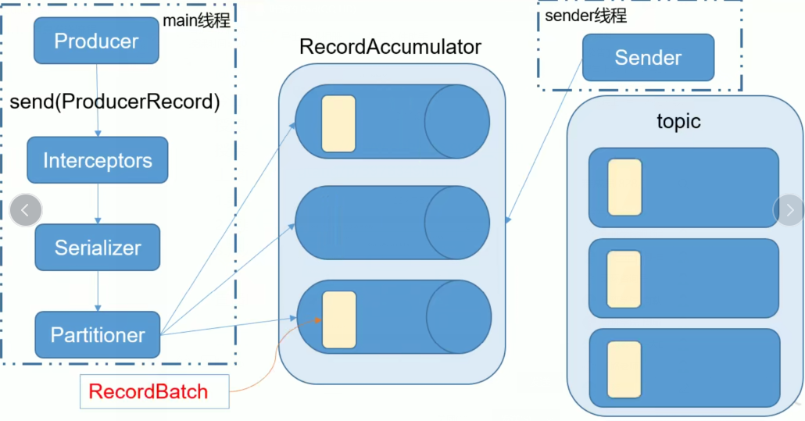
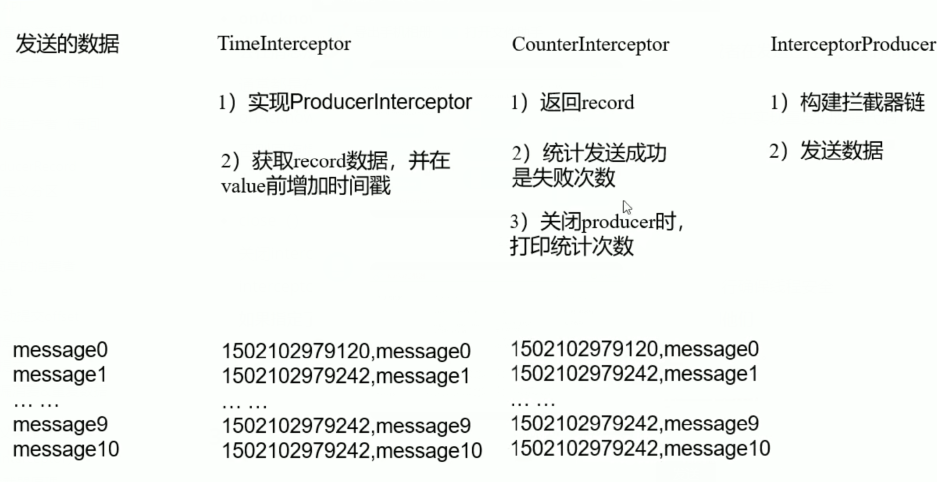

## Producer API

### 1.1、消息发送流程

Kafka的Producer发送消息采用的是**异步发送**方式

在消息发送过程中，涉及到两个线程---**mian线程**和**Sender线程**

以及**一个此案成共享变量--RecordAccumulator**

mian线程将消息发送RecordAccumulator

sender线程不断从RecordAccumulator中拉取消息发送到Kafka broker




batch.size : 只有数据累计到batch.size之后，sender才会发送数据

linger.ms：如果数据迟迟未到batch.size，sender等到linger.time之后就会发送数据


### 1.2、环境准备

添加所需要的依赖

```
    <dependency>
      <groupId>org.apache.kafka</groupId>
      <artifactId>kafka-clients</artifactId>
      <version>0.11.0.0</version>
    </dependency>
    <!-- https://mvnrepository.com/artifact/org.apache.kafka/kafka -->
    <dependency>
    <groupId>org.apache.kafka</groupId>
    <artifactId>kafka_2.12</artifactId>
      <version>0.11.0.0</version>
    </dependency>
```


### 1.3、创建生产者(不带回调)

```
package com.mrcheng.kafka.producer;

import org.apache.kafka.clients.producer.KafkaProducer;
import org.apache.kafka.clients.producer.ProducerRecord;

import java.util.Properties;

public class MyProducer {

    public static void main(String[] args) {

        //1、创建生产者配置信息
        Properties properties = new Properties();
        // Kafka 服务端的主机名和端口号
        properties.put("bootstrap.servers", "hadoop2:9092,hadoop3:9092,hadoop4:9092");
        // 等待所有副本节点的应答级别
        properties.put("acks", "all");
        // 消息发送最大尝试次数
        properties.put("retries", 2);
        // 一批消息处理大小
        properties.put("batch.size", 16384);
        // 请求延时
        properties.put("linger.ms", 100);
        // 发送缓存区内存大小
        properties.put("buffer.memory", 33554432);//32M

        //properties.put("group.id", "test-consumer-group");//32M

        // key 序列化
        properties.put("key.serializer",
                "org.apache.kafka.common.serialization.StringSerializer");
        // value 序列化
        properties.put("value.serializer",
                "org.apache.kafka.common.serialization.StringSerializer");

//ERROR [ConsumerFetcherThread-console-consumer-72992_hadoop3-1575041762056-e8228ef3-0-0]:
// Error for partition [first,1]
// to broker 0:kafka.common.NotLeaderForPartitionException (kafka.consumer.ConsumerFetcherThread

        //2、创建生产者对象
        KafkaProducer<String, String> producer = new KafkaProducer<>(properties);
        System.out.println("创建生产者对象...");
        System.out.println(producer.toString());


        for (int i =0 ;i<10;i++){
            System.out.println("msg" + i);
            //3、配置主题发送信息
            //Future<RecordMetadata> send(ProducerRecord<K, V> var1);
            //回调函数可以把当前数据在Kafka中的信息都返回
            //Future<RecordMetadata> send(ProducerRecord<K, V> var1, Callback var2);
            String msg = "msg" + i;
            producer.send(new ProducerRecord<>("first",msg));
        }

        System.out.println("结束1...");
        //4、关闭
        producer.close();
        System.out.println("结束2...");
    }
}

```


在命令行终端打开消费者进行消费消息

```
[root@hadoop2 kafka]# bin/kafka-console-consumer.sh  --topic first --zookeeper hadoop2:2181
```


执行代码之后

```
[root@hadoop2 kafka]# bin/kafka-console-consumer.sh  --topic first --zookeeper hadoop2:2181
Using the ConsoleConsumer with old consumer is deprecated and will be removed in a future major release. Consider using the new consumer by passing [bootstrap-server] instead of [zookeeper].
msg1
msg3
msg5
msg7
msg9
msg0
msg2
msg4
msg6
msg8
```


注意：可以使用进行替换


```
properties.put("bootstrap.servers", "hadoop2:9092,hadoop3:9092,hadoop4:9092");
ProducerConfig.BOOTSTRAP_SERVERS_CONFIG;
ProducerConfig.ACKS_CONFIG;
```


### 1.4、创建生产者（带回调）

```
public static void main(String[] args) {

        //1、创建生产者配置信息
        Properties properties = new Properties();
        // Kafka 服务端的主机名和端口号
        //ProducerConfig.ACKS_CONFIG;
        properties.put(ProducerConfig.BOOTSTRAP_SERVERS_CONFIG, "hadoop2:9092,hadoop3:9092,hadoop4:9092");
        // 等待所有副本节点的应答级别
        properties.put("acks", "all");
        // 消息发送最大尝试次数
        properties.put("retries", 2);
        // 一批消息处理大小
        properties.put("batch.size", 16384);
        // 请求延时
        properties.put("linger.ms", 100);
        // 发送缓存区内存大小
        properties.put("buffer.memory", 33554432);//32M

        //properties.put("group.id", "test-consumer-group");//32M

        // key 序列化
        properties.put("key.serializer",
                "org.apache.kafka.common.serialization.StringSerializer");
        // value 序列化
        properties.put("value.serializer",
                "org.apache.kafka.common.serialization.StringSerializer");


        //2、创建生产者对象
        KafkaProducer<String, String> producer = new KafkaProducer<>(properties);
        System.out.println("创建生产者对象...");
        System.out.println(producer.toString());


        for (int i =0 ;i<10;i++){
            System.out.println("msg" + i);
            //3、配置主题发送信息
            //Future<RecordMetadata> send(ProducerRecord<K, V> var1);
            //回调函数可以把当前数据在Kafka中的信息都返回
            //Future<RecordMetadata> send(ProducerRecord<K, V> var1, Callback var2);
            String msg = "msg" + i;
            producer.send(new ProducerRecord<>("first", msg), new Callback() {
                @Override
                public void onCompletion(RecordMetadata recordMetadata, Exception e) {
                    //RecordMetadata:当前行数据的行信息
                    //Exception：异常

                    //由异常返回异常
                    //无异常但会数据信息
                    if (e == null){
                        System.out.println(recordMetadata.partition()+"--"+ recordMetadata.offset());
                    }else {
                        e.printStackTrace();
                    }

                }
            });
        }

        System.out.println("结束1...");
        //4、关闭
        producer.close();
        System.out.println("结束2...");


    }

```


控制台结果

```
创建生产者对象...
org.apache.kafka.clients.producer.KafkaProducer@30c7da1e
msg0
msg1
msg2
msg3
msg4
msg5
msg6
msg7
msg8
msg9
结束1...
0--22
0--23
0--24
0--25
0--26
1--30
1--31
1--32
1--33
1--34
结束2...
```


``````····ddwe
msg1
msg3
msg5
msg7
msg9
msg0
msg2
msg4
msg6
msg8

``````


### 1.5 ProducerRecord

new ProducerRecord<>("first", 0,"key",msg), new Callback() {});

first:topic

0:patition

key:key

msg:消息

```
 String msg = "msg" + i;
            producer.send(new ProducerRecord<>("first", 0,"key",msg), new Callback() {
                @Override
                public void onCompletion(RecordMetadata recordMetadata, Exception e) {
                    //RecordMetadata:当前行数据的行信息
                    //Exception：异常

                    //由异常返回异常
                    //无异常但会数据信息
                    if (e == null){
                        System.out.println(recordMetadata.partition()+"--"+ recordMetadata.offset());
                    }else {
                        e.printStackTrace();
                    }

                }
            });
        }
```


此时使用控制台只能打印出value（设置的key不能打印出来）


### 1.6、自定义分区

需要继承**Partitioner**类

```
public class MyProducerPartition implements  Partitioner{


    //序列化之后 Object
    //可以看到key&valuekey
    @Override
    public int partition(String topic, Object key, byte[] keyBytes, Object value, byte[] valuebytes, Cluster cluster) {
        Integer integer = cluster.partitionCountForTopic(topic);
        //return key.toString().hashCode() % integer;
        return 0;
    }

    @Override
    public void close() {

    }

    @Override
    public void configure(Map<String, ?> map) {

    }
}
```


自定义分区之后进行关联

```
public static void main(String[] args) {

        //1、创建生产者配置信息
        Properties properties = new Properties();
        // Kafka 服务端的主机名和端口号
        //ProducerConfig.ACKS_CONFIG;
        properties.put(ProducerConfig.BOOTSTRAP_SERVERS_CONFIG, "hadoop2:9092,hadoop3:9092,hadoop4:9092");
        // 等待所有副本节点的应答级别
        properties.put("acks", "all");
        // 消息发送最大尝试次数
        properties.put("retries", 2);
        // 一批消息处理大小
        properties.put("batch.size", 16384);
        // 请求延时
        properties.put("linger.ms", 100);
        // 发送缓存区内存大小
        properties.put("buffer.memory", 33554432);//32M

        //properties.put("group.id", "test-consumer-group");//32M

        // key 序列化
        properties.put("key.serializer",
                "org.apache.kafka.common.serialization.StringSerializer");
        // value 序列化
        properties.put("value.serializer",
                "org.apache.kafka.common.serialization.StringSerializer");

        //添加分区器
        properties.put(ProducerConfig.PARTITIONER_CLASS_CONFIG,"com.mrcheng.kafka.producer.MyProducerPartition");


        //2、创建生产者对象
        KafkaProducer<String, String> producer = new KafkaProducer<>(properties);
        System.out.println("创建生产者对象...");
        System.out.println(producer.toString());


        for (int i =0 ;i<10;i++){
            System.out.println("msg" + i);
            //3、配置主题发送信息
            //Future<RecordMetadata> send(ProducerRecord<K, V> var1);
            //回调函数可以把当前数据在Kafka中的信息都返回
            //Future<RecordMetadata> send(ProducerRecord<K, V> var1, Callback var2);
            String msg = "msg" + i;
            producer.send(new ProducerRecord<>("first", 0,"key",msg), new Callback() {
                @Override
                public void onCompletion(RecordMetadata recordMetadata, Exception e) {
                    //RecordMetadata:当前行数据的行信息
                    //Exception：异常

                    //由异常返回异常
                    //无异常但会数据信息
                    if (e == null){
                        System.out.println(recordMetadata.partition()+"--"+ recordMetadata.offset());
                    }else {
                        e.printStackTrace();
                    }

                }
            });
        }

        System.out.println("结束1...");
        //4、关闭
        producer.close();
        System.out.println("结束2...");


    }
```


可以发现此时的数据都是在0号分区

```
创建生产者对象...
org.apache.kafka.clients.producer.KafkaProducer@30c7da1e
msg0
msg1
msg2
msg3
msg4
msg5
msg6
msg7
msg8
msg9
结束1...
0--27
0--28
0--29
0--30
0--31
0--32
0--33
0--34
0--35
0--36
结束2...

```


### 1.7 同步发送

同步发送：一条消息发送之后，回阻塞当前线程，直到返回**ack**（）

由于send方法返回的是一个Future对象，根据Future对象 的特点，可以实现同步发送的效果

只需要调用Future对象的get方法

```
 public static void main(String[] args) {

        //1、创建生产者配置信息
        Properties properties = new Properties();
        // Kafka 服务端的主机名和端口号
        //ProducerConfig.ACKS_CONFIG;
        properties.put(ProducerConfig.BOOTSTRAP_SERVERS_CONFIG, "hadoop2:9092,hadoop3:9092,hadoop4:9092");
        // 等待所有副本节点的应答级别
        properties.put("acks", "all");
        // 消息发送最大尝试次数
        properties.put("retries", 2);
        // 一批消息处理大小
        properties.put("batch.size", 16384);
        // 请求延时
        properties.put("linger.ms", 100);
        // 发送缓存区内存大小
        properties.put("buffer.memory", 33554432);//32M

        //properties.put("group.id", "test-consumer-group");//32M

        // key 序列化
        properties.put("key.serializer",
                "org.apache.kafka.common.serialization.StringSerializer");
        // value 序列化
        properties.put("value.serializer",
                "org.apache.kafka.common.serialization.StringSerializer");

        //添加分区器
        //partitioner.class
        properties.put(ProducerConfig.PARTITIONER_CLASS_CONFIG,"com.mrcheng.kafka.producer.MyProducerPartition");


        //2、创建生产者对象
        KafkaProducer<String, String> producer = new KafkaProducer<>(properties);
        System.out.println("创建生产者对象...");
        System.out.println(producer.toString());


        for (int i =0 ;i<10;i++){
            System.out.println("msg" + i);
            //3、配置主题发送信息
            //Future<RecordMetadata> send(ProducerRecord<K, V> var1);
            //回调函数可以把当前数据在Kafka中的信息都返回
            //Future<RecordMetadata> send(ProducerRecord<K, V> var1, Callback var2);
            String msg = "msg" + i;
            Future<RecordMetadata> send = producer.send(new ProducerRecord<>("first", 0, "key", msg));
            try {
                //调用get方法会阻塞前面的线程
                RecordMetadata recordMetadata = send.get();
            } catch (InterruptedException e) {
                e.printStackTrace();
            } catch (ExecutionException e) {
                e.printStackTrace();
            }
        }

        System.out.println("结束1...");
        //4、关闭
        producer.close();
        System.out.println("结束2...");


    }
```


## Consumer API

### 2.1 、简单的消费者

```
public static void main(String[] args) {
        //1、创建生产者配置信息
        Properties properties = new Properties();

        //集群信息
        properties.put(ConsumerConfig.BOOTSTRAP_SERVERS_CONFIG, "hadoop2:9092,hadoop3:9092,hadoop4:9092");

        properties.put(ConsumerConfig.ENABLE_AUTO_COMMIT_CONFIG,true);//开启自动提交
        properties.put(ConsumerConfig.AUTO_COMMIT_INTERVAL_MS_CONFIG,"1000");//提交的延时
        //key&value的反序列化
        properties.put(ConsumerConfig.KEY_DESERIALIZER_CLASS_CONFIG,"org.apache.kafka.common.serialization.StringDeserializer");//提交的延时
        properties.put(ConsumerConfig.VALUE_DESERIALIZER_CLASS_CONFIG,"org.apache.kafka.common.serialization.StringDeserializer");//提交的延时

        //消费者组consumer配置文件中
        properties.put(ConsumerConfig.GROUP_ID_CONFIG,"test-consumer-group");

        KafkaConsumer<String, String> consumer = new KafkaConsumer<>(properties);

        //订阅主题
        consumer.subscribe(Arrays.asList(new String[]{"first"}));


        System.out.println("for循环开始");
        while (true){
            //获取数据
            ConsumerRecords<String, String> poll = consumer.poll(100);//延时（单位时间没有则进行延时）

            //解析ConsumerRecords
            for (ConsumerRecord<String, String> records : poll){
                System.out.println(records.key()+"---"+records.value());

            }
        }
        //关系
        //consumer.close();

    }

}
```


在命令行中进行发送一个数据之后是可以进行正常的接收数据

```
log4j:WARN No appenders could be found for logger (org.apache.kafka.clients.consumer.ConsumerConfig).
log4j:WARN Please initialize the log4j system properly.
log4j:WARN See http://logging.apache.org/log4j/1.2/faq.html#noconfig for more info.
for循环开始
null---sdfasdf
null---dfas
null---fsfasfsaf
null---saf
null---as
null---sddf
null---asf
```


### 2.2 offset

两个条件：

1、消费者没有初始化的offst（当前消费者第一次消费）（换了一个组）

2、当前的offset已经不存在了，在任何机器上（数据已经被i删除恶略）（在期间数据被删除）

参数：

earliest：最早的

latest：最新的


```
public static void main(String[] args) {
        //1、创建生产者配置信息
        Properties properties = new Properties();

        //集群信息
        properties.put(ConsumerConfig.BOOTSTRAP_SERVERS_CONFIG, "hadoop2:9092,hadoop3:9092,hadoop4:9092");

        properties.put(ConsumerConfig.ENABLE_AUTO_COMMIT_CONFIG,true);//开启自动提交
        properties.put(ConsumerConfig.AUTO_COMMIT_INTERVAL_MS_CONFIG,"1000");//提交的延时
        //key&value的反序列化
        properties.put(ConsumerConfig.KEY_DESERIALIZER_CLASS_CONFIG,"org.apache.kafka.common.serialization.StringDeserializer");//提交的延时
        properties.put(ConsumerConfig.VALUE_DESERIALIZER_CLASS_CONFIG,"org.apache.kafka.common.serialization.StringDeserializer");//提交的延时

        //消费者组consumer配置文件中
        properties.put(ConsumerConfig.GROUP_ID_CONFIG,"test-consumer-group");

        KafkaConsumer<String, String> consumer = new KafkaConsumer<>(properties);

        //订阅主题
        consumer.subscribe(Arrays.asList(new String[]{"first"}));

        //重置消费者的offset
        properties.put(ConsumerConfig.AUTO_OFFSET_RESET_CONFIG,"earliest");


        System.out.println("for循环开始");
        while (true){
            //获取数据
            ConsumerRecords<String, String> poll = consumer.poll(100);//延时（单位时间没有则进行延时）

            //解析ConsumerRecords
            for (ConsumerRecord<String, String> records : poll){
                System.out.println(records.key()+"---"+records.value());

            }
        }

        //关系
        //consumer.close();

    }

```

此时没由换组，数据也没有失效，所以此时不会进行数据的打印


条件：

1、组没换，数据过期

2、换组


把offset存入假设从90消费到100

此时只要当前线程没有挂掉，就会从内存中读取相应的数据，直接读取offset为100的位置

此时只是访问内部的offset，减少了访问外部的时间

只是在线程启动的时候访问去offset一次


**enable.auto.commit:是否开启自动提交offset功能**

**auto.commit.interval.ms:自动提交offset的时间间隔**


### 2.3、手动提交offset

两种方式：同步提交&异步提交

相同点：本次的poll的一批数据**最高的偏移量的提交**

不同点：同步提交阻塞当前线程，一直到提交成功

​				异步提交没有重试机制，有可能提交失败


#### 同步提交：

同步提交offset可靠性高

但是由于会阻塞当前的线程直到成功

效率低

```
    //同步提交需要将开启自动提交关闭
    properties.put(ConsumerConfig.ENABLE_AUTO_COMMIT_CONFIG,false);
        
    while (true){
        //获取数据
        //延时（单位时间没有则进行延时）
        ConsumerRecords<String, String> poll = consumer.poll(100);

            //解析ConsumerRecords
            for (ConsumerRecord<String, String> records : poll){
                System.out.println(records.key()+"---"+records.value());
            }

            //同步提交,当前线程会阻塞到offset提交成功
            consumer.commitSync();

        }

```


#### 异步提交

同步提交offset可靠性高

但是由于会阻塞当前的线程直到成功

此时会影响吞吐量

为了提高效率更倾向选择异步提交

```
        //异步提交需要将开启自动提交关闭
        properties.put(ConsumerConfig.ENABLE_AUTO_COMMIT_CONFIG,false);

        while (true){
            //获取数据
            ConsumerRecords<String, String> poll = consumer.poll(100);//延时（单位时间没有则进行延时）

            //解析ConsumerRecords
            for (ConsumerRecord<String, String> records : poll){
                System.out.println(records.key()+"---"+records.value());
            }

            //同步提交,当前线程会阻塞到offset提交成功
            consumer.commitAsync(new OffsetCommitCallback() {
                @Override
                public void onComplete(Map<TopicPartition, OffsetAndMetadata> map, Exception e) {
                    if (e != null){
                        System.out.println("error" + ".....");
                    }
                }
            });

        }
```


#### 数据漏消费&重复数据分析

同步还是异步提交offset，都有可能造成数据的漏消费或者重复消费

先提交offset后消费--->造成数据的漏消费

先消费后提交offset--->造成数据的重复消费


#### 自定义存储offset

0.9版本之前，offset存储在zk的

0.9版本之后，offset存在一个内置的topic中


还可以选择自定义存储offset

offset的维护相当繁琐，需要考虑到消费者的**Rebalace**


**当有新的消费者加入消费者组，已有的消费者推出消费者组或者所订阅的主题分区发生变化**

**就会触发到分区的重新分配，重新分配 的过程叫做Rebalace**


消费者发生Rebalace之后，每个消费者的分区就会发生变化

**因此消费者要首先获取到自己被重新分配到的分区，并且定位到每个分区最近提交的offset位置继续消费**


实现自定义的rebalace 

需要实现ConsumerRabalanceListener


## 拦截器（Interceptor）

### 3.1、拦截器原理

Producer拦截器实在0.10版本引入

主要用于**实现clients端 的定制化控制逻辑**


interceptor使得用户在消息发送之前以及producer回调逻辑有机会对详细进行定制化要求

如：修改消息等....

producer允许用户指定多个interceptor按序对同一条消息进行拦截形成拦截器链

Intercepto实现的接口是：org.apache.kafka.clients.producer.**ProducerInterceptor**

接口需要实现的方法

- **-configure**（configs）：

  获取配置信息和初始化数据时调用

- **onSend**（ProducerRecord）：

  方法封装进KafkaProducer.send方法中，运行在用户主线程中

​	   Producer确保在消息被序列化以及计算分区之前调用该方法

​	   **用户可以在该方法中对消息做任何操作，最好不要修改消息所在的topic&分区**，以免影响目标分区的计算

- **onAcknowledgement**(RecordMetadata,Exception):

  **会在消息从RecordAccumulator成功发送到Kafka Broker之后，或者在发送过程中失败时调用**

  通常都是在producer回调函数触发之前

  onAcknowledgement运行在producer的IO线程中，因此不要在该方法中实现重要的逻辑代码

  否则回拖慢producer的发送效率

  

- close（）

  关闭interceptor，主要用于执行一些资源你的清理工作

  interceptor可能被运行在多个线程中，因此在具体实现时用户需要自行确保线程安全

  **如果指定了多个interceptor，则producer将按照指定的顺序去调用他们**

  仅仅时捕获每个intercceptor可能抛出的异常记录到错误日志而非向上传递。 


### 3.2、拦截器的实现




**时间拦截器**

```
package com.mrcheng.kafka.interceptor;

import org.apache.kafka.clients.producer.ProducerInterceptor;
import org.apache.kafka.clients.producer.ProducerRecord;
import org.apache.kafka.clients.producer.RecordMetadata;

import java.util.Map;

public class timeInterceptor implements ProducerInterceptor<String,String> {
    @Override
    public void configure(Map<String, ?> map) {

    }

    @Override
    public ProducerRecord<String, String> onSend(ProducerRecord<String, String> record) {

        //取出消息
        String value = record.value();

        //创建新的ProducerRecord对象
        return new ProducerRecord<String, String>(record.topic(),record.partition(),
                record.key(),System.currentTimeMillis()+"-"+value);
    }

    @Override
    public void onAcknowledgement(RecordMetadata recordMetadata, Exception e) {

    }

    @Override
    public void close() {

    }
}
```


**次数拦截器**

```
package com.mrcheng.kafka.interceptor;

import org.apache.kafka.clients.producer.ProducerInterceptor;
import org.apache.kafka.clients.producer.ProducerRecord;
import org.apache.kafka.clients.producer.RecordMetadata;

import java.util.Map;

//返回成功还是失败的个数
public class countInterceptor implements ProducerInterceptor<String,String> {
    int success;
    int error;

    //不需要对数据进行操作
    @Override
    public ProducerRecord<String, String> onSend(ProducerRecord<String, String> producerRecord) {
        return producerRecord;
    }

    @Override
    public void onAcknowledgement(RecordMetadata recordMetadata, Exception e) {
        //成功
        if (recordMetadata != null){
            success++;
        }else {
            error++;
        }
    }

    @Override
    public void close() {
        System.out.println("success:"+ success);
        System.out.println("error:"+ error);
    }

    @Override
    public void configure(Map<String, ?> map) {

    }
}
```


生产者

```
    public static void main(String[] args) {

        //1、创建生产者配置信息
        Properties properties = new Properties();
        // Kafka 服务端的主机名和端口号

        properties.put("bootstrap.servers", "hadoop2:9092,hadoop3:9092,hadoop4:9092");
        // 等待所有副本节点的应答级别
        properties.put("acks", "all");
        // 消息发送最大尝试次数
        properties.put("retries", 2);
        // 一批消息处理大小
        properties.put("batch.size", 16384);
        // 请求延时
        properties.put("linger.ms", 100);
        // 发送缓存区内存大小
        properties.put("buffer.memory", 33554432);//32M

        //properties.put("group.id", "test-consumer-group");//32M

        // key 序列化
        properties.put("key.serializer",
                "org.apache.kafka.common.serialization.StringSerializer");
        // value 序列化
        properties.put("value.serializer",
                "org.apache.kafka.common.serialization.StringSerializer");

        //添加拦截器(>1)
        //可以进行添加多个
        ArrayList<String> interceptor = new ArrayList<>();
        interceptor.add("com.mrcheng.kafka.interceptor.timeInterceptor");
        interceptor.add("com.mrcheng.kafka.interceptor.countInterceptor");
        properties.put(ProducerConfig.INTERCEPTOR_CLASSES_CONFIG, interceptor);

        //2、创建生产者对象
        KafkaProducer<String, String> producer = new KafkaProducer<>(properties);
        System.out.println("创建生产者对象...");
        System.out.println(producer.toString());


        for (int i =0 ;i<10;i++){
            System.out.println("msg" + i);

            String msg = "msg" + i;
            producer.send(new ProducerRecord<>("first",msg));
        }

        System.out.println("结束1...");
        //4、关闭
        producer.close();
        System.out.println("结束2...");
    }
```


此时查看控制台的数据消息

```
[root@hadoop3 kafka]# bin/kafka-console-consumer.sh  --topic first --zookeeper hadoop2:2181
Using the ConsoleConsumer with old consumer is deprecated and will be removed in a future major release. Consider using the new consumer by passing [bootstrap-server] instead of [zookeeper].
1
1575212789864-msg1
1575212789873-msg3
1575212789873-msg5
1575212789873-msg7
1575212789874-msg9
1575212788659-msg0
1575212789865-msg2
1575212789873-msg4
1575212789873-msg6
1575212789874-msg8

```


执行控制台的打印

```
创建生产者对象...
org.apache.kafka.clients.producer.KafkaProducer@57829d67
msg0
msg1
msg2
msg3
msg4
msg5
msg6
msg7
msg8
msg9
结束1...
success:10
error:0
结束2...

```


关于关闭资源最好使用try...catch...finally进行关闭资源