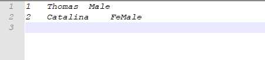
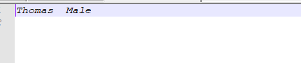
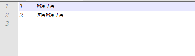
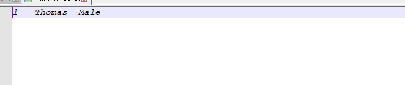

# **导入数据**

在 Sqoop 中，“导入”概念指：从非大数据集群（RDBMS）向大数据集群（HDFS，HIVE， 

HBASE）中传输数据，叫做：导入，即使用 import 关键字。


## **1、RDBMS** **到** **HDFS**

1) 确定 Mysql 服务开启正常

2) 在 Mysql 中新建一张表并插入一些数据

```sql
mysql>  create database company;
Query OK, 1 row affected (0.14 sec)

mysql>  create table company.staff(id int(4) primary key not null 
    -> auto_increment, name varchar(255), sex varchar(255));
Query OK, 0 rows affected (0.52 sec)

mysql>  insert into company.staff(name, sex) values('Thomas', 'Male');
Query OK, 1 row affected (0.06 sec)

mysql> insert into company.staff(name, sex) values('Catalina', 
    -> 'FeMale');
Query OK, 1 row affected (0.13 sec)

```


3) 导入数据

- （ 1）全部导入

  ```shell
  bin/sqoop import \
  mysql参数
  --connect jdbc:mysql://hadoop2:3306/company \
  --username root \
  --password 1234 \
  --table staff \
  hdfs参数
  --target-dir /user/company \  目标路径
  --delete-target-dir \  有的话就删除
  --num-mappers 1 \   mapper数
  --fields-terminated-by "\t"  分隔符（一条数据的分隔符）
  ```

  结果




- （2）查询导入

```
 bin/sqoop import \
--connect jdbc:mysql://hadoop2:3306/company \
--username root \
--password 1234 \
--target-dir /user/company \
--delete-target-dir \
--num-mappers 1 \
--fields-terminated-by "\t" \
--query 'select name,sex from staff where id <=1 and $CONDITIONS;'
```

提示：must contain '$CONDITIONS' in WHERE clause. 

如果 query 后使用的是双引号，则$CONDITIONS 前必须加转移符，防止 shell 识别为自己的 

变量。 

结果：




- （3）导入指定列

```shell
 bin/sqoop import \
--connect jdbc:mysql://hadoop2:3306/company \
--username root \
--password 1234 \
--target-dir /user/company \
--delete-target-dir \
--num-mappers 1 \
--fields-terminated-by "\t" \
--columns id,sex \
--table staff
```

提示：columns 中如果涉及到多列，用逗号分隔，分隔时不要添加空格

结果：




- （4）使用sqoop关键字筛选查询导入数据

```shell
 bin/sqoop import \
--connect jdbc:mysql://hadoop2:3306/company \
--username root \
--password 1234 \
--target-dir /user/company \
--delete-target-dir \
--num-mappers 1 \
--fields-terminated-by "\t" \
--table staff \
--where "id=1"
```

结果：




 


## 2、 RDBMS 到 Hive


```shell
 bin/sqoop import \
--connect jdbc:mysql://hadoop2:3306/company \
--username root \
--password 1234 \
--table staff \
--num-mappers 1 \
--hive-import \
--fields-terminated-by "\t" \
--hive-overwrite \
--hive-table staff_hive   //hive中的表会自动创建
```

提示：该过程分为两步，第一步将数据导入到 HDFS，第二步将导入到 HDFS 的数据迁移到 

Hive 仓库，第一步默认的临时目录是/user/用户名/表名 

结果：

```sql
hive (default)> select * from staff_hive;
OK
staff_hive.id	staff_hive.name	staff_hive.sex
1	Thomas	Male
2	Catalina	FeMale
Time taken: 4.255 seconds, Fetched: 2 row(s)

```


## 3 RDBMS 到 Hbase

```
 bin/sqoop import \
--connect jdbc:mysql://hadoop2:3306/company \
--username root \
--password 1234 \
--table staff \
--columns "id,name,sex" \
--column-family "info" \
--hbase-create-table \
--hbase-row-key "id" \
--hbase-table "hbase_company" \
--num-mappers 1 \
--split-by id
```

sqoop1.4.6 只支持 HBase1.0.1 之前的版本的自动创建 HBase 表的功能


解决方案：手动创建 HBase 表

```
hbase> create 'hbase_company,'info'
```


结果：

```shell
hbase(main):005:0> scan 'hbase_company'
ROW                                      COLUMN+CELL                                                                                                          
 1                                       column=info:name, timestamp=1582642370114, value=Thomas                                                              
 1                                       column=info:sex, timestamp=1582642370114, value=Male                                                                 
 2                                       column=info:name, timestamp=1582642370114, value=Catalina                                                            
 2                                       column=info:sex, timestamp=1582642370114, value=FeMale  
```


# 导出数据

在 Sqoop 中，“导出”概念指：从大数据集群（HDFS，HIVE，HBASE）向非大数据集群 

（RDBMS）中传输数据，叫做：导出，即使用 export 关键字。 

不支持直接将HBase导出到mysql


```
 bin/sqoop export \
--connect jdbc:mysql://hadoop2:3306/company \
--username root \
--password 1234 \
--table staff \
--num-mappers 1 \
--export-dir /user/hive/warehouse/staff_hive \   导出的目录
--input-fields-terminated-by "\t"		数据切割符
```


结果：

```sql
mysql> truncate table staff;
Query OK, 0 rows affected (0.77 sec)

mysql> select * from staff;
Empty set (0.00 sec)

mysql> clear
mysql> select * from staff;
+----+----------+--------+
| id | name     | sex    |
+----+----------+--------+
|  1 | Thomas   | Male   |
|  2 | Catalina | FeMale |
+----+----------+--------+
2 rows in set (0.00 sec)
```


# 脚本打包


使用 opt 格式的文件打包 sqoop 命令，然后执行


test.opt

```shell
export
--connect 
jdbc:mysql://hadoop2:3306/company
--username 
root 
--password 
1234
--table 
staff
--num-mappers 
1
--export-dir 
/user/hive/warehouse/staff_hive
--input-fields-terminated-by  
"\t"
```


执行脚本

```
[root@hadoop2 sqoop]# bin/sqoop --options-file ./test.opt 
```


```sql
mysql> truncate table staff;
Query OK, 0 rows affected (0.06 sec)

mysql> select * from staff;
Empty set (0.00 sec)

mysql> select * from staff;
+----+----------+--------+
| id | name     | sex    |
+----+----------+--------+
|  1 | Thomas   | Male   |
|  2 | Catalina | FeMale |
+----+----------+--------+
2 rows in set (0.00 sec)

```


