## 1、概述

Zookeeper是一个开源的分布式的，为分布式应用提供协调服务的Apache项目

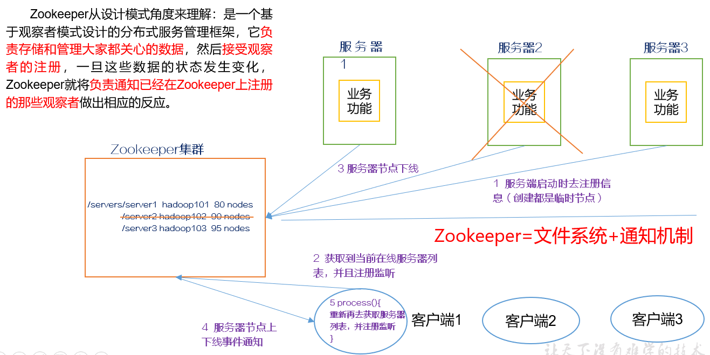

## 2、特点

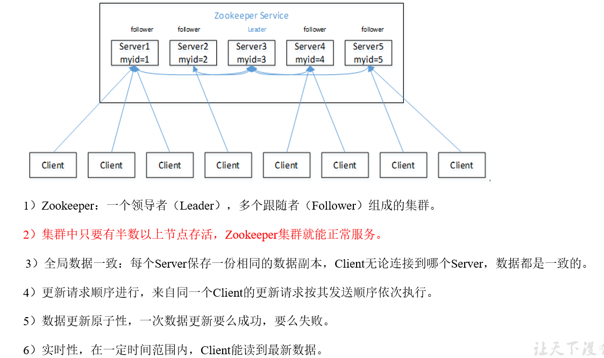

关于（2） 是半数 不能等于半数

## 3、数据结构

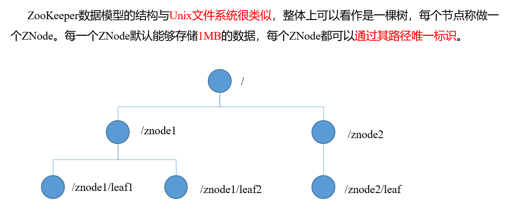

## 4、应用场景

提供的服务包括：统一命名服务、统一配置管理、统一集群管理、服务器节点动态上下线、软负载均衡等

**统一命名服务**

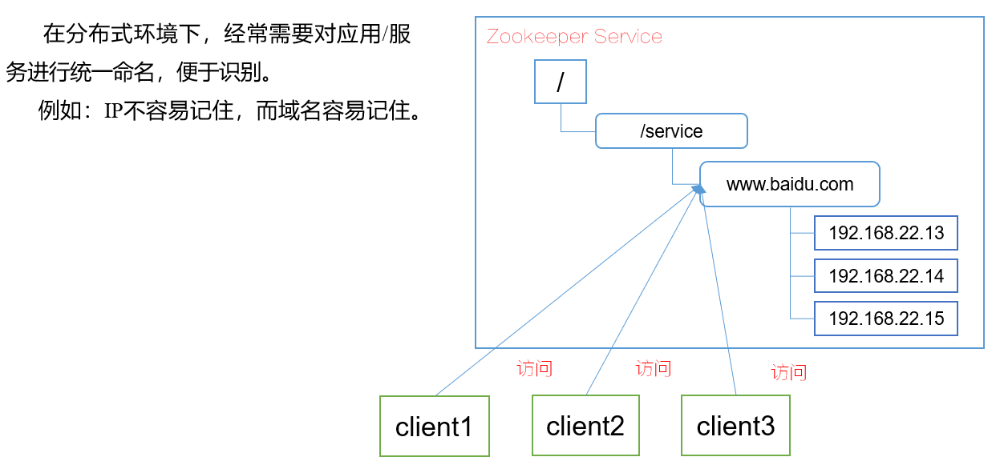

**统一配置管理**

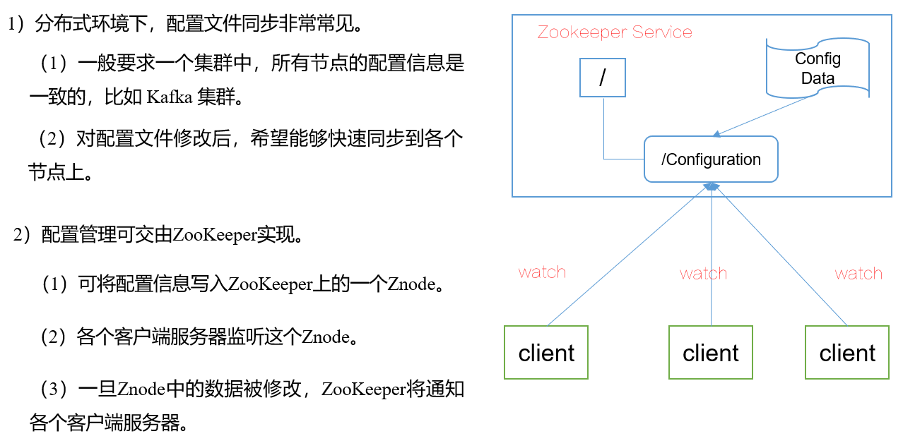

**统一集群管理**

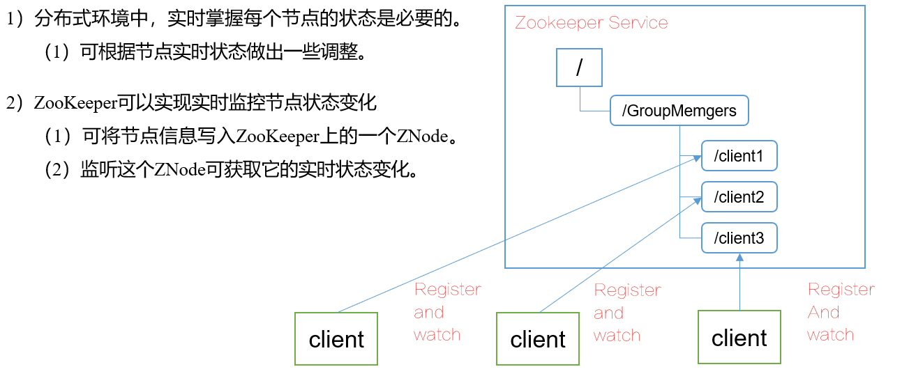

**服务器动态上下线**

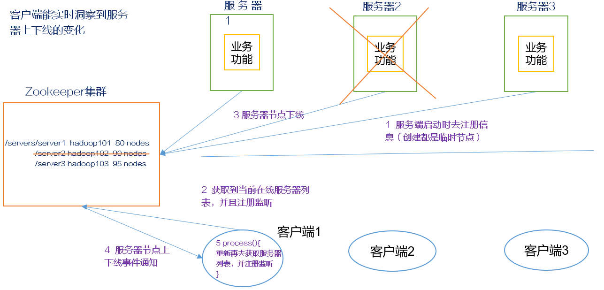

**软负载均衡**

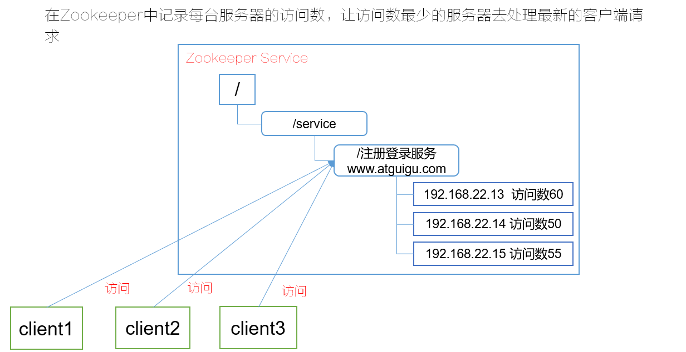

## 5、下载地址

1．官网首页：
https://zookeeper.apache.org/

2．下载截图

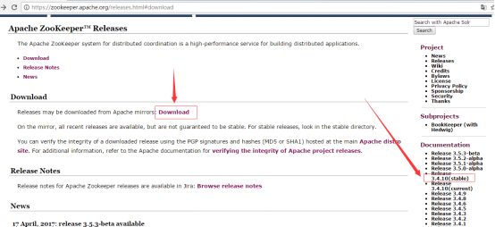

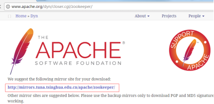

Zookeeper下载

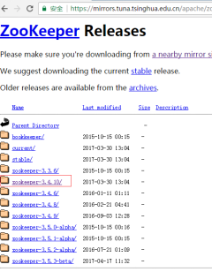

