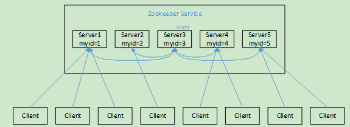
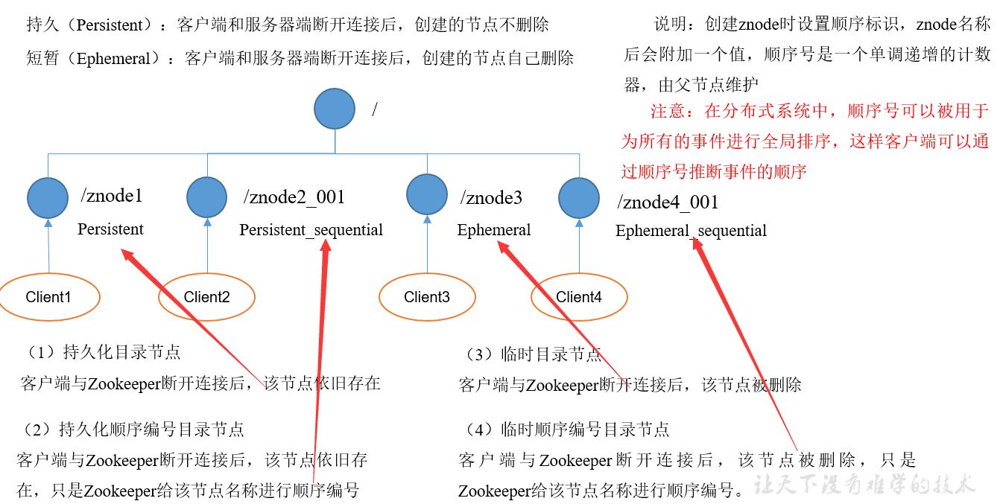
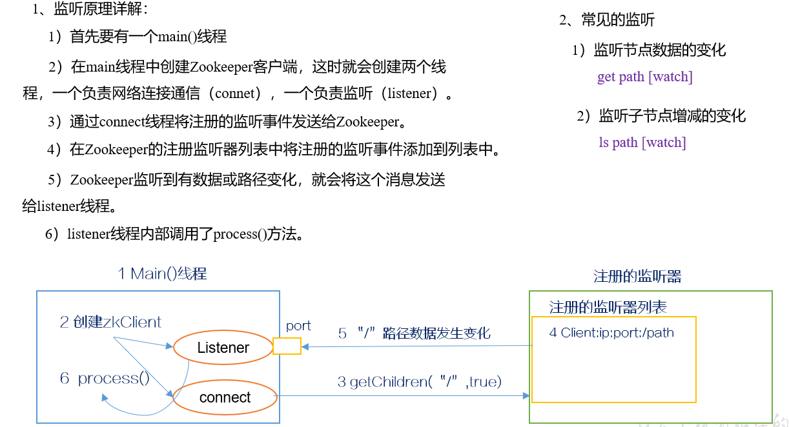
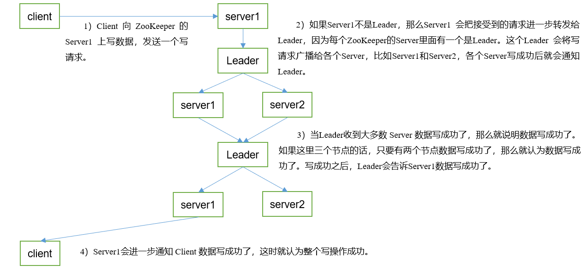

## 3.1、选举机制

**1）半数机制：集群中半数以上机器存活，集群可用。所以Zookeeper适合安装奇数台服务器。**

2）Zookeeper虽然在配置文件中并没有指定Master和Slave。但是，Zookeeper工作时，是有一个节点为Leader，其他则为Follower，Leader是通过内部的选举机制临时产生的。

3）以一个简单的例子来说明整个选举的过程。

假设有五台服务器组成的Zookeeper集群，它们的id从1-5，同时它们都是最新启动的，也就是没有历史数据，在存放数据量这一点上，都是一样的。假设这些服务器依序启动，来看看会发生什么，如下图

（1）服务器1启动，此时只有它一台服务器启动了，它发出去的报文没有任何响应，所以它的选举状态一直是LOOKING状态。

（2）服务器2启动，它与最开始启动的服务器1进行通信，互相交换自己的选举结果，由于两者都没有历史数据，所以id值较大的服务器2胜出，但是由于没有达到超过半数以上的服务器都同意选举它(这个例子中的半数以上是3)，所以服务器1、2还是继续保持LOOKING状态。

（3）服务器3启动，根据前面的理论分析，服务器3成为服务器1、2、3中的老大，而与上面不同的是，此时有三台服务器选举了它，所以它成为了这次选举的Leader。

（4）服务器4启动，根据前面的分析，理论上服务器4应该是服务器1、2、3、4中最大的，但是由于前面已经有半数以上的服务器选举了服务器3，所以它只能接收当小弟的命了。

（5）服务器5启动，同4一样当小弟。

## 3.2 节点类型

## 3.3 Stat结构体

1）czxid-创建节点的事务zxid
每次修改ZooKeeper状态都会收到一个zxid形式的时间戳，也就是ZooKeeper事务ID。
事务ID是ZooKeeper中所有修改总的次序。每个修改都有唯一的zxid，如果zxid1小于zxid2，那么zxid1在zxid2之前发生。

2）ctime - znode被创建的毫秒数(从1970年开始)

3）mzxid - znode最后更新的事务zxid

4）mtime - znode最后修改的毫秒数(从1970年开始)

5）pZxid-znode最后更新的子节点zxid

6）cversion - znode子节点变化号，znode子节点修改次数

7）dataversion - znode数据变化号

8）aclVersion - znode访问控制列表的变化号

9）ephemeralOwner- 如果是临时节点，这个是znode拥有者的session id。如果不是临时节点则是0。

10）dataLength- znode的数据长度

11）numChildren - znode子节点数量

## 3.4 监听器原理（面试重点）

## 3.5 写数据流程

