## 4.1 分布式安装部署

**1．集群规划**

在hadoop102、hadoop103和hadoop104三个节点上部署Zookeeper。


**2．解压安装**

1）解压Zookeeper安装包到/opt/module/目录下

```
[root@localhost software]$ tar -zxvf zookeeper-3.4.10.tar.gz -C /opt/module/
```

（2）同步/opt/module/zookeeper-3.4.10目录内容到hadoop103、hadoop104

```
[root@localhost module]$ xsync zookeeper-3.4.10/
```


**3．配置服务器编号**

（1）在/opt/module/zookeeper-3.4.10/这个目录下创建zkData

```
[root@localhost zookeeper-3.4.10]$ mkdir -p zkData
```

（2）在/opt/module/zookeeper-3.4.10/zkData目录下创建一个myid的文件

```
[root@localhost zkData]# touch myid 
[root@localhost zkData]# ll 
total 0 
-rw-r--r--. 1 
root root 0 Oct 1 11:40 myid drwxr
-xr-x.1 
root root 10 Oct 1 11:20 version-2 
[root@localhost zkData]#
```

添加myid文件，注意一定要在linux里面创建，在notepad++里面很可能乱码

（3）编辑myid文件


（4）拷贝配置好的zookeeper到其他机器上

```
[root@localhost zkData]# xsync myid
```

并分别在hadoop102、hadoop103上修改myid文件中内容为3、4


**4．配置zoo.cfg文件**

（1）重命名/opt/module/zookeeper-3.4.10/conf这个目录下的zoo_sample.cfg为zoo.cfg

```
[root@localhost conf]$ mv zoo_sample.cfg zoo.cfg
```

（2）打开zoo.cfg文件

```
[root@localhost conf]$ vim zoo.cfg
```

修改数据存储路径配置

dataDir=/opt/module/zookeeper-3.4.10/zkData
增加如下配置

```
#######################cluster########################## server.2=hadoop2:2888:3888 
server.3=hadoop3:2888:3888 
server.4=hadoop4:2888:3888
```

（3）同步zoo.cfg配置文件

```
[root@localhost conf]$ xsync zoo.cfg
```

（4）配置参数解读

server.A=B:C:D

```
A是一个数字，表示这个是第几号服务器； 

集群模式下配置一个文件myid，这个文件在dataDir目录下，这个文件里面有一个数据就是A的值，Zookeeper启动时读取此文件，拿到里面的数据与zoo.cfg里面的配置信息比较从而判断到底是哪个server。

B是这个服务器的ip地址； C是这个服务器与集群中的Leader服务器交换信息的端口； 

D是万一集群中的Leader服务器挂了，需要一个端口来重新进行选举，选出一个新的Leader，而这个端口就是用来执行选举时服务器相互通信的端口。
```

**5．集群操作**

（1）分别启动Zookeeper

[root@hadoop2 zookeeper-3.4.10]$ bin/zkServer.sh start

[root@hadoop3 zookeeper-3.4.10]$ bin/zkServer.sh start

[root@hadoop4 zookeeper-3.4.10]$ bin/zkServer.sh start


（2）查看状态

```
[root@hadoop2 zookeeper-3.4.10]# bin/zkServer.sh status ZooKeeper JMX enabled by default Using config: /opt/module/zookeeper-3.4.10/bin/../conf/zoo.cfg Mode: follower 

[root@hadoop3 zookeeper-3.4.10]# bin/zkServer.sh status ZooKeeper JMX enabled by default Using config: /opt/module/zookeeper-3.4.10/bin/../conf/zoo.cfg Mode: leader 

[root@hadoop4 zookeeper-3.4.10]# bin/zkServer.sh status ZooKeeper JMX enabled by default Using config: /opt/module/zookeeper-3.4.10/bin/../conf/zoo.cfg Mode: follower
```


## 4.2、客户端命令行操作

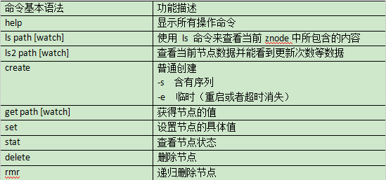


**1．启动客户端**

```
[root@hadoop2 zookeeper-3.4.10]# bin/zkCli.sh
```

**2．显示所有操作命令**

```
[zk: localhost:2181(CONNECTED) 1] help
```

**3．查看当前znode中所包含的内容**

```
[zk: localhost:2181(CONNECTED) 0] ls /
```

**4．查看当前节点详细数据**

```
[zk: localhost:2181(CONNECTED) 2] ls2 /
[zookeeper]
cZxid = 0x0
ctime = Wed Dec 31 19:00:00 EST 1969
mZxid = 0x0
mtime = Wed Dec 31 19:00:00 EST 1969
pZxid = 0x0
cversion = -1
dataVersion = 0
aclVersion = 0
ephemeralOwner = 0x0
dataLength = 0
numChildren = 1
```

**5．分别创建2个普通节点**

```
[zk: localhost:2181(CONNECTED) 3] create /sanguo "liubei" Created /sanguo
[zk: localhost:2181(CONNECTED) 4] create /sanguo/shu "zhangfei" 
Created /sanguo/shu 

[zk: localhost:2181(CONNECTED) 5] ls /sanguo/shu [] 

[zk: localhost:2181(CONNECTED) 6] ls /sanguo 
[shu]
```

**6．获得节点的值**

```
[zk: localhost:2181(CONNECTED) 8] get /sanguo/shu 
zhangfei 
cZxid = 0x300000003 
ctime = Wed Oct 02 00:28:22 EDT 2019 
mZxid = 0x300000003 
mtime = Wed Oct 02 00:28:22 EDT 2019 
pZxid = 0x300000003 
cversion = 0 
dataVersion = 0 
aclVersion = 0 
ephemeralOwner = 0x0 
dataLength = 8 
numChildren = 0

[zk: localhost:2181(CONNECTED) 9] get /sanguo 
liubei 
cZxid = 0x300000002 
ctime = Wed Oct 02 00:26:57 EDT 2019 
mZxid = 0x300000002 
mtime = Wed Oct 02 00:26:57 EDT 2019 
pZxid = 0x300000003 
cversion = 1 
dataVersion = 0 
aclVersion = 0 
ephemeralOwner = 0x0 
dataLength = 6 
numChildren = 1
```

**7．创建短暂节点**

```
[zk: localhost:2181(CONNECTED) 10] create -e /sanguo/wu "zhouyu" Created /sanguo/wu
```

（1）在当前客户端是能查看到的

```
[zk: localhost:2181(CONNECTED) 12] ls /sanguo 
[shu, wu]
```

（2）退出当前客户端然后再重启客户端

```
[zk: localhost:2181(CONNECTED) 13] quit
[root@hadoop2 zookeeper-3.4.10]# bin/zkCli.sh
```

（3）再次查看根目录下短暂节点已经删除

```
[zk: localhost:2181(CONNECTED) 0] ls /sanguo
[shu]
```

**8．创建带序号的节点**

1）先创建一个普通的根节点/sanguo/weiguo

```
[zk: localhost:2181(CONNECTED) 1] create /sanguo/weiguo "caocao"
Created /sanguo/weiguo
```

2）创建带序号的节点

```
[zk: localhost:2181(CONNECTED) 1] create -s /sanguo/wei "caocao"
Created /sanguo/wei0000000002 

[zk: localhost:2181(CONNECTED) 2] create -s /sanguo/wei "caocao" 
Created /sanguo/wei0000000003

[zk: localhost:2181(CONNECTED) 3] ls /sanguo 
[shu, wei0000000002, wei0000000003]
```

如果原来没有序号节点，序号从0开始依次递增。如果原节点下已有2个节点，则再排序时从2开始，以此类推。


**9．修改节点数据值**

```
[zk: localhost:2181(CONNECTED) 4] set /sanguo/shu "guanyu" 

cZxid = 0x300000003 
ctime = Wed Oct 02 00:28:22 EDT 2019 
mZxid = 0x300000009 
mtime = Wed Oct 02 00:40:12 EDT 2019 
pZxid = 0x300000003 
cversion = 0 
dataVersion = 1 
aclVersion = 0 
ephemeralOwner = 0x0 
dataLength = 6 
numChildren = 0

[zk: localhost:2181(CONNECTED) 6] get /sanguo/shu
guanyu 
cZxid = 0x300000003 
ctime = Wed Oct 02 00:28:22 EDT 2019 
mZxid = 0x300000009 
mtime = Wed Oct 02 00:40:12 EDT 2019 
pZxid = 0x300000003 
cversion = 0 
dataVersion = 1 
aclVersion = 0 
ephemeralOwner = 0x0 
dataLength = 6 
numChildren = 0
```

**10．节点的值变化监听**

注册一次有效次数为1

（1）在hadoop4主机上注册监听/sanguo节点数据变化

```
[zk: localhost:2181(CONNECTED) 1] get /sanguo watch
liubei 
cZxid = 0x300000002 
ctime = Wed Oct 02 00:26:57 EDT 2019 
mZxid = 0x300000002 
mtime = Wed Oct 02 00:26:57 EDT 2019 
pZxid = 0x300000008 
cversion = 5 
dataVersion = 0 
aclVersion = 0 
ephemeralOwner = 0x0 
dataLength = 6 
numChildren = 3
```

（2）在hadoop3主机上修改/sanguo节点的数据

```
[zk: localhost:2181(CONNECTED) 2] set /sanguo "zhuge"
cZxid = 0x300000002
ctime = Wed Oct 02 00:26:57 EDT 2019
mZxid = 0x30000000c
mtime = Wed Oct 02 01:04:44 EDT 2019
pZxid = 0x300000008
cversion = 5
dataVersion = 1
aclVersion = 0
ephemeralOwner = 0x0
dataLength = 5
numChildren = 3
```

（3）观察hadoop104主机收到数据变化的监听

```
[zk: localhost:2181(CONNECTED) 1] get /sanguo watch 
liubei 
cZxid = 0x300000002 
ctime = Wed Oct 02 00:26:57 EDT 2019 
mZxid = 0x300000002 
mtime = Wed Oct 02 00:26:57 EDT 2019 
pZxid = 0x300000008 
cversion = 5 
dataVersion = 0 
aclVersion = 0 
ephemeralOwner = 0x0 
dataLength = 6 
numChildren = 3 

[zk: localhost:2181(CONNECTED) 2] 
WATCHER:: WatchedEvent state:SyncConnected type:NodeDataChanged path:/sanguo
```

**11．节点的子节点变化监听（路径变化）**

注册一次有效次数为1

（1）在hadoop104主机上注册监听/sanguo节点的子节点变化

```
[zk: localhost:2181(CONNECTED) 1] ls /sanguo watch
[shu, wei0000000002, wei0000000003]
```

（2）在hadoop103主机/sanguo节点上创建子节点

```
[zk: localhost:2181(CONNECTED) 3] create /sanguo/wu "sun" 
Created /sanguo/wu
```

（3）观察hadoop104主机收到子节点变化的监听

```
WATCHER:: 
WatchedEvent state:SyncConnected type:NodeChildrenChanged path:/sanguo
```

**12．删除节点**

```
[zk: localhost:2181(CONNECTED) 7] ls /sanguo 
[shu, wei0000000002, wei0000000003, wu] 

[zk: localhost:2181(CONNECTED) 8] delete /sanguo/wu 

[zk: localhost:2181(CONNECTED) 9] ls /sanguo 
[shu, wei0000000002, wei0000000003]
```

**13．递归删除节点**

```
[zk: localhost:2181(CONNECTED) 15] rmr /sanguo/shuguo
```

**14．查看节点状态**

```
[zk: localhost:2181(CONNECTED) 10] stat /sanguo 
cZxid = 0x300000002 
ctime = Wed Oct 02 00:26:57 EDT 2019 
mZxid = 0x30000000c 
mtime = Wed Oct 02 01:04:44 EDT 2019
pZxid = 0x300000010 
cversion = 7 
dataVersion = 1 
aclVersion = 0 
ephemeralOwner = 0x0 
dataLength = 5 
numChildren = 3
```


## 4.3 API应用


### **4.3.1、IDEA环境搭建**

1、创建maven工程

2、添加依赖

````
<dependencies>      <dependency>          <groupId>junit</groupId>          <artifactId>junit</artifactId>          <version>RELEASE</version>      </dependency>      <dependency>          <groupId>org.apache.logging.log4j</groupId>          <artifactId>log4j-core</artifactId>          <version>2.8.2</version>      </dependency>      <!-- https://mvnrepository.com/artifact/org.apache.zookeeper/zookeeper -->      <dependency>          <groupId>org.apache.zookeeper</groupId>          <artifactId>zookeeper</artifactId>          <version>3.4.10</version>      </dependency> </dependencies>
````

3、拷贝log4j.properties文件到资源文件夹

```
log4j.rootLogger=INFO, stdout  log4j.appender.stdout=org.apache.log4j.ConsoleAppender  log4j.appender.stdout.layout=org.apache.log4j.PatternLayout  log4j.appender.stdout.layout.ConversionPattern=%d %p [%c] - %m%n  log4j.appender.logfile=org.apache.log4j.FileAppender  log4j.appender.logfile.File=target/spring.log  log4j.appender.logfile.layout=org.apache.log4j.PatternLayout  log4j.appender.logfile.layout.ConversionPattern=%d %p [%c] - %m%n
```

### **4.3.2 创建ZooKeeper客户端**

```
private String connectStr = "192.168.199.120:2181,192.168.199.186:2181,192.168.199.224:2181";

 private int sessionTimeout = 2000;//超时时间 
 
 ZooKeeper zkClient; 
 
 //链接 
 @Test 
 public void init() throws IOException 
 { 
	zkClient = new ZooKeeper(connectStr, sessionTimeout, new Watcher() {
		@Override 
		public void process(WatchedEvent watchedEvent) { 
		} 
	}); 
}
```

```
2019-10-02 14:07:33,935 INFO [org.apache.zookeeper.ZooKeeper] - Client environment:zookeeper.version=3.4.10-39d3a4f269333c922ed3db283be479f9deacaa0f, built on 03/23/2017 10:13 GMT 2019-10-02 14:07:33,936 INFO [org.apache.zookeeper.ZooKeeper] - Client environment:host.name=DESKTOP-SHRMQH1 2019-10-02 14:07:33,936 INFO [org.apache.zookeeper.ZooKeeper] - Client environment:java.version=1.8.0_101 2019-10-02 14:07:33,936 INFO [org.apache.zookeeper.ZooKeeper] - Client environment:java.vendor=Oracle Corporation 2019-10-02 14:07:33,936 INFO [org.apache.zookeeper.ZooKeeper] - Client environment:java.home=C:\Program Files\Java\jdk1.8.0_101\jre 2019-10-02 14:07:33,936 INFO [org.apache.zookeeper.ZooKeeper] - Client environment:java.class.path=D:\SecondFile\idea\IntelliJ IDEA 2018.2.3\lib\idea_rt.jar;D:\SecondFile\idea\IntelliJ IDEA 2018.2.3\plugins\junit\lib\junit-rt.jar;D:\SecondFile\idea\IntelliJ IDEA 2018.2.3\plugins\junit\lib\junit5-rt.jar;C:\Program Files\Java\jdk1.8.0_101\jre\lib\charsets.jar;C:\Program Files\Java\jdk1.8.0_101\jre\lib\deploy.jar;C:\Program Files\Java\jdk1.8.0_101\jre\lib\ext\access-bridge-64.jar;C:\Program Files\Java\jdk1.8.0_101\jre\lib\ext\cldrdata.jar;C:\Program Files\Java\jdk1.8.0_101\jre\lib\ext\dnsns.jar;C:\Program Files\Java\jdk1.8.0_101\jre\lib\ext\jaccess.jar;C:\Program Files\Java\jdk1.8.0_101\jre\lib\ext\jfxrt.jar;C:\Program Files\Java\jdk1.8.0_101\jre\lib\ext\localedata.jar;C:\Program Files\Java\jdk1.8.0_101\jre\lib\ext\nashorn.jar;C:\Program Files\Java\jdk1.8.0_101\jre\lib\ext\sunec.jar;C:\Program Files\Java\jdk1.8.0_101\jre\lib\ext\sunjce_provider.jar;C:\Program Files\Java\jdk1.8.0_101\jre\lib\ext\sunmscapi.jar;C:\Program Files\Java\jdk1.8.0_101\jre\lib\ext\sunpkcs11.jar;C:\Program Files\Java\jdk1.8.0_101\jre\lib\ext\zipfs.jar;C:\Program Files\Java\jdk1.8.0_101\jre\lib\javaws.jar;C:\Program Files\Java\jdk1.8.0_101\jre\lib\jce.jar;C:\Program Files\Java\jdk1.8.0_101\jre\lib\jfr.jar;C:\Program Files\Java\jdk1.8.0_101\jre\lib\jfxswt.jar;C:\Program Files\Java\jdk1.8.0_101\jre\lib\jsse.jar;C:\Program Files\Java\jdk1.8.0_101\jre\lib\management-agent.jar;C:\Program Files\Java\jdk1.8.0_101\jre\lib\plugin.jar;C:\Program Files\Java\jdk1.8.0_101\jre\lib\resources.jar;C:\Program Files\Java\jdk1.8.0_101\jre\lib\rt.jar;D:\SecondProject\IDEAFile\hdfsclient\target\test-classes;D:\SecondProject\IDEAFile\hdfsclient\target\classes;D:\Tools\maven\maven-repository\org\apache\logging\log4j\log4j-core\2.8.2\log4j-core-2.8.2.jar;D:\Tools\maven\maven-repository\org\apache\logging\log4j\log4j-api\2.8.2\log4j-api-2.8.2.jar;D:\Tools\maven\maven-repository\org\apache\zookeeper\zookeeper\3.4.10\zookeeper-3.4.10.jar;D:\Tools\maven\maven-repository\org\slf4j\slf4j-api\1.6.1\slf4j-api-1.6.1.jar;D:\Tools\maven\maven-repository\org\slf4j\slf4j-log4j12\1.6.1\slf4j-log4j12-1.6.1.jar;D:\Tools\maven\maven-repository\log4j\log4j\1.2.16\log4j-1.2.16.jar;D:\Tools\maven\maven-repository\jline\jline\0.9.94\jline-0.9.94.jar;D:\Tools\maven\maven-repository\io\netty\netty\3.10.5.Final\netty-3.10.5.Final.jar;D:\Tools\maven\maven-repository\junit\junit\4.13-beta-3\junit-4.13-beta-3.jar;D:\Tools\maven\maven-repository\org\hamcrest\hamcrest-core\1.3\hamcrest-core-1.3.jar;D:\Tools\maven\maven-repository\org\apache\hadoop\hadoop-common\2.7.2\hadoop-common-2.7.2.jar;D:\Tools\maven\maven-repository\org\apache\hadoop\hadoop-annotations\2.7.2\hadoop-annotations-2.7.2.jar;C:\Program Files\Java\jdk1.8.0_101\lib\tools.jar;D:\Tools\maven\maven-repository\com\google\guava\guava\11.0.2\guava-11.0.2.jar;D:\Tools\maven\maven-repository\commons-cli\commons-cli\1.2\commons-cli-1.2.jar;D:\Tools\maven\maven-repository\org\apache\commons\commons-math3\3.1.1\commons-math3-3.1.1.jar;D:\Tools\maven\maven-repository\xmlenc\xmlenc\0.52\xmlenc-0.52.jar;D:\Tools\maven\maven-repository\commons-httpclient\commons-httpclient\3.1\commons-httpclient-3.1.jar;D:\Tools\maven\maven-repository\commons-codec\commons-codec\1.4\commons-codec-1.4.jar;D:\Tools\maven\maven-repository\commons-io\commons-io\2.4\commons-io-2.4.jar;D:\Tools\maven\maven-repository\commons-net\commons-net\3.1\commons-net-3.1.jar;D:\Tools\maven\maven-repository\commons-collections\commons-collections\3.2.2\commons-collections-3.2.2.jar;D:\Tools\maven\maven-repository\javax\servlet\servlet-api\2.5\servlet-api-2.5.jar;D:\Tools\maven\maven-repository\org\mortbay\jetty\jetty\6.1.26\jetty-6.1.26.jar;D:\Tools\maven\maven-repository\org\mortbay\jetty\jetty-util\6.1.26\jetty-util-6.1.26.jar;D:\Tools\maven\maven-repository\javax\servlet\jsp\jsp-api\2.1\jsp-api-2.1.jar;D:\Tools\maven\maven-repository\com\sun\jersey\jersey-core\1.9\jersey-core-1.9.jar;D:\Tools\maven\maven-repository\com\sun\jersey\jersey-json\1.9\jersey-json-1.9.jar;D:\Tools\maven\maven-repository\org\codehaus\jettison\jettison\1.1\jettison-1.1.jar;D:\Tools\maven\maven-repository\com\sun\xml\bind\jaxb-impl\2.2.3-1\jaxb-impl-2.2.3-1.jar;D:\Tools\maven\maven-repository\javax\xml\bind\jaxb-api\2.2.2\jaxb-api-2.2.2.jar;D:\Tools\maven\maven-repository\javax\xml\stream\stax-api\1.0-2\stax-api-1.0-2.jar;D:\Tools\maven\maven-repository\javax\activation\activation\1.1\activation-1.1.jar;D:\Tools\maven\maven-repository\org\codehaus\jackson\jackson-jaxrs\1.8.3\jackson-jaxrs-1.8.3.jar;D:\Tools\maven\maven-repository\org\codehaus\jackson\jackson-xc\1.8.3\jackson-xc-1.8.3.jar;D:\Tools\maven\maven-repository\com\sun\jersey\jersey-server\1.9\jersey-server-1.9.jar;D:\Tools\maven\maven-repository\asm\asm\3.1\asm-3.1.jar;D:\Tools\maven\maven-repository\commons-logging\commons-logging\1.1.3\commons-logging-1.1.3.jar;D:\Tools\maven\maven-repository\net\java\dev\jets3t\jets3t\0.9.0\jets3t-0.9.0.jar;D:\Tools\maven\maven-repository\org\apache\httpcomponents\httpclient\4.1.2\httpclient-4.1.2.jar;D:\Tools\maven\maven-repository\org\apache\httpcomponents\httpcore\4.1.2\httpcore-4.1.2.jar;D:\Tools\maven\maven-repository\com\jamesmurty\utils\java-xmlbuilder\0.4\java-xmlbuilder-0.4.jar;D:\Tools\maven\maven-repository\commons-lang\commons-lang\2.6\commons-lang-2.6.jar;D:\Tools\maven\maven-repository\commons-configuration\commons-configuration\1.6\commons-configuration-1.6.jar;D:\Tools\maven\maven-repository\commons-digester\commons-digester\1.8\commons-digester-1.8.jar;D:\Tools\maven\maven-repository\commons-beanutils\commons-beanutils\1.7.0\commons-beanutils-1.7.0.jar;D:\Tools\maven\maven-repository\commons-beanutils\commons-beanutils-core\1.8.0\commons-beanutils-core-1.8.0.jar;D:\Tools\maven\maven-repository\org\codehaus\jackson\jackson-core-asl\1.9.13\jackson-core-asl-1.9.13.jar;D:\Tools\maven\maven-repository\org\codehaus\jackson\jackson-mapper-asl\1.9.13\jackson-mapper-asl-1.9.13.jar;D:\Tools\maven\maven-repository\org\apache\avro\avro\1.7.4\avro-1.7.4.jar;D:\Tools\maven\maven-repository\com\thoughtworks\paranamer\paranamer\2.3\paranamer-2.3.jar;D:\Tools\maven\maven-repository\org\xerial\snappy\snappy-java\1.0.4.1\snappy-java-1.0.4.1.jar;D:\Tools\maven\maven-repository\com\google\protobuf\protobuf-java\2.5.0\protobuf-java-2.5.0.jar;D:\Tools\maven\maven-repository\com\google\code\gson\gson\2.2.4\gson-2.2.4.jar;D:\Tools\maven\maven-repository\org\apache\hadoop\hadoop-auth\2.7.2\hadoop-auth-2.7.2.jar;D:\Tools\maven\maven-repository\org\apache\directory\server\apacheds-kerberos-codec\2.0.0-M15\apacheds-kerberos-codec-2.0.0-M15.jar;D:\Tools\maven\maven-repository\org\apache\directory\server\apacheds-i18n\2.0.0-M15\apacheds-i18n-2.0.0-M15.jar;D:\Tools\maven\maven-repository\org\apache\directory\api\api-asn1-api\1.0.0-M20\api-asn1-api-1.0.0-M20.jar;D:\Tools\maven\maven-repository\org\apache\directory\api\api-util\1.0.0-M20\api-util-1.0.0-M20.jar;D:\Tools\maven\maven-repository\org\apache\curator\curator-framework\2.7.1\curator-framework-2.7.1.jar;D:\Tools\maven\maven-repository\com\jcraft\jsch\0.1.42\jsch-0.1.42.jar;D:\Tools\maven\maven-repository\org\apache\curator\curator-client\2.7.1\curator-client-2.7.1.jar;D:\Tools\maven\maven-repository\org\apache\curator\curator-recipes\2.7.1\curator-recipes-2.7.1.jar;D:\Tools\maven\maven-repository\com\google\code\findbugs\jsr305\3.0.0\jsr305-3.0.0.jar;D:\Tools\maven\maven-repository\org\apache\htrace\htrace-core\3.1.0-incubating\htrace-core-3.1.0-incubating.jar;D:\Tools\maven\maven-repository\org\apache\commons\commons-compress\1.4.1\commons-compress-1.4.1.jar;D:\Tools\maven\maven-repository\org\tukaani\xz\1.0\xz-1.0.jar;D:\Tools\maven\maven-repository\org\apache\hadoop\hadoop-client\2.7.2\hadoop-client-2.7.2.jar;D:\Tools\maven\maven-repository\org\apache\hadoop\hadoop-mapreduce-client-app\2.7.2\hadoop-mapreduce-client-app-2.7.2.jar;D:\Tools\maven\maven-repository\org\apache\hadoop\hadoop-mapreduce-client-common\2.7.2\hadoop-mapreduce-client-common-2.7.2.jar;D:\Tools\maven\maven-repository\org\apache\hadoop\hadoop-yarn-client\2.7.2\hadoop-yarn-client-2.7.2.jar;D:\Tools\maven\maven-repository\org\apache\hadoop\hadoop-yarn-server-common\2.7.2\hadoop-yarn-server-common-2.7.2.jar;D:\Tools\maven\maven-repository\org\apache\hadoop\hadoop-mapreduce-client-shuffle\2.7.2\hadoop-mapreduce-client-shuffle-2.7.2.jar;D:\Tools\maven\maven-repository\org\apache\hadoop\hadoop-yarn-api\2.7.2\hadoop-yarn-api-2.7.2.jar;D:\Tools\maven\maven-repository\org\apache\hadoop\hadoop-mapreduce-client-core\2.7.2\hadoop-mapreduce-client-core-2.7.2.jar;D:\Tools\maven\maven-repository\org\apache\hadoop\hadoop-yarn-common\2.7.2\hadoop-yarn-common-2.7.2.jar;D:\Tools\maven\maven-repository\com\sun\jersey\jersey-client\1.9\jersey-client-1.9.jar;D:\Tools\maven\maven-repository\org\apache\hadoop\hadoop-mapreduce-client-jobclient\2.7.2\hadoop-mapreduce-client-jobclient-2.7.2.jar;D:\Tools\maven\maven-repository\org\apache\hadoop\hadoop-hdfs\2.7.2\hadoop-hdfs-2.7.2.jar;D:\Tools\maven\maven-repository\commons-daemon\commons-daemon\1.0.13\commons-daemon-1.0.13.jar;D:\Tools\maven\maven-repository\io\netty\netty-all\4.0.23.Final\netty-all-4.0.23.Final.jar;D:\Tools\maven\maven-repository\xerces\xercesImpl\2.9.1\xercesImpl-2.9.1.jar;D:\Tools\maven\maven-repository\xml-apis\xml-apis\1.3.04\xml-apis-1.3.04.jar;D:\Tools\maven\maven-repository\org\fusesource\leveldbjni\leveldbjni-all\1.8\leveldbjni-all-1.8.jar;D:\SecondFile\idea\IntelliJ IDEA 2018.2.3\lib\idea_rt.jar 2019-10-02 14:07:33,940 INFO [org.apache.zookeeper.ZooKeeper] - Client environment:java.library.path=C:\Program Files\Java\jdk1.8.0_101\bin;C:\WINDOWS\Sun\Java\bin;C:\WINDOWS\system32;C:\WINDOWS;D:\Tools\sxshell6\;D:\Tools\xshell\;C:\oraclexe\app\oracle\product\10.2.0\server\bin;C:\Program Files\Java\jdk1.8.0_101\bin;C:\ProgramData\Oracle\Java\javapath;C:\Program Files (x86)\Intel\iCLS Client\;C:\Program Files\Intel\iCLS Client\;C:\WINDOWS\system32;C:\WINDOWS;C:\WINDOWS\System32\Wbem;C:\WINDOWS\System32\WindowsPowerShell\v1.0\;C:\Program Files (x86)\Intel\Intel(R) Management Engine Components\DAL;C:\Program Files\Intel\Intel(R) Management Engine Components\DAL;C:\Program Files (x86)\Intel\Intel(R) Management Engine Components\IPT;C:\Program Files\Intel\Intel(R) Management Engine Components\IPT;C:\Program Files (x86)\ATI Technologies\ATI.ACE\Core-Static;C:\Program Files\Java\jdk1.8.0_101\bin;C:\Program Files (x86)\MySQL\MySQL Fabric 1.5 & MySQL Utilities 1.5\;C:\Program Files (x86)\MySQL\MySQL Fabric 1.5 & MySQL Utilities 1.5\Doctrine extensions for PHP\;C:\Program Files\MySQL\MySQL Server 5.7\bin;C:\Program Files\Java\jdk1.8.0_101\jre\bin;D:\apache-tomcat-8.5.34;D:\apache-tomcat-8.5.34\bin;C:\WINDOWS\System32\OpenSSH\;D:\SecondFile\xampp\php;C:\composer;D:\Tools\maven\mavens\bin;D:\apache-cxf-3.2.8\apache-cxf-3.2.8\bin;D:\Android\SDK\tools;D:\Android\SDK\platform-tools;D:\Tools3\hdfsclient\hadoop-2.7.2\bin;C:\Program Files\Intel\WiFi\bin\;C:\Program Files\Common Files\Intel\WirelessCommon\;D:\apache-cxf-3.2.8\bin;D:\Tools2\Anaconda;D:\Tools2\Anaconda\Library\mingw-w64\bin;D:\Tools2\Anaconda\Library\usr\bin;D:\Tools2\Anaconda\Library\bin;D:\Tools2\Anaconda\Scripts;C:\Users\ccrr\AppData\Local\Programs\Python\Python36\Scripts\;C:\Users\ccrr\AppData\Local\Programs\Python\Python36\;C:\Users\ccrr\AppData\Local\Microsoft\WindowsApps;C:\Users\ccrr\AppData\Roaming\Composer\vendor\bin;D:\apache-tomcat-8.5.34\bin;D:\Tools2\pycharm\PyCharm 2018.3.4\bin;;;D:\Tools3\WebStrom\WebStorm 2019.1.3\bin;;. 2019-10-02 14:07:33,940 INFO [org.apache.zookeeper.ZooKeeper] - Client environment:java.io.tmpdir=C:\Users\ccrr\AppData\Local\Temp\ 2019-10-02 14:07:33,940 INFO [org.apache.zookeeper.ZooKeeper] - Client environment:java.compiler=<NA> 2019-10-02 14:07:33,940 INFO [org.apache.zookeeper.ZooKeeper] - Client environment:os.name=Windows 10 2019-10-02 14:07:33,940 INFO [org.apache.zookeeper.ZooKeeper] - Client environment:os.arch=amd64 2019-10-02 14:07:33,940 INFO [org.apache.zookeeper.ZooKeeper] - Client environment:os.version=10.0 2019-10-02 14:07:33,940 INFO [org.apache.zookeeper.ZooKeeper] - Client environment:user.name=ccrr 2019-10-02 14:07:33,940 INFO [org.apache.zookeeper.ZooKeeper] - Client environment:user.home=C:\Users\ccrr 2019-10-02 14:07:33,940 INFO [org.apache.zookeeper.ZooKeeper] - Client environment:user.dir=D:\SecondProject\IDEAFile\hdfsclient 2019-10-02 14:07:33,943 INFO [org.apache.zookeeper.ZooKeeper] - Initiating client connection, connectString=192.168.199.120:2181,192.168.199.186:2181,192.168.199.224:2181 sessionTimeout=2000 watcher=hdfs.zookeeper.TestZookeeper$1@2d209079 Process finished with exit code 0
```

### **4.3.3 创建子节点**

```
private String connectStr = "192.168.199.120:2181,192.168.199.186:2181,192.168.199.224:2181";

 private int sessionTimeout = 2000;//超时时间 
 
 ZooKeeper zkClient; 
 
 //链接 
 @Test 
 public void init() throws IOException 
 { 
	zkClient = new ZooKeeper(connectStr, sessionTimeout, new Watcher() {
		@Override 
		public void process(WatchedEvent watchedEvent) { 
		} 
	}); 
}


//创建子节点 、
@Test 
public void create() throws KeeperException, InterruptedException { 
	//ZooDefs.Ids.OPEN_ACL_UNSAFE权限 
	//CreateMode.PERSISTENT创建的类型数据 
String path = zkClient.create("/mr", "mrchengs".getBytes(), 
	ZooDefs.Ids.OPEN_ACL_UNSAFE, 
	CreateMode.PERSISTENT); 
}
```

测试结果

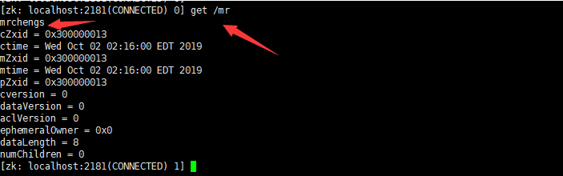


### 4.3.4 获取子节点并监听节点变化

```
//获取子节点,并且监控数据的变化
 @Test 
 public void getChild() throws KeeperException, InterruptedException { 
 
 List<String> children = zkClient.getChildren("/", false); 
 for (String c : children){ 
 System.out.println(c); 
 } 
}
```

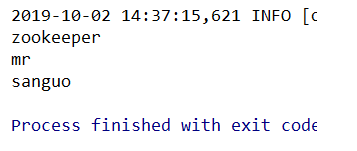


实时监听

```
/链接 
@Before 
public void init() throws IOException { 
	zkClient = new ZooKeeper(connectStr, sessionTimeout, new Watcher() {
		@Override 
		public void process(WatchedEvent watchedEvent) { 
			List<String> children =null; 
			try { 
				children = zkClient.getChildren("/", true); 
				} catch (KeeperException e) 
				{ 
					e.printStackTrace(); 
				} catch (InterruptedException e) { 
					e.printStackTrace(); 
				} 
				
				for (String c : children){ 
					System.out.println(c); 
				} 
			}
		}); 
} 
//获取子节点,并且监控数据的变化 
@Test 
public void getChild() throws KeeperException, InterruptedException { 
	List<String> children = zkClient.getChildren("/", true); 
	for (String c : children){ 
		System.out.println(c); 
	} 
	// 延时阻塞 
	Thread.sleep(Long.MAX_VALUE); 
}
```

```
[zk: localhost:2181(CONNECTED) 2] delete /test
```

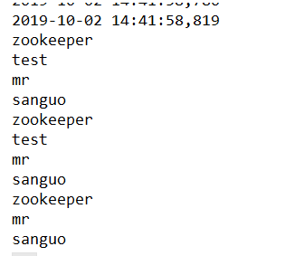


### 4.3.5 判断Znode是否存在

```
// 判断znode是否存在 
@Test 
public void exist() throws Exception {   
	Stat stat = zkClient.exists("/mr", false);
    System.out.println(stat == null ? "not exist" : "exist"); 
 }
```

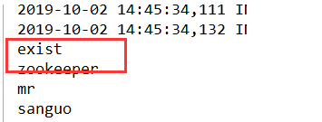


### 4.4 监听服务器节点动态上下线案例

1．需求
某分布式系统中，主节点可以有多台，可以动态上下线，任意一台客户端都能实时感知到主节点服务器的上下线。


2．需求分析

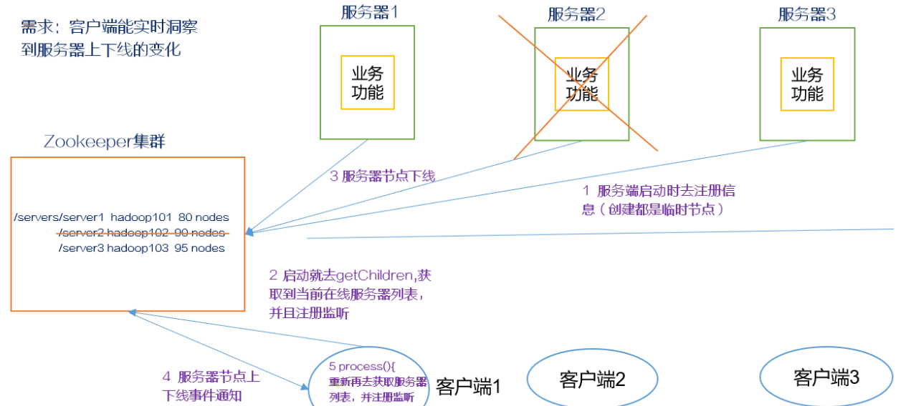

3、集体实现
（1）、先创建/server节点

```
[zk: localhost:2181(CONNECTED) 3] create /server "servers"
Created /server
```

```
package hdfs.zookeeper; 
import org.apache.zookeeper.*; 
import java.io.IOException; 
import java.util.List; 

public class DistributeServer { 
	public static void main(String[] args) 
		throws IOException, KeeperException, InterruptedException 
	{ 
	
		DistributeServer server = new DistributeServer(); 
		
		//链接 
		server.getConnect(); 
		
		//注册 
		server.regist(args[0]); 
		
		//业务代码 
		server.business(); 
	} 
	
	private void business() throws InterruptedException { 
		Thread.sleep(Long.MAX_VALUE); 
	}
	private void regist(String hostname) 
		throws KeeperException, InterruptedException { 
		
		zkClient.create("/server/server1",hostname.getBytes(),
			ZooDefs.Ids.OPEN_ACL_UNSAFE, CreateMode.EPHEMERAL_SEQUENTIAL); 
			
			System.out.println(hostname + "上线"); 
		} 
			
	private String connectStr = "192.168.199.120:2181,192.168.199.186:2181,192.168.199.224:2181"; 
			
	private int sessionTimeout = 2000;//超时时间 
			
	ZooKeeper zkClient; 
			
	private void getConnect() throws IOException { 
			
			zkClient = new ZooKeeper(connectStr, sessionTimeout, new Watcher() {
				@Override 
				public void process(WatchedEvent watchedEvent) { 
				} 
			}); 
	} 
}
```

```
package hdfs.zookeeper; 
import org.apache.zookeeper.KeeperException; 
import org.apache.zookeeper.WatchedEvent; 
import org.apache.zookeeper.Watcher; 
import org.apache.zookeeper.ZooKeeper; 
import java.io.IOException; 
import java.util.ArrayList; 
import java.util.List; 

public class DistributeClient { 
	public static void main(String[] args) throws IOException, 
		KeeperException, InterruptedException { 
		
		DistributeClient client = new DistributeClient(); 
		
		//链接 
		client.getConnect(); 
		
		//注册监听 
		client.getChild(); 
		
		//业务逻辑 
		client.business(); 
	} 
	
	private void business() throws InterruptedException { 
		Thread.sleep(Long.MAX_VALUE); 
	} 
	
	private void getChild() throws KeeperException,
		InterruptedException { 
		
		List<String> children = zkClient.getChildren("/server", true); 
		
		//存储服务器节点 
		ArrayList<Object> hosts = new ArrayList<>(); 
		
		for (String c : children){ 
			byte[] data = zkClient.getData("/server" + “/” +c, false, null); 
			hosts.add(new String(data)); 
		} 
		
		//打印所有主机名称 
		System.out.println(hosts);

	} 
	
	private String connectStr = "192.168.199.120:2181,192.168.199.186:2181,192.168.199.224:2181"; 
	private int sessionTimeout = 2000;//超时时间 
	ZooKeeper zkClient; 
	
	private void getConnect() throws IOException { 
		zkClient = new ZooKeeper(connectStr, sessionTimeout, new Watcher() { 
			@Override 
			public void process(WatchedEvent watchedEvent) { 
				try { 
					getChild(); 
				} catch (KeeperException e) {
					e.printStackTrace(); 
				} catch (InterruptedException e) { 
					e.printStackTrace(); 
				} 
			} 
		}); 
	} 
}
```

首先启动clent端的服务

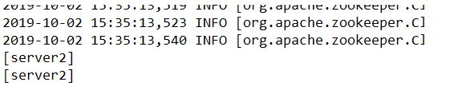


```
[zk: localhost:2181(CONNECTED) 5] create -e -s /server/server3 "server3" 
Created /server/server30000000001
```

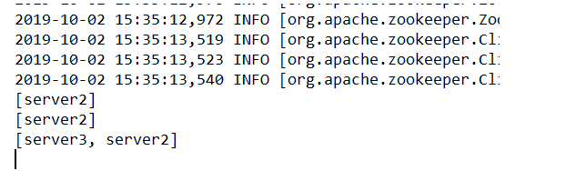


全部删除之后

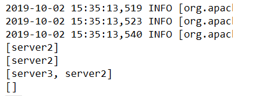


运行server端的代码

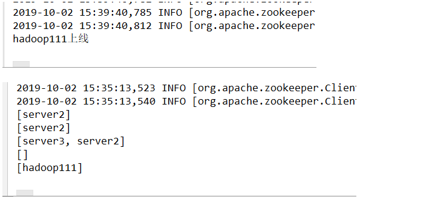


停止server段的服务

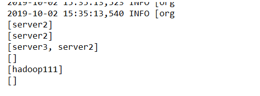

